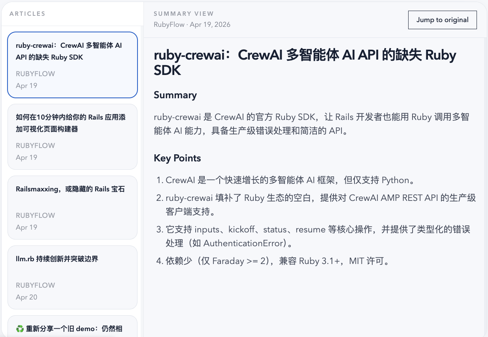

# RSSift

<p align="center">
  <a href="./README.md">English</a> · <a href="./README.zh-Hans.md">中文</a>
</p>

[](https://ai-declaration.md)

RSSift is a minimalist RSS summary reader.

Focuses on optimizing the "Open -> Scan Summary/Key Points -> Deep Read (on demand)" reading workflow.

By leveraging LLMs to rapidly extract the essence of content, it allows users to filter information efficiently and quickly decide whether to invest time in reading the full text.

RSSift works as follows:

- Precompute translated titles and layered summaries with an LLM
- Show a quick gist first, then ordered key points for deeper scanning
- Jump to the original article only when you actually want the full text

v0.1 delivers the complete core workflow. v0.2 plans to refine UI/UX interactions.



## Deployment

```bash
git clone https://github.com/sommio/RSSift
cd RSSift
cp .env.example .env
```

### Configuration

Edit `.env` with your values:

- `HTTP_PORT`
  - Purpose: Host port exposed by Caddy
  - Example: `80`
- `POSTGRES_DB`
  - Purpose: PostgreSQL database name used by the stack
  - Example: `rssift`
- `POSTGRES_USER`
  - Purpose: PostgreSQL username used by the stack
  - Example: `rssift`
- `POSTGRES_PASSWORD`
  - Purpose: PostgreSQL password for that user
  - Example: `replace-with-a-long-random-password`
- `FEED_OPML_HOST_PATH`
  - Purpose: Absolute host path to the operator-owned OPML file mounted into the API container
  - Example: `/srv/rssift/feeds.opml`
- `INGEST_ON_BOOT`
  - Purpose: Whether the API should ingest feeds automatically on container start
  - Example: `true`
- `FEED_AUTO_REFRESH_INTERVAL_HOURS`
  - Purpose: Minimum interval between automatic refresh waves after wake/resume checks
  - Example: `6`
- `FEED_MAX_ARTICLES_PER_FEED`
  - Purpose: Number of newest articles to persist per feed during each ingestion run
  - Example: `10`
- `LLM_API_KEY`
  - Purpose: API key for the OpenAI-compatible LLM gateway
  - Example: `sk-...`
- `LLM_BASE_URL`
  - Purpose: Base URL for the OpenAI-compatible LLM gateway
  - Example: `https://api.openai.com/v1`
- `LLM_MODEL`
  - Purpose: Model name used for translated titles and summaries
  - Example: `gpt-4.1-mini`
- `LLM_SUMMARY_CONCURRENCY`
  - Purpose: Number of concurrent summary jobs the API may run
  - Example: `2`
- `LLM_SUMMARY_LANGUAGE`
  - Purpose: Target language for translated titles and summaries
  - Example: `zh-CN`
- `LLM_TIMEOUT_MS`
  - Purpose: Optional request timeout for LLM calls in milliseconds; leave empty to use the SDK default
  - Example: `30000`

### Start

```bash
docker compose up -d --build
```

### Verify

```bash
docker compose ps
docker compose logs --tail=100 api-migrate api web caddy
curl http://127.0.0.1:${HTTP_PORT:-80}/
curl http://127.0.0.1:${HTTP_PORT:-80}/api/health
```

## Contributing

This repository uses an agent-first development workflow based on skills:

- `ce:brainstorm -> ce:plan -> ce:work -> ce:review -> ce:compound`.

Contributor docs: [`docs/en/CONTRIBUTING.md`](./docs/en/CONTRIBUTING.md)
