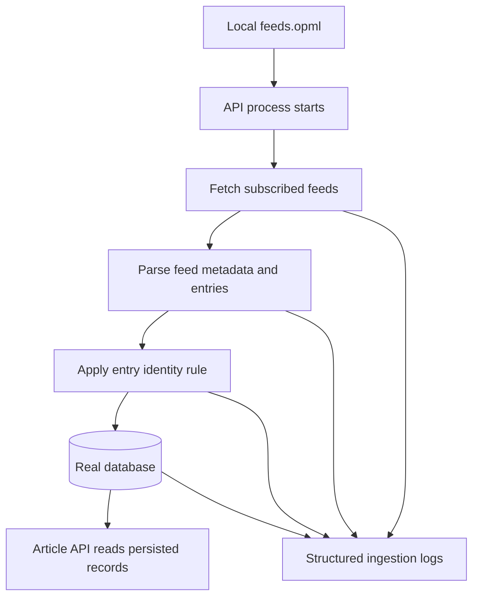

# v0.1 Slice 2 Feed Ingestion Requirements

## Problem Frame

The current backend only exposes fixture-backed article data, so the product still lacks the first durable leg of the RSS workflow: reading a fixed OPML file, fetching real feeds, and persisting real entries. For v0.1 slice 2, the goal is to prove the ingestion backbone without expanding into article extraction, summarization, or feed-management UX.

Verified current-state context:

- `apps/api/src/articles/articles.service.ts` still reads from `ArticleFixtureRepository`.
- `apps/api/src/articles/article-fixture.repository.ts` still loads `prepared-articles.json` from disk.
- `apps/api/package.json` currently contains no database package.
- Prisma has been selected as the ORM direction for this slice.

## Requirements

**Ingestion Input**

- R1. The system must read feed subscriptions from a fixed local file named `feeds.opml`.
- R2. The system must trigger feed ingestion automatically during application startup.
- R3. The startup ingestion flow must fetch multiple feeds independently so one failing feed does not prevent attempts on the others.

**Persistence Backbone**

- R4. The system must persist real feed and article records to a real database instead of serving article data from static fixtures.
- R5. The article list/detail API must read only from persisted database records after the fixture cutover, including startup runs that are only partially successful; the API may return previously persisted data, partially populated data, or empty persisted data, but must not fall back to fixtures.
- R6. The system must enforce a stable per-feed article identity rule so repeated startup ingestions do not create uncontrolled duplicates; application logic must derive a deterministic `identityHash` from the best available source identifier, and persistence must enforce uniqueness per feed on that derived identity.
- R7. For this slice, the existing article-detail `summary` field may be satisfied by feed-provided description/excerpt text when available, and may be an empty string when the feed has no usable summary-like text; this slice does not require generated summaries.
- R8. The first Prisma `Feed` model must stay minimal and only cover fields required for ingestion and read-path support, such as feed URL, site title, site URL, conditional-fetch cache fields, and timestamps.
- R9. The API design scope for this slice is limited to mapping the existing read-only `/articles` contracts onto persisted data; this slice does not add new `/feeds` read endpoints or ingestion-control endpoints.
- R10. The first Prisma `Article` model must carry both feed-published time (`publishedAt`) and first-ingested time (`ingestedAt`).
- R11. Prisma schema organization must be modular from the start rather than treated as one long-term monolithic schema file.
- R12. Prisma schema modularization must align with the backend's feature-module architecture: use domain-split schema files for feed/article areas while preserving one Prisma schema directory and one migration history.

**Operability**

- R12. The system must emit logs that make startup ingestion outcomes diagnosable at the per-feed level.
- R13. The system must record enough failure information to distinguish per-feed success/failure and to emit a startup-level summary stating whether the run was fully successful, partially successful, or fully failed; this requirement is satisfied by structured logs plus a startup summary and does not force a persistent run-state model in this slice.
- R14. The system must avoid a startup policy that requires every feed fetch to succeed before the application can start serving.

## Success Criteria

- With a valid local `feeds.opml`, application startup attempts real RSS ingestion automatically.
- After a successful ingestion run, persisted feed/article records exist in the real database.
- The article API no longer depends on `ArticleFixtureRepository` or `prepared-articles.json` for reads, even when the latest startup ingestion run is only partially successful.
- Logs clearly show which feeds succeeded, which failed, and whether the overall run was partially successful.

## Scope Boundaries

- No article body extraction.
- No summary generation, translation, or layered reading UI work.
- No feed CRUD.
- No OPML import/export UI or API.
- No scheduler, cron, or background refresh beyond startup ingestion.
- No requirement that all feeds succeed before application startup is considered usable.
- No requirement for a production-scale database topology; this slice only needs a single-instance PostgreSQL database suitable for one self-hosted operator.
- No new public contract for generated summaries; the existing `summary` field is only a compatibility field in this slice.
- No split-database strategy where development uses SQLite and deployment uses PostgreSQL; this slice uses PostgreSQL in every environment.
- No feed-management or ingestion-control API surface in this slice.
- No feed runtime-state model in the first Prisma schema beyond fields directly required by ingestion and conditional fetches.
- No monolithic long-term `schema.prisma` workflow that ignores the repo's feature-module architecture.
- No custom schema-concatenation build hack when Prisma's official multi-file schema support can provide a single source of truth.

## Key Decisions

- Fixed OPML source: use `feeds.opml` rather than a configurable feed-management workflow in this slice.
- Startup-first execution: prove ingestion on process start before adding manual refresh or scheduling.
- Real-data cutover: removing fixture-backed article reads is part of slice completion, not future polish.
- Observability is mandatory: logging is part of the slice definition because ingestion quality cannot be trusted without it.
- This document supersedes older v0.1 planning references that named the fixed subscription file `config.opml`; the intended file name for this slice is `feeds.opml`.
- Summary compatibility only: preserve the current detail-field shape by using feed-provided description/excerpt text when available instead of introducing generated-summary work into this slice.
- Prisma is the chosen ORM for schema, migrations, and data access in this slice.
- Development and deployment both use PostgreSQL. This avoids provider-specific migration drift and keeps Prisma Migrate on its supported path.
- Entry identity follows the Miniflux-style direction: prefer the best available source identifier in application logic, then normalize it into a deterministic hash that the database can constrain.
- Feed modeling stays intentionally thin in v0.1 slice 2; operational state and future management settings are deferred.
- API design also stays intentionally thin in v0.1 slice 2; the only contract work here is cutting the current `/articles` read endpoints over to persisted data.
- Article time semantics are explicit: `publishedAt` preserves source chronology, while `ingestedAt` preserves system-ingestion chronology.
- Prisma schema structure should start modular so feed/article domains can evolve without turning one schema file into a long-lived bottleneck.
- Prisma modularization should follow the same domain boundaries as the NestJS backend: feed-related models in one schema area, article-related models in another, with one official Prisma schema directory as the migration entrypoint.

## High-Level Technical Direction

This brainstorm is intentionally technical enough to define the first schema and API shape, because the slice is centered on persistence and contract cutover.

### Prisma Schema Draft

**Feed**

- `id`: internal primary key
- `feedUrl`: source RSS/Atom/JSON feed URL
- `siteTitle`: feed/site title for display and source labeling
- `siteUrl`: canonical site URL when available
- `etag`: conditional-fetch cache token
- `lastModified`: conditional-fetch cache token
- `createdAt`: record creation time
- `updatedAt`: record update time

**Article**

- `id`: internal primary key
- `feedId`: relation to `Feed`
- `identityHash`: deterministic per-feed identity derived in application logic
- `sourceId`: best available raw source identifier before hashing, when available
- `title`: article title
- `originalUrl`: canonical article URL
- `publishedAt`: source-published time
- `ingestedAt`: first-ingested time
- `summary`: feed-provided description/excerpt compatibility field
- `createdAt`: record creation time
- `updatedAt`: record update time

### Prisma Constraint Direction

- `Feed.feedUrl` should be unique.
- `Article` should enforce a composite unique constraint on `(feedId, identityHash)`.
- `Article.feedId` should be indexed.
- `Article.publishedAt` should be indexed for read ordering.

### Modular Prisma Layout Direction

- Use one official Prisma schema directory as the migration source of truth.
- Split schema files by domain, aligned with backend feature boundaries.
- Initial domain split should at least separate feed-related and article-related models.

### API Contract Draft

The public API surface stays intentionally minimal and keeps the current read-only contract:

- `GET /articles`
- `GET /articles/:id`

`GET /articles` response shape remains:

- `id`
- `title`
- `sourceTitle`
- `publishedAt`
- `originalUrl`

`GET /articles/:id` response shape remains:

- `title`
- `sourceTitle`
- `publishedAt`
- `summary`
- `originalUrl`

### Persistence-to-API Mapping

| API field     | Backing data          |
| ------------- | --------------------- |
| `id`          | `Article.id`          |
| `title`       | `Article.title`       |
| `sourceTitle` | `Feed.siteTitle`      |
| `publishedAt` | `Article.publishedAt` |
| `originalUrl` | `Article.originalUrl` |
| `summary`     | `Article.summary`     |

### Identity Derivation Direction

- Prefer the best available source-native identifier from the parsed item.
- Fall back to a normalized URL when the source identifier is missing or unreliable.
- Fall back again to a deterministic content-derived signature only when stronger identifiers are unavailable.
- Persist the derived result as `identityHash`; do not make raw RSS GUID the database uniqueness contract.

## Dependencies / Assumptions

- Feed URLs in `feeds.opml` are controlled by the operator and can be trusted as the source list for this slice.
- Planning should prefer the lightest single-instance PostgreSQL path that fits the current NestJS app and monorepo, rather than introducing extra infrastructure beyond what Prisma needs.
- Research from `nkanaev/yarr` and `miniflux/v2` should inform the final fallback details of the article identity rule and the exact shape of startup-failure logging.
- FreshRSS and Miniflux both suggest that hard-coding raw RSS GUIDs as the sole persistence key is too brittle for real-world feeds; this slice therefore treats source IDs as inputs to identity derivation, not as the final database uniqueness contract.
- Prisma modularization should preserve a single coherent migration source of truth while still letting feed/article areas be maintained separately.
- AGENTS.md requires `apps/api` backend architecture to follow feature modules, and Prisma official documentation supports a multi-file schema directory with one migration history; these two constraints jointly favor domain-split schema files over a monolithic schema file.
- Prisma official guidance does not support treating SQLite development migrations and PostgreSQL production migrations as a stable no-code-change path, so provider consistency is a requirement here.

## Outstanding Questions

### Deferred to Planning

- [Affects R6][Technical] What exact fallback order should identity derivation use before computing `identityHash` (for example source GUID/ID, canonical URL, or content-derived fallback)?
- [Affects R7][Technical] Is a persisted feed-ingestion error record necessary in addition to the minimum requirement of structured logs plus a startup summary?
- [Affects R4][Technical] Which PostgreSQL-friendly Prisma schema shape best fits the current NestJS app and monorepo constraints with the least added scope?
- [Affects R12][Technical] What exact Prisma multi-file directory layout best maps onto the backend feature modules while preserving one migration source of truth?

## Next Steps

-> /ce:plan for structured implementation planning
