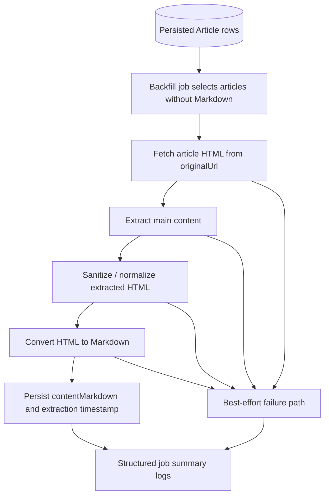
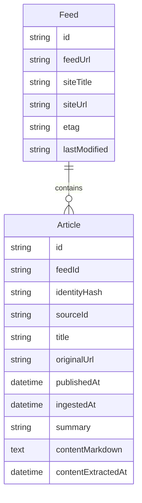

# v0.1 Slice 3 Article Markdown Storage Requirements

## Problem Frame

The current backend proves feed ingestion, but it still stops at feed-provided metadata plus a compatibility `summary`. That is not yet the right substrate for later title translation, layered summarization, or richer reading. The next v0.1 slice should therefore prove one narrower capability first: fetch the original article page for already-persisted articles, extract the main body, convert it to Markdown, and persist that Markdown to PostgreSQL.

This slice is intentionally framed as an independent enrichment/backfill capability rather than a change to the boot-time feed ingestion backbone. The goal is to make article-body persistence real and testable without turning the current startup ingestion path into a more fragile multi-stage pipeline.

Verified current-state context:

- `apps/api/src/feeds/feed-bootstrap.service.ts` triggers feed ingestion on application bootstrap.
- `apps/api/src/feeds/feed-ingestion.service.ts` currently fetches feed XML, normalizes entries, and persists `Article` rows, but does not fetch article pages.
- `apps/api/prisma/models/article.prisma` currently stores feed-level metadata only: no extracted body field exists yet.
- `apps/api/src/articles/articles.service.ts` and `apps/api/src/articles/article.repository.ts` expose only `title`, `sourceTitle`, `publishedAt`, `summary`, and `originalUrl` on the current public detail path.

## Requirements

**Body Extraction Backbone**

- R1. The system must provide an independent article-content backfill capability that runs separately from startup feed ingestion.
- R2. The backfill capability must read candidate articles from persisted `Article` rows and use `Article.originalUrl` as the fetch target.
- R3. The backfill capability must fetch article HTML, extract the main readable body, convert that body to Markdown, and persist the Markdown back onto the same `Article` record.
- R4. The first implementation must be best-effort: failure to extract Markdown for one article must not block attempts on other candidate articles.
- R5. The first implementation must preserve the existing feed-ingestion backbone semantics; boot-time feed ingestion remains responsible only for feed metadata/article discovery in this slice.

**Persistence Shape**

- R6. The `Article` model must gain a nullable `contentMarkdown` field for extracted body Markdown.
- R7. The `Article` model must gain a nullable `contentExtractedAt` field that records when Markdown was last successfully persisted.
- R8. The current `summary` field must keep its existing meaning as feed-provided summary/description compatibility text rather than being repurposed for article-body storage.
- R9. The schema change must remain inside `apps/api` and continue to use the existing Prisma/PostgreSQL ownership model and migration history.

**Execution Surface**

- R10. The first execution surface should be operator-triggered backfill, not a new public HTTP API.
- R11. The backfill must support a narrow verification path for local development, such as targeting one article or a limited batch, so the operator can explicitly confirm that Markdown persists.
- R12. The backfill must emit a structured run summary that at least reports attempted articles, successful markdown writes, and failed extraction attempts.

**Testing and Reliability**

- R13. The slice must include automated tests that prove the path from controlled input HTML to persisted `contentMarkdown`.
- R14. The primary automated test path must rely on local HTML fixtures rather than real external article URLs.
- R15. The extraction pipeline must fail open: an extraction failure may leave `contentMarkdown` null, but must not corrupt the existing article row or break article reads.
- R16. The first implementation may keep failure observability in structured logs and test assertions; it does not require a persistent extraction-jobs table in this slice.

## Success Criteria

- A developer can run the article-content backfill against a local database and observe at least one `Article` row receive non-null `contentMarkdown`.
- The persisted Markdown is derived from extracted article-body HTML rather than copied from feed `summary`.
- Automated tests using local fixtures verify that extracted Markdown is written to the database.
- Existing `/articles` read APIs continue to work without requiring any new public endpoint.
- Logs or structured command output clearly distinguish successful writes from extraction failures.

## Scope Boundaries

- No change to the startup feed-ingestion trigger in this slice.
- No scheduler, cron, or continuous background content extraction in this slice.
- No public API contract expansion for exposing Markdown yet.
- No LLM summarization, translated titles, or layered summaries yet.
- No browser automation, paywall handling, login flows, or anti-bot bypass in the first version.
- No persistent extraction queue or job-history model in the first version.
- No requirement to guarantee successful extraction for every article source.

## Key Decisions

- Separate discovery from enrichment: feed ingestion continues to discover articles, while article-body extraction runs as a distinct backfill capability.
- Markdown is the canonical persisted body format for this product direction, even though reference systems such as Miniflux and FreshRSS usually persist HTML/content rather than Markdown.
- The recommended first extraction stack is `@mozilla/readability` for body extraction plus `turndown` and `turndown-plugin-gfm` for HTML-to-Markdown conversion.
- The first test strategy uses local HTML fixtures because reproducible extraction correctness matters more than external-network realism in this slice.
- The public article API remains intentionally thin for now; this slice proves storage before contract expansion.

## External Best-Practice Signals

- Miniflux and FreshRSS both support a notion of full-content enrichment separate from the original feed metadata path, and both persist enriched article content rather than treating feed summaries as the final source of truth.
- Miniflux's architecture suggests that original-content fetching is a distinct enrichment action rather than a hard prerequisite for feed refresh success.
- FreshRSS shows that full-content retrieval often needs source-specific tuning over time, which is another reason to keep this first slice decoupled from the boot ingestion backbone.
- `@mozilla/readability` remains a strong baseline for readable-content extraction in the JavaScript ecosystem, but it is not itself a security sanitizer.
- `turndown` remains a pragmatic, mature HTML-to-Markdown converter for Node-based pipelines, especially when paired with `turndown-plugin-gfm`.
- `defuddle` is worth tracking as a later alternative if Markdown fidelity becomes a primary issue, but it is not necessary to de-risk this first storage slice.

## High-Level Technical Direction

This brainstorm is intentionally technical enough to define the first schema shape, execution surface, and API stance.

### Prisma Schema Draft

**Article**

- `id`: existing internal primary key
- `feedId`: existing relation to `Feed`
- `identityHash`: existing per-feed article identity
- `sourceId`: existing source-native identifier when available
- `title`: existing article title
- `originalUrl`: existing article URL
- `publishedAt`: existing source-published timestamp
- `ingestedAt`: existing first-ingested timestamp
- `summary`: existing feed-provided summary compatibility field
- `contentMarkdown`: nullable extracted article body in Markdown
- `contentExtractedAt`: nullable timestamp of the latest successful markdown persistence
- `createdAt`: record creation time
- `updatedAt`: record update time

### Prisma Constraint Direction

- Keep existing `Feed.feedUrl` uniqueness and `Article(feedId, identityHash)` uniqueness unchanged.
- Add no new uniqueness constraint for `contentMarkdown`; it is enrichment data attached to an existing `Article`.
- Keep `contentMarkdown` nullable so extraction can fail without forcing placeholder content.
- Keep `contentExtractedAt` nullable so "not attempted yet" and "not successfully extracted yet" can both remain representable without adding a separate status model in this slice.

### Internal Execution Surface Draft

The first execution surface should be package-local and operator-driven rather than publicly routable.

Preferred shape:

- package-local command or script owned by `apps/api`
- default behavior: process articles where `contentMarkdown` is null
- narrow verification option: process one explicit article ID
- optional batch limit for local verification and safe iteration

Illustrative command shape:

- `pnpm --filter api article-content:backfill`
- `pnpm --filter api article-content:backfill --article-id <id>`
- `pnpm --filter api article-content:backfill --limit 10`

The exact command wiring is deferred to planning, but the contract direction is that the first surface is an internal operator tool, not a public route.

### Public API Contract Stance

The public API surface should remain unchanged in this slice:

- `GET /articles`
- `GET /articles/:id`

`GET /articles/:id` should continue to return:

- `title`
- `sourceTitle`
- `publishedAt`
- `summary`
- `originalUrl`

This slice deliberately does **not** require exposing `contentMarkdown` yet. Storage is proven first; public consumption can be planned later.

### Backfill Run Summary Shape

The internal execution surface should emit a structured summary that is simple but enough to confirm success:

- `attemptedCount`
- `succeededCount`
- `failedCount`
- `skippedCount`
- optional list of failed article IDs / URLs for diagnosis

### Extraction Pipeline Direction

- Fetch HTML from `Article.originalUrl`.
- Parse DOM in a controlled environment suitable for Readability.
- Use `@mozilla/readability` to extract the main article content.
- Sanitize or normalize the extracted HTML before Markdown conversion.
- Convert the cleaned HTML to Markdown via `turndown` plus GFM support.
- Persist `contentMarkdown` and `contentExtractedAt` only on successful extraction.

### Persistence-to-API Mapping

| Concern                                     | Backing data                                             |
| ------------------------------------------- | -------------------------------------------------------- |
| Existing article title reads                | `Article.title`                                          |
| Existing detail summary reads               | `Article.summary`                                        |
| Future article body substrate               | `Article.contentMarkdown`                                |
| Verification of successful body persistence | `Article.contentMarkdown` + `Article.contentExtractedAt` |

### Testing Direction

- Use local HTML fixtures as the main correctness input.
- Test the extraction pipeline from HTML fixture through database persistence.
- Include at least one failure-path test showing that invalid/unextractable input does not corrupt existing article metadata.
- Keep tests package-local to `apps/api` and aligned with the current NestJS/Prisma test setup.

## Dependencies / Assumptions

- Persisted article rows already exist from the prior feed ingestion slice.
- `Article.originalUrl` is the fetch anchor for this slice; the first version does not invent alternate article-source resolution.
- PostgreSQL `text` storage through Prisma `String` is sufficient for the expected Markdown payload size of this stage.
- The future LLM pipeline will consume persisted Markdown rather than re-fetching article pages on demand.
- Source-specific extraction edge cases will exist, but broad generic extraction is enough for the first proof slice.

## Outstanding Questions

### Deferred to Planning

- [Affects R10][Technical] What is the exact package-local command wiring for the operator-triggered backfill?
- [Affects R11][Technical] Should the first verification-focused execution surface prioritize `--article-id`, `--limit`, or both?
- [Affects R15][Technical] What minimum sanitization/normalization step is sufficient before `turndown` without expanding this slice into a larger content-cleaning project?
- [Affects R13][Technical] What fixture set best represents the first expected article shapes without overfitting the test corpus?

## Next Steps

-> Keep this as a brainstorm pair for now; do not convert it into a plan until the user explicitly asks for planning.
