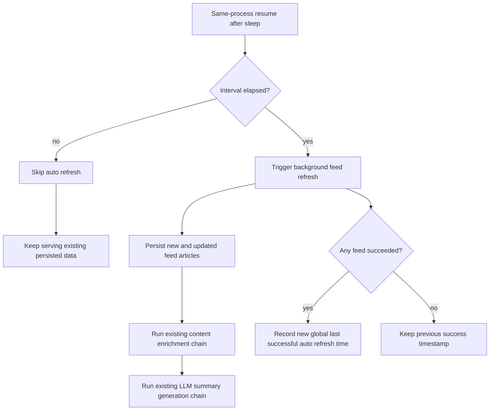

# Feed Auto Refresh On Wake Requirements

## Problem Frame

The current product can ingest feeds on API startup, but it still behaves like a one-shot bootstrap flow instead of an ongoing feed refresh capability. That leaves a practical product gap: after the server has been idle or asleep for a while, the system may come back online with stale feed data, including the case where the machine resumes from sleep and the same process is still alive.

For this slice, the goal is to add a serverless-friendly automatic refresh rule: when the runtime resumes after machine sleep / suspend while the same process is still alive, it should decide whether enough time has passed since the last successful automatic refresh. If the configured interval has elapsed, the system should trigger a new background refresh without blocking HTTP availability. Newly discovered articles from that refresh must continue into the existing enrichment chain, including the current LLM summary generation flow.

Verified current-state context:

- `apps/api/src/feeds/feed-bootstrap.service.ts` currently triggers feed ingestion during application bootstrap when `INGEST_ON_BOOT=true`.
- `apps/api/src/config/env.validation.ts` and `apps/api/src/config/app-config.ts` currently validate bootstrap ingestion settings, but they do not yet expose any feed refresh interval in hours.
- `apps/api/src/feeds/feed-ingestion.service.ts` already persists new feed articles and then kicks off downstream article-content enrichment and summary refresh work for affected articles.
- `apps/api/prisma/models/feed.prisma` currently stores feed metadata such as `etag`, `lastModified`, `createdAt`, and `updatedAt`, but there is no verified dedicated field that represents the global last successful automatic refresh time.
- `INGEST_ON_BOOT` keeps its existing bootstrap meaning in this slice: when it is `true`, startup still always triggers startup-time ingestion. This slice does not change that contract; it only adds interval-based auto-refresh behavior for same-process resume after sleep / suspend.

## Requirements

**Automatic Refresh Triggering**

- R1. The system must evaluate automatic feed refresh eligibility only when the machine or runtime resumes from sleep / suspend / freeze while the same process is still alive; it must not attach auto-refresh checks to user read requests.
- R2. The first automatic refresh gate must be time-based: if the configured refresh interval has elapsed since the last successful automatic refresh, the system must trigger one new background feed refresh attempt.
- R3. If the configured interval has not elapsed, the system must skip the automatic refresh and continue serving existing persisted data.
- R4. Automatic refresh must remain non-blocking for HTTP availability after local startup prerequisites have passed, matching the current bootstrap ingestion posture.
- R5. This slice must not change the existing meaning of `INGEST_ON_BOOT`: when `INGEST_ON_BOOT=true`, startup-time ingestion still runs unconditionally on process start, independent of the new auto-refresh interval.
- R6. If an automatic refresh run is already in progress when another same-process resume trigger arrives, the new trigger must be skipped rather than queued into a second run.

**Configuration and Defaults**

- R7. The refresh interval must be controlled by an environment variable whose unit is hours.
- R8. If that environment variable is unset, the system must fall back to a code-defined default value of `6` hours rather than failing startup.
- R9. The refresh-interval setting must describe the gap between successful automatic refresh runs; it is not a cron expression and does not require an always-on scheduler for this slice.

**Success Tracking and Serverless Behavior**

- R10. The system must track one global last successful automatic refresh time for this slice rather than introducing per-feed refresh eligibility.
- R11. A serverless-friendly deployment must apply the same elapsed-interval rule to same-process resume after machine or runtime sleep / suspend / freeze, so a sleeping server can catch up automatically after it resumes.
- R12. If there is no recorded last successful automatic refresh time yet, a same-process resume must still trigger an automatic refresh immediately.
- R13. An automatic refresh run counts as successful for interval tracking when at least one feed succeeds.
- R14. The global last successful automatic refresh time must be updated only after the full automatic refresh run finishes and only if that run had at least one successful feed.
- R15. If no feed succeeds during the automatic refresh run, the system must not advance the global last successful automatic refresh time.

**Ingestion and Downstream Pipeline Continuity**

- R16. Articles discovered by an automatic refresh must flow through the same existing downstream processing chain as startup-ingested articles instead of being treated as a separate product path.
- R17. Newly discovered or newly enriched articles from the automatic refresh path must remain eligible for the existing LLM summary generation chain.
- R18. This slice must not redefine the current summary product behavior; it only extends how fresh articles enter the already established ingestion and enrichment pipeline.

**Operational Boundaries**

- R19. The slice must not add user-facing feed refresh controls, feed CRUD, or public write endpoints for manually forcing refresh.
- R20. The slice must not require an always-running scheduler, external cron infrastructure, or request-time refresh hooks to satisfy the serverless-friendly requirement.
- R21. Logging and run summaries for the automatic refresh path must make it possible to distinguish skip, triggered refresh, already-running skip, partial success, and full failure outcomes.
- R22. To avoid hanging the resume-triggered refresh path, each feed attempt may retry transient failures, but it must stop after at most three tries for that feed within one automatic refresh run.

## Success Criteria

- After the API has been asleep or inactive longer than the configured interval, the next same-process resume triggers one background feed refresh automatically.
- When the machine resumes from sleep and the original API process is still alive, the system still performs the interval check instead of waiting for a later restart.
- When there is no prior successful automatic refresh timestamp, a same-process resume still triggers an immediate automatic refresh.
- When the interval has not elapsed, startup or wake does not perform unnecessary refresh work.
- New articles discovered through the automatic refresh path continue into the existing enrichment and LLM summary pipeline.
- Automatic refresh does not move feed freshness checks onto user read traffic.
- A partially successful automatic refresh updates the global success timestamp only after the full run finishes, while a full failure does not.
- A duplicate resume trigger during an already-running automatic refresh is skipped instead of starting a second run.
- `INGEST_ON_BOOT=true` continues to mean that startup always runs startup-time ingestion, regardless of the new auto-refresh interval.

## Scope Boundaries

- This slice does not introduce per-feed refresh scheduling or per-feed freshness policies.
- This slice does not add request-triggered refresh checks on article list or detail reads.
- This slice does not change the bootstrap semantics of `INGEST_ON_BOOT`.
- This slice does not add a general-purpose job scheduler or distributed cron system.
- This slice does not add manual refresh UI, admin tooling, or public repair endpoints.

## Key Decisions

- Resume-only auto-refresh trigger: Keeps interval-based refresh logic out of read latency and avoids coupling user traffic to slow upstream feed and LLM-adjacent work, while still covering same-process machine wake.
- `INGEST_ON_BOOT` remains separate: startup ingestion behavior stays unconditional when enabled, so this slice does not repurpose an existing bootstrap flag into interval logic.
- Environment-variable interval in hours with a code default: Preserves deploy-time control without making configuration mandatory for local development.
- One global last successful automatic refresh timestamp: Solves the stale-on-wake problem without expanding this slice into a per-feed runtime state system.
- Success means at least one feed succeeded: Prevents one bad feed from forcing every future wake to retry the whole set immediately.
- Update the success timestamp only after the run ends: Keeps interval tracking aligned to one finished refresh run instead of an early in-flight success.
- Skip duplicate resume triggers while a run is active: Prevents overlapping refresh waves from the same recovery window.
- Reuse the existing enrichment and summary chain: Avoids inventing a parallel path for refreshed articles and preserves current downstream behavior.

## Dependencies / Assumptions

- This slice assumes the existing feed ingestion path remains the canonical way new feed articles enter persistence.
- This slice assumes the current article enrichment and LLM summary path should continue to run independently of user read requests.
- This slice assumes a durable place can be added or identified for the global last successful automatic refresh time during planning.

## Outstanding Questions

### Deferred to Planning

- [Affects R8][Technical] What is the smallest durable persistence shape for the global last successful automatic refresh time that fits the existing data model and deployment assumptions?
- [Affects R17][Technical] Should automatic refresh logging reuse the existing bootstrap summary structure verbatim or add one new scope for wake-driven runs?
- [Affects R12][Needs research] Are there any current edge cases in the enrichment or summary chain where refreshed existing articles should re-enter processing differently from newly created articles?

## Next Steps

-> /ce:plan for structured implementation planning
