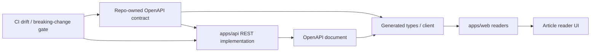

# Make the Web/API Read Boundary OpenAPI-First

## Problem Frame

`apps/web` still reads `apps/api` through hand-written fetch wrappers.
`apps/web/src/widgets/article-reader/api/articles-api.ts` defines its own return
types and then trusts `response.json() as T`. On the API side, `apps/api` keeps a
separate set of DTO classes and controller mappings. That leaves a gap between
"looks typed" and "is actually contract-safe."

The goal of this refactor is not to switch to a different RPC style. It is to
collapse the Web/API read boundary onto a single OpenAPI contract that is
reviewable, generatable, and checkable. The current external read surface is
narrow, but it is the template for every future web->api read path, so it should
become the repo standard first.

## Requirements

**Contract Source of Truth**

- R1. The repository must provide a single OpenAPI contract source for every API
  read surface consumed by `apps/web`.
- R2. The contract must cover all API response shapes currently consumed by
  `apps/web`; this cannot only fix the article reader while leaving another hand-
  written contract behind.
- R3. The contract must be a reviewable repo artifact in PRs, not something that
  exists only at runtime.

**Web Consumption**

- R4. `apps/web` must read API data through generated types or a generated client
  derived from the contract, not through hand-written DTO-like types.
- R5. `apps/web` must remove every unchecked `response.json() as T` or equivalent
  cast for API responses.
- R6. The current reader experience must remain intact: default article
  selection, URL persistence, 404 handling, summary fallback copy, and detail
  rendering must not regress.

**Backend Ownership and Validation**

- R7. `apps/api` remains the owner of the REST implementation, runtime
  validation, response mapping, and data sourcing.
- R8. Any response-shape change must land together with the contract change in
  the same PR; the backend must not move first and the contract later.
- R9. The contract layer must make breaking changes visible before merge, not
  only at runtime.

**Workflow**

- R10. The repository must provide a repeatable contract refresh flow so
  developers can regenerate the OpenAPI contract and web-side generated
  artifacts reliably.
- R11. CI or an equivalent repo-level check must detect drift between the
  implementation and the published contract.
- R12. This migration must cover all current web->api read seams, not just the
  article reader, so no parallel hand-written path remains behind.

## Success Criteria

- `apps/web` no longer relies on hand-written API return types as the only
  contract source.
- The current reader page still works and user-visible behavior does not regress.
- Contract changes are explicit in PRs, so reviewers can see the impact surface
  directly.
- If implementation and contract diverge, repo-level checks catch it before
  merge.

## Scope Boundaries

- This will not migrate to tRPC or turn REST into an internal RPC style.
- This will not change ingestion, summary handling, Prisma schema, or database
  persistence semantics.
- This does not require exposing more reader data, such as `contentMarkdown`.
- This is not a broader frontend data-layer redesign; it only solves the
  Web/API read contract layer.

## Key Decisions

- OpenAPI contract-first is the chosen direction, not tRPC.
- The OpenAPI contract will be a repo asset that is reviewed and synchronized,
  not something that exists only as an implicit runtime output.
- Migration scope is defined as "all current web->api read seams," not just the
  article reader.
- `apps/api` keeps the Nest REST shape, and the contract and implementation stay
  on the same mainline instead of splitting into two sources of truth.

**NestJS Reference Docs**

- OpenAPI introduction: <https://docs.nestjs.com/openapi/introduction>
- OpenAPI CLI plugin: <https://docs.nestjs.com/openapi/cli-plugin>
- Validation: <https://docs.nestjs.com/techniques/validation>
- Monorepo / workspace: <https://docs.nestjs.com/cli/monorepo>

**Next.js / OpenAPI Frontend References**

- Data fetching / Client Components:
  <https://nextjs.org/docs/app/getting-started/fetching-data>
- Orval:
  <https://orval.dev/>
- Orval React Query:
  <https://orval.dev/docs/guides/react-query>

## Dependencies / Assumptions

- Assume the current REST response shapes can be represented clearly in
  OpenAPI without redesigning the API first.
- Assume `apps/web` can accept Orval-generated clients/hooks instead of
  continuing to maintain handwritten fetch wrappers.
- Assume the existing CI flow can host contract-drift checks without a full
  pipeline rebuild.

## Outstanding Questions

### Deferred to Planning

- [Affects R1][Technical] Should the canonical OpenAPI file be YAML or JSON?
- [Affects R10][Technical] Which script or workspace task should own contract
  generation and web client generation?
- [Affects R10][Needs research] Which contract diff / breaking-change gate fits
  this repo best?
- [Affects R4][Technical] Should web-generated artifacts read directly from the
  repo contract or from an exported artifact?

## Next Steps

-> /ce:plan for structured implementation planning
