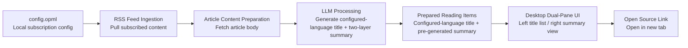
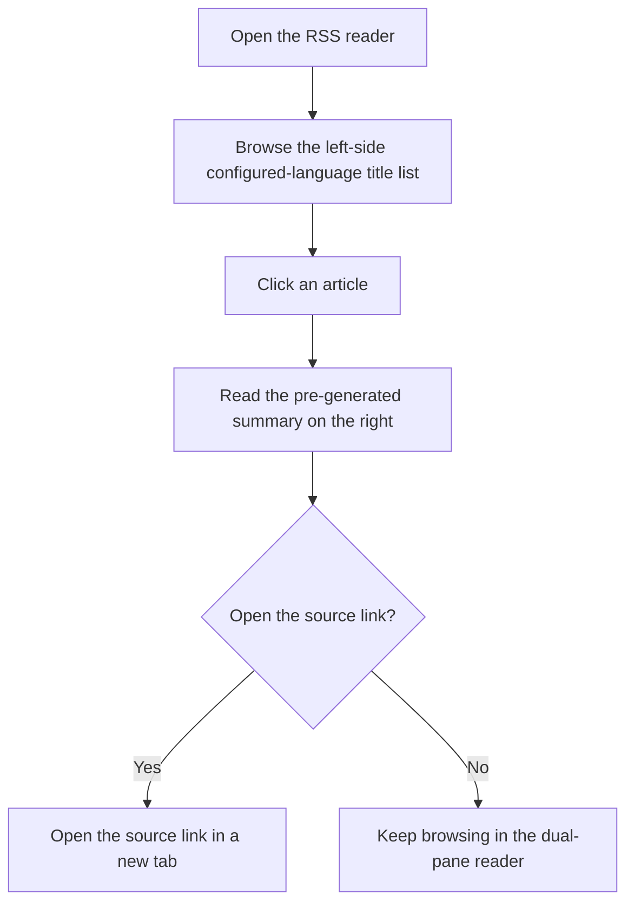

# rss-start v0.1 Diagram Notes

## Overview

This document uses two essential Mermaid diagrams to explain the minimum product loop of `rss-start v0.1`.
The focus is not implementation detail. It is meant to answer two product questions:

- What information does the system prepare in advance to help the reader decide?
- How does the desktop experience move from "scan titles" to "decide whether to open the source link in a new tab"?

This version keeps only two diagrams:

1. `MVP concept flow`
2. `Desktop reading journey`

Out of scope for this version: failure paths, degraded states, retry logic, and implementation-level API choreography.

## Diagram 1: MVP concept flow

This diagram confirms the v0.1 product loop: the system reads from the local subscription config, prepares titles and two-layer summaries in the user-configured target language, and then hands that prepared information to a desktop dual-pane UI so the reader can decide whether to open the source link in a new tab.

Caption: This diagram answers the question, "What decision material is prepared before the reader starts browsing?"

## Diagram 2: Desktop reading journey

This diagram confirms the shortest decision path inside the desktop dual-pane reader: first scan the configured-language title list on the left, then read one article's pre-generated summary on the right, and finally decide whether to open the source link in a new tab.

Caption: This diagram answers the question, "How does the reader move from title judgment to summary judgment and then optionally open the source in a new tab?"

## Scope boundary

Together, these two diagrams define the product boundary of v0.1:

- The list view lowers the language barrier by using the user's configured target language at the title level.
- The summary view helps the reader decide whether the source link is worth opening.
- Opening the original article is an external follow-out action from the reader, specifically opening the source link in a new tab, not the start of a more complex in-product workflow.

If future versions need implementation details, state transitions, or error handling, those should live in a separate technical document rather than expanding this product diagram document.
