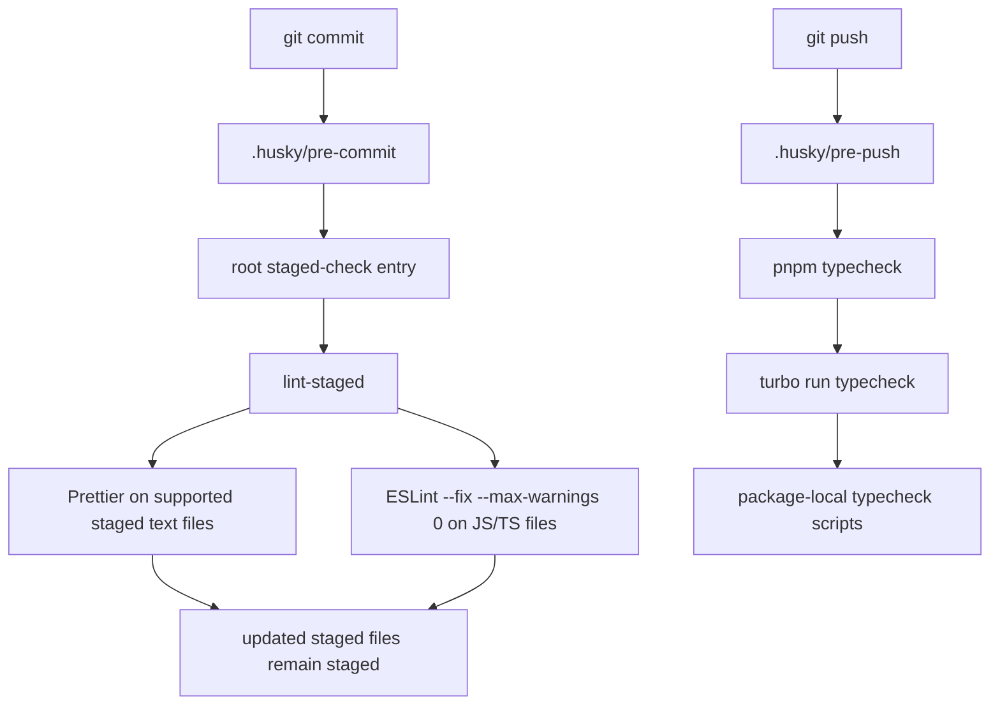

# feat: Add Husky local quality gates

## Overview

This plan adds a local Git quality gate for the monorepo with Husky as the hook manager. `pre-commit` stays fast and staged-file-only by routing formatting and linting through `lint-staged`, while `pre-push` reuses the existing root workspace `typecheck` entry so the Git hook path stays aligned with the current Turborepo task graph instead of inventing a parallel workflow.

The rollout also closes the most obvious coverage gap in the current workspace gate: `packages/ui` contains TypeScript source but still lacks local `lint` and `typecheck` scripts. The plan therefore treats hook wiring and task-coverage normalization as one change set, so the new push-time gate is trustworthy the day it lands.

## Problem Frame

The origin requirements document already fixed Scheme A as the desired behavior: commit-time checks should stay limited to staged formatting and linting, workspace typechecking should move to push-time, and local hooks must not run end-to-end tests (see origin: `docs/en/brainstorms/2026-04-11-git-hooks-scheme-a-requirements.md`).

The current repository is close to supporting that shape, but it is missing three pieces:

- there is no checked-in Git hook manager or `.husky/` surface yet;
- there is no staged-file orchestration layer for fast commit-time fixes; and
- the workspace gate is not fully representative because `packages/ui/package.json` still lacks local `lint` and `typecheck` scripts even though `packages/ui` is a real source-bearing package.

The user has already selected Husky. This planning pass therefore focuses on how to introduce Husky as a thin root-level wrapper, keep staged checks aligned with the existing Prettier/ESLint toolchain, and preserve Turborepo package-task ownership while making the push-time `typecheck` gate complete enough to trust.

## Requirements Trace

- R1. Before commit creation, only staged files should be formatted and linted; safe auto-fixes must remain part of the same commit attempt.
- R2. Before push acceptance, the workspace must run a repository-level `typecheck` gate through the existing monorepo task model.
- R3. No local Git hook in this scope may run `test:e2e` or any equivalent end-to-end suite.
- R4. The hook flow must reuse existing repo entry points and remain a thin orchestration layer over the current toolchain.
- R5. Package-local tasks remain the source of truth; root-level hook entry points only orchestrate.
- R6. Commit-time checks must stay fast and staged-file-focused.
- R7. Push-time behavior may be slower, but it must remain explicit and predictable for contributors.

## Scope Boundaries

- Do not change CI policy, deployment behavior, or release workflow.
- Do not add commit-message hooks, branch-name hooks, or any hook types outside the quality-gate path.
- Do not move task logic out of package `package.json` files into the root; root scripts may only orchestrate root-only tooling.
- Do not introduce end-to-end test execution into local hooks.
- Do not redesign the current Turborepo dependency graph unless hook rollout reveals a concrete gate-completeness problem that cannot be solved by normalizing missing package scripts.

## Context & Research

### Relevant Code and Patterns

- `package.json` already establishes the current root orchestration pattern: repo-level commands delegate to `turbo run ...`, while root-owned tooling such as Prettier lives at the repository boundary.
- `turbo.json` already defines workspace `lint` and `typecheck` tasks, so the hook plan should reuse those entry points instead of creating a new task graph.
- `apps/api/package.json`, `apps/web/package.json`, and `packages/jest-config/package.json` show the current package-local script pattern for `lint` and `typecheck`.
- `packages/ui/package.json` currently lacks both `lint` and `typecheck` despite containing TypeScript source under `packages/ui/src/`; this is the clearest current gap in the workspace gate.
- `.prettierrc.mjs`, `eslint.config.mjs`, and `apps/web/eslint.config.mjs` already define the formatting and linting behavior that staged checks should reuse.
- `README.md` and `README.zh-Hans.md` already act as the contributor-facing runbook pair; hook behavior should be documented there rather than hidden in implementation details.
- `pnpm-workspace.yaml` confirms the standard `apps/*` + `packages/*` layout that the hook rollout must preserve.
- `.agents/skills/turborepo/references/best-practices/RULE.md` explicitly allows repo-level tooling such as Husky and lint-staged at the root, while keeping executable task ownership inside packages.

### Institutional Learnings

- `docs/en/solutions/documentation-gaps/keeping-bilingual-diagram-docs-synchronized-2026-04-09.md` and `docs/zh-Hans/solutions/documentation-gaps/keeping-bilingual-diagram-docs-synchronized-2026-04-09.md` require durable documentation to remain synchronized across English and Simplified Chinese.
- Existing bilingual plans in `docs/en/plans/` and `docs/zh-Hans/plans/` also show the repo norm of making tooling ownership explicit instead of relying on unwritten executor habits.

### External References

- Husky official get-started guide: `https://typicode.github.io/husky/get-started.html`
- lint-staged official documentation: `https://github.com/lint-staged/lint-staged`

## Key Technical Decisions

- Use Husky as the checked-in hook manager at the repository root. This matches the user's explicit decision, keeps Git-hook ownership at the correct repo boundary, and avoids introducing ad hoc per-package hook wiring.
- Install Husky through the root package lifecycle and keep `.husky/pre-commit` and `.husky/pre-push` intentionally thin. The hook files should delegate to reviewable repo-relative entry points rather than embedding complex shell logic.
- Use `lint-staged` for commit-time staged-file orchestration. It is purpose-built for staged filename routing and automatically keeps task-modified files staged, which satisfies R1 without custom `git add` index-management scripts.
- Reuse the existing root `typecheck` entry for `pre-push` rather than creating a hook-only typecheck command. Contributors should see the same gate whether they run it manually or trigger it through Git.
- Normalize missing package coverage during the same rollout, starting with `packages/ui`. The push-time gate is only trustworthy if every relevant source-bearing package participates in workspace `typecheck`, so hook adoption and coverage repair should land together.
- Keep `test:e2e` outside all local hooks. Broader validation remains available through existing manual and CI flows, while local hooks stay focused on fast quality gates.
- Document contributor expectations explicitly in the bilingual READMEs, including the fact that the current `typecheck` task graph may trigger upstream `build` prerequisites and therefore make `pre-push` slower than `pre-commit`.

## Open Questions

### Resolved During Planning

- Which hook manager should own the implementation surface? Husky, per the user's decision and the repo's root-tooling boundary.
- Which staged-file mapping should be used for formatting and linting? A root `lint-staged` configuration that runs Prettier on supported staged text files and ESLint `--fix --max-warnings 0` on JavaScript/TypeScript variants.
- How should push-time checks invoke the workspace gate? `pre-push` should call the existing root `typecheck` entry so Git and manual workflows converge on the same `turbo run typecheck` path.
- Which packages must be in scope for the rollout? At minimum `apps/api`, `apps/web`, `packages/jest-config`, and `packages/ui` participate in workspace `typecheck`; config-only packages without executable source remain intentionally outside that gate unless they later gain code that needs checking.
- Should package task coverage be normalized before or during hook rollout? During the same rollout, so the new hook boundary never ships with a knowingly incomplete workspace gate.

### Deferred to Implementation

- The exact staged-file glob boundaries and command ordering inside `lint-staged.config.mjs` can be finalized during implementation as long as the staged-only scope and auto-fix behavior remain intact.
- Whether `.husky/*` stays one-command-per-file or extracts to a small `scripts/hooks/` helper can be decided during implementation if the hook bodies would otherwise stop being thin.

## High-Level Technical Design

> _This illustrates the intended approach and is directional guidance for review, not implementation specification. The implementing agent should treat it as context, not code to reproduce._

## Implementation Units

- [x] **Unit 1: Normalize workspace lint and typecheck coverage**

**Goal:** Make the existing workspace quality commands trustworthy enough to serve as the push-time Git gate.

**Requirements:** R2, R4, R5, R7

**Dependencies:** None

**Files:**

- Modify: `packages/ui/package.json`

**Approach:**

- Add local `lint` and `typecheck` scripts to `packages/ui/package.json` using the same package-owned pattern already present in `apps/api`, `apps/web`, and `packages/jest-config`.
- Reconfirm which packages are intentionally in scope for workspace `typecheck`, and do not paper over missing coverage with a root-only workaround task.
- Keep the root `lint` and `typecheck` commands delegating to `turbo run ...`; the rollout should improve task coverage, not replace the task model.
- If implementation discovers another source-bearing package with the same gap, expand coverage explicitly in the same pass instead of leaving the scope ambiguous.

**Patterns to follow:**

- `apps/api/package.json`
- `apps/web/package.json`
- `packages/jest-config/package.json`
- `package.json`

**Test scenarios:**

- Happy path — `packages/ui` exposes local `lint` and `typecheck` scripts that follow the same ownership pattern as the other source-bearing packages.
- Happy path — the root workspace `typecheck` gate now includes `packages/ui` instead of silently skipping it.
- Edge case — config-only packages without executable source remain outside `typecheck` intentionally instead of gaining meaningless placeholder scripts.
- Integration — a failure introduced in `packages/ui` propagates through the workspace `typecheck` gate and would therefore block a push once hooks are wired.

**Verification:**

- The declared in-scope packages all participate in workspace lint/typecheck through package-local scripts, and the root commands remain thin `turbo run` orchestrators.

- [x] **Unit 2: Define the staged-file formatting and lint orchestration**

**Goal:** Satisfy the commit-time gate with a fast staged-only path that preserves safe auto-fixes inside the same commit attempt.

**Requirements:** R1, R4, R6

**Dependencies:** Unit 1

**Files:**

- Modify: `package.json`
- Create: `lint-staged.config.mjs`

**Approach:**

- Add a root staged-check entry such as `lint:staged` that delegates to `lint-staged` rather than reusing the full workspace `lint` command.
- Route supported staged text files through Prettier using the existing root `.prettierrc.mjs`; route JavaScript/TypeScript files through ESLint `--fix --max-warnings 0` using the current repo configs.
- Keep the staged-file globs narrow enough to skip unsupported binaries and avoid noisy false positives.
- Rely on lint-staged's built-in restaging behavior instead of custom `git add` choreography.

**Patterns to follow:**

- `package.json`
- `.prettierrc.mjs`
- `eslint.config.mjs`
- `apps/web/eslint.config.mjs`

**Test scenarios:**

- Happy path — a staged TypeScript file with only formatting drift is rewritten and remains staged for the same commit attempt.
- Happy path — a staged TS/TSX file with a fixable ESLint issue is auto-fixed and still included in the pending commit.
- Edge case — a mixed commit containing supported text files and unsupported assets only runs checks on the supported files.
- Error path — a non-fixable lint failure aborts the commit with a clear failure signal.
- Integration — staged files from both `apps/*` and `packages/*` resolve through the shared repo-level Prettier and ESLint configuration without package-specific hook logic.

**Verification:**

- The commit-time gate is staged-file-only, safe auto-fixes stay staged, and non-recoverable failures stop the commit.

- [x] **Unit 3: Wire Husky as the root Git hook entry surface**

**Goal:** Connect Git lifecycle events to the planned repository gates without adding a second task model.

**Requirements:** R1, R2, R3, R4, R5, R6, R7

**Dependencies:** Unit 1, Unit 2

**Files:**

- Modify: `package.json`
- Create: `.husky/pre-commit`
- Create: `.husky/pre-push`

**Approach:**

- Add Husky and lint-staged as root-level development tooling, which is consistent with the repo's Turborepo guidance for root-owned Git-hook tools.
- Configure the root package lifecycle so contributors get hook installation through the normal dependency-install path rather than through an undocumented manual setup step.
- Keep `.husky/pre-commit` focused on the staged-check entry from Unit 2 and `.husky/pre-push` focused on the existing root `typecheck` entry.
- Do not invoke `test:e2e`, and do not hide hook-specific task logic in package scripts that should remain generic workspace commands.

**Patterns to follow:**

- `package.json`
- `turbo.json`
- `.agents/skills/turborepo/references/best-practices/RULE.md`

**Test scenarios:**

- Happy path — after a normal dependency installation, the repository has an active Husky hook surface without requiring extra contributor-specific Git configuration.
- Error path — if the staged-check entry exits non-zero, `git commit` is blocked by the hook exit code.
- Error path — if the root workspace `typecheck` gate exits non-zero, `git push` is blocked by the hook exit code.
- Integration — `pre-push` runs the same root `typecheck` path contributors already use manually, and no hook in this scheme runs `test:e2e`.

**Verification:**

- Git commit and push operations route into the intended repo-level gates through a minimal Husky surface, and those hooks do not introduce a parallel quality workflow.

- [x] **Unit 4: Document the contributor workflow and hook boundaries**

**Goal:** Make the new local quality gates explicit, understandable, and bilingual for future contributors.

**Requirements:** R3, R4, R6, R7

**Dependencies:** Unit 3

**Files:**

- Modify: `README.md`
- Modify: `README.zh-Hans.md`

**Approach:**

- Add a concise contributor-facing section that explains what runs at `pre-commit`, what runs at `pre-push`, and what is intentionally excluded.
- Call out that `pre-push` may be slower because the current `typecheck` task graph can trigger upstream `build` prerequisites.
- Keep the English and Simplified Chinese READMEs semantically synchronized in the same change set.
- Document hook behavior as repo-level guidance rather than burying it in a plan-only artifact.

**Patterns to follow:**

- `README.md`
- `README.zh-Hans.md`
- `docs/en/solutions/documentation-gaps/keeping-bilingual-diagram-docs-synchronized-2026-04-09.md`
- `docs/zh-Hans/solutions/documentation-gaps/keeping-bilingual-diagram-docs-synchronized-2026-04-09.md`

**Test scenarios:**

- Test expectation: none -- this unit is documentation-only, but the published README text must match the actual hook behavior implemented by Units 1-3.

**Verification:**

- Contributors can understand the new local gate shape, exclusions, and expected latency tradeoffs from the bilingual READMEs alone.

## System-Wide Impact

- **Interaction graph:** Git lifecycle events will now traverse `.husky/*`, the root staged-check entry, the root `typecheck` entry, `turbo run typecheck`, package-local scripts, and the existing Prettier/ESLint configuration surface.
- **Error propagation:** Any non-zero exit from lint-staged, ESLint, Prettier, or the workspace `typecheck` gate must bubble up directly so Git blocks the corresponding commit or push.
- **State lifecycle risks:** Commit-time auto-fixes must remain staged; push-time `typecheck` may trigger upstream `build` prerequisites because of the current `turbo.json` dependency graph.
- **API surface parity:** Manual contributor commands such as `pnpm lint` and `pnpm typecheck` remain the source-of-truth quality gates; Husky only adds Git-triggered entry points to the same behavior.
- **Integration coverage:** Unit tests alone cannot prove Git-hook activation; implementation should include disposable-branch smoke verification of real commit and push attempts after the files are wired.
- **Unchanged invariants:** CI, deployment, release flow, and end-to-end test execution remain outside this plan's scope; there is still no commit-message policy in the local hook surface.

## Risks & Dependencies

| Risk                                                                                                    | Mitigation                                                                                                                            |
| ------------------------------------------------------------------------------------------------------- | ------------------------------------------------------------------------------------------------------------------------------------- |
| Contributors may not realize hook installation depends on the normal dependency-install path            | Keep Husky installation inside the root package lifecycle and document it clearly in both READMEs                                     |
| The current `typecheck` task graph can make `pre-push` slower than contributors expect                  | Call out the latency tradeoff explicitly in documentation and keep `pre-commit` intentionally narrow                                  |
| Over-broad staged-file globs could touch unsupported files or create noisy failures                     | Keep lint-staged patterns explicit and verify mixed staged-file scenarios before considering the rollout complete                     |
| Workspace gate completeness may still be ambiguous if another source-bearing package is missing scripts | Treat scope declaration as part of the rollout and expand missing package-local coverage explicitly instead of relying on assumptions |

## Documentation / Operational Notes

- Roll out the README updates in the same change set as the hook files so contributor guidance and behavior do not drift.
- Verify hook behavior on a disposable feature branch rather than on a protected branch.
- Keep the hook surface reviewable: thin `.husky/*` files, explicit root configuration, and no hidden per-developer setup steps.

## Sources & References

- **Origin documents:** `docs/en/brainstorms/2026-04-11-git-hooks-scheme-a-requirements.md`, `docs/zh-Hans/brainstorms/2026-04-11-git-hooks-scheme-a-requirements.md`
- **Related code:** `package.json`, `turbo.json`, `pnpm-workspace.yaml`, `.prettierrc.mjs`, `eslint.config.mjs`, `apps/web/eslint.config.mjs`, `apps/api/package.json`, `apps/web/package.json`, `packages/jest-config/package.json`, `packages/ui/package.json`, `README.md`, `README.zh-Hans.md`
- **Related guidance:** `.agents/skills/turborepo/references/best-practices/RULE.md`
- **External docs:** `https://typicode.github.io/husky/get-started.html`, `https://github.com/lint-staged/lint-staged`
