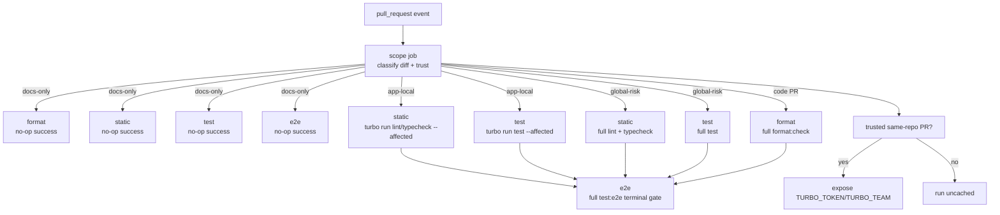

# feat: Add GitHub PR quality CI

## Overview

This plan adds a pull-request-only GitHub Actions quality workflow that turns the repository's existing local quality gates into required remote checks without expanding into a broader CI/CD program. The rollout now explicitly starts by repairing any boundary-bearing workspace that should emit `.d.ts` but currently does not, because emitted declarations are the expected type-boundary contract. After that prerequisite repair, the workflow stays inside the current Turborepo task graph, keeps GitHub Actions spend under control with workflow-level concurrency and a coarse docs-only no-op path, and uses Vercel Remote Cache only when the PR context is trusted enough to expose cache credentials.

| PR class                                      | Format                   | Lint / typecheck / test               | E2E                           | Remote cache       |
| --------------------------------------------- | ------------------------ | ------------------------------------- | ----------------------------- | ------------------ |
| Docs-only or clearly non-code                 | No-op success            | No-op success                         | No-op success                 | Not used           |
| App-local code change under `apps/`           | Full repo `format:check` | `turbo run ... --affected` where safe | Full `test:e2e` terminal gate | Same-repo PRs only |
| Shared, root, workflow, or `packages/` change | Full repo `format:check` | Full repo gates                       | Full `test:e2e` terminal gate | Same-repo PRs only |

## Problem Frame

The origin requirements document fixed the target shape already: pull requests need an enforced remote quality gate, but the repository should not grow a generic push-time CI or deployment pipeline in this scope (see origin: `docs/en/brainstorms/2026-04-12-github-pr-quality-ci-requirements.md`).

The repository already exposes the right quality entry points in `package.json`, and `turbo.json` already models the task graph behind them. The gap is that `.github/workflows/` is still empty, so pull requests do not yet have a remote, branch-protection-friendly gate for `format`, `lint`, `typecheck`, `test`, and `test:e2e`.

This planning pass therefore focuses on how to introduce one PR-only workflow that is strict, readable in the PR UI, conservative about trust boundaries, and intentionally cost-aware. It must preserve the repo's existing Turborepo ownership model, keep the current upstream `build` prerequisites where they protect package type boundaries, explicitly repair any missing `.d.ts` emission on boundary-bearing workspaces before CI optimization, and avoid clever skip logic that could leave required checks stuck in a pending state.

## Requirements Trace

- R1. Trigger the quality workflow on pull requests only.
- R2. Keep scope limited to code quality; exclude deployment, release, Docker, and unrelated delivery work.
- R3. Reuse existing repo-level and package-level quality entry points instead of inventing a parallel task model.
- R4. Require formatting, linting, tests, and end-to-end tests for every code-affecting PR.
- R5. Treat `typecheck` as a first-class required gate.
- R6. Publish branch-protection-friendly signals that make failures obvious in the PR UI.
- R7. Preserve the intentional upstream `build` prerequisites behind `lint` and `typecheck` where they protect emitted type boundaries.
- R8. Reduce wasted GitHub Actions minutes with cancellation of superseded PR runs and by avoiding duplicate orchestration.
- R9. Prefer Turborepo-native incremental execution when it is safe.
- R10. Use Vercel Remote Cache when credentials are available.
- R11. Do not rely on top-level workflow path filters that can strand required checks in a pending state.
- R12. Keep any first-rollout no-op optimization coarse, conservative, and easy to audit.
- R13. Stay safe for untrusted PR execution; do not expose cache credentials to fork code.
- R14. Degrade gracefully when cache credentials are unavailable by running uncached rather than weakening the gate.
- R15. Any workspace that is expected to provide an upstream type boundary in the current Turborepo graph must emit `.d.ts`; if it does not, fixing that gap is a prerequisite to the CI rollout rather than a follow-up optimization.

## Scope Boundaries

- Do not add `push`-triggered cloud CI in this change set.
- Do not add deployment, image build, publish, or release automation.
- Do not redesign the monorepo layout, package boundaries, or Turborepo task graph beyond the minimum package-local build/export changes needed to restore expected `.d.ts` emission on boundary-bearing workspaces.
- Do not change local Git hook behavior in `.husky/`.
- Do not adopt `pull_request_target` as the default execution model for untrusted PR code.
- Do not introduce fine-grained dependency-inference skip rules in the first rollout beyond the coarse docs-only/non-code no-op path.

## Context & Research

### Relevant Code and Patterns

- `package.json` already exposes `format:check`, `lint`, `typecheck`, `test`, and `test:e2e` as the current root orchestration entries, and it declares the repo's `pnpm` and Node expectations.
- `turbo.json` already defines `lint`, `typecheck`, `test`, and `test:e2e`, including the intentional upstream `build` edges behind the static checks.
- `.github/workflows/` is currently empty, so the plan can introduce a single workflow without colliding with an existing CI surface.
- `apps/web/playwright.config.ts` shows that browser e2e coverage boots both the API and web apps, so `test:e2e` is a real cross-surface gate rather than a placeholder.
- `apps/api/test/jest-e2e.json` shows the repo already distinguishes API e2e coverage from the browser suite.
- `packages/typescript-config/nestjs.json` enables `declaration`, and the current `apps/api/dist/src/*.d.ts` artifacts confirm that the API build emits declarations.
- `packages/jest-config/package.json`, `packages/jest-config/tsconfig.json`, and the existing `packages/jest-config/dist/*.d.ts` files confirm that `@repo/jest-config` is a declaration-emitting shared package.
- `packages/typescript-config/nextjs.json` sets `noEmit: true`; `apps/web/tsconfig.json` and `packages/ui/tsconfig.json` inherit that mode, while `packages/ui/package.json` exports source files directly and has no `build` script. Given the clarified requirement, this is not an accepted steady state for a shared boundary package: `packages/ui` is the clearest declaration-gap that must be repaired before CI optimization.
- `docs/en/solutions/workflow-issues/monorepo-husky-hooks-package-aware-and-bootstrap-stable-2026-04-11.md` captures a recent repo norm: root-owned workflow surfaces should stay thin and auditable, while package ownership stays explicit.
- `AGENTS.md` requires durable documentation to remain synchronized between `docs/en/` and `docs/zh-Hans/`, and it treats Turborepo package ownership as the default authority for workspace task wiring.

### Institutional Learnings

- `docs/en/solutions/workflow-issues/monorepo-husky-hooks-package-aware-and-bootstrap-stable-2026-04-11.md` and `docs/zh-Hans/solutions/workflow-issues/monorepo-husky-hooks-package-aware-and-bootstrap-stable-2026-04-11.md` reinforce that root-level workflow surfaces should orchestrate transparently instead of hiding package-boundary logic in ad hoc shortcuts.
- The existing plan/doc conventions in this repo favor explicit task ownership, conservative rollout notes, and synchronized English/Chinese durable artifacts instead of relying on unwritten operator knowledge.

### External References

- GitHub Actions concurrency docs: `https://docs.github.com/en/actions/how-tos/write-workflows/choose-when-workflows-run/control-workflow-concurrency`
- GitHub branch protection docs: `https://docs.github.com/en/repositories/configuring-branches-and-merges-in-your-repository/managing-protected-branches/about-protected-branches`
- GitHub required-check troubleshooting docs: `https://docs.github.com/en/repositories/configuring-branches-and-merges-in-your-repository/troubleshooting-required-status-checks`
- GitHub event/security docs for `pull_request_target`: `https://docs.github.com/en/actions/reference/events-that-trigger-workflows#pull_request_target`
- GitHub docs on forked PR action restrictions: `https://docs.github.com/en/enterprise-cloud@latest/organizations/managing-organization-settings/disabling-or-limiting-github-actions-for-your-organization`
- Turborepo CI docs: `https://turborepo.com/repo/docs/crafting-your-repository/constructing-ci`

## Key Technical Decisions

- Use one `pull_request` workflow with one non-required `scope` job and four stable required jobs: `pr-quality / format`, `pr-quality / static`, `pr-quality / test`, and `pr-quality / e2e`. This keeps branch protection readable without multiplying workflow overhead.
- Avoid top-level `paths` / `paths-ignore` filters. Instead, a workflow-internal scope classifier decides between docs-only no-op, app-local affected mode, and conservative full-repo mode so required checks always resolve.
- Use workflow-level concurrency keyed by PR identity and `cancel-in-progress: true` so superseded runs stop consuming minutes.
- Keep permissions minimal and read-only, and do not use `pull_request_target` for code execution. The default trust model remains normal `pull_request` execution.
- Gate Vercel Remote Cache on trust and availability: same-repository PRs can use `TURBO_TOKEN` and `TURBO_TEAM` when configured; fork and secret-less automation PRs (for example Dependabot) degrade to uncached execution.
- Use `turbo run lint --affected`, `turbo run typecheck --affected`, and `turbo run test --affected` only when the scope classifier proves the diff is app-local and does not touch shared or global-risk surfaces. Any root, workflow, shared-package, lockfile, or config change escalates back to full-repo execution.
- Keep `format` conservative in the first rollout by reusing the existing full-repo `format:check` path for code PRs, and keep `e2e` as one terminal job for every code-affecting PR instead of splitting it by app surface prematurely.
- Treat emitted declarations as the expected contract for boundary-bearing workspaces. Before narrowing any `^build`-backed CI path, implementation must identify every upstream workspace that should provide a type boundary, repair missing `.d.ts` emission starting with `packages/ui`, and preserve the broader current edge whenever intent is ambiguous.
- Configure branch protection against the stable job names rather than an umbrella workflow result so reviewers can see exactly which gate failed.
- Keep CI runtime parity explicit: use a Node 24.x version that satisfies `engines.node`, use the declared `pnpm` tooling, and write CI commands as `turbo run ...` rather than Turborepo shorthand.

## Open Questions

### Resolved During Planning

- Which event surface should own the workflow? `pull_request` only in the first rollout, with no `push` and no `pull_request_target` execution model.
- Which jobs may use Turborepo's affected mode safely? `lint`, `typecheck`, and `test` only when the diff is app-local and does not touch shared/global-risk paths.
- Should the first rollout include no-op success optimization? Yes, but only for docs-only or clearly non-code PRs.
- How should branch protection be configured? Require the stable named jobs (`pr-quality / format`, `pr-quality / static`, `pr-quality / test`, `pr-quality / e2e`) instead of the workflow shell.
- Should e2e be split by surface now? No. Keep one explicit terminal `test:e2e` gate first, then revisit split coverage only if runtime data justifies it.
- How should cache secrets be handled? Make cache usage optional and trusted-context-only, never a prerequisite for the quality gate.
- Has the repository standardized on emitted `.d.ts` as the universal type-boundary gate? Not yet. Current repo evidence shows the intended behavior is only partially realized: `apps/api` and `packages/jest-config` emit declarations, while `packages/ui` does not. The rollout must first repair that boundary gap instead of normalizing it as an exception.

### Deferred to Implementation

- The exact file-pattern list that separates docs-only, app-local, and global-risk changes can be finalized during implementation as long as uncertainty defaults to the conservative full-run path.
- Whether the command-selection logic stays fully inside the workflow YAML or is partially extracted into a second helper script can be decided during implementation based on readability.
- If the repository later enables merge queue, the workflow may need a `merge_group` trigger; that forward-compatibility adjustment is outside the current PR-only scope.
- Any retry, timeout, or flake-handling policy for e2e should be set during implementation after seeing actual CI behavior, not guessed into the plan.
- Whether deployable leaf apps that are not consumed cross-workspace should also emit declarations is outside this rollout unless implementation finds they participate in an upstream boundary role.

## High-Level Technical Design

> _This illustrates the intended approach and is directional guidance for review, not implementation specification. The implementing agent should treat it as context, not code to reproduce._

## Implementation Units

- [x] **Unit 1: Repair declaration-emitting boundary packages before CI rollout**

**Goal:** Restore the expected `.d.ts`-emitting boundary behavior for every upstream workspace that should participate in type-boundary validation, starting with `packages/ui`.

**Requirements:** R7, R9, R15

**Dependencies:** None

**Files:**

- Modify: `packages/ui/package.json`
- Modify: `packages/ui/tsconfig.json`
- Create: `packages/ui/tsconfig.build.json`
- Test: `packages/ui/package.json`

**Approach:**

- Add a package-local `build` surface for `packages/ui` that emits declaration artifacts and compatible runtime outputs without introducing new dependencies.
- Move `packages/ui` away from raw source exports for boundary validation so its exported entrypoints resolve through build artifacts the same way `packages/jest-config` already does.
- Keep the change package-owned: the fix belongs in `packages/ui`, while root `turbo.json` continues to orchestrate through package-local tasks.
- Audit whether any other upstream dependency in the current `^build` chain also lacks declaration output; if so, repair it in the same phase before CI narrowing.

**Execution note:** Start with a failing verification that the package build produces `.d.ts` for every exported entrypoint expected to participate in cross-workspace typing.

**Patterns to follow:**

- `packages/jest-config/package.json`
- `packages/jest-config/tsconfig.json`
- `turbo.json`

**Test scenarios:**

- Happy path — building `packages/ui` produces `.d.ts` artifacts for each exported component or helper entrypoint.
- Happy path — downstream consumers such as `apps/web` resolve package types from build artifacts rather than raw source-path exports.
- Edge case — if another shared workspace is discovered to sit in the same upstream boundary role, it is repaired in the same phase rather than left as a silent exception.
- Error path — a missing declaration output for an exported entrypoint fails the package build verification instead of silently passing.
- Integration — once `packages/ui` participates in `build`, upstream `^build` edges used by `lint` and `typecheck` can rely on a real declaration-emitting boundary instead of an implied one.

**Verification:**

- Every in-scope upstream boundary workspace emits `.d.ts`, and `packages/ui` no longer depends on source-export / `noEmit` behavior to satisfy cross-workspace typing.

- [x] **Unit 2: Add PR scope classification and trust gating**

**Goal:** Introduce a small, testable helper that classifies each PR into docs-only, app-local code, or global-risk scope and reports whether remote cache may be used safely.

**Requirements:** R1, R8, R11, R12, R13, R14

**Dependencies:** Unit 1

**Files:**

- Create: `.github/scripts/pr-quality-scope.mjs`
- Create: `.github/scripts/pr-quality-scope.test.mjs`

**Approach:**

- Read the PR base/head comparison and emit machine-readable outputs such as `docs_only`, `code_change`, `run_mode`, and `can_use_remote_cache`.
- Treat changes under `packages/`, `.github/`, root lock/config files, `turbo.json`, and other shared repository surfaces as global-risk so they escalate to full-repo execution.
- Treat app-local changes under `apps/` as eligible for affected-mode static/test execution when no shared/global-risk files are present.
- Treat uncertainty conservatively: if the classifier cannot prove the safe narrow path, it must return full-run mode.
- Mark fork and secret-less automation PR contexts (for example Dependabot) as untrusted for cache exposure even when the checks themselves still run.

**Execution note:** Start with failing classifier tests that cover docs-only, app-local, global-risk, and untrusted-PR cases.

**Patterns to follow:**

- `package.json`
- `turbo.json`
- `docs/en/solutions/workflow-issues/monorepo-husky-hooks-package-aware-and-bootstrap-stable-2026-04-11.md`
- `docs/zh-Hans/solutions/workflow-issues/monorepo-husky-hooks-package-aware-and-bootstrap-stable-2026-04-11.md`

**Test scenarios:**

- Happy path — a docs-only diff sets `docs_only=true`, `code_change=false`, and allows every required job to take the explicit no-op path.
- Happy path — a diff limited to `apps/web/**` or `apps/api/**` yields `run_mode=affected` while still marking the PR as code-affecting.
- Edge case — changing `packages/ui/**`, `turbo.json`, `.github/workflows/**`, or `pnpm-lock.yaml` escalates to full-run mode.
- Error path — unknown or unparsable diff input falls back to full-run mode instead of skipping checks.
- Integration — a same-repo PR with configured secrets reports `can_use_remote_cache=true`, while a fork or secret-less automation PR reports `false`.

**Verification:**

- The classifier output is deterministic, auditable, and conservative enough that false skips are less likely than extra work.

- [x] **Unit 3: Add the PR-only workflow shell and stable required jobs**

**Goal:** Create the GitHub Actions workflow surface that publishes stable branch-protection-friendly check names and never leaves required checks pending because of top-level filter skips.

**Requirements:** R1, R2, R6, R8, R11, R13

**Dependencies:** Unit 2

**Files:**

- Create: `.github/workflows/pr-quality.yml`
- Test: `.github/scripts/pr-quality-scope.test.mjs`

**Approach:**

- Add a single workflow triggered on `pull_request` only.
- Set minimal permissions and workflow-level concurrency so older runs on the same PR are cancelled.
- Check out enough git history for diff-based scope logic and reliable Turborepo affected comparisons.
- Keep `scope` as a setup job and publish four stable required jobs named for the real quality gates: `pr-quality / format`, `pr-quality / static`, `pr-quality / test`, and `pr-quality / e2e`.
- Use internal job/step conditionals and explicit no-op success steps for docs-only PRs so required checks resolve cleanly without path-filter deadlock.
- Place `e2e` behind the cheaper gates to reduce wasted minutes on obviously broken PRs.

**Patterns to follow:**

- `package.json`
- `turbo.json`
- `.agents/skills/turborepo/SKILL.md`

**Test scenarios:**

- Happy path — opening or updating a pull request starts exactly one PR-quality workflow run and publishes stable named checks.
- Happy path — pushing a newer commit to the same PR cancels the superseded in-progress run.
- Edge case — a docs-only PR still reports `format`, `static`, `test`, and `e2e` as successful/no-op instead of leaving pending checks behind.
- Error path — if the scope job fails, downstream required jobs do not report misleading success.
- Integration — branch protection can require the named jobs without ambiguity or dependence on a workflow filename.

**Verification:**

- The PR UI shows stable required check names, superseded runs cancel automatically, and docs-only PRs do not strand branch protection in a pending state.

- [x] **Unit 4: Wire conservative command selection and remote cache behavior**

**Goal:** Connect the workflow jobs to the existing root and Turborepo quality commands in a way that preserves correctness first and uses affected-mode and remote cache only where they are safe.

**Requirements:** R3, R4, R5, R7, R9, R10, R13, R14

**Dependencies:** Unit 1, Unit 2, Unit 3

**Files:**

- Modify: `.github/workflows/pr-quality.yml`
- Create: `.github/scripts/pr-quality-command-plan.mjs`
- Create: `.github/scripts/pr-quality-command-plan.test.mjs`

**Approach:**

- Encode the command matrix once so the workflow stays thin and easy to review.
- Reuse the completed declaration-boundary repair from Unit 1 as the baseline for the CI command matrix, and extend the audit only if implementation discovers another upstream package gap.
- Reuse the existing full-repo entries for conservative mode: `pnpm format:check`, `pnpm lint`, `pnpm typecheck`, `pnpm test`, and `pnpm test:e2e`.
- Reuse the same Turborepo tasks in affected mode through CI-native commands written as `turbo run lint --affected`, `turbo run typecheck --affected`, and `turbo run test --affected`.
- Keep the existing upstream `build` prerequisites in `turbo.json` intact; do not move task logic into root-only CI scripts. If implementation discovers additional boundary packages that still need repair, fix them before narrowing any `^build`-backed CI path.
- Keep `test:e2e` out of affected mode in the first rollout and run it as one terminal integration gate for every code-affecting PR.
- Inject `TURBO_TOKEN` and `TURBO_TEAM` only for trusted same-repo PRs when the secrets exist; otherwise run the same commands uncached.

**Execution note:** Start with failing command-selection tests that lock the docs-only, affected, full-run, and uncached branches before wiring the workflow to them.

**Patterns to follow:**

- `package.json`
- `turbo.json`
- `apps/web/playwright.config.ts`
- `apps/api/test/jest-e2e.json`
- `.agents/skills/turborepo/SKILL.md`

**Test scenarios:**

- Happy path — an app-local PR runs `format` in full-repo mode, `static`/`test` through `turbo run ... --affected`, and `e2e` as a full terminal gate.
- Happy path — a same-repo PR with configured cache secrets exposes `TURBO_TOKEN` and `TURBO_TEAM` only to the jobs that need Turbo remote cache.
- Edge case — changing `packages/**`, root config files, workflow files, or the lockfile forces full-repo `static` and `test` instead of the affected path.
- Edge case — if implementation finds another upstream boundary package beyond `packages/ui` that still lacks `.d.ts`, the rollout repairs it before enabling any narrower CI path that depends on declaration artifacts.
- Error path — missing cache secrets does not skip or downgrade the checks; the workflow still runs uncached and fails only on real quality problems.
- Integration — a browser e2e failure still blocks merge even when unit/integration `test` passed, and earlier static/test failures prevent wasting e2e minutes on obviously broken code.

**Verification:**

- Command selection remains conservative, package/task ownership stays inside the Turborepo graph, and cache availability changes runtime cost rather than pass/fail semantics.

- [x] **Unit 5: Document repository operations and branch protection setup**

**Goal:** Make the maintainer-facing setup explicit so the workflow behavior, required checks, and secret expectations stay understandable after rollout.

**Requirements:** R6, R10, R11, R13, R14

**Dependencies:** Unit 3, Unit 4

**Files:**

- Modify: `README.md`
- Modify: `README.zh-Hans.md`

**Approach:**

- Add a concise bilingual section that names the four stable required checks and explains the docs-only no-op path.
- Document that branch protection should require the stable job names rather than the workflow filename.
- Document the need to configure `TURBO_TOKEN` and `TURBO_TEAM`, and note that fork and secret-less automation PRs (for example Dependabot) intentionally run without secrets and may therefore be slower.
- Mention merge-queue follow-up only as a future operational adjustment if the repository later adopts it.

**Patterns to follow:**

- `README.md`
- `README.zh-Hans.md`
- `AGENTS.md`

**Test scenarios:**

- Test expectation: none -- this unit documents operational setup and repository settings rather than adding new executable behavior.

**Verification:**

- Maintainer docs reflect the actual workflow behavior, the paired READMEs remain synchronized, and branch-protection setup no longer depends on tribal knowledge.

## System-Wide Impact

- **Interaction graph:** `pull_request` events feed a scope-classification job, which gates the four named quality jobs, which in turn feed GitHub branch protection and optional Turbo remote-cache usage.
- **Error propagation:** Scope-classification mistakes are the highest-leverage failure mode, so ambiguity must propagate to full-run behavior rather than silent skipping; cache outages must propagate only as slower execution, not weaker checks.
- **State lifecycle risks:** Superseded runs, stale git history, and cache trust decisions all affect correctness; the workflow must cancel old runs, fetch enough history for diff-based decisions, and never reuse secrets in untrusted contexts.
- **API surface parity:** The visible contract is the stable required job names (prefixed as `pr-quality / ...`) plus the repo's existing root/Turbo task entries; future workflow edits must preserve those names or update branch protection and docs in the same change.
- **Integration coverage:** The critical cross-layer cases are same-repo code PRs, fork and secret-less automation PRs (for example Dependabot), docs-only PRs, and shared/root config PRs because they exercise trust, cache, and execution-mode boundaries simultaneously.
- **Unchanged invariants:** This plan does not add push-time cloud CI, does not replace local hooks, does not move task logic out of packages, and does not make cache availability a prerequisite for passing quality gates.

## Risks & Dependencies

| Risk                                                                                                           | Mitigation                                                                                                                              |
| -------------------------------------------------------------------------------------------------------------- | --------------------------------------------------------------------------------------------------------------------------------------- |
| Scope classification misses a shared-risk file and chooses an affected path incorrectly                        | Keep the classifier coarse, unit-test the file groups, and default unknown cases to full-run mode                                       |
| Required checks remain pending because skip logic happens at the workflow trigger layer                        | Avoid top-level path filters and make every required job resolve internally through normal or no-op execution                           |
| Remote cache credentials leak into untrusted PR execution                                                      | Stay on `pull_request`, gate secret exposure to trusted same-repo contexts, and never switch to `pull_request_target` for this workflow |
| Affected-mode comparisons are wrong because CI does not have enough git history                                | Fetch enough history for diff calculation and keep the full-run fallback when comparisons are uncertain                                 |
| A shared upstream boundary package still lacks `.d.ts`, so CI optimization would rely on a broken prerequisite | Repair declaration output first, starting with `packages/ui`, and only then narrow any `^build`-backed CI path                          |
| E2E runtime remains expensive even after rollout                                                               | Keep docs-only no-op and workflow concurrency in phase one, then revisit deeper optimization only after real CI timing data exists      |

## Documentation / Operational Notes

- The repository owner must configure `TURBO_TOKEN` and `TURBO_TEAM` in GitHub Actions secrets before trusted PRs can use Vercel Remote Cache.
- Branch protection should require the stable job names from this workflow, not the workflow filename alone.
- If the repository later enables merge queue, add `merge_group` to the workflow trigger set so required checks continue to report for queued merges.
- Keep the English and Simplified Chinese documentation updates in the same change set as the workflow rollout.

## Sources & References

- **Origin documents:** `docs/en/brainstorms/2026-04-12-github-pr-quality-ci-requirements.md` + `docs/zh-Hans/brainstorms/2026-04-12-github-pr-quality-ci-requirements.md`
- Related code: `package.json`, `turbo.json`, `apps/web/playwright.config.ts`, `apps/api/test/jest-e2e.json`
- Related repo learnings: `docs/en/solutions/workflow-issues/monorepo-husky-hooks-package-aware-and-bootstrap-stable-2026-04-11.md`, `docs/zh-Hans/solutions/workflow-issues/monorepo-husky-hooks-package-aware-and-bootstrap-stable-2026-04-11.md`
- External docs: `https://docs.github.com/en/actions/how-tos/write-workflows/choose-when-workflows-run/control-workflow-concurrency`, `https://docs.github.com/en/repositories/configuring-branches-and-merges-in-your-repository/managing-protected-branches/about-protected-branches`, `https://docs.github.com/en/repositories/configuring-branches-and-merges-in-your-repository/troubleshooting-required-status-checks`, `https://docs.github.com/en/actions/reference/events-that-trigger-workflows#pull_request_target`, `https://docs.github.com/en/enterprise-cloud@latest/organizations/managing-organization-settings/disabling-or-limiting-github-actions-for-your-organization`, `https://turborepo.com/repo/docs/crafting-your-repository/constructing-ci`
