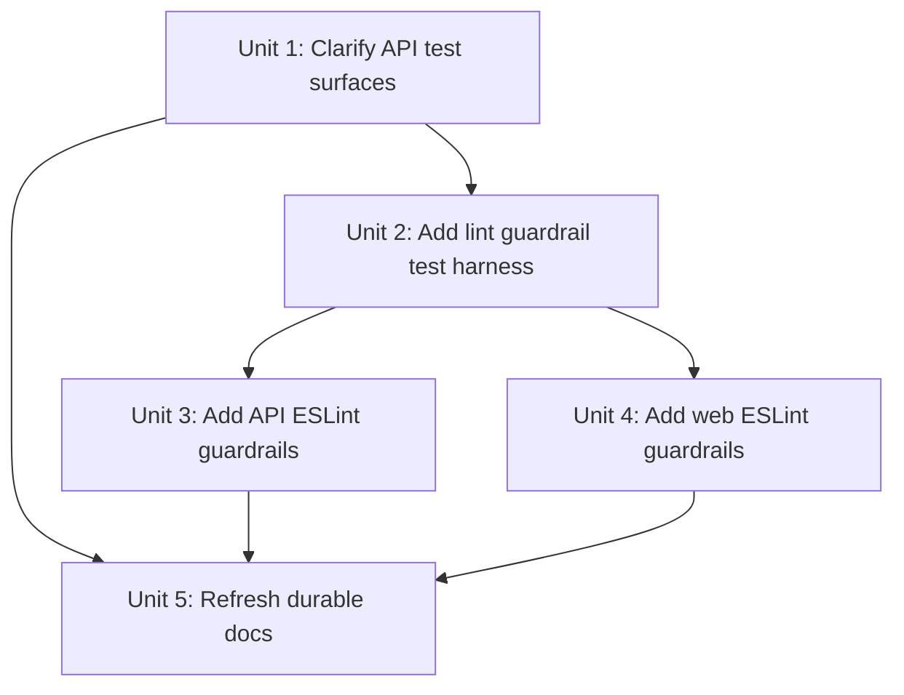

# refactor: Clarify API e2e boundaries and add ESLint maintainability guardrails

## Overview

This plan renames the misleading API app-level test surface from `apps/api/test` to `apps/api/e2e`, extracts the database reset/bootstrap helper into an app-local shared test-support surface because colocated specs already depend on it, and adds a first maintainability-guardrail layer to `apps/api` and `apps/web` through their existing ESLint entrypoints.

The implementation must preserve the current monorepo ownership model: package-local lint/test scripts stay package-local, root orchestration stays root-only, and CI continues to enforce the same `pnpm lint` path instead of introducing a second checker.

## Problem Frame

The paired requirements document already narrowed the problem correctly (see origin: `docs/en/brainstorms/2026-04-16-test-boundaries-and-eslint-guardrails-requirements.md`). The repository has two healthy test layers in `apps/api`: feature-local specs inside `apps/api/src/**` and app-level HTTP/DB suites currently grouped under `apps/api/test`. The issue is naming and ownership clarity, not the existence of two layers.

The current codebase also proves that `apps/api/test` is not purely e2e-owned: `apps/api/src/articles/article.repository.spec.ts` imports `../../test/test-db`, so a simple directory rename would leave a misleading boundary intact.

The lint side has the opposite problem: ownership is clear, but guardrails are absent. `apps/api/eslint.config.mjs` and `apps/web/eslint.config.mjs` already sit behind shared framework baselines from `packages/eslint-config`, and root `pnpm lint` already delegates through Turbo into those package-local entrypoints. That makes this a good fit for a small first-wave maintainability policy: a few low-ambiguity ESLint rules, scoped by file role, with no new enforcement path.

## Requirements Trace

- R1. Rename API app-level suites into an explicitly e2e-named surface.
- R2. Keep feature-local unit and narrow integration specs colocated in `apps/api/src/**`.
- R3. Preserve clear layering between package-local specs and app-level HTTP/DB e2e coverage.
- R4. Keep e2e-only helpers adjacent to the e2e suite; move only the helpers that are already shared beyond e2e.
- R5. Add maintainability guardrails to both `apps/api` and `apps/web` for large files, large functions, and overly complex control flow.
- R6. Use different thresholds for backend and frontend surfaces.
- R7. Distinguish web logic-only TypeScript, TSX components, and Next App Router entry files.
- R8. Give tests and test-support code looser limits than production code.
- R9. Keep the first version intentionally small and low-noise.
- R10. Run guardrails through existing ESLint entrypoints.
- R11. Keep CI enforcement on the current lint gate.

## Scope Boundaries

- Do not collapse colocated specs into the app-level e2e tree or move app-specific test helpers into `packages/`.
- Do not add a custom repo-wide lint wrapper, new CI job, or parallel enforcement chain.
- Do not try to encode full architectural boundaries in ESLint in this iteration.
- Do not rewrite historical plan documents; refresh current durable guidance where path or ownership semantics would become stale.
- Do not let generated code or framework build output become the target surface for these guardrails.

## Context & Research

### Relevant Code and Patterns

- `apps/api/src/**/*.spec.ts` already colocates feature-local tests next to the code they validate.
- `apps/api/test/articles.e2e-spec.ts`, `apps/api/test/feed-ingestion.e2e-spec.ts`, `apps/api/test/prisma-schema.e2e-spec.ts`, and `apps/api/test/jest-e2e.json` are the current app-level API suite surface that the plan should rename.
- `apps/api/src/articles/article.repository.spec.ts` imports `../../test/test-db`, proving that the current `test-db.ts` helper is shared beyond e2e and should not keep living under an e2e-only namespace.
- `apps/api/tsconfig.json`, `apps/api/tsconfig.build.json`, and `apps/api/package.json` currently hard-code the `test` path into include/exclude/script behavior.
- `apps/api/eslint.config.mjs` and `apps/web/eslint.config.mjs` already own package-local flat-config entrypoints layered on `packages/eslint-config/nest.js` and `packages/eslint-config/next.js`.
- `package.json` and `turbo.json` already enforce the repo through `pnpm lint` -> `turbo run lint`, and `.github/workflows/pr-quality.yml` already treats lint as the required static gate.
- `apps/web/app/page.tsx` and `apps/web/app/layout.tsx` are thin App Router entry files today, but Next.js treats them as framework file conventions rather than ordinary leaf components, which justifies a separate override class.

### Local Inventory

- Hand-authored API production source currently peaks at about 384 lines in `apps/api/src/feeds/feed-ingestion.service.ts`, while colocated API specs top out around 111 lines and current API e2e files top out around 166 lines.
- Current web `src/**/*.tsx` components peak around 85 lines, `apps/web/app/page.tsx` and `apps/web/app/layout.tsx` are about 20 lines each, and current web test surfaces sit around 57-99 lines.
- That inventory supports a ratcheting strategy: backend source gets the loosest production ceiling, tests get wider ceilings than production, and web logic can stay tighter than backend services.

### Institutional Learnings

- `docs/en/solutions/developer-experience/root-pnpm-typecheck-uses-turbo-workspace-coverage-2026-04-13.md` and `docs/zh-Hans/solutions/developer-experience/root-pnpm-typecheck-uses-turbo-workspace-coverage-2026-04-13.md` reinforce that root commands are orchestration entrypoints, so package-local verification ownership matters.
- `docs/en/solutions/workflow-issues/monorepo-husky-hooks-package-aware-and-bootstrap-stable-2026-04-11.md` and `docs/zh-Hans/solutions/workflow-issues/monorepo-husky-hooks-package-aware-and-bootstrap-stable-2026-04-11.md` establish package-aware ESLint ownership as the stable monorepo pattern for this repo.
- `docs/en/solutions/workflow-issues/github-pr-quality-ci-trusted-base-scope-and-ui-bootstrap-2026-04-12.md` and `docs/zh-Hans/solutions/workflow-issues/github-pr-quality-ci-trusted-base-scope-and-ui-bootstrap-2026-04-12.md` show that CI already treats package-local lint as the required gate; this plan should plug into that path instead of adding another one.
- `docs/en/solutions/integration-issues/ci-e2e-runtime-inputs-must-match-seeded-targets-2026-04-16.md` and `docs/zh-Hans/solutions/integration-issues/ci-e2e-runtime-inputs-must-match-seeded-targets-2026-04-16.md` currently describe the API e2e layer using `apps/api/test`, so durable guidance will need a refresh when the path changes.

### External References

- ESLint flat config migration guide: `https://eslint.org/docs/latest/use/configure/migration-guide`
- ESLint `max-lines`: `https://eslint.org/docs/latest/rules/max-lines`
- ESLint `max-lines-per-function`: `https://eslint.org/docs/latest/rules/max-lines-per-function`
- ESLint `complexity`: `https://eslint.org/docs/latest/rules/complexity`
- Next.js `page` file convention: `https://nextjs.org/docs/app/api-reference/file-conventions/page`
- Next.js `layout` file convention: `https://nextjs.org/docs/app/api-reference/file-conventions/layout`

## Key Technical Decisions

- Rename `apps/api/test` to `apps/api/e2e` and keep `apps/api/src/**` colocated specs in place. This preserves the two-layer model from the origin doc while fixing the misleading namespace (see origin: `docs/en/brainstorms/2026-04-16-test-boundaries-and-eslint-guardrails-requirements.md`).
- Extract the shared database bootstrap/reset helper into an app-local test-support surface such as `apps/api/test-support/database.ts`, because it is already consumed by both colocated integration specs and app-level e2e. Keep genuinely e2e-only files such as `jest-e2e.json` and HTTP suite files under `apps/api/e2e`.
- Use only three maintainability rules in v1: `max-lines`, `max-lines-per-function`, and `complexity`. Configure the two line-count rules with `skipBlankLines: true` and `skipComments: true`, and enable file-role overrides through flat-config `files` globs instead of broad global exemptions.
- Keep numeric ceilings app-local in `apps/api/eslint.config.mjs` and `apps/web/eslint.config.mjs`. The shared package `packages/eslint-config` should remain the framework baseline rather than the owner of repo-specific size budgets.
- Roll out as a green-at-head ratchet: pick the smallest ceilings that keep the current repository green after the boundary rename and helper extraction, rather than starting with strict numbers that force unrelated cleanup during the same change.

### Expected Starting Guardrail Matrix

The matrix below is anchored to external practice rather than repo-local guesswork. ESLint's official defaults are `300` for `max-lines`, `50` for `max-lines-per-function`, and `20` for `complexity`; the `max-lines` rule docs also note that common recommendations range from `100` to `500` lines. Widely used shared configs such as Airbnb disable these size rules entirely, while stricter shareable configs such as `ljharb/eslint-config` keep `300 / 50 / 20`, and large production repos such as Sentry keep `max-lines: 300` and `complexity: 33` for source but disable those rules in test surfaces. Based on that evidence, v1 should use a wide file-level ceiling, keep function-length closer to the official default than the earlier draft did, and avoid applying file/branch-count pressure to tests and framework glue.

| Surface                          | Primary globs                                                                        | Starting ceilings (`max-lines` / `max-lines-per-function` / `complexity`) | Rationale                                                                                                                                                                            |
| -------------------------------- | ------------------------------------------------------------------------------------ | ------------------------------------------------------------------------- | ------------------------------------------------------------------------------------------------------------------------------------------------------------------------------------ |
| API production source            | `apps/api/src/**/*.ts` excluding `**/*.spec.ts` and generated code                   | `500 / 75 / 20`                                                           | `500` matches the top end of the ESLint-documented common range for file limits, while `75 / 20` stays much closer to official and shared-config defaults than the earlier draft.    |
| API specs, test support, and e2e | `apps/api/src/**/*.spec.ts`, `apps/api/test-support/**/*.ts`, `apps/api/e2e/**/*.ts` | `off / 100 / off`                                                         | Large repos commonly disable file-size and cyclomatic-pressure rules in tests because fixture/setup code is structurally noisy; keep only a loose function-length cap as a backstop. |
| Web logic-only TypeScript        | `apps/web/src/**/*.ts`                                                               | `500 / 75 / 20`                                                           | Logic files should follow the same evidence-based baseline as API production source rather than a much tighter repo-specific guess.                                                  |
| Web TSX components               | `apps/web/src/**/*.tsx`                                                              | `500 / 100 / 20`                                                          | JSX-heavy components need more function-length headroom than pure TS, but external practice still supports keeping complexity near `20` rather than inflating it immediately.        |
| Web App Router entry files       | `apps/web/app/**/{page,layout,loading,error,not-found,template,default}.tsx`         | `500 / 100 / 20`                                                          | Framework entry files deserve the same relaxed function cap as TSX components, but not a distinct file-size rule unless real lint inventory proves they need it.                     |
| Web test surfaces                | `apps/web/**/*.spec.tsx`, `apps/web/e2e/**/*.ts`                                     | `off / 100 / off`                                                         | Mirror the test-surface pattern used by large repos: do not let fixture/setup shape dominate file-size or complexity alerts.                                                         |

If a lint inventory during implementation finds a single unexpected false positive on current code, adjust the narrowest relevant override instead of globally tightening or loosening the whole matrix. In particular, do not lower `max-lines` below `500` without new external evidence, and do not re-enable `complexity` on test surfaces without a repo-specific reason.

## Open Questions

### Resolved During Planning

- **Where should the shared database helper live after the rename?** In an app-local shared test-support surface such as `apps/api/test-support/`, not under `apps/api/e2e` and not in `packages/`.
- **Where should the numeric maintainability ceilings live?** In the app-local ESLint configs, because the fairness boundaries are repo/app-specific rather than framework-global.
- **Should App Router entry files be treated differently from ordinary TSX components?** Yes. `page` and `layout` are special Next.js file conventions, and the same override should cover the other App Router special files that may be added later.
- **How should guardrail behavior be regression-tested without creating a new enforcement path?** With root-owned tooling tests under `.github/scripts/*.test.mjs` that materialize temporary app-relative paths and exercise the existing app-local ESLint configs against small fixtures. CI enforcement still remains `pnpm lint`.

### Deferred to Implementation

- The exact helper filename under `apps/api/test-support/` (`database.ts` vs a narrower name), as long as it is clearly app-local and shared between colocated specs and e2e.
- Whether any one surface needs a +10 to +20 ceiling adjustment after the first lint run against current code. That is an implementation-time calibration detail, not a planning-time architecture change.

## Implementation Units

- [x] **Unit 1: Clarify API app-level e2e boundaries and shared test support**

**Goal:** Rename the misleading API e2e surface, preserve colocated specs, and move the shared database helper out of the e2e-only namespace.

**Requirements:** R1, R2, R3, R4

**Dependencies:** None

**Files:**

- Create: `apps/api/e2e/articles.e2e-spec.ts`
- Create: `apps/api/e2e/feed-ingestion.e2e-spec.ts`
- Create: `apps/api/e2e/prisma-schema.e2e-spec.ts`
- Create: `apps/api/e2e/jest-e2e.json`
- Create: `apps/api/test-support/database.ts`
- Modify: `apps/api/src/articles/article.repository.spec.ts`
- Modify: `apps/api/package.json`
- Modify: `apps/api/tsconfig.json`
- Modify: `apps/api/tsconfig.build.json`
- Test: `apps/api/src/articles/article.repository.spec.ts`
- Test: `apps/api/e2e/articles.e2e-spec.ts`
- Test: `apps/api/e2e/feed-ingestion.e2e-spec.ts`
- Test: `apps/api/e2e/prisma-schema.e2e-spec.ts`

**Approach:**

- Rename the app-level suite namespace from `test` to `e2e` without collapsing or relocating `apps/api/src/**/*.spec.ts`.
- Move only the helper that is already shared beyond e2e into `apps/api/test-support/`; keep e2e-specific config and HTTP/database suites adjacent under `apps/api/e2e`.
- Update all path consumers in scripts and TypeScript include/exclude config so the new structure is self-describing and build-safe.

**Patterns to follow:**

- `apps/api/src/**/*.spec.ts` for feature-local ownership
- `apps/api/package.json` for package-local script ownership
- `apps/api/tsconfig.json` and `apps/api/tsconfig.build.json` for test-vs-build surface separation

**Test scenarios:**

- Happy path — `apps/api/src/articles/article.repository.spec.ts` still reaches the shared database helper after the move and continues to validate persisted reads.
- Happy path — the API e2e runner still discovers and executes `articles`, `feed-ingestion`, and `prisma-schema` suites from `apps/api/e2e`.
- Edge case — production build inputs exclude `apps/api/e2e` and `apps/api/test-support` so app build output does not absorb test-only files.
- Integration — both a colocated spec and an app-level e2e suite import the same DB bootstrap helper from `apps/api/test-support/` without path hacks back into an e2e namespace.

**Verification:**

- The API package still has one unit-test entrypoint and one e2e entrypoint, but the filesystem now makes that split obvious.
- No current code path outside historical docs still depends on `apps/api/test`.

- [x] **Unit 2: Add a repo-owned lint guardrail regression harness**

**Goal:** Pin the intended ESLint surface matrix with tooling tests so future config edits do not silently erase or over-expand the guardrails.

**Requirements:** R5, R6, R7, R8, R9, R10, R11

**Dependencies:** Unit 1

**Files:**

- Create: `.github/scripts/eslint-guardrails.test.mjs`
- Create: `.github/scripts/fixtures/eslint-guardrails/api/source-pass.ts`
- Create: `.github/scripts/fixtures/eslint-guardrails/api/source-fail.ts`
- Create: `.github/scripts/fixtures/eslint-guardrails/api/spec-pass.spec.ts`
- Create: `.github/scripts/fixtures/eslint-guardrails/api/e2e-pass.e2e-spec.ts`
- Create: `.github/scripts/fixtures/eslint-guardrails/web/logic-pass.ts`
- Create: `.github/scripts/fixtures/eslint-guardrails/web/logic-fail.ts`
- Create: `.github/scripts/fixtures/eslint-guardrails/web/component-pass.tsx`
- Create: `.github/scripts/fixtures/eslint-guardrails/web/page-pass.tsx`
- Create: `.github/scripts/fixtures/eslint-guardrails/web/page-fail.tsx`
- Create: `.github/scripts/fixtures/eslint-guardrails/web/test-pass.spec.tsx`
- Test: `.github/scripts/eslint-guardrails.test.mjs`

**Approach:**

- Follow the existing repo-tooling test pattern under `.github/scripts/*.test.mjs` instead of adding a new package or CI lane.
- Materialize temporary app-relative paths (for example `apps/api/e2e/...` and `apps/web/app/...`) inside the test run so the real flat-config `files` globs are exercised without committing intentionally failing files into the live app trees.
- Exercise the real app-local ESLint configs against small pass/fail fixtures for each intended surface: API production, API specs, API e2e/test-support, web logic TS, web TSX components, App Router entry files, and web tests.
- Keep fixtures intentionally small and one-purpose so failures identify the broken override class immediately.

**Patterns to follow:**

- `.github/scripts/pr-quality-scope.test.mjs`
- `.github/scripts/pr-quality-command-plan.test.mjs`

**Test scenarios:**

- Happy path — a fixture that stays below the API source budget passes under the API config.
- Happy path — a web `page.tsx` fixture that would exceed the generic TSX budget but stays within the App Router entry budget passes under the web config.
- Edge case — a fixture under `*.spec.tsx` or `apps/api/e2e/**/*.ts` receives the looser test budget rather than the production budget.
- Edge case — the harness writes fixtures under temporary app-relative paths so the same globs used in real lint runs are the ones being validated.
- Error path — intentionally oversized fixtures fail with the expected rule family instead of falling through silently.
- Integration — root tooling tests validate app-local ESLint behavior without changing the actual enforcement path, which remains `pnpm lint`.

**Verification:**

- The repo has a single fast regression test that explains the intended guardrail matrix in executable form.
- Future threshold or glob drift becomes visible even if current app files do not immediately hit the affected surface.

- [x] **Unit 3: Add API maintainability guardrails through `apps/api/eslint.config.mjs`**

**Goal:** Give `apps/api` a first-wave maintainability policy that distinguishes production source from specs, test support, and app-level e2e.

**Requirements:** R5, R6, R8, R9, R10, R11

**Dependencies:** Unit 1, Unit 2

**Files:**

- Modify: `apps/api/eslint.config.mjs`
- Modify: `.github/scripts/eslint-guardrails.test.mjs`
- Modify: `.github/scripts/fixtures/eslint-guardrails/api/source-pass.ts`
- Modify: `.github/scripts/fixtures/eslint-guardrails/api/source-fail.ts`
- Modify: `.github/scripts/fixtures/eslint-guardrails/api/spec-pass.spec.ts`
- Modify: `.github/scripts/fixtures/eslint-guardrails/api/e2e-pass.e2e-spec.ts`
- Test: `.github/scripts/eslint-guardrails.test.mjs`
- Test: `apps/api/src/articles/article.repository.spec.ts`
- Test: `apps/api/e2e/articles.e2e-spec.ts`

**Approach:**

- Add API-specific flat-config override blocks ordered from broad to narrow so `src/**/*.ts` gets the production ceiling while `src/**/*.spec.ts`, `apps/api/test-support/**/*.ts`, and `apps/api/e2e/**/*.ts` receive the wider test ceiling.
- Apply only `max-lines`, `max-lines-per-function`, and `complexity`; configure the two size rules to ignore blank lines and comments so the guardrails measure substantive code rather than formatting style.
- Keep the numeric ceilings local to `apps/api/eslint.config.mjs` so future API-specific tuning does not leak into unrelated packages.

**Patterns to follow:**

- `apps/api/eslint.config.mjs`
- `docs/en/solutions/workflow-issues/monorepo-husky-hooks-package-aware-and-bootstrap-stable-2026-04-11.md`
- `docs/zh-Hans/solutions/workflow-issues/monorepo-husky-hooks-package-aware-and-bootstrap-stable-2026-04-11.md`

**Test scenarios:**

- Happy path — an API production-source fixture below the `420 / 100 / 18` ceiling passes.
- Error path — an API production-source fixture above the file ceiling fails with `max-lines`.
- Edge case — a colocated `src/**/*.spec.ts` fixture that would fail the production ceiling passes under the looser test ceiling.
- Edge case — an `apps/api/e2e/**/*.ts` or `apps/api/test-support/**/*.ts` fixture uses the same wider budget as other API test code.
- Integration — the API package still participates in the existing `pnpm lint` and `pr-quality / static` path without any new wrapper command.

**Verification:**

- API source and API test surfaces are linted by different budgets for a reason the filesystem makes obvious.
- The shared lint harness and the real API lint command agree on the intended surface split.

- [x] **Unit 4: Add web maintainability guardrails through `apps/web/eslint.config.mjs`**

**Goal:** Give `apps/web` a first-wave maintainability policy that distinguishes logic TS files, TSX components, App Router entry files, and test surfaces.

**Requirements:** R5, R6, R7, R8, R9, R10, R11

**Dependencies:** Unit 2

**Files:**

- Modify: `apps/web/eslint.config.mjs`
- Modify: `.github/scripts/eslint-guardrails.test.mjs`
- Modify: `.github/scripts/fixtures/eslint-guardrails/web/logic-pass.ts`
- Modify: `.github/scripts/fixtures/eslint-guardrails/web/logic-fail.ts`
- Modify: `.github/scripts/fixtures/eslint-guardrails/web/component-pass.tsx`
- Modify: `.github/scripts/fixtures/eslint-guardrails/web/page-pass.tsx`
- Modify: `.github/scripts/fixtures/eslint-guardrails/web/page-fail.tsx`
- Modify: `.github/scripts/fixtures/eslint-guardrails/web/test-pass.spec.tsx`
- Test: `.github/scripts/eslint-guardrails.test.mjs`
- Test: `apps/web/app/page.spec.tsx`
- Test: `apps/web/e2e/home.spec.ts`

**Approach:**

- Add web-specific flat-config override blocks that treat `src/**/*.ts`, `src/**/*.tsx`, App Router special files under `apps/web/app/**`, and web tests as separate lint surfaces.
- Reuse the same three-rule policy as the API app, but with stricter logic-file ceilings and more generous budgets for TSX components and App Router entry files.
- Use explicit App Router special-file globs rather than broad `app/**/*.tsx` exemptions so ordinary route-local UI does not automatically inherit the entry-file budget.

**Patterns to follow:**

- `apps/web/eslint.config.mjs`
- `apps/web/app/page.tsx`
- `apps/web/app/layout.tsx`

**Test scenarios:**

- Happy path — a logic-only TS fixture below the `180 / 90 / 14` ceiling passes.
- Error path — a logic-only TS fixture above its ceiling fails, proving that stricter logic budgets are really active.
- Happy path — a TSX component fixture below the component budget passes without needing the App Router entry override.
- Edge case — an `apps/web/app/page.tsx` fixture that would fail the generic component ceiling passes under the App Router entry-file budget.
- Edge case — `apps/web/app/page.spec.tsx` and `apps/web/e2e/home.spec.ts` use the looser test surface budget instead of the production budgets.
- Integration — the web package still flows through the existing `pnpm lint` and `pr-quality / static` path unchanged.

**Verification:**

- Web linting differentiates logic, components, framework entry files, and tests in a way that matches how contributors actually work in the app.
- The App Router special-file override is narrow enough that ordinary TSX files still get the standard component budget.

- [x] **Unit 5: Refresh durable repo guidance for the renamed e2e surface and lint semantics**

**Goal:** Keep current repository guidance synchronized with the new API e2e path and the first-wave maintainability policy.

**Requirements:** R1, R3, R4, R10, R11

**Dependencies:** Unit 1, Unit 3, Unit 4

**Files:**

- Modify: `apps/api/README.md`
- Modify: `docs/en/solutions/integration-issues/ci-e2e-runtime-inputs-must-match-seeded-targets-2026-04-16.md`
- Modify: `docs/zh-Hans/solutions/integration-issues/ci-e2e-runtime-inputs-must-match-seeded-targets-2026-04-16.md`
- Modify: `docs/en/solutions/workflow-issues/github-pr-quality-ci-trusted-base-scope-and-ui-bootstrap-2026-04-12.md`
- Modify: `docs/zh-Hans/solutions/workflow-issues/github-pr-quality-ci-trusted-base-scope-and-ui-bootstrap-2026-04-12.md`

**Approach:**

- Update durable docs that currently present `apps/api/test` as the live app-level suite path.
- Explain the final ownership model plainly: colocated specs stay under `apps/api/src/**`, app-level suites live under `apps/api/e2e`, and shared API test-support helpers live in an app-local `apps/api/test-support/**` surface.
- Note that maintainability guardrails continue to run through the existing ESLint and CI path rather than through a new custom checker.

**Patterns to follow:**

- `apps/api/README.md`
- `docs/en/solutions/documentation-gaps/keeping-bilingual-diagram-docs-synchronized-2026-04-09.md`
- `docs/zh-Hans/solutions/documentation-gaps/keeping-bilingual-diagram-docs-synchronized-2026-04-09.md`

**Test scenarios:**

- Test expectation: none -- this unit updates synchronized durable documentation after behavior and ownership changes already land in code.

**Verification:**

- Current durable docs no longer teach `apps/api/test` as the live API e2e path.
- The English and Simplified Chinese guidance remain semantically synchronized.

## System-Wide Impact

- **Interaction graph:** Root `pnpm lint` continues to flow through `turbo run lint` into `apps/api/eslint.config.mjs` and `apps/web/eslint.config.mjs`; API test entrypoints continue to flow through package-local scripts into unit and e2e surfaces, but with the renamed `apps/api/e2e` path and app-local shared testing support.
- **Error propagation:** Lint failures remain ordinary ESLint failures in the existing static gate. Boundary mistakes now fail in clearer places: bad path wiring breaks API test discovery, and bad glob wiring breaks the root lint harness plus package-local lint.
- **State lifecycle risks:** There is no runtime data migration, but there is config-state risk: a missed import path, tsconfig include, or doc reference can leave the repo half-renamed. Unit 1 and Unit 5 are the control points for that blast radius.
- **API surface parity:** `pnpm --filter api test:e2e`, root `pnpm test:e2e`, and `pr-quality / static` remain the public workflow surfaces. The plan changes their internals, not their entrypoint names.
- **Integration coverage:** The guardrail fixture harness and the existing package test suites together cover config semantics, path wiring, and real package behavior.
- **Unchanged invariants:** `apps/api/src/**/*.spec.ts` remains the home of feature-local tests; `packages/` does not gain app-specific test helpers; CI still enforces lint through the current `pnpm lint` path.

## Risks & Dependencies

| Risk                                                                                             | Mitigation                                                                                                            |
| ------------------------------------------------------------------------------------------------ | --------------------------------------------------------------------------------------------------------------------- |
| One or more current files exceed the initial guardrail ceilings and make the first rollout noisy | Use the green-at-head ratchet and only widen the specific surface that produces an unexpected current false positive. |
| Renaming `apps/api/test` breaks scripts, tsconfig globs, or imports                              | Treat every path consumer as part of Unit 1, not as follow-up cleanup.                                                |
| Guardrails drift silently later because current app files do not exercise every surface          | Add the root fixture harness in Unit 2 and keep it under the existing root tooling test path.                         |
| Documentation becomes stale after the path rename                                                | Refresh current durable docs in both languages as part of the same implementation.                                    |
| Over-centralizing numeric thresholds in `packages/eslint-config` couples unrelated packages      | Keep shared config framework-oriented and keep repo-specific ceilings in the app-local configs.                       |

## Documentation / Operational Notes

- Historical plan documents may continue to reference `apps/api/test` as part of past-state context. Current durable guidance and live code paths should not.
- No rollout flag or staged CI path is needed. The existing lint gate is already the required enforcement surface; implementation must keep it green before merge.

## Sources & References

- **Origin documents:** `docs/en/brainstorms/2026-04-16-test-boundaries-and-eslint-guardrails-requirements.md` + `docs/zh-Hans/brainstorms/2026-04-16-test-boundaries-and-eslint-guardrails-requirements.md`
- **Related code:** `apps/api/package.json`, `apps/api/tsconfig.json`, `apps/api/tsconfig.build.json`, `apps/api/eslint.config.mjs`, `apps/web/eslint.config.mjs`, `apps/api/src/articles/article.repository.spec.ts`, `apps/api/test/articles.e2e-spec.ts`, `apps/api/test/test-db.ts`, `package.json`, `turbo.json`, `.github/workflows/pr-quality.yml`
- **Related docs:** `docs/en/solutions/workflow-issues/github-pr-quality-ci-trusted-base-scope-and-ui-bootstrap-2026-04-12.md`, `docs/zh-Hans/solutions/workflow-issues/github-pr-quality-ci-trusted-base-scope-and-ui-bootstrap-2026-04-12.md`, `docs/en/solutions/integration-issues/ci-e2e-runtime-inputs-must-match-seeded-targets-2026-04-16.md`, `docs/zh-Hans/solutions/integration-issues/ci-e2e-runtime-inputs-must-match-seeded-targets-2026-04-16.md`
- **External docs:** `https://eslint.org/docs/latest/use/configure/migration-guide`, `https://eslint.org/docs/latest/rules/max-lines`, `https://eslint.org/docs/latest/rules/max-lines-per-function`, `https://eslint.org/docs/latest/rules/complexity`, `https://nextjs.org/docs/app/api-reference/file-conventions/page`, `https://nextjs.org/docs/app/api-reference/file-conventions/layout`
