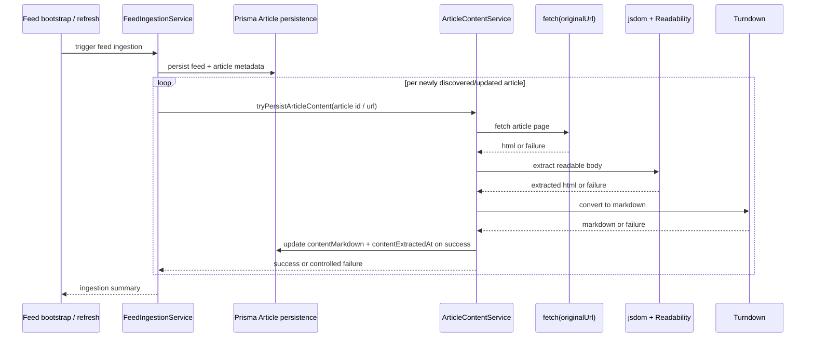

# feat: persist article body content during ingestion

## Overview

This plan replaces the previous CLI/backfill-centered direction. The correct v0.1 slice is not a developer-operated sync script. The system should persist article body content as part of the normal article-ingestion lifecycle, while keeping the existing feed-discovery backbone fail-open and preserving the thin public `/articles` contract.

The recommended shape follows the external pattern seen in Miniflux and FreshRSS:

- body persistence belongs to the system's normal refresh/ingestion path, not a manual developer script
- body extraction must remain best-effort so feed/article discovery still succeeds when extraction fails
- a single-article retry HTTP endpoint is useful as a repair path, but it is not the primary trigger surface

This slice still does not expose article Markdown to the UI and still does not generate AI summaries. It only makes sure body content can be stored reliably for later summarization work.

## Problem Frame

`apps/api` already ingests feed metadata and persists `Article` rows, but those rows only contain feed-layer fields such as title, URL, published timestamp, and compatibility `summary`. That is not enough for later AI summarization. The missing capability is durable article body persistence.

The earlier plan went in the wrong direction by centering the feature around a package-local command. That would make body persistence an optional operator action instead of normal system behavior. For this product, that is the wrong default. The system should attempt body extraction when it already discovers and persists a new article.

Current repo context that matters:

- `apps/api/src/feeds/feed-bootstrap.service.ts` already owns startup ingestion semantics.
- `apps/api/src/feeds/feed-ingestion.service.ts` already owns feed fetch, normalization, best-effort looping, and persistence updates.
- `apps/api/src/articles/articles.controller.ts` exposes only thin read APIs today.
- `apps/api/prisma/models/article.prisma` still has no body-content storage fields.

The correct architectural boundary is therefore:

- feed ingestion still owns article discovery and metadata persistence
- a new `article-content` feature owns HTML fetch, extraction, Markdown conversion, and body persistence
- feed ingestion invokes that feature in a best-effort way for newly discovered/updated articles
- an internal HTTP retry endpoint can re-run extraction for one article when needed

## External Best-Practice Direction

### Miniflux

DeepWiki review indicates Miniflux primarily fetches full content during feed refresh/background processing, then also offers on-demand entry content fetch via HTTP/UI actions. The important pattern is not the exact implementation language; it is the trigger model:

- automatic refresh path does the normal enrichment work
- a single-entry on-demand action exists as a repair/override path
- persisted content lives on the article/entry record

### FreshRSS

DeepWiki review indicates FreshRSS integrates full-content loading into feed actualization/update flow, usually driven by cron/systemd or manual UI refresh. The important pattern here is that full content persistence is part of the feed update lifecycle rather than a separate developer-run sync workflow.

### Recommendation for This Repo

This repo should adopt a hybrid of those patterns:

- **Primary path:** attempt article body persistence during normal feed ingestion/refresh
- **Secondary path:** provide one single-article retry endpoint for repair and verification
- **Not recommended:** developer-run `pnpm script` as the explicit main sync path

That recommendation best matches the product goal (body content should exist automatically for later AI summarization) and the current codebase shape (existing ingestion backbone, thin read API, no current UI need for Markdown).

## Requirements Trace

- R1. The system must persist article body content as part of the normal ingestion/refresh lifecycle rather than relying on a developer-run sync script.
- R2. The system must fetch article HTML from `Article.originalUrl`, extract the readable body, convert it to Markdown, and persist it onto the same `Article` row.
- R3. The persistence path must remain best-effort: article discovery and metadata persistence still succeed even when body extraction fails.
- R4. `Article` must gain nullable `contentMarkdown` and `contentExtractedAt` fields.
- R5. The current `summary` field must keep its existing meaning as feed-provided summary/description compatibility text.
- R6. Public `GET /articles` and `GET /articles/:id` responses must remain unchanged in this slice.
- R7. The system may add a single-article HTTP retry endpoint for repair, but that endpoint must be a secondary path rather than the primary persistence trigger.
- R8. The slice must include automated tests that prove body extraction and persistence from controlled HTML fixtures.
- R9. HTML extraction failures must fail open and must not corrupt existing article rows.
- R10. All schema, dependency, and runtime ownership stays inside `apps/api`.
- R11. Any new packages installed by the implementation agent must be the newest conflict-free stable versions practical for the current dependency graph; if that cannot be achieved cleanly, implementation must stop and surface the conflict.

## Scope Boundaries

- Do not add a package-local or root-level `pnpm` sync script as the primary trigger path.
- Do not expose `contentMarkdown` through the public article read APIs in this slice.
- Do not build frontend consumption of body content in this slice.
- Do not build AI summarization, translated titles, or layered summaries in this slice.
- Do not add a persistent job queue, run-history table, or scheduler-specific management surface in this slice.
- Do not introduce browser automation, login flows, paywall handling, or anti-bot bypassing.
- Do not turn extraction failure into a blocker for feed/article ingestion.

## Context & Research

### Relevant Code and Patterns

- `apps/api/src/feeds/feed-ingestion.service.ts` is the primary place that already handles feed-level fetch loops, per-item normalization, and persistence.
- `apps/api/src/feeds/feed-bootstrap.service.ts` already defines the startup-triggered ingestion lifecycle.
- `apps/api/src/articles/article.repository.ts`, `apps/api/src/articles/articles.service.ts`, and `apps/api/src/articles/articles.controller.ts` show that the current public article surface is intentionally thin.
- `apps/api/test-support/database.ts` owns test-database reset and migration replay for database-backed tests.
- `apps/api/e2e/feed-ingestion.e2e-spec.ts` already demonstrates the repo's fetch mocking and persistence verification pattern.
- `apps/api/e2e/articles.e2e-spec.ts` and `apps/api/src/articles/article.repository.spec.ts` currently protect the thin read contract and must remain green after the schema grows.

### Dependency Direction

The intended extraction stack still remains:

- `@mozilla/readability`
- `jsdom`
- `turndown`
- a GFM-capable Markdown conversion extension, if it installs cleanly with the rest of the stack

Implementation must choose the newest cleanly compatible stable versions practical for the current `apps/api` dependency graph. If the preferred GFM plugin line is too stale to install cleanly, execution should stop and surface the smallest maintained alternative or minimal local fallback rules.

## Key Technical Decisions

- Add a dedicated `article-content` feature boundary inside `apps/api` rather than burying extraction logic directly inside `feeds` or `articles`.
- Keep feed ingestion as the orchestrator of discovery, but call into `article-content` for best-effort body extraction after article metadata has been normalized and is ready to persist.
- Persist body content on the existing `Article` row using nullable `contentMarkdown` and `contentExtractedAt`.
- Keep article body extraction fail-open: if fetching/parsing/conversion fails, the metadata row still persists and article reads continue to work.
- Add one single-article retry HTTP endpoint for repair and verification. This endpoint re-runs extraction for one article, but it is not required for the system to populate body content in the normal case.
- Keep `summary` semantics unchanged and keep the public `/articles` contract unchanged.
- Keep jsdom script execution and subresource execution off when processing untrusted article HTML.
- Keep HTML cleanup intentionally minimal before Markdown conversion; this slice is about storage, not fully polished rendering.

## Open Questions

### Resolved in This Revision

- **Should the main trigger be a CLI/script path?** No. That direction was wrong and is removed from the plan.
- **Should the system persist body content automatically?** Yes. Automatic ingestion-time persistence is now the primary path.
- **Should there still be a repair trigger?** Yes. A single-article retry endpoint is useful as a secondary path.
- **Should this slice expose Markdown or AI summaries to the UI?** No. Storage only.

### Deferred to Implementation

- The exact timeout values for article-page fetches.
- The exact single-article retry route name, as long as it is scoped clearly and remains secondary.
- The smallest stable Markdown normalization rules revealed by fixture-driven tests.

## High-Level Technical Design

## Implementation Units

- [x] **Unit 1: Extend `Article` persistence shape without changing the public read contract**

**Goal:** Add the body-content fields and prove the existing read APIs remain unchanged.

**Requirements:** R4, R5, R6, R9, R10

**Dependencies:** None

**Files:**

- Modify: `apps/api/prisma/models/article.prisma`
- Create: `apps/api/prisma/migrations/<timestamp>_add_article_content_markdown/migration.sql`
- Modify: `apps/api/e2e/prisma-schema.e2e-spec.ts`
- Modify: `apps/api/src/articles/article.repository.spec.ts`
- Modify: `apps/api/e2e/articles.e2e-spec.ts`

**Approach:**

- Add nullable `contentMarkdown` and `contentExtractedAt`.
- Keep article DTO mapping unchanged.
- Extend tests to prove the new columns do not alter `/articles` or `/articles/:id` response shapes.

**Verification:**

- Database rows can store article body content while public read APIs remain byte-for-byte compatible at the field level.

- [x] **Unit 2: Build the `article-content` extraction pipeline**

**Goal:** Create the pure body-extraction and Markdown-conversion layer from article URL + HTML to controlled persistence-ready output.

**Requirements:** R2, R3, R8, R9, R10, R11

**Dependencies:** Unit 1

**Files:**

- Modify: `apps/api/package.json`
- Create: `apps/api/src/article-content/article-content.module.ts`
- Create: `apps/api/src/article-content/article-content-extraction.service.ts`
- Create: `apps/api/src/article-content/article-content-extraction.service.spec.ts`
- Create: `apps/api/src/article-content/fixtures/clean-article.html`
- Create: `apps/api/src/article-content/fixtures/noisy-relative-links-article.html`
- Create: `apps/api/src/article-content/fixtures/non-readerable-page.html`

**Approach:**

- Install extraction dependencies only in `apps/api`.
- Keep the service persistence-agnostic: input is article URL + raw HTML, output is either Markdown success payload or controlled failure.
- Use jsdom with the article URL, Readability for extraction, then minimal cleanup and Turndown conversion.

**Verification:**

- Fixture-backed tests prove deterministic Markdown output and controlled failure behavior without touching the database.

- [x] **Unit 3: Invoke body persistence automatically from ingestion**

**Goal:** Make body persistence part of the normal article-ingestion lifecycle.

**Requirements:** R1, R2, R3, R6, R8, R9, R10, R11

**Dependencies:** Unit 1, Unit 2

**Files:**

- Modify: `apps/api/src/feeds/feed-ingestion.service.ts`
- Modify: `apps/api/src/feeds/feeds.module.ts`
- Create: `apps/api/src/article-content/article-content.repository.ts`
- Create: `apps/api/src/article-content/article-content.service.ts`
- Create: `apps/api/src/article-content/article-content.service.spec.ts`
- Modify: `apps/api/e2e/feed-ingestion.e2e-spec.ts`

**Approach:**

- After feed entries are normalized and persisted, invoke `article-content` for newly discovered/updated eligible articles.
- Keep the extraction path best-effort and isolate failures to the current article.
- Log structured success/failure outcomes in the same operational style already used by feed ingestion.
- Avoid reprocessing rows that already have `contentMarkdown` unless a later explicit retry path requests it.

**Verification:**

- Feed ingestion persists metadata even when extraction fails, and automatically persists body content when extraction succeeds.

- [x] **Unit 4: Add a single-article retry HTTP endpoint as a repair path**

**Goal:** Provide one narrow backend trigger to re-run extraction for a specific article when automatic ingestion-time persistence was skipped or failed.

**Requirements:** R7, R9, R10

**Dependencies:** Unit 1, Unit 2, Unit 3

**Files:**

- Create: `apps/api/src/article-content/article-content.controller.ts`
- Modify: `apps/api/src/app.module.ts`
- Create: `apps/api/e2e/article-content-retry.e2e-spec.ts`

**Approach:**

- Add a single route scoped to one article, e.g. under the article-content feature boundary.
- Keep the endpoint narrow: one article in, one retry attempt out.
- Return a small structured result such as `succeeded`, `failed`, or `skipped`, with a narrow reason string where useful.
- Keep this route explicitly secondary in docs and implementation; the system should not depend on operators calling it for normal body persistence.

**Verification:**

- A targeted HTTP call can retry extraction for one article and persist body content without changing the public article read contract.

- [x] **Unit 5: Update documentation to reflect the corrected trigger model**

**Goal:** Remove the old script-centered mental model and document automatic persistence plus the narrow retry path.

**Requirements:** R1, R6, R7

**Dependencies:** Unit 1, Unit 2, Unit 3, Unit 4

**Files:**

- Modify: `apps/api/README.md`
- Modify: `README.md`
- Modify: `README.zh-Hans.md`

**Approach:**

- Document that article body content is now attempted automatically during ingestion.
- Document the retry endpoint as a repair path, not the default workflow.
- Keep docs aligned with the fact that Markdown is stored internally and not yet exposed in the product UI.

**Verification:**

- The docs no longer imply a manual script-driven sync model and accurately describe the automatic body-persistence flow.

## System-Wide Impact

- **Primary behavior change:** the system now attempts body persistence automatically during article ingestion.
- **Failure model:** body extraction failures become local, non-blocking enrichment failures rather than ingestion blockers.
- **API behavior:** existing article read APIs remain unchanged; one narrow retry endpoint is added for repair.
- **Product posture:** this slice prepares internal stored body content for future AI summarization without prematurely exposing body content to the UI.

## Risks & Mitigations

| Risk                                                                    | Mitigation                                                                                                    |
| ----------------------------------------------------------------------- | ------------------------------------------------------------------------------------------------------------- |
| Body extraction makes ingestion slower or more failure-prone.           | Keep extraction best-effort, bounded by timeout, and isolated from metadata persistence success.              |
| Some publishers produce unreadable or highly noisy HTML.                | Use fixture-driven tests, keep failures non-blocking, and defer source-specific heuristics.                   |
| The preferred Markdown plugin stack may have dependency conflicts.      | Choose the newest cleanly installable stable versions and stop if the dependency path becomes conflict-heavy. |
| Operators may misunderstand the retry endpoint as the primary workflow. | Make docs and implementation explicit that retry is a repair path only.                                       |

## Sources & References

- **Origin documents:** `docs/en/brainstorms/2026-04-17-v0-1-slice-3-article-markdown-storage-requirements.md`, `docs/zh-Hans/brainstorms/2026-04-17-v0-1-slice-3-article-markdown-storage-requirements.md`
- **Relevant code:** `apps/api/src/feeds/feed-ingestion.service.ts`, `apps/api/src/feeds/feed-bootstrap.service.ts`, `apps/api/src/articles/articles.controller.ts`, `apps/api/test-support/database.ts`, `apps/api/e2e/feed-ingestion.e2e-spec.ts`
- **External architectural references via DeepWiki:** `miniflux/v2`, `FreshRSS/FreshRSS`
