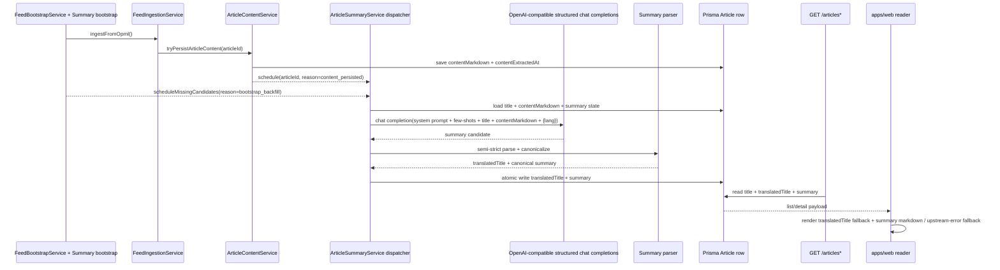
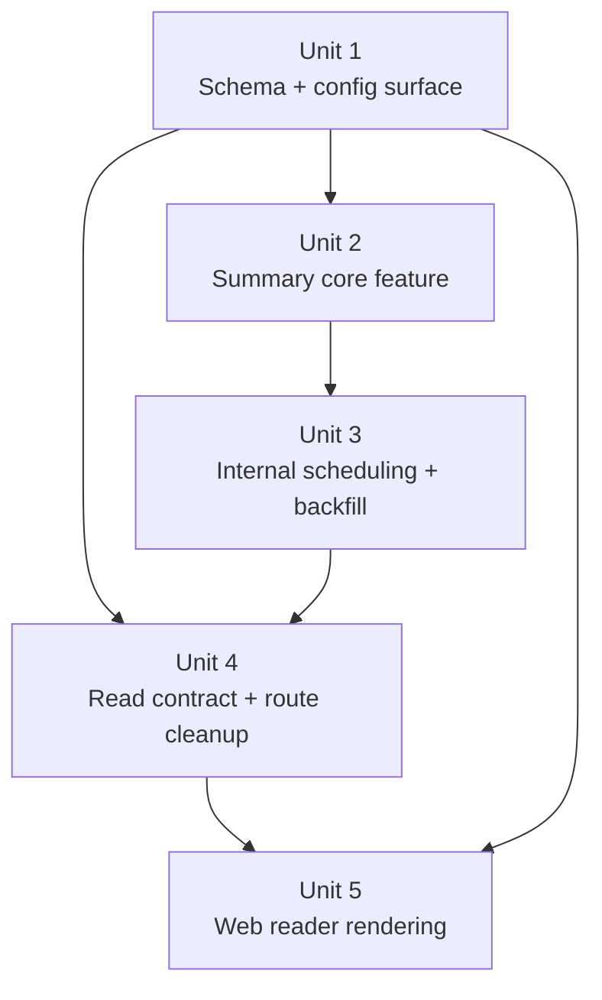
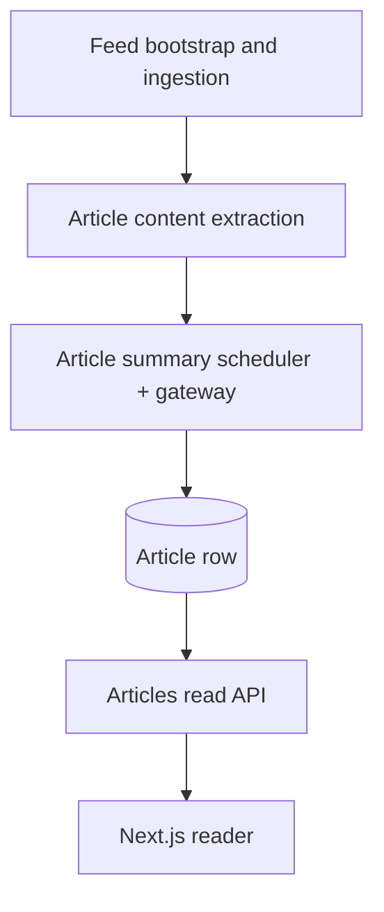

# feat: deliver the v0.1 LLM summary reader slice

## Overview

This plan turns the article-body slice into the first real product loop for v0.1: persisted article metadata plus persisted `contentMarkdown` now become a prepared translated title and prepared reading summary that the existing dual-pane reader can consume directly. The plan keeps the public surface read-only, keeps LLM integration intentionally thin, and treats missing summaries as an internal enrichment problem rather than a user-triggered action.

## Problem Frame

`tmp/v0.1/v0.1.md` defines the product as a summary-first RSS filter, not a conventional RSS reader. The origin requirements make two product shifts explicit:

- `Article.summary` stops meaning “feed compatibility description” and becomes the prepared summary-reader artifact (see origin: `docs/en/brainstorms/2026-04-18-v0-1-slice-4-llm-summary-reader-requirements.md`).
- The system must cover both newly enriched articles and already-persisted historical articles that have `contentMarkdown` but no complete summary result (see origin: `docs/en/brainstorms/2026-04-18-v0-1-slice-4-llm-summary-reader-requirements.md`).

Current repo facts that materially shape the plan:

- `apps/api/src/feeds/feed-ingestion.service.ts` already owns the feed refresh loop and article discovery path.
- `apps/api/src/article-content/article-content.service.ts` already persists `contentMarkdown` in a fail-open way, but it is still scoped to article-body extraction.
- `apps/api/src/articles/article.repository.ts` and `apps/web/src/widgets/article-reader/ui/article-detail.tsx` still assume the old thin read contract: `title` plus plain-text `summary`.
- `apps/api/src/article-content/article-content.controller.ts` still exposes `POST /article-content/:id/retry`, which now conflicts with the slice's read-only product posture.

The plan therefore needs to solve four intertwined problems at once:

1. create a safe persistence shape for translated titles and prepared summaries;
2. add a thin, gateway-oriented LLM integration that does not drag provider-specific abstractions into the repo;
3. trigger summary generation internally for both new and historical eligible rows;
4. adapt the read contract and web reader to consume translated titles plus Markdown summaries without reopening the public write surface.

## Requirements Trace

- R1-R5 — summary generation is a prepared internal production step, uses `title + contentMarkdown` together, persists one translated title plus one fixed-format reading summary, and preserves the existing summary-first reading mental model.
- R6-R9 — external LLM access stays behind one OpenAI-compatible surface with only `LLM_BASE_URL`, `LLM_API_KEY`, `LLM_MODEL`, `LLM_SUMMARY_LANGUAGE`, and one optional timeout setting; retry/fallback complexity stays outside the app boundary.
- R10-R16 — the summarization contract is an English system prompt with few-shot examples, `{lang}` injection, conservative source-only behavior, and a three-part Markdown output shape whose `## Title` means “translated original title,” not editorial rewriting.
- R17-R24 — summary generation is triggered internally after content extraction, covers new and historical rows, persists `translatedTitle` and `summary` atomically, overwrites old results on later successful regeneration, and fails open.
- R25-R30 — the public surface stays read-oriented, `POST /article-content/:id/retry` is removed, list/detail views prefer translated titles, and the desktop dual-pane reader remains the primary UX.
- R31-R39 — rows without `contentMarkdown` are not forced into summaries, retryable gateway failures get three implicit retries spaced one minute apart, parsing is semi-strict around `Title / Summary / Key Points`, partial persistence is forbidden, and observability stays lightweight through logs plus automated tests.

## Scope Boundaries

- No mobile adaptation, keyboard shortcuts, digest/timeline products, or batch briefing surfaces.
- No user-facing “regenerate summary” control and no replacement public write endpoint.
- No per-user language selector; `LLM_SUMMARY_LANGUAGE` remains deployment-scoped.
- No dedicated `ArticleSummary` table, version history, prompt-version tracking model, or persistent job queue.
- No provider-specific adapter matrix, multi-gateway router, complex retry/fallback center, or user-facing operations console.
- No requirement to expose `contentMarkdown` publicly.
- No complex nested JSON contract for the summary artifact; any structured helper must stay shallow and internal.
- No partial writes where only `translatedTitle` or only `summary` persists.

## Planned Dependency Direction

- Any new registry dependency introduced by this slice must be disclosed up front in the implementation change and installed only in the owning workspace, never in the repository root.
- Version policy: choose the newest practical stable version available at implementation time, as long as it does not conflict with the current workspace dependency graph. If the latest release creates peer conflicts, override-heavy workarounds, or unrelated dependency churn, fall back to the newest conflict-free stable version instead.
- Required package decisions for this slice after external reconnaissance:
  - `apps/web/package.json` — add `react-markdown` and `remark-gfm` as the concrete Markdown rendering stack for the persisted summary artifact.
  - `apps/api/package.json` — add `openai` as the concrete SDK for OpenAI-compatible Structured Outputs and request construction.
  - `apps/api/package.json` — add `zod` as the concrete schema-definition and validation helper for `Title / Summary / Key Points`.
- Package changes must stay package-local. This slice does not justify new root-level runtime dependencies, cross-workspace dependency hoisting, or broad dependency refresh work outside the owning package.

## Context & Research

### Relevant Code and Patterns

- `apps/api/src/feeds/feed-ingestion.service.ts` already provides the repo's sequential best-effort enrichment pattern and remaining-budget handling for content extraction.
- `apps/api/src/article-content/article-content.service.ts` provides the existing fail-open enrichment boundary, fetch timeout handling, and structured JSON logging style that summary generation should mirror rather than reinvent.
- `docs/zh-Hans/solutions/integration-issues/feed-ingestion-retries-missing-article-markdown-2026-04-17.md` and `docs/en/solutions/integration-issues/feed-ingestion-retries-missing-article-markdown-2026-04-17.md` establish an important orchestration rule: historical incomplete rows must be re-queued by the normal internal path instead of depending on a repair endpoint.
- `apps/api/src/articles/*` plus `apps/api/e2e/articles.e2e-spec.ts` protect the thin read contract; any DTO or field-shape change must move through repository, service, controller, and end-to-end contract tests together.
- `apps/web/src/widgets/article-reader/ui/article-reader-page.tsx` and `apps/web/src/widgets/article-reader/ui/article-detail.tsx` show the current server-driven data loading seam and the detail-pane rendering surface that must absorb Markdown summary rendering and translated-title fallback.
- `apps/web/e2e/home.spec.ts` already proves the browser-level invariants the new slice must preserve: default article selection, URL-persisted selection, and stale-detail fallback.

### Institutional Learnings

- The markdown recovery solution doc above proves that “existing row but incomplete enrichment” is a real regression shape in this codebase, so historical missing summaries must be part of the primary design rather than an afterthought.
- The same solution doc also shows that a narrow repair endpoint is easy to overvalue; when the product contract says the main path is automatic enrichment, the tests must assert that main path directly.
- The earlier read-path plan (`docs/en/plans/2026-04-10-001-feat-first-vertical-slice-read-path-plan.md` + `docs/zh-Hans/plans/2026-04-10-001-feat-first-vertical-slice-read-path-plan.md`) set the repo expectation that the web reader stays URL-driven and server-fetched; summary work should extend that seam rather than introduce client-state orchestration.

### External References

- OpenAI API reference for Chat Completions: `https://developers.openai.com/api/reference/resources/chat/subresources/completions/methods/create/`
- OpenAI Structured Outputs guide: `https://developers.openai.com/api/docs/guides/structured-outputs`
- OpenAI JavaScript SDK docs: `https://platform.openai.com/docs/libraries/javascript`
- OpenAI rate-limit guide: `https://developers.openai.com/api/docs/guides/rate-limits/`
- OpenAI error-code guide: `https://platform.openai.com/docs/guides/error-codes/`
- LiteLLM OpenAI-compatible endpoint docs: `https://docs.litellm.ai/docs/providers/openai_compatible`
- DeepWiki package reconnaissance for `ChatGPTNextWeb/NextChat`: `https://deepwiki.com/search/for-this-repository-which-npm_db076053-4c7a-49eb-89c2-d30d24d63cf3`
- DeepWiki package reconnaissance for `lobehub/lobe-chat`: `https://deepwiki.com/search/for-this-repository-which-npm_f055647b-4050-4233-9c8e-654e7059288a`
- DeepWiki package reconnaissance for `vercel/ai-chatbot`: `https://deepwiki.com/search/for-this-repository-which-npm_69a35a70-24fa-4303-9608-e284b4b77bf2`

These sources imply two practical constraints for this repo:

- OpenAI recommends newer structured APIs for OpenAI-native projects, but OpenAI-compatible gateways still center their compatibility surface on `/chat/completions`; for this slice, the SDK path should therefore target the OpenAI-compatible structured-output flow that still fits that surface.
- Because gateway compatibility for OpenAI-compatible Structured Outputs is treated as a confirmed premise for this slice, the plan can rely on SDK-driven structured parsing as the primary contract rather than relegating it to an optional enhancement.

### External Package Survey

- `ChatGPTNextWeb/NextChat` uses `react-markdown` plus `remark-gfm` for Markdown rendering and enriches further only for chat-heavy features; this supports using that pair as the smallest mainstream rendering baseline.
- `lobehub/lobe-chat` also carries `react-markdown`, `remark-gfm`, `zod`, and the official `openai` package; that combination is closer to this slice because it separates Markdown rendering concerns from structured LLM contracts.
- `vercel/ai-chatbot` uses `streamdown` plus the Vercel AI SDK stack (`ai`, `@ai-sdk/react`, `@ai-sdk/gateway`) for streamed chat UX; that is optimized for interactive generation, not for stored summary Markdown.
- Decision from the survey: this slice should adopt the smallest package set that still matches common TypeScript practice for persisted Markdown plus structured LLM parsing. Concretely, use `react-markdown` + `remark-gfm` in `apps/web`, and `openai` + `zod` in `apps/api`.

## Key Technical Decisions

| Decision                    | Chosen direction                                                                                                                                                | Why this wins now                                                                                                                                           |
| --------------------------- | --------------------------------------------------------------------------------------------------------------------------------------------------------------- | ----------------------------------------------------------------------------------------------------------------------------------------------------------- |
| Summary trigger ownership   | New `article-summary` feature owns scheduling plus execution; `article-content` only signals successful body persistence                                        | Keeps body extraction and LLM work separate, avoids blocking feed-content timeout budgets, and gives historical backfill a first-class owner                |
| Historical coverage         | Add a bootstrap-time backfill sweep for rows with `contentMarkdown` and missing complete summary results, in addition to new-row scheduling                     | Feed replay alone cannot guarantee historical rows reappear in later RSS payloads                                                                           |
| Gateway surface             | Use the official `openai` SDK against the OpenAI-compatible base URL and drive structured generation through the compatible chat-completions path               | Keeps request construction and structured parsing aligned with the ecosystem's standard SDK while still matching the explicit OpenAI-compatible requirement |
| Output validation           | Use Structured Outputs with `zod` as the primary contract, then persist canonical Markdown plus `translatedTitle` derived from that structured result           | Satisfies the product contract, keeps the web renderer simple, and makes the persisted artifact a deterministic projection of one validated result          |
| Read contract shape         | Expose both `title` (original title) and optional `translatedTitle`, with the web layer applying display fallback                                               | Preserves the original title for debugging/fallback while making UI behavior explicit and testable                                                          |
| `Article.summary` semantics | Stop writing feed-provided descriptions into `Article.summary`, clear legacy values in the migration, and treat empty summary as “not prepared yet”             | Prevents later ingestion from overwriting AI summaries and avoids surfacing stale compatibility text as if it were the new product artifact                 |
| Web rendering               | Render canonical summary Markdown directly in the detail pane and let the stored summary own the layered reading shape                                          | Keeps Markdown as the output contract instead of reconstructing a UI-only summary object downstream                                                         |
| Retry model                 | Use an internal serial in-memory dispatcher with three retries spaced one minute apart for timeout / `429` / `5xx` only                                         | Meets the requirement without adding queues, while keeping gateway pressure bounded and recoverable on the next boot                                        |
| Refresh rules               | Re-run summary generation when content extraction succeeds again or when feed ingestion observes a raw-title change on a row that already has `contentMarkdown` | Keeps `translatedTitle` and Markdown summary aligned with the latest persisted source material instead of only filling empty slots                          |

## Open Questions

### Resolved During Planning

- **What exact internal trigger should own summary generation after `contentMarkdown` is persisted?** Use a dedicated `article-summary` feature. `ArticleContentService` only schedules work after successful body persistence; it does not perform the LLM call inline. Historical rows are picked up by a bootstrap backfill sweep.
- **Should the first implementation render Markdown in the web reader?** Yes. The prepared summary artifact is Markdown by contract, so the detail pane should render it now rather than flattening it to plain text.
- **Should the slice use Responses or Chat Completions?** Use the `openai` SDK on the OpenAI-compatible chat-completions structured-output path for v0.1, because the explicit requirement is OpenAI-compatible gateway access and that compatibility surface remains the slice's operative boundary.
- **Should the API hide translated titles behind a rewritten `title` field?** No. Keep `title` as the original title, add `translatedTitle`, and let the web reader prefer `translatedTitle ?? title`.

### Deferred to Implementation

- The exact default value for `LLM_TIMEOUT_MS` if the initial gateway measurements show that a single static default would be either too aggressive or too lax. The plan assumes one optional timeout setting exists; the final default can be confirmed while implementing tests around the selected gateway behavior.
- Whether the detail pane needs any additional typography polish after the first safe Markdown renderer lands. The plan requires Markdown rendering and fallback correctness, not a broader visual redesign.

## High-Level Technical Design

> _This illustrates the intended approach and is directional guidance for review, not implementation specification. The implementing agent should treat it as context, not code to reproduce._

## Implementation Units

- [x] **Unit 1: Extend persistence and runtime config for prepared summaries**

**Goal:** Add the database and config shape needed for translated-title persistence and thin gateway configuration without forcing a provider-specific abstraction into the repo.

**Requirements:** R3, R6, R7, R8, R18, R19, R21, R33

**Dependencies:** None

**Files:**

- Modify: `apps/api/prisma/models/article.prisma`
- Create: `apps/api/prisma/migrations/<timestamp>_add_article_summary_fields/migration.sql`
- Modify: `apps/api/prisma/seed/seed.sql`
- Modify: `apps/api/src/config/env.validation.ts`
- Modify: `apps/api/src/config/app-config.ts`
- Modify: `apps/api/src/config/app-config.spec.ts`
- Modify: `apps/api/.env.example`
- Test: `apps/api/e2e/prisma-schema.e2e-spec.ts`

**Approach:**

- Add `translatedTitle` to `Article` as a non-null string with an empty-string default so “missing complete result” remains queryable without nullable tri-state logic.
- Use the migration to clear legacy compatibility summaries so existing rows do not surface feed descriptions as if they were prepared AI summaries.
- Extend app config with the minimal LLM surface: base URL, API key, model, deployment language (default `zh-CN`), and one optional timeout setting.
- Keep runtime validation fail-open for the rest of the app: missing LLM settings should prevent summary generation, not basic read-path startup, so the config object should distinguish “gateway unavailable” from “database unavailable.”

**Patterns to follow:**

- `apps/api/src/config/app-config.ts`
- `apps/api/src/config/app-config.spec.ts`
- `apps/api/prisma/models/article.prisma`
- `apps/api/prisma/migrations/202604150001_init_feed_ingestion/migration.sql`

**Test scenarios:**

- Happy path — the migration adds `translatedTitle` and preserves existing article rows with `translatedTitle = ""` while clearing legacy `summary` values to the new empty-state baseline.
- Happy path — `LLM_SUMMARY_LANGUAGE` defaults to `zh-CN` when omitted.
- Edge case — a relative or absolute existing `FEED_OPML_PATH` still resolves exactly as before after config changes.
- Error path — missing `DATABASE_URL` still fails fast, while missing `LLM_*` settings do not break unrelated read-path startup.
- Integration — the checked-in seed can represent both “prepared summary present” and “summary missing” states using `translatedTitle` + canonical Markdown instead of the old feed-description semantics.

**Verification:**

- The database can distinguish “row has prepared summary” from “row is still awaiting summary generation,” and the app can read LLM settings without entangling them with unrelated runtime prerequisites.

- [x] **Unit 2: Build the `article-summary` feature boundary for prompt, gateway, parsing, and atomic persistence**

**Goal:** Create one self-contained Nest feature that can turn `title + contentMarkdown` into a validated prepared summary result.

**Requirements:** R1, R2, R3, R4, R6-R16, R20-R24, R34-R38

**Dependencies:** Unit 1

**Files:**

- Create: `apps/api/src/article-summary/article-summary.module.ts`
- Create: `apps/api/src/article-summary/article-summary.repository.ts`
- Create: `apps/api/src/article-summary/article-summary.gateway.ts`
- Create: `apps/api/src/article-summary/article-summary.prompt.ts`
- Create: `apps/api/src/article-summary/article-summary.parser.ts`
- Create: `apps/api/src/article-summary/article-summary.service.ts`
- Test: `apps/api/src/article-summary/article-summary.parser.spec.ts`
- Test: `apps/api/src/article-summary/article-summary.service.spec.ts`

**Approach:**

- Keep the new code inside `apps/api/src/article-summary/` as a feature module, matching the repo's existing Nest feature-module organization.
- Keep backend dependency pressure intentionally low while still using the standard tools for this contract: use the official `openai` SDK for transport plus structured parsing, and `zod` for the summary schema owned by this repo.
- Use the SDK against `LLM_BASE_URL` on the OpenAI-compatible chat-completions structured-output path, send the English system prompt plus few-shot examples, inject `{lang}` from config, and classify retryable vs permanent failures.
- Treat one structured result shape as the primary contract: `translatedTitle`, one summary paragraph, and ordered key points. Recompose that validated result into canonical Markdown with stable `## Title`, `## Summary`, and `## Key Points` headings before persistence.
- Persist `translatedTitle` plus canonical `summary` in one repository update only after the structured result passes schema validation. Permanent failures or exhausted retries leave both fields empty.
- Keep a thin local normalization step after schema validation so persistence remains deterministic even if model wording varies inside the allowed structure.

**Patterns to follow:**

- `apps/api/src/article-content/article-content.service.ts`
- `apps/api/src/article-content/article-content.service.spec.ts`
- `apps/api/src/article-content/article-content-extraction.service.ts`
- `apps/api/src/articles/article.repository.ts`

**Test scenarios:**

- Happy path — a successful gateway response is parsed into `translatedTitle` plus canonical Markdown and both fields persist together.
- Happy path — a response whose headings vary only by case or minor spacing still parses and is normalized into canonical headings.
- Edge case — `Key Points` with 2 or 6 items still succeeds as long as all three sections exist.
- Error path — a missing `Title` section causes the whole attempt to fail and leaves both persisted fields empty.
- Error path — `401`/`403`/other permanent gateway failures are reported without retry.
- Error path — timeout, `429`, and `5xx` responses are classified as retryable.
- Integration — the persisted Markdown is stable enough that the web reader can render headings, paragraph text, and ordered lists without UI-side reconstruction.

**Verification:**

- One feature boundary now owns the summary contract end-to-end: prompt, gateway request, parser, and atomic save all line up with the requirements document.

- [x] **Unit 3: Add internal scheduling, retries, and historical backfill without a public repair endpoint**

**Goal:** Make summary generation happen automatically for both newly enriched and already-persisted eligible articles, while keeping feed ingestion fail-open.

**Requirements:** R17, R18, R21-R24, R31-R33, R37-R39

**Dependencies:** Unit 1, Unit 2

**Files:**

- Create: `apps/api/src/article-summary/article-summary-bootstrap.service.ts`
- Modify: `apps/api/src/article-content/article-content.module.ts`
- Modify: `apps/api/src/article-content/article-content.service.ts`
- Modify: `apps/api/src/article-content/article-content.service.spec.ts`
- Modify: `apps/api/src/app.module.ts`
- Modify: `apps/api/src/feeds/feed-bootstrap.service.ts`
- Modify: `apps/api/src/feeds/feed-bootstrap.service.spec.ts`
- Modify: `apps/api/e2e/feed-ingestion.e2e-spec.ts`
- Test: `apps/api/src/article-summary/article-summary-bootstrap.service.spec.ts`

**Approach:**

- Do not call the LLM inline inside `FeedIngestionService`'s existing per-article content budget. Instead, `ArticleContentService` schedules summary work only after content persistence succeeds.
- Add a lightweight in-memory serial dispatcher inside the summary feature to dedupe article IDs, bound concurrency, and execute the required three retry attempts with one-minute spacing for retryable failures only.
- Make bootstrap enqueue eligible rows and return immediately rather than waiting for the full backlog to drain; this preserves the repo's existing non-blocking bootstrap posture.
- Add a bootstrap backfill sweep that finds rows where `contentMarkdown` exists but the complete summary result is still missing, then schedules them through the same dispatcher. This is the repo's recovery path for historical rows and restart recovery.
- Reuse the same dispatcher when article-content re-extraction succeeds again, and when feed ingestion updates an already-enriched row whose raw `title` changed.
- Keep the whole orchestration fail-open: bootstrap and feed ingestion should continue even when scheduling or summary execution fails, with structured logs carrying the failure reason.

**Patterns to follow:**

- `apps/api/src/feeds/feed-bootstrap.service.ts`
- `apps/api/src/feeds/feed-bootstrap.service.spec.ts`
- `apps/api/src/article-content/article-content.service.ts`
- `docs/en/solutions/integration-issues/feed-ingestion-retries-missing-article-markdown-2026-04-17.md`

**Test scenarios:**

- Happy path — after `ArticleContentService` persists `contentMarkdown`, it schedules one summary job for that article.
- Happy path — bootstrap finds historical rows with `contentMarkdown` and empty `translatedTitle`, enqueues them, and returns without blocking application bootstrap on the full backlog.
- Edge case — scheduling the same article twice before execution does not create duplicate concurrent work.
- Edge case — when feed ingestion updates the raw `title` of a row that already has `contentMarkdown`, the row is re-enqueued for summary refresh even if it previously had a prepared summary.
- Error path — a retryable failure waits one minute between attempts and stops after the third failed attempt, leaving `translatedTitle` and `summary` empty.
- Error path — a permanent gateway failure is logged once and is not retried.
- Error path — missing LLM configuration causes bootstrap scheduling to skip cleanly with logs instead of failing app startup.
- Integration — feed ingestion still succeeds and persists article rows even when summary generation ultimately fails.

**Verification:**

- New rows and historical rows both reach the same internal summary pipeline, and failure in that pipeline does not regress the existing ingestion backbone.

- [x] **Unit 4: Clean up the public API surface and shift `Article.summary` to its new product meaning**

**Goal:** Remove the public write route, stop overwriting prepared summaries with feed descriptions, and publish the read shape the web reader now needs.

**Requirements:** R3, R20, R25-R30, R33

**Dependencies:** Unit 1, Unit 2, Unit 3

**Files:**

- Modify: `apps/api/src/feeds/feed-ingestion.service.ts`
- Modify: `apps/api/src/feeds/feed-ingestion.service.spec.ts`
- Modify: `apps/api/src/articles/article.repository.ts`
- Modify: `apps/api/src/articles/article.repository.spec.ts`
- Modify: `apps/api/src/articles/articles.service.ts`
- Modify: `apps/api/src/articles/dto/article-list-item.dto.ts`
- Modify: `apps/api/src/articles/dto/article-detail-item.dto.ts`
- Modify: `apps/api/src/articles/articles.controller.spec.ts`
- Modify: `apps/api/e2e/articles.e2e-spec.ts`
- Modify: `apps/api/src/article-content/article-content.module.ts`
- Delete: `apps/api/src/article-content/article-content.controller.ts`
- Delete: `apps/api/e2e/article-content-retry.e2e-spec.ts`
- Modify: `apps/api/README.md`

**Approach:**

- Remove the `POST /article-content/:id/retry` controller from the app surface entirely.
- Stop persisting feed-provided descriptions into `Article.summary` during feed ingestion; after this slice the column belongs to prepared summaries only.
- When feed ingestion updates an existing row that already has `contentMarkdown`, compare the newly normalized raw title to the persisted raw title and enqueue a summary refresh if the source title changed.
- Expand the read DTOs to include `translatedTitle` while preserving `title` as the original title. The web layer will decide the display fallback, but the API will expose enough information to do so without re-parsing Markdown.
- Keep the rest of the read-path behavior thin: unknown IDs remain `404`, `contentMarkdown` stays internal, and there is still no public summary-generation resource.

**Patterns to follow:**

- `apps/api/src/articles/article.repository.ts`
- `apps/api/src/articles/articles.service.ts`
- `apps/api/e2e/articles.e2e-spec.ts`
- `apps/api/README.md`

**Test scenarios:**

- Happy path — `GET /articles` returns the original `title`, optional `translatedTitle`, and no internal fields such as `contentMarkdown`.
- Happy path — `GET /articles/:id` returns `summary` plus `translatedTitle` so the web reader does not need to reverse-parse the Markdown title.
- Edge case — rows without a complete prepared summary return empty `summary` and empty `translatedTitle` instead of leaking old feed-description text.
- Error path — `GET /articles/:id` still returns `404` for unknown article IDs.
- Error path — `POST /article-content/:id/retry` is no longer routable.
- Integration — a later feed ingestion run no longer overwrites an already prepared AI summary with feed metadata.
- Integration — a later feed ingestion run that changes the raw source title re-queues summary regeneration so `translatedTitle` does not drift from the latest persisted source title.

**Verification:**

- The public API is read-only again, `Article.summary` now has one stable meaning, and the web client can implement translated-title fallback without inventing extra parsing rules.

- [x] **Unit 5: Update the web reader to prefer translated titles and render canonical summary Markdown**

**Goal:** Make the desktop reader consume the prepared summary artifact directly while preserving its existing URL-driven navigation model.

**Requirements:** R4, R5, R28-R30, R33, R39

**Dependencies:** Unit 1, Unit 4

**Files:**

- Modify: `apps/web/package.json`
- Modify: `apps/web/src/widgets/article-reader/api/articles-api.ts`
- Modify: `apps/web/src/widgets/article-reader/ui/article-list.tsx`
- Modify: `apps/web/src/widgets/article-reader/ui/article-detail.tsx`
- Modify: `apps/web/app/page.spec.tsx`
- Modify: `apps/web/e2e/home.spec.ts`
- Modify: `apps/web/README.md`

**Approach:**

- Add a thin safe Markdown renderer in `apps/web` using `react-markdown` plus `remark-gfm`, and use it in the detail pane so the persisted summary string can own the `Title / Summary / Key Points` structure.
- Keep the web Markdown stack intentionally small. Do not add streaming-oriented renderers or extra rehype plugins unless implementation proves the canonical summary format actually needs them.
- Prefer `translatedTitle ?? title` in the left rail and any detail fallback state.
- Remove the redundant plain-text rendering path in the detail body. Keep the source/date metadata plus jump-to-original action in the header, but let the canonical summary Markdown drive the reading content.
- When the API returns an empty `summary`, render the fixed fallback copy `上游服务错误` instead of inventing new partial-summary logic.
- Keep the existing server-component fetch flow in `apps/web/app/page.tsx` and `apps/web/src/widgets/article-reader/ui/article-reader-page.tsx`; no client cache or mutation layer is needed.

**Patterns to follow:**

- `apps/web/src/widgets/article-reader/api/articles-api.ts`
- `apps/web/src/widgets/article-reader/ui/article-reader-page.tsx`
- `apps/web/app/page.spec.tsx`
- `apps/web/e2e/home.spec.ts`
- `docs/en/plans/2026-04-10-001-feat-first-vertical-slice-read-path-plan.md`

**Test scenarios:**

- Happy path — the list renders `translatedTitle` when present and falls back to `title` when it is empty.
- Happy path — the detail pane renders canonical Markdown headings, paragraph text, and ordered key points from `summary`.
- Edge case — an empty `summary` renders the fixed `上游服务错误` fallback while keeping the rest of the reader chrome visible.
- Error path — a stale `articleId` still shows the pane-level unavailable state without hiding the list.
- Integration — the browser test seeded through `apps/api/prisma/seed/seed.sql` proves that translated titles and Markdown summaries survive the full API-to-web seam.

**Verification:**

- The reader stays desktop-first and URL-driven, but it now consumes the same prepared summary artifact that the backend persists.

## System-Wide Impact

- **Interaction graph:** `FeedBootstrapService` and `FeedIngestionService` still own feed discovery; `ArticleContentService` still owns HTML-to-Markdown persistence; a new `article-summary` feature owns LLM scheduling/execution; `apps/api/src/articles/*` remains the public read seam; `apps/web` remains the only consumer.
- **Error propagation:** gateway configuration mistakes, rate limits, and transient upstream failures stay inside structured logs and empty prepared-summary state; they do not become new HTTP write surfaces or API status taxonomies.
- **State lifecycle risks:** summary work is intentionally in-memory and best-effort, so process restarts can drop pending retries; the bootstrap backfill sweep is the recovery mechanism that makes this acceptable for v0.1. Title-change refresh must also re-enter that same queue so translated titles do not silently drift.
- **API surface parity:** DTOs, repository mappings, README endpoint docs, seed data, and Playwright expectations all need to move together once `translatedTitle` is added and `POST /article-content/:id/retry` is removed.
- **Integration coverage:** unit tests alone are insufficient; the slice needs end-to-end proof across feed ingestion, bootstrap backfill, API response mapping, and browser rendering of canonical Markdown.
- **Unchanged invariants:** `contentMarkdown` stays internal, there is still no public regeneration endpoint, no per-user language selector is introduced, and no persistent queue/history model is added.

## Alternative Approaches Considered

| Approach                                                                         | Why not chosen                                                                                                                                                                              |
| -------------------------------------------------------------------------------- | ------------------------------------------------------------------------------------------------------------------------------------------------------------------------------------------- |
| Run summary generation only inside `FeedIngestionService`                        | Misses historical rows that never reappear in a later feed payload and couples LLM latency/retries to the existing feed budget loop                                                         |
| Call the LLM inline inside `ArticleContentService.tryPersistArticleContent(...)` | Makes content extraction much slower, entangles two feature boundaries, and turns a one-step content timeout into a much larger summary timeout/retry window                                |
| Skip Structured Outputs and rely on free-form Markdown parsing alone             | The slice now treats OpenAI-compatible Structured Outputs as a confirmed capability, so giving up schema validation would remove a reliable contract without reducing meaningful complexity |
| Keep the public repair endpoint and add a new public summary endpoint            | Directly violates the origin document's read-only public-surface requirement and increases the security/operational surface for a v0.1 slice                                                |

## Risk Analysis & Mitigation

| Risk                                                                         | Likelihood | Impact | Mitigation                                                                                                                                          |
| ---------------------------------------------------------------------------- | ---------- | ------ | --------------------------------------------------------------------------------------------------------------------------------------------------- |
| Structured output shape drifts from the repo's persisted summary contract    | Low        | High   | Keep the `openai` SDK response bound to one repo-owned `zod` schema, then normalize the validated result into canonical Markdown before persistence |
| Historical rows remain unsummarized after restart or temporary failure       | Medium     | High   | Use bootstrap-time candidate sweep plus idempotent scheduling keyed by empty `translatedTitle` / empty `summary`                                    |
| Later feed ingestion overwrites prepared AI summaries with feed descriptions | High       | High   | Stop writing feed descriptions into `Article.summary` entirely and cover the regression with repository + ingestion tests                           |
| Markdown renderer causes UI duplication or malformed presentation            | Medium     | Medium | Persist canonical Markdown, keep the detail pane focused on that artifact, and test rendered headings/list output explicitly                        |
| Missing or wrong LLM configuration blocks summary generation in production   | Medium     | Medium | Document `LLM_*` ownership in `.env.example` and `apps/api/README.md`, and log config-missing startup skips clearly                                 |

## Documentation / Operational Notes

- Update `apps/api/.env.example` and `apps/api/README.md` to document `LLM_BASE_URL`, `LLM_API_KEY`, `LLM_MODEL`, `LLM_SUMMARY_LANGUAGE`, optional timeout behavior, the internal backfill path, and the removal of `POST /article-content/:id/retry`.
- Update `apps/web/README.md` to describe translated-title fallback and Markdown summary rendering expectations.
- Keep observability lightweight through structured logs under new scopes such as `article_summary` and `article_summary_bootstrap`; this slice does not add dashboards or consoles.
- Seed data should include at least one prepared translated title plus canonical Markdown summary so browser tests exercise the real product shape.

## Sources & References

- **Origin documents:** `docs/en/brainstorms/2026-04-18-v0-1-slice-4-llm-summary-reader-requirements.md` + `docs/zh-Hans/brainstorms/2026-04-18-v0-1-slice-4-llm-summary-reader-requirements.md`
- **Prior plans:** `docs/en/plans/2026-04-17-001-feat-article-markdown-backfill-plan.md` + `docs/zh-Hans/plans/2026-04-17-001-feat-article-markdown-backfill-plan.md`
- **Institutional learnings:** `docs/en/solutions/integration-issues/feed-ingestion-retries-missing-article-markdown-2026-04-17.md` + `docs/zh-Hans/solutions/integration-issues/feed-ingestion-retries-missing-article-markdown-2026-04-17.md`
- **Related code:** `apps/api/src/feeds/feed-ingestion.service.ts`, `apps/api/src/article-content/article-content.service.ts`, `apps/api/src/articles/article.repository.ts`, `apps/web/src/widgets/article-reader/ui/article-detail.tsx`, `apps/web/e2e/home.spec.ts`
- **External docs:** `https://developers.openai.com/api/reference/resources/chat/subresources/completions/methods/create/`, `https://developers.openai.com/api/docs/guides/structured-outputs`, `https://developers.openai.com/api/docs/guides/rate-limits/`, `https://platform.openai.com/docs/guides/error-codes/`, `https://docs.litellm.ai/docs/providers/openai_compatible`
