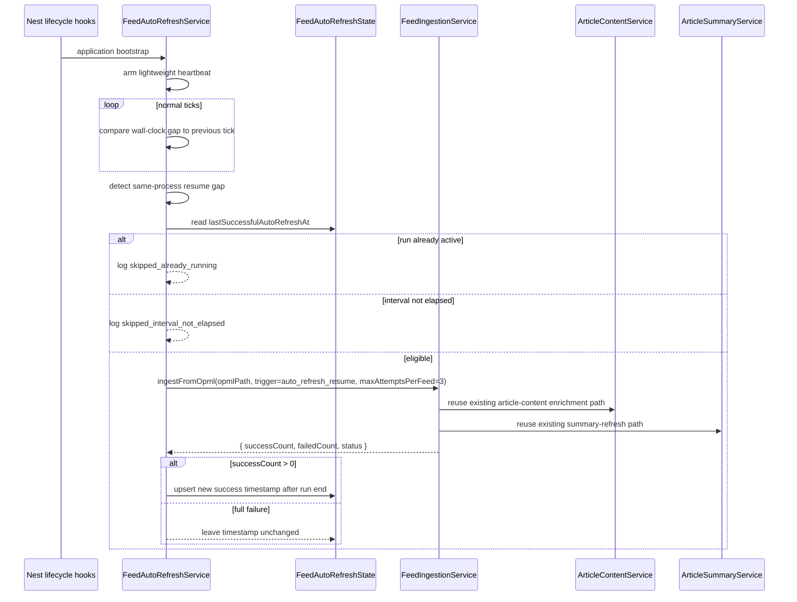

# feat: add feed auto refresh on wake

## Overview

This plan adds a same-process wake auto-refresh path for `apps/api` without changing the existing bootstrap meaning of `INGEST_ON_BOOT`. The API should keep startup ingestion behavior exactly as it works today, but it should also recognize when a still-alive process resumes after a long sleep/freeze window and decide whether a background feed refresh is overdue.

The work stays inside `apps/api`, reuses the existing feed ingestion plus enrichment plus summary pipeline, and keeps refresh decisions out of user read traffic.

| Situation                                                   | Trigger surface         | Expected outcome                                                                                   |
| ----------------------------------------------------------- | ----------------------- | -------------------------------------------------------------------------------------------------- |
| Process start with `INGEST_ON_BOOT=true`                    | Existing bootstrap path | Startup ingestion still runs unconditionally                                                       |
| Process start with `INGEST_ON_BOOT=false`                   | Existing bootstrap path | No startup ingestion; auto-refresh monitor only arms background detection                          |
| Same-process resume and interval not elapsed                | New wake detector       | Skip refresh, keep serving persisted data                                                          |
| Same-process resume and no prior success / interval elapsed | New wake detector       | Fire one background refresh, then advance global success state only if at least one feed succeeded |

## Problem Frame

`apps/api` already has a solid primary ingestion backbone: `FeedBootstrapService` can kick off OPML-driven ingestion at startup, `FeedIngestionService` already persists feed/article changes, existing rows with missing body content already re-enter article-content enrichment, and title changes already requeue summary refresh. What it does not have is an always-available way to catch up after the runtime sleeps while the same process stays alive.

That gap matters for the product slice described in the origin requirements: a machine or runtime can wake up with stale feed data even though the process never restarted, so startup-only ingestion is not enough. The plan therefore adds a lightweight wake detector plus one durable last-successful wake auto-refresh timestamp, then keeps the actual article processing inside the existing ingestion pipeline.

Important repo constraints carried forward from the origin document:

- Auto-refresh eligibility must be checked only on same-process resume, never on user read requests.
- `INGEST_ON_BOOT` keeps its current bootstrap-only contract.
- Auto-refresh must stay backgrounded and must not block HTTP availability.
- One successful feed is enough to count a full wake-triggered refresh run as successful for interval tracking.
- The slice does not add per-feed scheduling, public refresh endpoints, or an always-on cron/scheduler subsystem.

## Requirements Trace

- R1-R6. Detect same-process resume, skip duplicate in-process triggers, and run at most one background auto-refresh wave at a time without changing bootstrap semantics.
- R7-R9. Expose one environment variable for refresh interval hours, default it to `6`, and keep the contract interval-based rather than cron-based.
- R10-R15. Persist one global last successful wake auto-refresh timestamp, treat a run as successful when at least one feed succeeds, and only advance that timestamp after the full run finishes.
- R16-R18. Reuse the existing feed ingestion, article-content enrichment, and summary refresh pipeline instead of creating a parallel downstream path.
- R19-R20. Keep the feature internal to `apps/api`; do not add request-time refresh, manual controls, or external scheduler requirements.
- R21. Emit structured logs that distinguish skipped wake checks, already-running skips, triggered runs, partial success, and full failure.
- R22. Cap transient retry attempts at three tries per feed during one auto-refresh run.

## Scope Boundaries

- Do not change the meaning of `INGEST_ON_BOOT` or gate bootstrap ingestion behind the new interval.
- Do not move refresh eligibility checks onto `GET /articles` or any other read path.
- Do not introduce per-feed freshness state, cron syntax, or distributed scheduler infrastructure.
- Do not add public manual refresh APIs, admin tooling, or UI controls in this slice.
- Do not redesign article-content or LLM-summary product behavior; this slice only changes how wake-triggered ingestion enters that existing pipeline.

## Context & Research

### Relevant Code and Patterns

- `apps/api/src/feeds/feed-bootstrap.service.ts` already defines startup-triggered ingestion and shows the repo's pattern for fire-and-forget background work that logs structured failure payloads.
- `apps/api/src/feeds/feed-ingestion.service.ts` is already the canonical orchestration boundary for feed fetch loops, article persistence, article-content enrichment, and summary refresh on title change.
- `apps/api/src/feeds/feed-ingestion.service.spec.ts` and `apps/api/e2e/feed-ingestion.e2e-spec.ts` already cover repeated-ingestion stability, fail-open behavior, and downstream continuity across multiple runs.
- `apps/api/src/config/env.validation.ts`, `apps/api/src/config/app-config.ts`, and `apps/api/src/config/app-config.spec.ts` establish the repo's config-defaulting and validation pattern.
- `apps/api/e2e/prisma-schema.e2e-spec.ts` is the existing schema-and-migration regression harness for durable persistence changes.
- `apps/api/README.md` and `apps/api/.env.example` own API runtime environment documentation.

### Institutional Learnings

- `docs/en/solutions/integration-issues/feed-ingestion-retries-missing-article-markdown-2026-04-17.md` plus `docs/zh-Hans/solutions/integration-issues/feed-ingestion-retries-missing-article-markdown-2026-04-17.md` reinforce that recovery behavior must stay on the primary ingestion path, not a secondary repair-only path. That directly supports reusing `FeedIngestionService` for wake-triggered refreshes.
- `docs/en/solutions/workflow-issues/api-test-surfaces-and-package-local-eslint-guardrails-2026-04-16.md` plus `docs/zh-Hans/solutions/workflow-issues/api-test-surfaces-and-package-local-eslint-guardrails-2026-04-16.md` reinforce that app-level integration coverage belongs under `apps/api/e2e/`, while narrow orchestration tests stay colocated in `apps/api/src/**/*.spec.ts`.
- `docs/en/plans/2026-04-15-001-feat-feed-ingestion-backbone-plan.md` and `docs/zh-Hans/plans/2026-04-15-001-feat-feed-ingestion-backbone-plan.md` already set the pattern of app-owned config defaults, Prisma migration coverage, and feed-pipeline verification for this area.

### External References

- NestJS lifecycle events: `https://docs.nestjs.com/fundamentals/lifecycle-events`
- Node.js timers API: `https://nodejs.org/api/timers.html`
- Planning inference from those sources: the clean repo-fit approach is a lightweight, unref'd background heartbeat started from Nest lifecycle hooks and cleaned up on shutdown, with wall-clock drift used to infer same-process resume rather than introducing a scheduler dependency.

## Key Technical Decisions

- Use a dedicated singleton persistence model for wake-refresh state rather than adding a pseudo-global field onto `Feed`. A global success timestamp is cross-feed state, so duplicating it per feed would create ambiguity and unnecessary write fan-out.
- Separate two concepts that the product requirements intentionally keep distinct: an internal heartbeat gap for detecting same-process resume, and the public refresh interval in hours for deciding whether a refresh is eligible. The heartbeat is implementation detail; `FEED_AUTO_REFRESH_INTERVAL_HOURS` remains the only user-visible contract.
- Keep `FeedIngestionService` as the sole owner of feed/article pipeline work. Auto-refresh orchestration should call into it and consume a structured run result instead of reimplementing feed loops, enrichment, or summary scheduling.
- Extend ingestion logging with trigger metadata while also adding one new top-level auto-refresh orchestration scope. This keeps bootstrap and wake-driven runs distinguishable without forking the underlying ingestion/event vocabulary.
- Use a process-local in-flight guard for duplicate same-process wake triggers. That satisfies R6 without expanding this slice into multi-replica distributed locking.
- Advance the global success timestamp only after a wake auto-refresh run completes and only when `successCount > 0`. Partial success therefore counts, but full failure never shortens the next retry window incorrectly.
- Keep this timestamp intentionally decoupled from bootstrap ingestion for KISS: startup success does not write auto-refresh state, even if that means some sleep/wake paths may accept one extra refresh.

## Open Questions

### Resolved During Planning

- **What is the smallest durable place for the wake auto-refresh success timestamp?** Add a dedicated singleton Prisma model, e.g. one `FeedAutoRefreshState` row keyed by a fixed ID, instead of misusing the per-feed `Feed` model. This keeps semantics aligned with R10-R15.
- **Should wake-triggered logging reuse bootstrap scope verbatim?** No. Add a new top-level orchestration scope such as `feed_auto_refresh`, while adding a `trigger` field on ingestion sub-logs so bootstrap and wake-driven runs stay comparable but distinguishable.
- **Do refreshed articles need a different downstream enrichment/summary path?** No. Current repo behavior already re-enqueues existing rows that still lack body content and requeues summaries when enriched article titles change. Wake-triggered refresh should reuse `FeedIngestionService` so those rules continue unchanged.

### Deferred to Implementation

- The exact heartbeat interval and resume-gap tolerance that best balance false positives versus responsiveness. The plan fixes the shape (heartbeat gap detection) but leaves the concrete constants to test-backed implementation tuning.
- The exact fixed key name and repository helper naming for the singleton state row.
- The precise retryable-error classifier for per-feed retries, as long as timeout/network/5xx-style failures remain retryable and retries never exceed three attempts.

## High-Level Technical Design

> _This illustrates the intended approach and is directional guidance for review, not implementation specification. The implementing agent should treat it as context, not code to reproduce._

## Implementation Units

- [x] **Unit 1: Add wake-refresh config and durable global state**

**Goal:** Introduce the new interval config and a dedicated persistence shape for the global last successful wake auto-refresh timestamp.

**Requirements:** R7, R8, R9, R10, R12, R14, R15

**Dependencies:** None

**Files:**

- Create: `apps/api/prisma/models/feed-auto-refresh-state.prisma`
- Create: `apps/api/prisma/migrations/<timestamp>_add_feed_auto_refresh_state/migration.sql`
- Modify: `apps/api/src/config/env.validation.ts`
- Modify: `apps/api/src/config/app-config.ts`
- Modify: `apps/api/src/config/app-config.spec.ts`
- Modify: `apps/api/e2e/prisma-schema.e2e-spec.ts`

**Approach:**

- Add one optional env var such as `FEED_AUTO_REFRESH_INTERVAL_HOURS`, parsed as a positive integer and defaulted in `getAppConfig()` to `6` when unset.
- Store wake-refresh success state in a dedicated singleton table rather than piggybacking on `Feed`; the row should allow `lastSuccessfulAutoRefreshAt` to remain null until the first successful wake-triggered run.
- Keep the schema change local to `apps/api` and cover it with the same Prisma migration replay pattern already used for previous feed/article schema changes.

**Patterns to follow:**

- `apps/api/src/config/app-config.ts`
- `apps/api/src/config/app-config.spec.ts`
- `apps/api/e2e/prisma-schema.e2e-spec.ts`
- `docs/en/plans/2026-04-15-001-feat-feed-ingestion-backbone-plan.md` (see origin patterns for config + migration coverage)

**Test scenarios:**

- Happy path - when `FEED_AUTO_REFRESH_INTERVAL_HOURS` is unset, config returns the default `6` hours instead of throwing.
- Happy path - when `FEED_AUTO_REFRESH_INTERVAL_HOURS=12`, config exposes `12` and preserves existing `INGEST_ON_BOOT` parsing behavior.
- Error path - `FEED_AUTO_REFRESH_INTERVAL_HOURS=0`, negative values, or non-integer strings fail validation with a clear positive-integer message.
- Integration - the Prisma migration creates the dedicated global state table with a nullable last-success timestamp and does not alter existing `Feed` / `Article` row shapes.
- Integration - migration replay from the existing feed/article baseline still succeeds, proving the new table layers cleanly on top of current schema history.

**Verification:**

- API config has a stable defaulted interval contract, and the database can persist one global wake-refresh success timestamp without mutating per-feed semantics.

- [x] **Unit 2: Extend feed ingestion with structured wake-run outcomes and bounded retries**

**Goal:** Make the existing ingestion backbone report run results that auto-refresh orchestration can reason about, while keeping downstream enrichment and summary continuity intact.

**Requirements:** R13, R16, R17, R18, R21, R22

**Dependencies:** None

**Files:**

- Modify: `apps/api/src/feeds/feed-ingestion.service.ts`
- Modify: `apps/api/src/feeds/feed-ingestion.service.spec.ts`
- Modify: `apps/api/e2e/feed-ingestion.e2e-spec.ts`

**Approach:**

- Change `ingestFromOpml(...)` from log-only orchestration into a method that still logs structured summaries but also returns a run result object with counts/status for callers such as bootstrap and wake auto-refresh.
- Add caller options for trigger metadata and per-feed retry caps so wake-driven runs can retry transient failures up to three times without changing bootstrap's unconditional-start semantics.
- Keep all article-content enrichment and title-change summary refresh behavior inside the existing pipeline; the wake path should inherit those rules rather than branching around them.

**Execution note:** Start with failing unit coverage for run-result shape and retry boundaries before rewiring callers; this keeps the existing ingestion contract honest while the orchestration surface changes.

**Patterns to follow:**

- `apps/api/src/feeds/feed-ingestion.service.ts`
- `apps/api/src/feeds/feed-ingestion.service.spec.ts`
- `docs/en/solutions/integration-issues/feed-ingestion-retries-missing-article-markdown-2026-04-17.md`
- `docs/zh-Hans/solutions/integration-issues/feed-ingestion-retries-missing-article-markdown-2026-04-17.md`

**Test scenarios:**

- Happy path - all feeds succeed and the returned run result reports `all_success` with correct `successCount`, `failedCount`, and total feed count.
- Happy path - wake-triggered runs still enqueue article-content enrichment for newly created rows and still requeue summary refresh when an existing enriched article title changes.
- Edge case - a mixed-success run reports `partial_success`, preserving the exact count of successful versus failed feed attempts.
- Error path - retryable failures are retried up to three times for one feed, then reported as failed if every attempt exhausts.
- Error path - terminal failures (for example clearly non-retryable responses or parse failures) stop without burning all retry slots unnecessarily.
- Integration - repeated ingestion runs still keep article IDs stable and do not overwrite prepared summaries with feed metadata.

**Verification:**

- Callers can reliably distinguish full failure from partial success, and the ingestion backbone still owns the only path into article-content enrichment and summary refresh.

- [x] **Unit 3: Add same-process wake detection and auto-refresh orchestration**

**Goal:** Detect same-process resume, gate refreshes by elapsed time and in-flight state, and trigger background refresh runs without blocking HTTP availability.

**Requirements:** R1, R2, R3, R4, R5, R6, R10, R11, R12, R13, R14, R15, R19, R20, R21

**Dependencies:** Unit 1, Unit 2

**Files:**

- Create: `apps/api/src/feeds/feed-auto-refresh.repository.ts`
- Create: `apps/api/src/feeds/feed-auto-refresh.service.ts`
- Create: `apps/api/src/feeds/feed-auto-refresh.service.spec.ts`
- Modify: `apps/api/src/feeds/feed-bootstrap.service.ts`
- Modify: `apps/api/src/feeds/feed-bootstrap.service.spec.ts`
- Modify: `apps/api/src/feeds/feeds.module.ts`

**Approach:**

- Add a feeds-local service that starts on Nest bootstrap, arms a lightweight unref'd heartbeat, detects same-process resume by observing an unexpected wall-clock gap, and tears the heartbeat down during module/application shutdown.
- Keep bootstrap ingestion and wake-driven refresh separate concerns: bootstrap still respects only `INGEST_ON_BOOT`, while auto-refresh only evaluates eligibility after a detected resume event.
- Use one process-local `isRefreshRunning` guard to skip overlapping wake-triggered runs in the same process, and persist success state only after the returned ingestion result shows at least one successful feed.
- Log orchestration outcomes under a dedicated scope such as `feed_auto_refresh`, while passing trigger metadata into ingestion so lower-level logs remain comparable across bootstrap and wake flows.
- Reuse existing OPML/config inputs and extract a tiny shared prerequisite helper only if it removes duplication cleanly; do not introduce a generic scheduler abstraction for this slice.

**Execution note:** Implement the timer-gap and in-flight-guard behavior with fake timers/unit tests before wiring the provider into `FeedsModule`; timer semantics are the fragile edge of this slice.

**Patterns to follow:**

- `apps/api/src/feeds/feed-bootstrap.service.ts`
- `apps/api/src/article-summary/article-summary-bootstrap.service.ts`
- `https://docs.nestjs.com/fundamentals/lifecycle-events`
- `https://nodejs.org/api/timers.html`

**Test scenarios:**

- Happy path - a detected same-process resume with no prior success timestamp triggers one background refresh immediately.
- Happy path - a detected same-process resume after the configured interval triggers a background refresh and advances the stored success timestamp only after the run finishes.
- Edge case - a resume detected before the configured interval elapses logs a skip and leaves the success timestamp unchanged.
- Edge case - if another resume event lands while a wake-triggered run is already active, the second trigger logs `already_running` and does not queue a second run.
- Error path - a run with `successCount = 0` logs full failure and does not advance the persistent success timestamp.
- Error path - wake auto-refresh prerequisite failures are logged and swallowed without crashing HTTP startup, while the existing bootstrap prerequisite fail-fast behavior under `INGEST_ON_BOOT=true` remains unchanged.
- Integration - startup with `INGEST_ON_BOOT=false` still does not perform an unconditional ingestion; only the monitor arms.

**Verification:**

- The API can wake from a long idle/sleep window, evaluate eligibility once, and either skip or launch exactly one background refresh wave while leaving bootstrap semantics unchanged.

- [x] **Unit 4: Add cross-layer proof and operator-facing documentation**

**Goal:** Prove the full wake-refresh path across schema, orchestration, and ingestion boundaries, then document the runtime contract for operators and future contributors.

**Requirements:** R4, R7, R8, R11, R16, R17, R18, R21

**Dependencies:** Unit 1, Unit 2, Unit 3

**Files:**

- Create: `apps/api/e2e/feed-auto-refresh.e2e-spec.ts`
- Modify: `apps/api/README.md`
- Modify: `apps/api/.env.example`

**Approach:**

- Add one app-level e2e suite that simulates the durable state row, a stale-versus-fresh interval decision, and the existing ingestion pipeline under wake-triggered orchestration. Drive wake detection through fake timers or an extracted resume-check entrypoint inside the test module rather than relying on real machine sleep in CI.
- Keep the new docs focused on runtime ownership: what the interval env var means, that wake detection is same-process only, how logs distinguish skip/trigger/failure states, and why this is not a cron replacement.
- Document the current single-process assumption explicitly so future multi-replica work does not mistake this slice for distributed locking.

**Patterns to follow:**

- `apps/api/e2e/feed-ingestion.e2e-spec.ts`
- `apps/api/README.md`
- `apps/api/.env.example`
- `docs/en/solutions/workflow-issues/api-test-surfaces-and-package-local-eslint-guardrails-2026-04-16.md`

**Test scenarios:**

- Integration - when the stored success timestamp is stale, a simulated wake event triggers ingestion, persists new articles through the existing pipeline, and advances the state row after the run completes.
- Integration - when the stored success timestamp is still within the interval, a simulated wake event skips refresh and leaves both articles and state untouched.
- Integration - when no state row exists yet, the first simulated wake still triggers the initial auto-refresh.
- Integration - when the first wake-triggered run is still active, a second simulated wake does not create duplicate ingestion waves.
- Test expectation: none -- README and `.env.example` updates are documentation-only, but the e2e suite above must prove the documented runtime contract.

**Verification:**

- Cross-layer tests prove the wake path reuses the canonical ingestion pipeline, and API docs explain the new env var, log vocabulary, and same-process-only scope without drifting from runtime behavior.

## System-Wide Impact

- **Interaction graph:** `FeedBootstrapService` remains the startup-only trigger; new wake detection lives in `FeedAutoRefreshService`; durable state sits behind `FeedAutoRefreshRepository`; actual feed/article processing still flows through `FeedIngestionService`, `ArticleContentService`, and `ArticleSummaryService`.
- **Error propagation:** Wake-triggered orchestration must log and swallow asynchronous failures so HTTP availability stays unaffected. Only the structured run result and persistent success-state update should decide whether the global timestamp advances.
- **State lifecycle risks:** The new singleton timestamp is durable across process restarts, but the in-flight dedupe is intentionally process-local. That matches the same-process requirement but does not solve cross-replica overlap.
- **API surface parity:** No public REST/DTO surface changes are expected. Internal logging and config shape change, but `/articles` behavior and `INGEST_ON_BOOT` semantics remain intact.
- **Integration coverage:** Unit tests alone will not prove migration compatibility, same-process wake orchestration, and downstream article pipeline continuity; that is why the plan adds both schema e2e and wake-path e2e coverage.
- **Unchanged invariants:** User read requests still never trigger refresh checks, no public manual refresh control is added, and existing article-content plus summary rules continue to come from the same ingestion backbone rather than a new parallel path.

## Risks & Dependencies

| Risk                                                                                                  | Mitigation                                                                                                                                                                                                                  |
| ----------------------------------------------------------------------------------------------------- | --------------------------------------------------------------------------------------------------------------------------------------------------------------------------------------------------------------------------- |
| Timer-gap detection could misclassify a long event-loop stall as a resume event.                      | Use a conservative heartbeat gap threshold, cover skip/trigger boundaries with fake-timer tests, and keep eligibility gated by the durable success timestamp so one false positive does not create repeated refresh storms. |
| The new process-local `already running` guard does not dedupe across multiple API replicas.           | Document the single-process assumption explicitly, keep scope aligned to the stated same-process requirement, and leave distributed locking as follow-up work if deployment topology changes.                               |
| Adding a new persistence model could drift from existing migration history or break test reset flows. | Use the established Prisma migration replay harness in `apps/api/e2e/prisma-schema.e2e-spec.ts` and keep the schema change additive.                                                                                        |
| Retry logic could over-retry permanent failures or create noisy logs.                                 | Restrict retries to clearly transient failure classes, cap attempts at three, and include trigger/attempt metadata in structured logs for diagnosis.                                                                        |

## Documentation / Operational Notes

- Update `apps/api/README.md` and `apps/api/.env.example` to document `FEED_AUTO_REFRESH_INTERVAL_HOURS`, its default value of `6`, and the fact that it measures time between successful wake-triggered refresh runs rather than defining a cron schedule.
- Document the new log vocabulary for operators: wake check skipped, already running, triggered, partial success, and full failure.
- Note that cold starts still depend on existing bootstrap behavior; this slice only covers same-process resume after sleep/freeze.
- Note that the feature is serverless-friendly only for runtimes that freeze and later resume the same process; platforms that fully tear down the process still rely on normal startup behavior.

## Sources & References

- **Origin documents:** `docs/en/brainstorms/2026-04-20-feed-auto-refresh-on-wake-requirements.md` + `docs/zh-Hans/brainstorms/2026-04-20-feed-auto-refresh-on-wake-requirements.md`
- Related code: `apps/api/src/feeds/feed-bootstrap.service.ts`, `apps/api/src/feeds/feed-ingestion.service.ts`, `apps/api/src/config/app-config.ts`, `apps/api/src/config/env.validation.ts`, `apps/api/e2e/feed-ingestion.e2e-spec.ts`, `apps/api/e2e/prisma-schema.e2e-spec.ts`
- Institutional learnings: `docs/en/solutions/integration-issues/feed-ingestion-retries-missing-article-markdown-2026-04-17.md`, `docs/zh-Hans/solutions/integration-issues/feed-ingestion-retries-missing-article-markdown-2026-04-17.md`, `docs/en/solutions/workflow-issues/api-test-surfaces-and-package-local-eslint-guardrails-2026-04-16.md`, `docs/zh-Hans/solutions/workflow-issues/api-test-surfaces-and-package-local-eslint-guardrails-2026-04-16.md`
- Related plans: `docs/en/plans/2026-04-15-001-feat-feed-ingestion-backbone-plan.md`, `docs/zh-Hans/plans/2026-04-15-001-feat-feed-ingestion-backbone-plan.md`
- External docs: `https://docs.nestjs.com/fundamentals/lifecycle-events`, `https://nodejs.org/api/timers.html`
