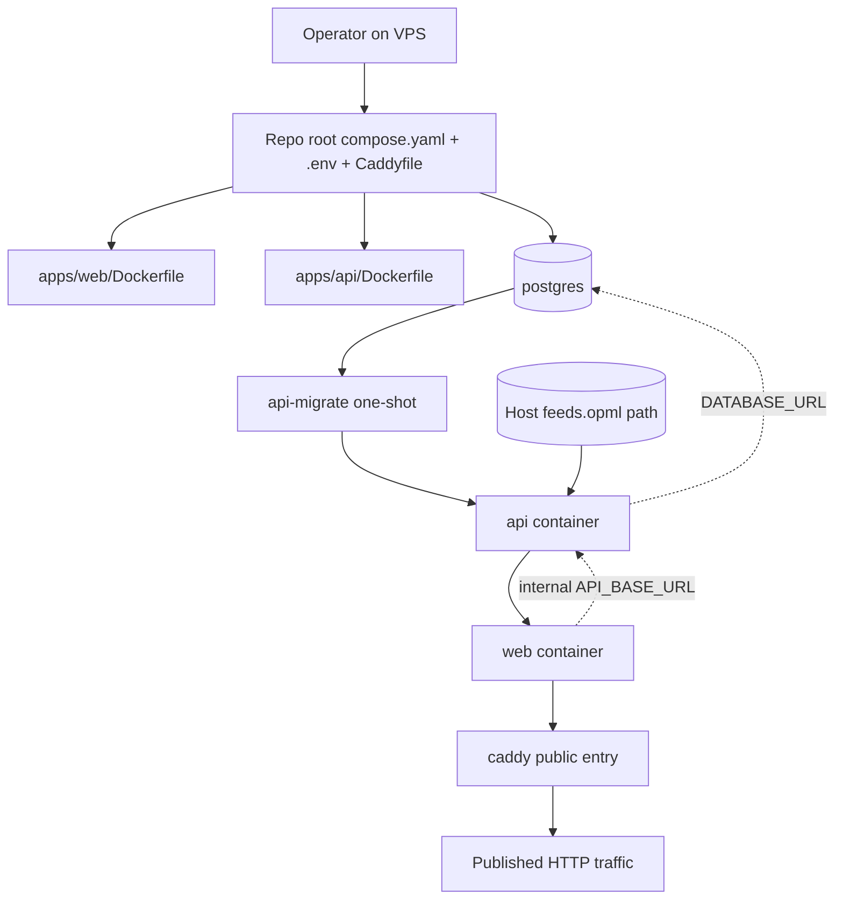
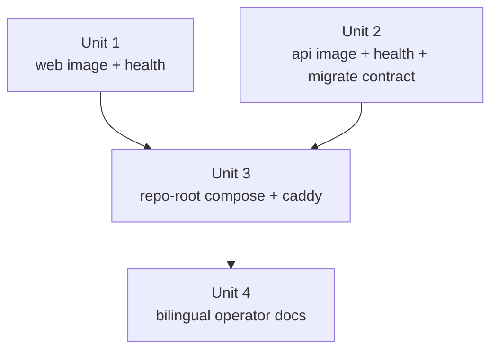

# feat: add docker images and VPS compose deployment path

## Overview

This plan rewrites the production deployment entrypoint around the repo root: `compose.yaml`, `.env.example`, `Caddyfile`, and `.dockerignore` live at the repository root, while `apps/web/Dockerfile` and `apps/api/Dockerfile` remain inside their respective apps. After cloning the repo onto a VPS, an operator should be able to prepare env, build images locally, and start the full stack directly from the repo root instead of dropping into an extra `deploy/vps/` subdirectory.

This does not collapse app responsibilities into the root. It restores the correct ownership split for a monorepo deployment surface: each app owns image build logic, runtime commands, and health surfaces; the repo root owns single-host production orchestration, reverse-proxy entry, and the operator-facing assembly layer. That satisfies R1-R12 while matching the required “obvious from the root, one-command to deploy” operator experience.

| Input / asset class                | Owner                   | Delivery method                              | First-slice constraint                                                            |
| ---------------------------------- | ----------------------- | -------------------------------------------- | --------------------------------------------------------------------------------- |
| Production deployment entry        | repo root               | `compose.yaml` + `.env` + `Caddyfile`        | Intentionally not placed under `deploy/`                                          |
| App image build logic              | `apps/web` / `apps/api` | `apps/*/Dockerfile`                          | Do not move app build logic into the root                                         |
| Operator-controlled mutable config | operator                | repo-root `.env` derived from `.env.example` | This is a Compose/operator contract, not a replacement for app-local `.env.local` |
| Persistent state                   | Compose                 | named volumes                                | PostgreSQL stays off host ports by default                                        |
| Feed subscription file             | operator                | explicit read-only bind mount                | Must not be baked into images or shipped as default deployment payload            |

## Problem Frame

The origin requirements document already defines the problem clearly: the repo has deployable `apps/web` and `apps/api`, but it still lacks production images and a single-host VPS self-hosting path, so operators do not yet have a stable flow from repo checkout to a running stack (see origin: `docs/zh-Hans/brainstorms/2026-04-21-docker-images-and-vps-compose-requirements.md`).

The current codebase also imposes a few constraints that the deployment plan must preserve:

- `apps/web` talks to the API through server-side `API_BASE_URL`; it is not a browser-direct client of the raw API port (`apps/web/src/widgets/article-reader/api/articles-api.ts`).
- `apps/api` already treats `DATABASE_URL`, `FEED_OPML_PATH`, `INGEST_ON_BOOT`, `LLM_*`, and `PORT` as app-owned runtime contracts (`apps/api/.env.example`, `apps/api/README.md`, `apps/api/src/config/app-config.ts`).
- `apps/api` wake auto-refresh remains a single-process assumption, so the first deployment slice should not introduce replicas or public API load balancing (`apps/api/README.md`).
- The repo currently has no production Docker/Compose/Caddy assets at all; there is no `compose.yaml`, `docker-compose.yml`, `Caddyfile`, or `.dockerignore` at the root, so this deployment surface genuinely needs to be created from scratch.
- Neither `apps/api` nor `apps/web` currently exposes a purpose-built health/readiness surface for container orchestration (`apps/api/src/main.ts`, `apps/api/src/app.module.ts`, plus repo-wide file search results).

So the real goal here is not “find somewhere to tuck Compose away.” It is to add the correct production operating surface for the monorepo: repo-root one-command orchestration, app-local image ownership, and operator-owned external inputs plus persistence.

## Requirements Trace

- R1-R3. Provide separate production images for `apps/web` and `apps/api` while preserving Turborepo app/package boundaries; the repo root carries only cross-app orchestration assets, not app-specific build implementations.
- R4-R8. Provide a single-host topology driven by repo-root `compose.yaml` that runs `web`, `api`, `postgres`, and `caddy`; keep PostgreSQL internal to the Compose network by default; route all public traffic through Caddy; keep Caddy as the only first-slice reverse proxy.
- R9-R10. Allow an operator to clone the repo onto a VPS, build images locally from the repo root, and start services while staying compatible with the existing build/start/migrate commands already defined in `apps/web/package.json` and `apps/api/package.json`.
- R11-R12. Make env files, named volumes, and bind mounts explicit in both docs and orchestration, especially the requirement that `feeds.opml` comes from an operator-provided host path and is mounted read-only into the API container.

## Scope Boundaries

- No GitHub Actions image publishing, registry rollout, Kubernetes, ECS, Nomad, Swarm, or multi-host orchestration.
- No attempt to make `apps/api` safe for multi-replica ingestion or distributed wake-refresh coordination; the single-process assumption remains intact.
- No PostgreSQL host port exposure in the default topology. A future loopback-only debug exception can be planned later, but it is not delivered here.
- No second reverse proxy in the first slice, and no premature public `/api/*` routing layer for future browser-direct API traffic.
- No `deploy/vps/` directory as the primary production entry; the production operating surface is the repo root.

## Context & Research

### Relevant Code and Patterns

- `apps/web/package.json` already defines `build` and `start` as the production command surface, with Web listening on `3001`; containerization should preserve that app-owned startup contract.
- `apps/api/package.json` already separates `db:deploy` from `start:prod`, which naturally supports a Compose design where one image powers both a one-shot migration service and the long-lived API service.
- `apps/web/src/widgets/article-reader/api/articles-api.ts` explicitly requires `API_BASE_URL`, and its error message already points maintainers to `apps/web/.env.local` / `apps/web/.env.example`; the deployment plan must not silently mutate that contract.
- `apps/api/src/config/app-config.ts` shows that `FEED_OPML_PATH` supports both absolute paths and paths resolved relative to the `apps/api` package root, which makes it safe for production Compose to inject a mounted absolute container path without breaking the local-development relative default.
- `apps/api/src/main.ts` and `apps/api/src/app.module.ts` show the current Nest bootstrap shape but no purpose-built liveness/readiness surface; container orchestration should not keep relying on “the port opened, so the service must be ready.”
- `README.md` and `README.zh-Hans.md` only cover local development today and do not describe any repo-root production deployment runbook, so the root Compose path must ship with synchronized documentation.

### Institutional Learnings

- `docs/en/solutions/integration-issues/ci-e2e-runtime-inputs-must-match-seeded-targets-2026-04-16.md` and its paired Chinese document already prove that as soon as build/start/reset/seed flows consume different runtime inputs, the system drifts into “works locally, fails in CI or hosting.” The production Compose path therefore needs one clear operator-owned source of truth instead of yet another implicit config entrypoint.

### External References

**GitHub + DeepWiki samples used to validate repo-root Compose as a reasonable pattern**

- `pezzolabs/pezzo`
  - The root `docker-compose.yaml` on GitHub shows a repo-root Compose file calling app-local Dockerfiles, using `service_completed_successfully` / `service_healthy`, and gating startup with healthchecks.
  - DeepWiki describes the repository as using root `docker-compose.yaml` as the main Docker deployment entrypoint.
- `nktnet1/rt-stack`
  - The root `compose.yaml` on GitHub shows `build.context: .` plus `dockerfile: ./apps/web/Dockerfile` / `./apps/server/Dockerfile`, alongside healthchecks and a separate database-tooling container pattern.
  - DeepWiki explicitly identifies the repo-root `compose.yaml` as the primary containerized deployment entrypoint.

**Planning inference from those samples**

- A repo-root Compose entry is a common and reasonable operator surface when the goal is “clone the repo and run `docker compose ...`.”
- App-local Dockerfiles and repo-root Compose do not conflict; that split is a common monorepo deployment pattern.
- One-shot migration services, health-gated startup order, and repo-root env / compose entrypoints are recurring patterns in mature examples.

**Standards references**

- Next.js `output` docs: `https://nextjs.org/docs/app/api-reference/config/next-config-js/output`
- Docker Compose startup order docs: `https://docs.docker.com/compose/how-tos/startup-order/`
- Docker bind mounts docs: `https://docs.docker.com/engine/storage/bind-mounts/`
- Caddy `reverse_proxy` docs: `https://caddyserver.com/docs/caddyfile/directives/reverse_proxy`

## Key Technical Decisions

- **Repo-root `compose.yaml` is the production deployment entrypoint**: the first slice creates `compose.yaml` at the repository root instead of introducing `deploy/vps/`. That lets operators run `docker compose up -d --build` from the root without extra `-f` flags or directory changes, and it matches real repository patterns such as `pezzolabs/pezzo` and `nktnet1/rt-stack`.
- **Repo-root `.env.example` represents only the Compose/operator contract**: the root `.env` owns single-host production deployment inputs and Compose interpolation; `apps/web/.env.example` and `apps/api/.env.example` remain the local-development and test surfaces.
- **App Dockerfiles stay inside the apps, but build from the repo root context**: `compose.yaml` should use `context: .` with `dockerfile: ./apps/web/Dockerfile` / `./apps/api/Dockerfile` so workspace dependencies remain available while each app keeps ownership of its image build implementation.
- **`apps/web` should use standalone output**: the Web image should rely on Next.js `output: 'standalone'` and explicitly set the monorepo tracing root so workspace dependencies such as `packages/ui` survive into the runtime image.
- **The same API image should power migrations and runtime**: the first slice accepts a modest image-size cost so the `apps/api` runtime image can retain Prisma migration assets; `api-migrate` and `api` then share one image and avoid schema-ownership drift.
- **Only Caddy publishes host ports**: `web`, `api`, and `postgres` communicate only inside the Compose network; Caddy is the only public entrypoint. That directly implements R5/R5a/R7 and simplifies the externally visible success surface.
- **The first slice exposes only Caddy -> Web; Web reaches API internally**: today Web fetches through server-side `API_BASE_URL`, so v1 does not need a public raw API port or a public `/api/*` proxy contract. Compose can set `API_BASE_URL=http://api:3000` internally.
- **The operator-owned `feeds.opml` file must be a read-only bind mount**: production should no longer treat `apps/api/feeds.opml` as the deployment input. The operator supplies an explicit host file path, Compose mounts it read-only into the container, and `FEED_OPML_PATH` points at that mounted container path.
- **Explicit health surfaces must be added**: `apps/api` needs liveness/readiness endpoints, and `apps/web` needs a lightweight health route. Compose sequencing and proxy health should not depend on business pages or business endpoints.
- **The repo-root `.dockerignore` is only a build-context control surface**: it is a repo-level helper for monorepo builds, not a place for app-specific logic and not a change to Turborepo package boundaries.
- **All external base images must be strictly version-pinned, and PostgreSQL must be pinned to a distro-qualified tag**: the first slice explicitly forbids `latest`, bare major tags, or other floating tags. `postgres` must use a tag such as `postgres:18.6-bookworm` that locks major/minor/patch plus distro, and Node base images should likewise pin exact versions plus distro variants rather than floating forms such as `node:24` or `node:24-bookworm`.
- **Implementation must include real local Docker / Compose validation**: the agent may not stop at static YAML / Dockerfile review; it must perform at least one repo-root `docker compose` startup validation locally and confirm that key services actually start, pass health checks, and honor dependency order.

## Open Questions

### Resolved During Planning

- **Where should production Compose live?** At the repo root, using `compose.yaml`. That is the first principle of this rewrite: operators should see the production entrypoint immediately and run it without extra path indirection.
- **Does a repo-root `.env` violate app-owned env boundaries?** No. The root `.env` exists only for the Compose/operator layer; app-local development keeps its own `.env.local` / `.env.example` contracts.
- **What is the public routing contract?** In the first slice, it is only `Internet -> Caddy -> web`; `web` talks to `api` through internal `API_BASE_URL`, so no new public API surface is added.
- **Which inputs belong in env vs volumes vs mounts?** Scalar config and secrets live in repo-root `.env`; PostgreSQL and Caddy state live in named volumes; `feeds.opml` lives in an operator-provided read-only bind mount.
- **What is the minimal reliable startup order on one host?** `postgres` healthy -> `api-migrate` completed successfully -> `api` ready -> `web` healthy -> `caddy` accepts public traffic.
- **How should external image versions be managed?** They must be pinned strictly. PostgreSQL in particular must not use only a major tag, and must not use forms such as `postgres:18`, `postgres:18-bookworm`, or `latest`; the plan requires a concrete patch version plus distro. Node base images follow the same rule so the base layer cannot drift into production without review.
- **How is implementation accepted?** It must include real local Docker / Compose validation, not just contract tests or config diffs. At minimum, the implementer must build and start the repo-root container topology once and confirm migration gating, health checks, internal service networking, and the Caddy public entry all work as planned.

### Deferred to Implementation

- The exact Node 24 base-image variant for API and Web runtime stages remains an implementation-time decision driven by size and compatibility validation.
- Exact Compose healthcheck timing constants (`interval`, `timeout`, `retries`, `start_period`) should be tuned against real container startup timings.
- A future loopback-only PostgreSQL debug profile may be useful, but it is intentionally out of scope for this slice.

## High-Level Technical Design

> _This illustrates the intended approach and is directional guidance for review, not implementation specification. The implementing agent should treat it as context, not code to reproduce._

## Implementation Units

- [x] **Unit 1: Give `apps/web` a self-hostable production image and health endpoint**

**Goal:** Produce a production-friendly container image for `apps/web` without changing its business boundary, and expose a dedicated health endpoint for Compose / Caddy that is independent from business pages.

**Requirements:** R1, R3, R9, R10

**Dependencies:** None

**Files:**

- Create: `apps/web/Dockerfile`
- Create: `apps/web/app/api/health/route.ts`
- Create: `apps/web/app/api/health/route.spec.ts`
- Modify: `apps/web/next.config.ts`

**Approach:**

- Enable Next.js standalone output and explicitly set the monorepo tracing root so `@repo/ui` and other workspace dependencies survive into the runtime image.
- Keep the Dockerfile in `apps/web`, but let repo-root `compose.yaml` build it from the root context so containerization does not break monorepo dependency resolution.
- Let the runtime image only start the Web production server while preserving `API_BASE_URL` as an env-owned contract instead of baking host loopback or public URLs into the image.
- Add a lightweight `/api/health` route dedicated to container and proxy probes so the homepage does not become the health surface.

**Patterns to follow:**

- `apps/web/package.json`
- `apps/web/src/widgets/article-reader/api/articles-api.ts`
- `apps/web/app/page.tsx`
- `apps/web/app/page.spec.tsx`
- `apps/web/playwright.config.ts`

**Test scenarios:**

- Happy path - `/api/health` returns `200` with a stable payload under the production server and does not depend on article data or API availability.
- Happy path - the Web runtime still reads `API_BASE_URL` from env rather than baking a fixed address into the image.
- Edge case - standalone output includes traced workspace dependencies such as `packages/ui`, so container startup does not fail on missing files.
- Error path - missing `API_BASE_URL` preserves the current explicit failure mode instead of silently falling back to the wrong target.
- Integration - when Compose sets `API_BASE_URL=http://api:3000`, the containerized Web service can reach the API via internal service DNS.

**Verification:**

- `apps/web` starts reliably in a container, responds on `/api/health`, and preserves the current app-owned `API_BASE_URL` contract.

- [x] **Unit 2: Give `apps/api` a production image, migration contract, and readiness checks**

**Goal:** Produce one production API image that can run both one-shot migrations and the long-lived service, while exposing health endpoints suitable for Compose startup sequencing.

**Requirements:** R2, R3, R6, R9, R10, R11, R12

**Dependencies:** None

**Files:**

- Create: `apps/api/Dockerfile`
- Create: `apps/api/src/health/health.module.ts`
- Create: `apps/api/src/health/health.controller.ts`
- Create: `apps/api/src/health/health.controller.spec.ts`
- Create: `apps/api/e2e/health.e2e-spec.ts`
- Modify: `apps/api/src/app.module.ts`
- Modify: `apps/api/src/main.ts`

**Approach:**

- Keep `db:deploy` and `start:prod` as the package-local authoritative commands; Compose should call those contracts rather than inventing repo-root wrappers.
- Retain Prisma CLI, migration files, and generated client assets in the runtime image so the same image can back both `api-migrate` and the long-lived `api` service.
- Add a small Nest feature module that exposes `/health/live` and `/health/ready`; readiness must reflect database reachability plus completed app startup, while liveness only means the process can still serve.
- Preserve the existing `FEED_OPML_PATH` resolution rules by letting Compose inject a mounted absolute container path instead of baking a default feed file into the image.

**Execution note:** Lock down liveness/readiness semantics with controller + e2e tests first, then wire Docker image behavior and Compose startup sequencing on top of those contracts.

**Patterns to follow:**

- `apps/api/package.json`
- `apps/api/src/app.module.ts`
- `apps/api/src/main.ts`
- `apps/api/src/config/app-config.ts`
- `apps/api/src/articles/articles.controller.spec.ts`
- `apps/api/e2e/articles.e2e-spec.ts`

**Test scenarios:**

- Happy path - `/health/live` returns `200` after Nest startup completes and does not depend on article data or LLM config.
- Happy path - `/health/ready` returns `200` only when the database is reachable and the app has finished startup.
- Error path - if PostgreSQL is unavailable or schema state is not ready, `/health/ready` returns a failing status instead of a false positive.
- Edge case - the same built image can successfully run one-shot `pnpm db:deploy` and then `pnpm start:prod`.
- Integration - when `FEED_OPML_PATH` points at a bind-mounted absolute path, the API still preserves the current local-development relative-path semantics.

**Verification:**

- The `apps/api` image can be used by Compose to migrate first and then start the service, and readiness truly means “database plus API are usable.”

- [x] **Unit 3: Add repo-root `compose.yaml`, `Caddyfile`, `.env.example`, and deployment contract tests**

**Goal:** Use the smallest possible set of repo-root orchestration assets to connect both apps, PostgreSQL, and Caddy into a one-command VPS deployment path while keeping operator inputs and persistent state on the right ownership boundaries.

**Requirements:** R3, R4, R5, R5a, R6, R7, R8, R9, R11, R12

**Dependencies:** Unit 1, Unit 2

**Files:**

- Create: `compose.yaml`
- Create: `Caddyfile`
- Create: `.env.example`
- Create: `.dockerignore`
- Create: `.github/scripts/compose-contract.test.mjs`

**Approach:**

- Define five services in repo-root `compose.yaml`: `postgres`, `api-migrate`, `api`, `web`, and `caddy`. Only Caddy publishes host ports.
- Build `web` and `api` with `context: .` while pointing `dockerfile` at the app-local Dockerfiles, so monorepo workspace dependencies remain available and app-owned image build logic stays inside the apps.
- Keep repo-root `.env.example` limited to true operator-owned deployment inputs such as the published HTTP port, database credentials, `FEED_OPML_HOST_PATH`, `INGEST_ON_BOOT`, and `LLM_*`; the operator copies it to repo-root `.env`, which Compose reads automatically from the same directory.
- Give `postgres` a named volume and no host `ports`; Caddy should also use named volumes for runtime state and config cache.
- Pass the operator-provided `feeds.opml` file into the API service via long-syntax read-only bind mount, then point `FEED_OPML_PATH` at the fixed container path.
- Keep the first Caddyfile thin: proxy the public entrypoint to `web:3001` only. `web` then reaches the API internally through `API_BASE_URL=http://api:3000`, with no new public API surface.
- Use official `depends_on` conditions so `postgres` must be healthy, `api-migrate` must complete successfully, `api` must be ready, and `web` must be healthy before Caddy becomes the public entrypoint.
- Freeze the deployment invariants in a repo-root contract test: only Caddy exposes ports, PostgreSQL has no host ports, the OPML mount is read-only, a migration gate exists, root Compose points at app-local Dockerfiles, and external image tags are not floating versions.

**Execution note:** Write `.github/scripts/compose-contract.test.mjs` first so the repo-root entrypoint and topology rules are locked before `compose.yaml` and `Caddyfile` are authored.

**Patterns to follow:**

- `package.json`
- `turbo.json`
- `.github/scripts/eslint-guardrails.test.mjs`
- `README.md`
- `README.zh-Hans.md`

**Test scenarios:**

- Happy path - the contract test verifies that repo-root `compose.yaml` defines at least `postgres`, `api-migrate`, `api`, `web`, and `caddy`, and references `apps/web/Dockerfile` plus `apps/api/Dockerfile`.
- Happy path - only Caddy publishes host ports; `postgres`, `api`, and `web` do not.
- Happy path - PostgreSQL uses a named volume and no host `ports`, preserving the default internal-only rule.
- Happy path - the `postgres` service uses an exact version plus distro-qualified tag such as `postgres:18.6-bookworm`, not `latest`, `18`, or another floating tag.
- Happy path - the Web/API Dockerfiles likewise pin Node base images to explicit versions and distro variants rather than floating tags.
- Happy path - the API service contains an operator-specified read-only bind mount for `feeds.opml`.
- Edge case - the dependency chain requires `postgres` healthy, `api-migrate` completed successfully, and `api` ready before later services can start.
- Error path - if a future edit moves Compose back under `deploy/`, adds host `ports` to PostgreSQL, removes the migration gate, or makes the OPML mount writable, the contract test fails.

**Verification:**

- On a VPS with Docker Engine and the Compose plugin installed, an operator only needs the repo checkout, repo-root `.env`, and an existing OPML host path to build and start the stack through repo-root `docker compose`.
- The implementing agent must also run one real local Docker / Compose validation pass covering image builds, one-shot `api-migrate` execution, API/Web health checks, and successful Caddy reverse proxying to Web.

- [x] **Unit 4: Finish the bilingual operator runbook and clarify the boundary between root deployment entry and app-local development entry**

**Goal:** Make the production deployment path understandable without requiring operators to read code or guess which values belong at the repo root versus inside app directories.

**Requirements:** R9, R10, R11, R12

**Dependencies:** Unit 3

**Files:**

- Modify: `README.md`
- Modify: `README.zh-Hans.md`
- Modify: `apps/api/README.md`
- Modify: `apps/web/README.md`

**Approach:**

- Add a production deployment / self-hosting section to the bilingual root README pair that states explicitly that repo-root `compose.yaml`, repo-root `.env`, and repo-root `Caddyfile` are the VPS entrypoint, and explain why the first slice intentionally does not hide that surface under `deploy/`.
- Extend `apps/api/README.md` to distinguish the two input layers: local development still uses `apps/api/.env.local` plus the app-local sample OPML file, while production Compose uses repo-root `.env` and an operator-owned external bind mount.
- Extend `apps/web/README.md` to document that under Compose deployment `API_BASE_URL` should point at the internal service name `http://api:3000`, not host loopback.
- Turn the single-process API constraint, the Caddy-only public entry, the internal-only PostgreSQL default, and the external ownership of `feeds.opml` into explicit operational rules rather than hidden assumptions.

**Patterns to follow:**

- `README.md`
- `README.zh-Hans.md`
- `apps/api/README.md`
- `apps/web/README.md`

**Test scenarios:**

- Test expectation: none -- this unit only updates documentation and explanatory text; behavior is already covered by Units 1-3, including the requirement for one real local Docker / Compose validation pass.

**Verification:**

- A new operator can follow the bilingual docs from clone to running stack and clearly distinguish the repo-root deployment entry from the app-local development entry.

## System-Wide Impact

- **Interaction graph:** public traffic becomes `Internet -> Caddy -> web -> api -> postgres`; `apps/api` also consumes the operator-provided `feeds.opml` bind mount.
- **Ownership model:** the repo root owns the cross-app production orchestration entrypoint; `apps/web` and `apps/api` continue to own their image build logic and runtime commands; the operator owns `.env` and the host feed file.
- **Error propagation:** if PostgreSQL is not ready, `api-migrate` must not run; if migration fails, `api` / `web` / `caddy` must not present a false online state; if API readiness fails, Web and Caddy must not become the public entrypoint.
- **State lifecycle risks:** PostgreSQL and Caddy runtime state need named volumes; `feeds.opml` must remain on the host filesystem under operator control so image rebuilds never overwrite it.
- **API surface parity:** the current server-to-server `API_BASE_URL` contract in `apps/web` remains intact; `apps/api` keeps package-local ownership of `db:deploy` / `start:prod`; there is no new browser-visible public `/api/*` surface.
- **Unchanged invariants:** the API stays single-process only; the first slice still excludes registry / CI publishing; PostgreSQL remains non-public by default; Caddy remains the only supported first-slice proxy.
- **Validation posture:** static contract tests are necessary but not sufficient; implementation acceptance requires one real local Docker / Compose startup validation.

## Risks & Dependencies

| Risk                                                                                                                         | Mitigation                                                                                                                                                       |
| ---------------------------------------------------------------------------------------------------------------------------- | ---------------------------------------------------------------------------------------------------------------------------------------------------------------- |
| If repo-root `.env` grows without discipline, it could recreate a config layer that drifts away from app contracts           | Keep repo-root `.env` limited to operator-owned Compose inputs and document its boundary against app `.env.local` files                                          |
| After moving Compose back to the root, future edits may incorrectly assume Docker build logic should also move into the root | State clearly in the plan, README, and contract test that the root owns orchestration only; `apps/*/Dockerfile` remains the image implementation owner           |
| Web standalone tracing may miss `packages/ui` or other workspace dependencies in the monorepo                                | Set tracing root explicitly in `apps/web/next.config.ts` and validate the container startup path                                                                 |
| If the API image is over-optimized for size, `db:deploy` and `start:prod` may drift into two inconsistent runtimes           | Explicitly accept the first-slice tradeoff of retaining Prisma CLI so one image owns both migration and runtime                                                  |
| A wrong operator OPML host path could still cause ingestion failures after startup                                           | Use explicit read-only bind mounts and clear path-ownership docs; readiness/startup logs should surface misconfiguration early                                   |
| Later Compose edits could accidentally expose PostgreSQL or remove the migration gate                                        | Add a repo-root contract test that freezes those deployment invariants                                                                                           |
| Floating external base-image tags could pull unreviewed foundation changes into production                                   | Make the plan and contract test explicitly forbid `latest`, bare major tags, and unpinned patch versions; require PostgreSQL to use a distro-qualified exact tag |
| Single-host deployment still depends on Docker Engine, Compose plugin, and inbound HTTP networking prerequisites             | Turn those prerequisites into an operator checklist in the runbook rather than leaving them implicit                                                             |

## Documentation / Operational Notes

- Repo-root `compose.yaml`, `Caddyfile`, and `.env.example` are production deployment assets; `apps/web/.env.example` and `apps/api/.env.example` remain local-development assets. Their coexistence is deliberate, not accidental duplication.
- The production deployment docs should treat “external images must be version-pinned” as an explicit rule, not an implementation detail: PostgreSQL must pin a concrete patch version plus distro tag, and Node base images must also pin exact versions.
- The bilingual root README needs to say clearly that this path builds images locally on the VPS from the repo root; it is not a registry-push / registry-pull flow.
- `apps/api/README.md` should emphasize that under Compose deployment, migrations are executed by the one-shot `api-migrate` service rather than implicitly by the long-lived API container.
- `apps/web/README.md` should explain that under production Compose, `API_BASE_URL` is an internal service address, not a browser-visible public URL.
- If implementation reveals the need for a longer-lived deployment knowledge-base document, create a synchronized pair under `docs/en/solutions/` and `docs/zh-Hans/solutions/`, but that is optional follow-on work rather than a required output of this plan.

## Sources & References

- **Origin documents:** `docs/en/brainstorms/2026-04-21-docker-images-and-vps-compose-requirements.md` + `docs/zh-Hans/brainstorms/2026-04-21-docker-images-and-vps-compose-requirements.md`
- **Related code:** `apps/web/package.json`, `apps/web/src/widgets/article-reader/api/articles-api.ts`, `apps/web/next.config.ts`, `apps/api/package.json`, `apps/api/README.md`, `apps/api/src/config/app-config.ts`, `apps/api/src/main.ts`, `apps/api/src/app.module.ts`, `README.md`, `README.zh-Hans.md`
- **Institutional learning:** `docs/en/solutions/integration-issues/ci-e2e-runtime-inputs-must-match-seeded-targets-2026-04-16.md`, `docs/zh-Hans/solutions/integration-issues/ci-e2e-runtime-inputs-must-match-seeded-targets-2026-04-16.md`
- **External repo examples:** `pezzolabs/pezzo` root `docker-compose.yaml`, `pezzolabs/pezzo` root `docker-compose.infra.yaml`, `nktnet1/rt-stack` root `compose.yaml`
- **External docs:** `https://nextjs.org/docs/app/api-reference/config/next-config-js/output`, `https://docs.docker.com/compose/how-tos/startup-order/`, `https://docs.docker.com/engine/storage/bind-mounts/`, `https://caddyserver.com/docs/caddyfile/directives/reverse_proxy`
