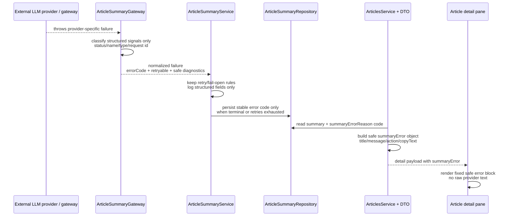

# fix: sanitize LLM summary errors and add safe diagnostics

## Overview

This plan closes the verified LLM summary error leak at the source instead of masking it downstream. The backend will normalize provider failures into stable error codes, keep raw upstream text out of durable business fields and routine logs, expose a structured safe error object on the article detail API, and let the web reader render a fixed copyable error block without breaking the existing fail-open reading path.

## Problem Frame

The current repository has one confirmed leak chain: `apps/api/src/article-summary/article-summary.gateway.ts` reads raw `error.message`, `apps/api/src/article-summary/article-summary.repository.ts` persists that string into `summaryErrorReason`, `apps/api/src/articles/articles.service.ts` returns it through the detail DTO, and `apps/web/src/widgets/article-reader/ui/article-detail.tsx` renders it directly. That means provider failures containing API keys, bearer tokens, header fragments, proxy details, or other sensitive diagnostics can reach the database, backend logs, and the reader UI.

Repo context makes the change more than a copy tweak:

- `apps/api/src/article-summary/article-summary.service.ts` already has retry and fail-open semantics that were recently tightened, so the safety fix cannot regress retry exhaustion behavior.
- `apps/api/src/article-summary/article-summary.gateway.ts` has classification logic but no gateway-level spec coverage, making the normalization boundary easy to drift.
- `apps/api/src/articles/*` and `apps/api/e2e/articles.e2e-spec.ts` protect the read contract today, but that contract still treats `summaryErrorReason` as user-facing text.
- `apps/web/app/page.spec.tsx` currently proves the web failure state by asserting the raw `summaryErrorReason` string is rendered, so UI tests must change with the contract.
- `packages/` has no shared API contract/types package, so the plan should avoid creating repo-wide packaging overhead for a single detail-path contract unless a second consumer justifies it.

The fix therefore needs to preserve one invariant while changing four surfaces at once: the summary job still fails open, but the failure payload becomes safe, structured, and stable across gateway, persistence, API, and UI.

## Requirements Trace

- R1-R4 - raw provider / gateway error text never reaches user-visible UI, durable business fields, or routine application logs; secrets and request details are discarded before entering the business contract.
- R5-R8 - the LLM summary boundary emits stable error codes plus retryability semantics, and the read path no longer relies on provider free-form text.
- R9-R12 - article-summary failures are logged as structured diagnostics with searchable fields such as `scope`, `status`, `errorCode`, `retryable`, `articleId`, `attempt`, and `trigger`, with optional safe provider metadata when available.
- R13-R16 - the web reader renders a fixed safe error block with a stable code, human-readable explanation, suggested next action, and copyable support text while preserving the current detail-pane layout.
- R17-R20 - the confirmed `article-summary -> article read API -> web detail pane` leak is closed first, the resulting pattern stays reusable for later external-error cleanup, and retry / fail-open behavior remains unchanged.

## Scope Boundaries

- No redesign of the global exception stack or the repository-wide `error.message` landscape.
- No new jobs dashboard, error history center, operator console, or provider-specific adapter layer.
- No Prisma schema migration in v1; the existing `Article.summaryErrorReason` column is reinterpreted as a stable machine-code slot rather than a raw-message slot.
- No new `packages/*` shared types package for this first pass; the backend will send a complete structured detail payload to the only current web consumer.
- No new client-side clipboard workflow is required; the error block only needs stable server-rendered text that users can copy safely.

## Context & Research

### Relevant Code and Patterns

- `apps/api/src/article-summary/article-summary.gateway.ts` is already the external LLM boundary and currently exposes the leak by returning `getErrorReason(error)`.
- `apps/api/src/article-summary/article-summary.service.ts` already centralizes retry scheduling, fail-open persistence timing, and structured JSON logging style for the summary job.
- `apps/api/src/article-summary/article-summary.repository.ts` is the only writer for `summaryErrorReason`, `summary`, and `translatedTitle`, so it is the right persistence seam for making the durable failure value code-only.
- `apps/api/src/article-summary/article-summary.service.spec.ts` already locks the retry-exhaustion boundary; the new plan should extend that spec rather than invent a second orchestration harness.
- `apps/api/src/articles/article.repository.ts`, `apps/api/src/articles/articles.service.ts`, `apps/api/src/articles/dto/article-detail-item.dto.ts`, and `apps/api/e2e/articles.e2e-spec.ts` together define the current detail contract.
- `apps/web/src/widgets/article-reader/ui/article-detail.tsx` and `apps/web/app/page.spec.tsx` show the only current failure presentation path; there is no separate reusable frontend error-surface pattern to follow.
- `apps/api/src/article-summary/article-summary.gateway.spec.ts` does not exist yet, which is a local-signal gap for the new normalization boundary.

### Institutional Learnings

- `docs/en/solutions/logic-errors/article-summary-retryable-failures-must-not-clear-existing-summary-2026-04-18.md` and `docs/zh-Hans/solutions/logic-errors/article-summary-retryable-failures-must-not-clear-existing-summary-2026-04-18.md` show that `ArticleSummaryService` is a fragile fail-open boundary: retries must not persist failure state or clear readable content before exhaustion.
- `docs/en/solutions/workflow-issues/api-test-surfaces-and-package-local-eslint-guardrails-2026-04-16.md` and `docs/zh-Hans/solutions/workflow-issues/api-test-surfaces-and-package-local-eslint-guardrails-2026-04-16.md` confirm the repo testing split: colocated specs for narrow behavior, `apps/api/e2e/**` for HTTP/database contract coverage, and package-local ownership for test surfaces.

### External References

- OpenAI Node SDK (`openai` `^6.34.0`) documents typed `APIError` handling with structured fields such as `status`, `name`, `headers`, and `request_id`, plus `_request_id` on responses. That supports a plan that classifies and logs structured metadata instead of raw error text: `https://github.com/openai/openai-node/blob/master/README.md`
- OWASP Logging Cheat Sheet explicitly treats secrets, access tokens, authentication data, and similar sensitive values as data that should not be recorded in logs. That reinforces dropping provider raw messages before routine logging: `https://cheatsheetseries.owasp.org/cheatsheets/Logging_Cheat_Sheet.html`

These sources, combined with local code inspection, point to a bounded approach:

- The repo already has enough local structure to keep the fix inside `article-summary`, `articles`, and the reader widget.
- Local patterns for safe external-error contracts are thin or absent, so the plan should create one feature-scoped pattern and prove it with tests instead of extracting a generic package immediately.
- `apps/api` is on NestJS `11.1.18`, `apps/web` is on Next.js `16.2.2`, and the current web reader is server-rendered, so the plan should avoid unnecessary client-only copy interactions or cross-workspace abstractions.

## Key Technical Decisions

| Decision                     | Chosen direction                                                                                                                                                                               | Why this wins now                                                                                                                           |
| ---------------------------- | ---------------------------------------------------------------------------------------------------------------------------------------------------------------------------------------------- | ------------------------------------------------------------------------------------------------------------------------------------------- |
| Durable failure persistence  | Keep `Article.summaryErrorReason` in the database, but persist only the stable error code there                                                                                                | Closes the leak without Prisma churn, preserves existing fail-open write paths, and keeps query/filter ergonomics for operations            |
| Public detail contract       | Stop treating `summaryErrorReason` as the public read field; expose a structured `summaryError` object on the article detail API instead                                                       | Makes the frontend data-driven, removes UI guesswork, and avoids duplicating copy logic or error-code mapping in `apps/web`                 |
| Normalization ownership      | Add the error-code registry, diagnostic mapper, and presentation metadata inside `apps/api/src/article-summary/` instead of a new repo-wide shared package                                     | Scope stays bounded to the confirmed leak path while still producing a pattern other external integrations can copy later                   |
| Diagnostic logging           | Log `errorCode`, `retryable`, `articleId`, `attempt`, `trigger`, and optional safe provider metadata such as `httpStatus`, `sdkErrorName`, or `providerRequestId`; never log raw upstream text | Aligns with the repo's JSON-string log style and with official SDK/OWASP guidance for structured, non-secret diagnostics                    |
| Copy UX                      | Keep the web failure state server-rendered and copy-safe, with stable text rather than a new clipboard button/client component                                                                 | Satisfies the requirement without adding a Next.js client boundary to a route that is already working well as a server-rendered detail pane |
| Cross-layer contract sharing | Let the backend emit the full safe error object and keep `apps/web` as a thin renderer; do not add a new `packages/*` types workspace in v1                                                    | There is only one current consumer, and the repo has no existing shared contract package to extend without extra monorepo overhead          |

## Open Questions

### Resolved During Planning

- **Should v1 persist only the error code or a new structured safe object?** Persist only the stable code in `Article.summaryErrorReason`, then synthesize the structured safe `summaryError` read object at the API boundary. This keeps persistence minimal while still giving the UI a structured contract.
- **Does this work need a new correlation-id system?** No new app-wide correlation layer in v1. Use `articleId`, `attempt`, and `trigger` as the stable local correlation tuple, and include `providerRequestId` only when the SDK/provider exposes it safely.
- **Should the repo extract a generic external-error helper now?** Not yet. The helper should live in the `article-summary` feature with generic-enough naming, and broader extraction can wait until a second external integration needs the same contract.

### Deferred to Implementation

- The exact user-facing copy for each error code can be finalized during implementation as long as every code still maps to a safe title, short explanation, suggested next step, and copy text.
- Whether the active OpenAI-compatible gateway in this environment reliably emits `request_id` / `x-request-id` can only be confirmed during execution; the plan treats that metadata as optional.

## High-Level Technical Design

> _This illustrates the intended approach and is directional guidance for review, not implementation specification. The implementing agent should treat it as context, not code to reproduce._

## Implementation Units

- [x] **Unit 1: Define the sanitized LLM summary failure contract at the gateway boundary**

**Goal:** Stop raw provider text at the external-call boundary and replace it with one stable failure contract that downstream code can trust.

**Requirements:** R1-R8, R17-R19

**Dependencies:** None

**Files:**

- Create: `apps/api/src/article-summary/article-summary.error.ts`
- Modify: `apps/api/src/article-summary/article-summary.gateway.ts`
- Test: `apps/api/src/article-summary/article-summary.gateway.spec.ts`

**Approach:**

- Add one feature-scoped registry for the first error-code set: `LLM_AUTH_FAILED`, `LLM_RATE_LIMITED`, `LLM_TIMEOUT`, `LLM_CONNECTION_FAILED`, `LLM_BAD_RESPONSE`, `LLM_PROVIDER_FAILED`, and `LLM_CONFIG_UNAVAILABLE`.
- Normalize failures from structured signals only: SDK error type/name, HTTP status, timeout/abort traits, and optional request-id metadata. Raw `message` text may be inspected locally only when needed to detect a narrow fallback case, but it must not be returned, logged, or persisted.
- Make the gateway return a normalized result that separates durable code/presentation data from log-only diagnostics, so downstream callers stop depending on provider free-form text.
- Keep the helper local to `apps/api/src/article-summary/` rather than introducing a repo-wide external-error abstraction during the first pass.

**Execution note:** Start with failing gateway specs that prove common provider failures collapse into stable codes without echoing raw text.

**Patterns to follow:**

- `apps/api/src/article-summary/article-summary.gateway.ts`
- `apps/api/src/feeds/feed-ingestion.service.ts` (local normalization seam only; do not copy its raw-message behavior)

**Test scenarios:**

- Happy path - a successful completion still returns structured output and no failure contract.
- Error path - `401` / `403` failures normalize to `LLM_AUTH_FAILED` with `retryable = false` and safe diagnostic metadata only.
- Error path - `429` and `5xx` failures normalize to retryable codes without surfacing provider text.
- Error path - timeout, connection, or abort failures normalize to `LLM_TIMEOUT` or `LLM_CONNECTION_FAILED` with `retryable = true`.
- Edge case - missing LLM config returns `LLM_CONFIG_UNAVAILABLE` without creating the client.
- Edge case - unknown error shapes fall back to `LLM_PROVIDER_FAILED` rather than leaking the original string.

**Verification:**

- `ArticleSummaryGateway` exposes only normalized failure data or successful output; no downstream caller needs raw `error.message` anymore.

- [x] **Unit 2: Thread normalized failures through summary execution, persistence, and structured logs**

**Goal:** Make the summary job persist only safe durable values and emit searchable diagnostics without regressing retry exhaustion or fail-open behavior.

**Requirements:** R2-R4, R6-R12, R17-R20

**Dependencies:** Unit 1

**Files:**

- Modify: `apps/api/src/article-summary/article-summary.service.ts`
- Modify: `apps/api/src/article-summary/article-summary.repository.ts`
- Modify: `apps/api/src/article-summary/article-summary.service.spec.ts`
- Modify: `apps/api/src/article-summary/article-summary-bootstrap.service.ts`
- Modify: `apps/api/src/article-summary/article-summary-bootstrap.service.spec.ts`
- Modify: `apps/api/src/feeds/feed-bootstrap.service.ts`
- Modify: `apps/api/src/feeds/feed-bootstrap.service.spec.ts`

**Approach:**

- Replace the current `reason` plumbing with normalized error codes plus structured diagnostic fields from Unit 1, and map parser/empty-response failures into the same contract family so the summary pipeline speaks one error language.
- Keep the existing fail-open timing intact: retryable failures before exhaustion do not persist or clear user-visible summary state, but terminal or exhausted failures persist the stable code into `summaryErrorReason`.
- Update summary-job logs to use explicit fields such as `scope`, `status`, `errorCode`, `retryable`, `articleId`, `attempt`, `trigger`, and optional `httpStatus`, `sdkErrorName`, `providerRequestId`, or provider kind.
- Remove raw `error.message` logging from article-summary bootstrap failure handling so the summary subsystem has no routine log sink for raw upstream text.

**Execution note:** Extend the existing retry/fail-open service specs first; this area already has a recent regression history.

**Patterns to follow:**

- `apps/api/src/article-summary/article-summary.service.ts`
- `apps/api/src/article-summary/article-summary.service.spec.ts`
- `docs/en/solutions/logic-errors/article-summary-retryable-failures-must-not-clear-existing-summary-2026-04-18.md`
- `docs/zh-Hans/solutions/logic-errors/article-summary-retryable-failures-must-not-clear-existing-summary-2026-04-18.md`

**Test scenarios:**

- Happy path - a successful summary write still clears any prior durable error code and keeps translated-title/summary persistence atomic.
- Edge case - retryable failures on attempts 1 and 2 log `scheduled_retry` with structured fields and do not persist `summaryErrorReason` or clear an existing readable summary.
- Error path - a terminal provider failure persists only the stable code, never raw provider text, and logs `persisted_failure_state` with the expected diagnostic keys.
- Error path - parser or empty-response failures normalize to `LLM_BAD_RESPONSE`, remain non-retryable unless explicitly reclassified, and do not emit raw payload text.
- Integration - bootstrap-level summary failures log a safe bootstrap reason without serializing raw upstream messages.

**Verification:**

- The summary pipeline still fails open, but durable failure state and operational logs now carry only stable codes plus structured diagnostics.

- [x] **Unit 3: Replace the article detail read contract with a structured safe error object**

**Goal:** Remove the raw-string leak from the public detail API and give the web reader one stable structured payload for summary failures.

**Requirements:** R1-R3, R5-R8, R13-R18

**Dependencies:** Unit 2

**Files:**

- Modify: `apps/api/src/articles/article.repository.ts`
- Modify: `apps/api/src/articles/articles.service.ts`
- Modify: `apps/api/src/articles/dto/article-detail-item.dto.ts`
- Modify: `apps/api/src/articles/article.repository.spec.ts`
- Modify: `apps/api/src/articles/articles.controller.spec.ts`
- Modify: `apps/api/e2e/articles.e2e-spec.ts`

**Approach:**

- Keep `summaryErrorReason` internal to repository/storage semantics, but stop exposing it directly from the detail DTO.
- Build a public `summaryError` object at the article read boundary using the backend-owned registry from Unit 1 so the frontend receives `code`, `title`, `message`, `action`, and copy-safe text without reimplementing mapping logic.
- Return `summaryError = null` for prepared or pending rows so existing fail-open reader states stay simple.
- Downgrade unknown codes to the generic safe presentation instead of failing the request or echoing the stored string.

**Patterns to follow:**

- `apps/api/src/articles/articles.service.ts`
- `apps/api/src/articles/article.repository.ts`
- `apps/api/e2e/articles.e2e-spec.ts`

**Test scenarios:**

- Happy path - rows with a prepared summary return `summaryError = null` and keep the existing detail fields stable.
- Happy path - failed rows return a structured `summaryError` object with safe fields and no raw provider text.
- Edge case - pending rows with empty summary and empty durable code still return `summaryError = null`.
- Edge case - unknown persisted codes degrade to the generic safe error object rather than surfacing raw stored text.
- Integration - `GET /articles/:id` removes `summaryErrorReason` from the public payload and includes the new structured `summaryError` field only on failure states.

**Verification:**

- The article detail API becomes the single safe contract for summary failure presentation, and the public read path no longer leaks provider strings.

- [x] **Unit 4: Render a fixed copyable summary error block in the web reader**

**Goal:** Show summary failures as a safe, copyable support block without disturbing prepared-summary rendering or the existing detail-pane layout.

**Requirements:** R13-R20

**Dependencies:** Unit 3

**Files:**

- Modify: `apps/web/src/widgets/article-reader/api/articles-api.ts`
- Modify: `apps/web/src/widgets/article-reader/ui/article-detail.tsx`
- Modify: `apps/web/app/page.spec.tsx`

**Approach:**

- Update the `ArticleDetail` type to consume the structured `summaryError` payload from Unit 3 and keep the widget-local presentation inside the existing article-reader widget, following the repo's current Next.js + FSD pages-first posture.
- Replace the raw-string fallback with a fixed error block that renders a stable title, error code, short explanation, suggested next action, and copy-safe support text.
- Keep the prepared-summary path, title fallback logic, and scroll-root structure unchanged so the safety fix does not turn into a layout regression.
- Keep the error block server-rendered and text-based; no new client-only clipboard interaction is required for v1.

**Patterns to follow:**

- `apps/web/src/widgets/article-reader/ui/article-detail.tsx`
- `apps/web/app/page.spec.tsx`
- `apps/web/src/widgets/article-reader/ui/article-detail-frame.tsx`

**Test scenarios:**

- Happy path - prepared summaries still render Markdown headings/lists correctly and continue stripping the stored `## Title` section from the body.
- Happy path - a failed detail payload renders the fixed error block with safe copy text and the expected code.
- Edge case - the detail pane still falls back to the original article title when `translatedTitle` is empty during a failure state.
- Edge case - rows with no summary and no `summaryError` still render `Summary pending`.
- Integration - server-rendered reader-shell tests keep the existing scroll-root/layout assertions while switching failure-state expectations from a raw string to structured safe content.

**Verification:**

- Users can copy a safe summary error block from the reader, and the detail pane keeps the same overall reading layout in success, pending, and failure states.

## System-Wide Impact

- **Interaction graph:** `ArticleSummaryGateway` becomes the only place allowed to inspect provider-specific failure details; `ArticleSummaryService`, `ArticleSummaryRepository`, `ArticlesService`, and the reader widget consume only normalized contracts.
- **Error propagation:** raw upstream text stops at the gateway boundary; structured diagnostics continue through service logs; only stable codes reach durable storage; only safe `summaryError` objects reach the web client.
- **State lifecycle risks:** retryable failures before exhaustion must continue preserving any existing summary/translated title; terminal persistence still clears prepared fields and writes the stable code.
- **API surface parity:** `GET /articles/:id` and `apps/web`'s `ArticleDetail` type change together; list payloads remain unchanged.
- **Integration coverage:** gateway specs, summary-service specs, article API contract tests, API e2e coverage, and `apps/web/app/page.spec.tsx` together prove the end-to-end leak is closed.
- **Unchanged invariants:** summary generation remains fail-open, the detail pane layout remains intact, and the plan does not broaden into a repo-wide error-handling refactor.

## Risks & Dependencies

| Risk                                                                   | Mitigation                                                                                                                                                                                        |
| ---------------------------------------------------------------------- | ------------------------------------------------------------------------------------------------------------------------------------------------------------------------------------------------- |
| Error-code mapping is too coarse and misclassifies retryability        | Keep the initial code set narrow, derive retryability from structured status/name rules, and lock representative cases in `article-summary.gateway.spec.ts` and `article-summary.service.spec.ts` |
| Public/API contract drift leaves the frontend guessing again           | Make the backend emit the full structured `summaryError` object and cover the contract in `apps/api/e2e/articles.e2e-spec.ts` plus `apps/web/app/page.spec.tsx`                                   |
| Safety fix accidentally regresses fail-open summary behavior           | Reuse and extend the existing retry-exhaustion service specs from the April 18 regression fix before changing persistence logic                                                                   |
| Compatible gateways do not always expose request IDs or SDK metadata   | Treat `providerRequestId` and similar fields as optional diagnostics, never as required contract fields                                                                                           |
| Other raw `error.message` call sites still exist elsewhere in the repo | Keep this plan explicitly scoped to the confirmed article-summary leak path, and record broader cleanup as follow-on work rather than silently expanding scope                                    |

## Documentation / Operational Notes

- No new environment variables are required; the plan reuses the existing `LLM_*` summary settings already present in `apps/api/src/config/app-config.ts` and `apps/api/.env.example`.
- Operators should triage summary failures from stable codes plus `articleId`, `attempt`, and `trigger`; optional provider request IDs can help correlate with upstream logs when available.
- If this plan lands successfully, the same feature-scoped normalization pattern can be referenced by future cleanup work in `feeds`, `article-content`, or other external-integration paths.

## Sources & References

- **Origin documents:** `docs/en/brainstorms/2026-04-22-llm-error-sanitization-and-diagnostics-requirements.md` + `docs/zh-Hans/brainstorms/2026-04-22-llm-error-sanitization-and-diagnostics-requirements.md`
- **Related code:** `apps/api/src/article-summary/article-summary.gateway.ts`, `apps/api/src/article-summary/article-summary.service.ts`, `apps/api/src/article-summary/article-summary.repository.ts`, `apps/api/src/articles/articles.service.ts`, `apps/web/src/widgets/article-reader/ui/article-detail.tsx`
- **Institutional learnings:** `docs/en/solutions/logic-errors/article-summary-retryable-failures-must-not-clear-existing-summary-2026-04-18.md`, `docs/zh-Hans/solutions/logic-errors/article-summary-retryable-failures-must-not-clear-existing-summary-2026-04-18.md`, `docs/en/solutions/workflow-issues/api-test-surfaces-and-package-local-eslint-guardrails-2026-04-16.md`, `docs/zh-Hans/solutions/workflow-issues/api-test-surfaces-and-package-local-eslint-guardrails-2026-04-16.md`
- **External docs:** `https://github.com/openai/openai-node/blob/master/README.md`, `https://cheatsheetseries.owasp.org/cheatsheets/Logging_Cheat_Sheet.html`
