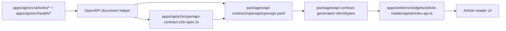

# refactor: Make the Web/API Read Boundary OpenAPI-First

## Likely Additional Packages

- Any new dependency must use the newest stable version available at the time
  of implementation whenever possible; only step down when compatibility,
  lockfile policy, or repo constraints require it.
- `@nestjs/swagger` - generate the OpenAPI document from the Nest article
  controllers/DTOs.
- `orval` - generate the web-side client/types from the checked-in OpenAPI
  contract.

## Overview

Turn the current `apps/api` public HTTP surface into a repo-owned OpenAPI
contract that is checked in, reviewable, and used to generate the web-side
client/types. The API still owns the runtime REST implementation and response
mapping, but the contract becomes the shared source that both sides must
follow. This keeps the change bounded to the current public endpoints instead
of opening a broader API redesign.

The current `apps/api` public interface set is four routes: `GET /health/live`,
`GET /health/ready`, `GET /articles`, and `GET /articles/:id`. Web only
consumes the article read seam, but the health probes also need to live in the
OpenAPI contract and drift check.

## Problem Frame

`apps/web` still consumes `apps/api` through a handwritten wrapper in
`apps/web/src/widgets/article-reader/api/articles-api.ts`. That file defines its
own return types and trusts `response.json() as T`, so the web layer can drift
from the API without an obvious review signal.

`apps/api` already has two public HTTP entry points: article read routes in
`apps/api/src/articles/*` and liveness/readiness probes in
`apps/api/src/health/health.controller.ts`. Those runtime shapes are not
published as a single repo-owned OpenAPI artifact yet, so there is still a gap
between "typed enough" and "contract-safe enough".

This plan makes the OpenAPI contract the reviewed repo artifact, generates the
web client from that artifact, and adds a drift check so the API implementation
cannot move without the contract moving with it.

## Requirements Trace

- R1. Provide one OpenAPI source of truth for every public HTTP surface in
  `apps/api`.
- R2. Cover every current public response shape, not just the article reader
  seam; health probes must be included too.
- R3. Keep the contract reviewable in PRs as a checked-in repo asset.
- R4. Move `apps/web` to generated types or a generated client instead of
  handwritten DTO-like types.
- R5. Remove unchecked `response.json() as T` casts from the article-reader
  seam.
- R6. Keep the current reader behavior intact: default selection, URL
  persistence, 404 handling, summary fallback copy, and detail rendering.
- R7. Keep `apps/api` as the owner of runtime validation, response mapping, and
  persistence.
- R8. Land response-shape changes and contract changes together.
- R9. Make breaking changes visible before merge.
- R10. Provide a repeatable contract refresh flow.
- R11. Add a repo-level drift check that catches implementation/contract
  divergence.
- R12. Ensure the migration covers all current public HTTP interfaces, not just
  a single hand-written path.

## Scope Boundaries

- No tRPC migration.
- No ingestion, summary-generation, Prisma-schema, or persistence-semantic
  changes.
- No expansion of the public reader payload, including `contentMarkdown`.
- No broader frontend data-layer rewrite.
- No broader API redesign beyond folding the existing public endpoints into the
  contract.
- No public Swagger UI route is required; the contract artifact itself is the
  reviewable output.

## Context & Research

### Relevant Code and Patterns

- `apps/web/src/widgets/article-reader/api/articles-api.ts` is the current
  manual seam with local DTO-like types and `response.json() as T`.
- `apps/web/src/widgets/article-reader/ui/article-reader-page.tsx`,
  `apps/web/src/widgets/article-reader/ui/article-list.tsx`, and
  `apps/web/src/widgets/article-reader/ui/article-detail.tsx` are the reader UI
  consumers that must keep the same visible behavior.
- `apps/api/src/articles/articles.controller.ts`,
  `apps/api/src/articles/articles.service.ts`, and
  `apps/api/src/articles/article.repository.ts` define the current response
  mapping boundary.
- `apps/api/src/articles/dto/article-list-item.dto.ts` and
  `apps/api/src/articles/dto/article-detail-item.dto.ts` are the current DTO
  shapes that the OpenAPI document should describe.
- `apps/api/src/health/health.controller.ts` and
  `apps/api/e2e/health.e2e-spec.ts` define the liveness/readiness public
  contract and need to be in the same OpenAPI view.
- `apps/api/e2e/articles.e2e-spec.ts` already asserts the article payload
  shape, and `apps/web/app/page.spec.tsx` plus `apps/web/e2e/home.spec.ts` lock
  the reader behavior.
- `apps/api/README.md` and `apps/web/README.md` still describe the current seam
  in prose, including stale field naming in places, so they need to be updated
  with the new contract path.
- `packages/ui/package.json` is the closest existing pattern for a shared
  workspace package that is built and imported across app boundaries.

## Key Technical Decisions

- Keep the canonical contract as YAML in `packages/api-contract/openapi/openapi.yaml`.
  YAML is the reviewable artifact, and the refresh flow can read and rewrite it
  directly without a second exported-spec layer.
- Add a shared `packages/api-contract` workspace package that exports the
  generated web client/types. This keeps the contract artifact and the consumer
  boundary in the normal Turborepo package graph instead of a one-off root
  script path.
- Keep API runtime ownership in `apps/api/src/articles` and
  `apps/api/src/health`, using explicit OpenAPI decorators and a shared
  document helper instead of a separate public docs server.
- Keep the web seam thin: it still owns `API_BASE_URL`, request caching policy,
  URL encoding, and 404-to-null translation, but it no longer owns the contract
  shapes themselves; health does not need a web adapter.
- Use a contract drift check that compares the emitted OpenAPI document against
  the checked-in YAML and fails on drift.
- Keep the reader route flow server-side; generated client code should replace
  the manual payload types, not introduce a new client-state model.

## Open Questions

### Resolved During Planning

- YAML vs JSON: YAML wins because this contract is meant to be human-reviewed
  and committed.
- Where the canonical artifact lives: `packages/api-contract/openapi/openapi.yaml`.
- How web reads the contract: `apps/web` imports the generated
  `@repo/api-contract` package, while the refresh flow reads the YAML directly.
  Web only imports the article read surface; health stays in the contract and
  drift check.
- Whether to expose a public Swagger route: no; the checked-in artifact is the
  contract.

## High-Level Technical Design

> This illustrates the intended approach and is directional guidance for review,
> not implementation specification. The implementing agent should treat it as
> context, not code to reproduce.

## Implementation Units

- [ ] **Unit 1: Publish the shared contract package**

**Goal:** Create the repo-owned OpenAPI package and the checked-in canonical
API contract that the web app can consume.

**Requirements:** R1, R2, R3, R4, R10

**Dependencies:** Current response shapes in `apps/api/src/articles/*` and
`apps/api/src/health/*`, plus the existing reader seam in `apps/web`.

**Files:**

- Create: `packages/api-contract/package.json`
- Create: `packages/api-contract/tsconfig.json`
- Create: `packages/api-contract/orval.config.ts`
- Create: `packages/api-contract/openapi/openapi.yaml`
- Create: `packages/api-contract/src/generated/api-client.ts`
- Create: `packages/api-contract/src/index.ts`
- Modify: `package.json`
- Modify: `apps/api/package.json`
- Modify: `apps/web/package.json`
- Modify: `apps/api/README.md`
- Modify: `apps/web/README.md`

**Approach:**

- Keep the checked-in YAML as the canonical contract artifact and generate the
  web-facing client/types from that file; the generated surface can include the
  health operations even though the web reader only imports the article
  helpers.
- Expose the generated surface from `packages/api-contract/src/index.ts` so the
  web app imports a normal workspace package instead of reading the spec file
  directly at runtime.
- Add explicit refresh entrypoints in the API and contract package, plus a
  repo-level alias, so developers have one obvious way to regenerate the
  contract and the generated client together.

**Execution note:** Start from the contract artifact and keep the package
boundary clean; do not recreate a parallel handwritten web contract.

**Patterns to follow:**

- `packages/ui/package.json`
- `packages/ui/src/index.ts`
- `apps/web/package.json`
- `apps/api/package.json`

**Test scenarios:**

- Happy path: shared package can build from the checked-in YAML and export a
  usable client surface for the article reader.
- Edge case: the contract file preserves the current article list/detail field
  set, including `summaryError` on detail and no `contentMarkdown`; health live
  and ready schemas still match the current implementation.
- Integration: `apps/web` can depend on `@repo/api-contract` without falling
  back to hand-written DTO-like types.

**Verification:**

- A single checked-in contract artifact exists, the generated client builds from
  it, and the repo-level refresh flow is discoverable.

- [ ] **Unit 2: Add API emission and drift validation**

**Goal:** Make `apps/api` emit the full public OpenAPI document from the real
Nest implementation and fail when the checked-in contract diverges.

**Requirements:** R7, R8, R9, R11, R12

**Dependencies:** Unit 1 and the current article/health controller and DTO
mapping.

**Files:**

- Create: `apps/api/src/openapi/openapi-document.ts`
- Create: `apps/api/src/openapi/openapi-refresh.ts`
- Modify: `apps/api/src/articles/articles.controller.ts`
- Modify: `apps/api/src/articles/dto/article-list-item.dto.ts`
- Modify: `apps/api/src/articles/dto/article-detail-item.dto.ts`
- Modify: `apps/api/src/health/health.controller.ts`
- Modify: `apps/api/src/articles/articles.controller.spec.ts`
- Modify: `apps/api/src/health/health.controller.spec.ts`
- Create: `apps/api/e2e/openapi-contract.e2e-spec.ts`
- Modify: `apps/api/e2e/articles.e2e-spec.ts`
- Modify: `apps/api/e2e/health.e2e-spec.ts`

**Approach:**

- Annotate the current article and health DTOs/controllers with explicit
  OpenAPI metadata so the generated document mirrors the full public surface
  instead of inferring it indirectly.
- Factor document creation into a reusable helper so the refresh path and the
  drift test use the same source of truth.
- Compare the emitted document against `packages/api-contract/openapi/openapi.yaml`
  and fail on drift or breaking changes before merge.

**Execution note:** Start with the drift test and the checked-in contract, then
make the controller metadata satisfy that contract.

**Patterns to follow:**

- `apps/api/src/articles/articles.controller.ts`
- `apps/api/src/articles/articles.controller.spec.ts`
- `apps/api/src/health/health.controller.ts`
- `apps/api/src/health/health.controller.spec.ts`
- `apps/api/e2e/articles.e2e-spec.ts`
- `apps/api/e2e/health.e2e-spec.ts`
- `apps/api/README.md`

**Test scenarios:**

- Happy path: the generated OpenAPI document includes `GET /health/live`,
  `GET /health/ready`, `GET /articles`, and `GET /articles/{id}` with the
  current response fields.
- Edge case: the readiness 503 response and the article detail schema still
  expose `summaryError` as nullable while keeping internal persistence fields
  out of the public contract.
- Error path: any implementation change that adds, removes, or renames public
  fields without updating the contract fails the drift check.
- Integration: the OpenAPI document and the existing HTTP e2e assertions
  describe the same health/article payloads, 404 behavior, and 503 readiness
  behavior.

**Verification:**

- The API test suite can regenerate the contract document and detect mismatches
  against the checked-in YAML before the change merges.

- [ ] **Unit 3: Swap the web seam to the generated contract**

**Goal:** Remove the handwritten article-client contract from `apps/web` and
keep the reader behavior intact through the generated package.

**Requirements:** R4, R5, R6, R12

**Dependencies:** Units 1 and 2.

**Files:**

- Modify: `apps/web/src/widgets/article-reader/api/articles-api.ts`
- Modify: `apps/web/src/widgets/article-reader/ui/article-reader-page.tsx`
- Modify: `apps/web/src/widgets/article-reader/ui/article-list.tsx`
- Modify: `apps/web/src/widgets/article-reader/ui/article-detail.tsx`
- Modify: `apps/web/package.json`
- Modify: `apps/web/next.config.ts`
- Modify: `apps/web/app/next-config.spec.ts`
- Modify: `apps/web/app/page.spec.tsx`
- Modify: `apps/web/e2e/home.spec.ts`

**Approach:**

- Keep a thin web adapter for `API_BASE_URL`, `cache: "no-store"`, URL
  encoding, and 404-to-null translation, but source its types and request
  surface from `@repo/api-contract`. The contract package may also contain
  health operations, but this seam only consumes the article read helpers.
- Remove the local DTO-like type declarations from the seam file so the web app
  stops owning the contract shape by hand.
- Update the web package wiring so direct app runs still build the shared
  contract package before the reader code imports it.

## System-Wide Impact

- **Interaction graph:** `apps/api/src/articles/*` + `apps/api/src/health/*`
  -> OpenAPI document helper -> `packages/api-contract/openapi/openapi.yaml`
  -> generated client/types -> `apps/web/src/widgets/article-reader/api/articles-api.ts`
  -> reader UI.
- **Error propagation:** 404 remains a 404 in the contract and API layer, but
  the web adapter still translates it to `null` so the unavailable state stays
  unchanged.
- **State lifecycle risks:** the checked-in contract or generated client can
  drift from the Nest implementation; the drift test must catch that before the
  mismatch reaches the browser.
- **API surface parity:** `/health/live`, `/health/ready`, `/articles`, and
  `/articles/:id` all live in the same public contract, and `summaryError`
  remains the public failure detail instead of any internal persistence field.
- **Integration coverage:** the OpenAPI drift test, HTTP health/article e2e
  suite, and browser reader spec together prove the same contract from
  different layers.
- **Unchanged invariants:** ingestion, summary generation, Prisma schema,
  article IDs, URL-driven selection, and current summary fallback copy all stay
  as they are.

## Risks & Dependencies

| Risk                                                               | Mitigation                                                                                                                           |
| ------------------------------------------------------------------ | ------------------------------------------------------------------------------------------------------------------------------------ |
| Generated client shape feels heavier than the current thin wrapper | Keep `apps/web/src/widgets/article-reader/api/articles-api.ts` as a small adapter that only owns env, encoding, and 404 translation. |
| Contract artifact drifts from the Nest implementation              | Add a dedicated API drift test that compares the emitted document to `packages/api-contract/openapi/openapi.yaml`.                   |
| New shared package creates workspace friction                      | Keep `packages/api-contract` private, exported, and aligned with the existing `packages/ui` pattern.                                 |
| App README prose lags behind the contract                          | Update both app READMEs in the same pass and replace stale field names at the same time.                                             |

## Documentation / Operational Notes

- Update `apps/api/README.md` and `apps/web/README.md` to point at the new
  contract package and refresh flow.
- Keep the YAML contract as the reviewable repo artifact; do not require a
  separate public docs server for this feature.
- When the contract changes later, refresh the checked-in YAML and regenerate
  the client from that file instead of editing web copies by hand.

## Sources & References

- **Origin documents:** `docs/en/brainstorms/2026-04-24-web-api-openapi-contract-first-requirements.md` +
  `docs/zh-Hans/brainstorms/2026-04-24-web-api-openapi-contract-first-requirements.md`
- Related code: `apps/api/src/articles/articles.controller.ts`,
  `apps/api/src/articles/articles.service.ts`,
  `apps/api/src/articles/article.repository.ts`,
  `apps/api/src/health/health.controller.ts`,
  `apps/web/src/widgets/article-reader/api/articles-api.ts`,
  `apps/web/src/widgets/article-reader/ui/article-reader-page.tsx`,
  `apps/api/e2e/articles.e2e-spec.ts`,
  `apps/api/e2e/health.e2e-spec.ts`,
  `apps/web/app/page.spec.tsx`,
  `apps/web/e2e/home.spec.ts`
- Related docs: `apps/api/README.md`, `apps/web/README.md`,
  `packages/ui/package.json`
- External docs: NestJS OpenAPI introduction and Orval
