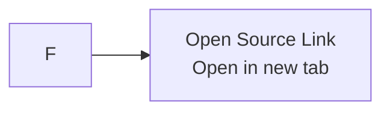

# Keep bilingual diagram docs and plans semantically synchronized

## Context
We created bilingual v0.1 product diagram docs and matching plan docs for `rss-start`, then iterated on them based on review and product clarification. During that process, several kinds of drift appeared at once: the durable docs moved from `docs/{lang}/v0.1-diagrams/` to `docs/{lang}/diagrams/`, the product semantics changed from fixed Chinese output to user-configured target language, and the “open original article” action was clarified as opening the source link in a new tab rather than entering another in-product reading flow.

The diagrams were corrected first, but the paired plan docs and some overview text still referenced the old paths and the old product model. That made the bilingual documentation set internally inconsistent even though each individual file looked reasonable on its own.

## Guidance
Treat bilingual durable docs as a locked set, not as independent files.

When a clarification lands in one language or one artifact type, update all paired artifacts in the same change:

1. Update the Chinese and English versions together.
2. Update both the user-facing doc and the planning artifact together.
3. If a file moves, update every durable reference path in the same pass.
4. If product semantics change, update overview text, diagram captions, node labels, and plan requirements together.

For this repo, the stable structure is:

```text
docs/zh-Hans/diagrams/v0.1-diagrams.md
docs/en/diagrams/v0.1-diagrams.md
docs/zh-Hans/plans/2026-04-09-001-feat-v0-1-bilingual-diagrams-plan.md
docs/en/plans/2026-04-09-001-feat-v0-1-bilingual-diagrams-plan.md
```

The semantic rules that had to stay aligned were:

- title and summary language is user-configured, not fixed to Chinese
- the reader is a dual-pane desktop reader
- opening the source is an external action: open the source link in a new tab

A practical review checklist for this kind of doc change:

- Search for stale paths after any move:
  - `docs/zh-Hans/v0.1-diagrams/v0.1-diagrams.md`
  - `docs/en/v0.1-diagrams/v0.1-diagrams.md`
- Search for stale product wording after any clarification:
  - `中文标题` / `Chinese titles`
  - `跳转原文` / `Jump to source`
  - `read the original article`
- Compare Diagram 1, Diagram 2, and the matching plan requirements to confirm they describe the same product behavior.

## Why This Matters
Bilingual documentation only compounds value if it remains trustworthy as a set. Once one file says “configured-language titles” while another still says “Chinese titles,” future agents and collaborators can reintroduce the old assumption during planning, implementation, or review.

Path drift is similarly expensive: a plan that points to a dead file path makes future readers think the document was never created, even when the real document exists. This is especially damaging in a repo that now uses `AGENTS.md` to encode bilingual durable-doc policy.

## When to Apply
- When a Chinese and English document are intended to be a synchronized pair
- When a plan doc references a durable product or design doc
- When review feedback changes product wording rather than implementation code
- When reorganizing docs into a new subdirectory such as `docs/{lang}/diagrams/`

## Examples
Before the cleanup, the document set had both path drift and semantic drift:

```md
- docs/zh-Hans/v0.1-diagrams/v0.1-diagrams.md
- users scan Chinese titles in the list
- Jump to source
```

After the cleanup, both paths and semantics were aligned:

```md
- docs/zh-Hans/diagrams/v0.1-diagrams.md
- users scan titles in the configured language
- open the source link in a new tab
```

A concrete Mermaid label correction from this change:



Related plan/docs updated together in the same pass:

- `docs/zh-Hans/diagrams/v0.1-diagrams.md`
- `docs/en/diagrams/v0.1-diagrams.md`
- `docs/zh-Hans/plans/2026-04-09-001-feat-v0-1-bilingual-diagrams-plan.md`
- `docs/en/plans/2026-04-09-001-feat-v0-1-bilingual-diagrams-plan.md`

## Related
- `AGENTS.md`
- `docs/zh-Hans/diagrams/v0.1-diagrams.md`
- `docs/en/diagrams/v0.1-diagrams.md`
- `docs/zh-Hans/plans/2026-04-09-001-feat-v0-1-bilingual-diagrams-plan.md`
- `docs/en/plans/2026-04-09-001-feat-v0-1-bilingual-diagrams-plan.md`
