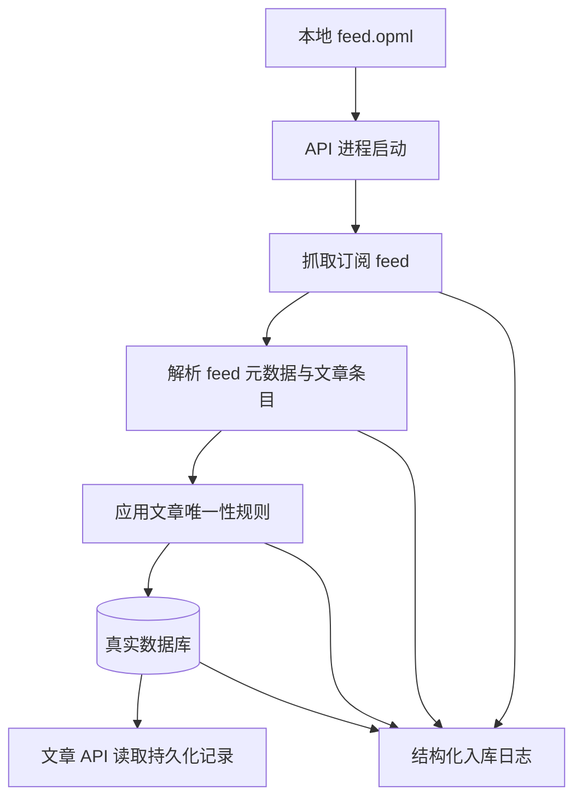

# v0.1 第二切片 Feed 入库需求

## Problem Frame

当前后端仍然只对外提供基于 fixture 的文章数据，因此产品还缺少 RSS 工作流里的第一条可持续主干：读取固定 OPML 文件、抓取真实 feed、并把真实文章持久化入库。v0.1 第二切片的目标，是先证明这条入库主干成立，而不是同时扩张到正文抽取、摘要生成或 feed 管理体验。

已核实的当前状态：

- `apps/api/src/articles/articles.service.ts` 仍然通过 `ArticleFixtureRepository` 读取文章数据。
- `apps/api/src/articles/article-fixture.repository.ts` 仍然从磁盘读取 `prepared-articles.json`。
- `apps/api/package.json` 当前还没有数据库相关依赖。
- 本切片的 ORM 方向已收敛为 Prisma。

## Requirements

**入库输入**

- R1. 系统必须从固定的本地文件 `feed.opml` 读取 feed 订阅列表。
- R2. 系统必须在应用启动时自动触发一次 feed 入库。
- R3. 启动期入库流程必须按 feed 独立尝试抓取，单个 feed 失败不能阻止其他 feed 被尝试处理。

**持久化主干**

- R4. 系统必须把真实的 feed 与文章记录持久化到真实数据库，而不是继续从静态 fixture 提供文章数据。
- R5. 在切换掉 fixture 之后，文章列表/详情 API 必须只读取数据库中的持久化记录；即使某次启动入库只是部分成功，也只能返回“之前已持久化的数据”“本次已持久化的部分数据”或空结果，不能回退到 fixture。
- R6. 系统必须定义稳定的“每 feed 文章唯一性规则”，使重复启动入库时不会产生失控的重复文章；应用层必须从可用的最佳源标识推导出确定性的 `identityHash`，并由持久化层对“同一 feed 下的该派生标识”施加唯一约束。
- R7. 对本切片而言，现有文章详情里的 `summary` 字段可以由 feed 自带的 description / excerpt 类文本来满足；若 feed 没有可用的摘要样文本，则允许返回空字符串；本切片不要求生成式摘要。
- R8. 第一版 Prisma `Feed` 模型必须保持最小，只覆盖入库与读取链路真正需要的字段，例如 feed URL、站点标题、站点链接、条件抓取缓存字段与时间戳。
- R9. 本切片的 API 设计范围仅限于把现有只读 `/articles` 契约映射到持久化数据；本切片不新增 `/feeds` 只读接口，也不新增入库控制接口。
- R10. 第一版 Prisma `Article` 模型必须同时承载 feed 提供的发布时间 `publishedAt` 与系统首次入库时间 `ingestedAt`。
- R11. Prisma schema 的组织方式必须从一开始就是模块化的，而不是长期维持单个巨大 schema 文件。
- R12. Prisma schema 的模块化拆分必须与后端的 feature module 架构对齐：按 feed/article 等领域拆分 schema 文件，同时保持单个 Prisma schema 目录与单一 migration 历史。

**可运维性**

- R12. 系统必须输出可诊断的日志，至少能定位到每个 feed 在启动入库中的结果。
- R13. 系统必须记录足够的失败信息，以区分每个 feed 的成功/失败，并输出一条启动级汇总，说明某次启动入库是“全部成功”“部分成功”还是“整体失败”；本条通过“结构化日志 + 启动汇总”即可满足，不强制本切片引入持久化的运行状态模型。
- R14. 系统禁止采用“所有 feed 都成功抓取后应用才算可启动”的策略。

## Success Criteria

- 在存在有效本地 `feed.opml` 的情况下，应用启动时会自动尝试真实 RSS 入库。
- 一次成功的入库运行后，真实数据库中存在持久化的 feed / article 记录。
- 即使最近一次启动入库只是部分成功，文章 API 的读取路径也不再依赖 `ArticleFixtureRepository` 或 `prepared-articles.json`。
- 日志能够清楚说明哪些 feed 成功、哪些失败，以及整体运行是否为部分成功。

## Scope Boundaries

- 不做正文抽取。
- 不做摘要生成、翻译或分层阅读 UI。
- 不做 feed CRUD。
- 不做 OPML 导入导出 UI 或 API。
- 不做启动期之外的调度、cron 或后台刷新。
- 不允许把“全部 feed 成功”作为应用可用启动的前提。
- 不要求生产级数据库拓扑；本切片只需要一个适合单个自托管操作者的单实例 PostgreSQL 数据库。
- 不新增“生成式摘要”的公开契约；本切片里的 `summary` 只是兼容现有详情字段的承载位。
- 不采用“开发用 SQLite、部署用 PostgreSQL”的分裂数据库策略；本切片所有环境统一使用 PostgreSQL。
- 本切片不新增 feed 管理或入库控制相关 API。
- 第一版 Prisma schema 不引入超出入库与条件抓取所需范围的 feed 运行状态模型。
- 不采用长期单体 `schema.prisma` 工作流去无视仓库的 feature module 架构。
- 在 Prisma 已有官方多文件 schema 支持的前提下，不引入自制 schema 拼接 hack。

## Key Decisions

- 固定 OPML 来源：本切片使用 `feed.opml`，而不是引入可配置的 feed 管理流程。
- 启动优先：先证明进程启动时的入库链路，再考虑手动刷新或定时调度。
- 真实数据切换：去掉基于 fixture 的文章读取，属于本切片完成条件，而不是后续优化。
- 可观测性是必需项：日志是切片定义的一部分，因为没有日志就无法信任入库质量。
- 本文覆盖旧的 v0.1 规划里把固定订阅文件写成 `config.opml` 的约定；本切片的目标文件名是 `feed.opml`。
- 摘要兼容优先：为了保留当前详情字段形状，本切片优先复用 feed 自带的 description / excerpt，而不是把生成式摘要工作带入本切片。
- Prisma 是本切片 schema、migration 与数据访问层的既定 ORM。
- 开发和部署统一使用 PostgreSQL，避免 Prisma 在不同 provider 上产生迁移历史漂移。
- 文章唯一性采用更接近 Miniflux 的方向：先在应用层选择最佳源标识，再归一为确定性的 hash，由数据库承接唯一约束。
- v0.1 第二切片里的 Feed 建模刻意保持很薄，运行状态和未来管理配置全部后置。
- v0.1 第二切片里的 API 设计也刻意保持很薄，只处理现有 `/articles` 读接口切库，不扩张新的读写面。
- 文章时间语义明确拆开：`publishedAt` 保留来源发布时间，`ingestedAt` 保留系统首次入库时间。
- Prisma schema 从一开始就要模块化组织，避免后续把 feed/article 等领域都挤进一个长期失控的大文件。
- Prisma 模块化应与 NestJS 后端的领域边界保持一致：feed 相关模型放一个 schema 区域，article 相关模型放另一个 schema 区域，但 migration 入口仍然只有一个官方 Prisma schema 目录。

## 高层技术方向

由于这次切片本身就是围绕持久化与契约切库展开，这份 brainstorm 需要技术化到足以先定义第一版 schema 与 API 形状。

### Prisma Schema 草案

**Feed**

- `id`：内部主键
- `feedUrl`：RSS/Atom/JSON Feed 源地址
- `siteTitle`：feed/站点标题，用于显示与来源标识
- `siteUrl`：可用时保存站点规范 URL
- `etag`：条件抓取缓存令牌
- `lastModified`：条件抓取缓存令牌
- `createdAt`：记录创建时间
- `updatedAt`：记录更新时间

**Article**

- `id`：内部主键
- `feedId`：关联到 `Feed`
- `identityHash`：由应用层推导出的、同一 feed 内稳定的派生标识
- `sourceId`：原始来源里可获得的最佳标识，若存在则保存
- `title`：文章标题
- `originalUrl`：文章规范 URL
- `publishedAt`：来源发布时间
- `ingestedAt`：首次入库时间
- `summary`：承接 feed 自带 description / excerpt 的兼容字段
- `createdAt`：记录创建时间
- `updatedAt`：记录更新时间

### Prisma 约束方向

- `Feed.feedUrl` 应唯一。
- `Article` 应对 `(feedId, identityHash)` 建复合唯一约束。
- `Article.feedId` 应建立索引。
- `Article.publishedAt` 应建立索引，以支持读取排序。

### Prisma 模块化布局方向

- 使用一个官方 Prisma schema 目录，作为唯一 migration 真相源。
- schema 文件按领域拆分，并与后端 feature boundary 对齐。
- 第一版至少把 feed 相关模型与 article 相关模型拆到不同 schema 区域。

### API 契约草案

公共 API 面继续保持最小化，并沿用当前只读契约：

- `GET /articles`
- `GET /articles/:id`

`GET /articles` 的返回结构保持为：

- `id`
- `title`
- `sourceTitle`
- `publishedAt`
- `originalUrl`

`GET /articles/:id` 的返回结构保持为：

- `title`
- `sourceTitle`
- `publishedAt`
- `summary`
- `originalUrl`

### 持久化到 API 的映射

| API 字段      | 对应数据              |
| ------------- | --------------------- |
| `id`          | `Article.id`          |
| `title`       | `Article.title`       |
| `sourceTitle` | `Feed.siteTitle`      |
| `publishedAt` | `Article.publishedAt` |
| `originalUrl` | `Article.originalUrl` |
| `summary`     | `Article.summary`     |

### Identity 派生方向

- 优先使用解析后条目中最可靠的源稳定标识。
- 若源标识缺失或不可靠，则回退到规范化后的 URL。
- 若更强标识仍然不可用，再回退到确定性的内容派生签名。
- 最终持久化的是 `identityHash`；原始 RSS GUID 不是数据库唯一性主契约。

## Dependencies / Assumptions

- `feed.opml` 中的 feed URL 由操作者控制，本切片默认把它视为可信输入源列表。
- planning 应优先选择最轻量、适合单实例的 PostgreSQL 路径，而不是引入超出 Prisma 所需范围的额外基础设施。
- 来自 `nkanaev/yarr` 与 `miniflux/v2` 的调研结果，应当用于指导文章唯一性规则的回退细节，以及启动失败日志的具体形态。
- FreshRSS 与 Miniflux 的实现都说明：把原始 RSS GUID 直接当成唯一持久化主契约过于脆弱；因此本切片把源标识视为 identity 派生输入，而不是最终数据库唯一键。
- Prisma 的模块化组织必须同时保持“单一迁移事实来源”，不能为了拆文件而破坏迁移一致性。
- AGENTS.md 明确要求 `apps/api` 按 feature module 组织后端架构，而 Prisma 官方文档又支持“单目录、多 schema 文件、单 migration 历史”的模式；这两条约束共同指向“按领域真拆文件”，而不是单文件注释分区。
- Prisma 官方实践不支持把“开发 SQLite 迁移”稳定、无代码修改地直接沿用到“部署 PostgreSQL”，因此 provider 一致性在本切片中是硬约束。

## Outstanding Questions

### Deferred to Planning

- [Affects R6][Technical] 在计算 `identityHash` 之前，identity 派生的精确回退顺序应是什么（例如源 GUID/ID、规范化 URL、或内容回退）？
- [Affects R7][Technical] 在最小要求已经是“结构化日志 + 启动汇总”的前提下，是否还需要额外持久化 feed 入库错误记录？
- [Affects R4][Technical] 在现有 NestJS 应用与 monorepo 约束下，哪种 PostgreSQL 友好的 Prisma schema 形状最合适，且不会额外引入不必要范围？
- [Affects R12][Technical] 在保持单一 migration 事实来源的前提下，哪种 Prisma 多文件目录布局最适合映射当前后端 feature modules？

## Next Steps

-> /ce:plan 进入结构化实现规划
