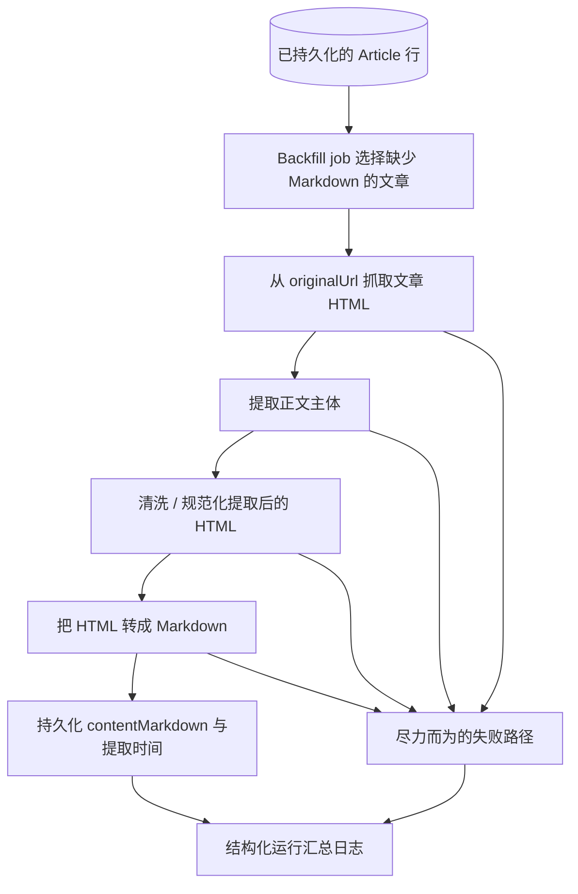
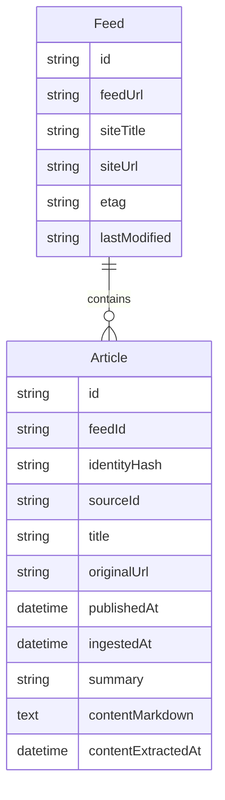

# v0.1 第三切片文章 Markdown 存储需求

## Problem Frame

当前后端已经证明了 feed 入库主干，但仍然只停留在 feed 提供的元数据和兼容性 `summary` 上。这还不是后续标题翻译、分层摘要或更丰富阅读体验的合适输入层。因此，下一个 v0.1 切片应该先证明一个更窄的能力：针对已经持久化的文章，抓取原始文章页，提取正文主体，转换为 Markdown，并把该 Markdown 持久化到 PostgreSQL。

这一切片被刻意定义为一个独立的 enrichment/backfill 能力，而不是去修改启动期 feed 入库主干。目标是在不把当前启动入库路径变成更脆弱的多阶段流水线的前提下，把“文章正文可持久化”这件事做成真实且可测试的能力。

已核实的当前状态：

- `apps/api/src/feeds/feed-bootstrap.service.ts` 会在应用 bootstrap 时触发 feed 入库。
- `apps/api/src/feeds/feed-ingestion.service.ts` 目前只抓 feed XML、规范化条目并持久化 `Article` 行，还不会抓文章页面。
- `apps/api/prisma/models/article.prisma` 当前只存 feed 层元数据，还没有正文存储字段。
- `apps/api/src/articles/articles.service.ts` 与 `apps/api/src/articles/article.repository.ts` 当前公开的详情读取路径只暴露 `title`、`sourceTitle`、`publishedAt`、`summary` 和 `originalUrl`。

## Requirements

**正文抽取主干**

- R1. 系统必须提供一个独立的文章正文 backfill 能力，并且该能力与启动期 feed 入库分开运行。
- R2. backfill 能力必须从已持久化的 `Article` 记录中读取候选文章，并以 `Article.originalUrl` 作为抓取目标。
- R3. backfill 能力必须抓取文章 HTML、提取可读正文主体、把正文转换为 Markdown，并将 Markdown 回写到同一条 `Article` 记录上。
- R4. 第一版实现必须是尽力而为的：单篇文章提取失败不能阻止其他候选文章被继续尝试处理。
- R5. 第一版实现必须保留现有 feed 入库主干的语义；在本切片中，启动期 feed 入库仍只负责 feed 元数据 / 文章发现。

**持久化形状**

- R6. `Article` 模型必须新增可空的 `contentMarkdown` 字段，用于存储提取后的正文 Markdown。
- R7. `Article` 模型必须新增可空的 `contentExtractedAt` 字段，用于记录最近一次成功持久化 Markdown 的时间。
- R8. 当前 `summary` 字段必须保留现有语义，继续表示 feed 提供的 summary / description 兼容文本，而不是被改作正文存储字段。
- R9. schema 变更必须继续收敛在 `apps/api` 内部，并沿用现有 Prisma/PostgreSQL 的所有权模型与 migration 历史。

**执行入口**

- R10. 第一版执行入口应该是操作者触发的 backfill，而不是新的公开 HTTP API。
- R11. backfill 必须支持一个窄化的本地验证路径，例如只处理单篇文章或一个受限 batch，以便操作者可以明确确认 Markdown 已经成功落库。
- R12. backfill 必须输出结构化运行汇总，至少报告尝试的文章数、成功写入 Markdown 的文章数，以及提取失败的文章数。

**测试与可靠性**

- R13. 本切片必须包含自动化测试，证明从受控输入 HTML 到持久化 `contentMarkdown` 的完整路径。
- R14. 主自动化测试路径必须依赖本地 HTML fixtures，而不是依赖真实外部文章 URL。
- R15. 提取流水线必须 fail-open：提取失败可以让 `contentMarkdown` 保持为空，但不能破坏现有文章行，也不能影响文章读取能力。
- R16. 第一版允许把失败可观测性主要放在结构化日志和测试断言里；本切片不要求引入持久化的 extraction-jobs 表。

## Success Criteria

- 开发者可以在本地数据库上运行文章正文 backfill，并观察到至少一条 `Article` 记录获得非空的 `contentMarkdown`。
- 已持久化的 Markdown 来自文章正文 HTML 提取，而不是简单复制 feed `summary`。
- 使用本地 fixtures 的自动化测试验证提取后的 Markdown 已经写入数据库。
- 现有 `/articles` 读取 API 继续可用，且不需要新增公开 endpoint。
- 日志或结构化命令输出能够清楚区分成功写入与提取失败。

## Scope Boundaries

- 本切片不修改启动期 feed 入库触发路径。
- 本切片不引入 scheduler、cron 或持续后台正文抽取。
- 本切片不扩展公开 API 契约来暴露 Markdown。
- 本切片不引入 LLM 摘要、标题翻译或分层摘要。
- 第一版不做浏览器自动化、付费墙处理、登录流程或反爬绕过。
- 第一版不做持久化抽取队列或 job-history 模型。
- 本切片不要求对每个文章来源都保证成功提取。

## Key Decisions

- 将文章发现与内容 enrichment 分开：feed 入库继续负责发现文章，文章正文抽取作为独立 backfill 能力运行。
- Markdown 是这个产品方向里的正文规范持久化格式，即使 Miniflux 和 FreshRSS 这类参考系统通常持久化的是 HTML / content 而不是 Markdown。
- 推荐的第一版技术栈是：使用 `@mozilla/readability` 做正文提取，使用 `turndown` 与 `turndown-plugin-gfm` 完成 HTML 到 Markdown 转换。
- 第一版测试策略使用本地 HTML fixtures，因为在本切片里，可重复验证的提取正确性比贴近外网环境更重要。
- 公开文章 API 目前继续保持很薄；这一切片先证明存储成立，再考虑契约扩张。

## 外部最佳实践信号

- Miniflux 与 FreshRSS 都支持某种“全文 enrichment”能力，并且都把增强后的文章内容持久化，而不是把 feed 摘要视为最终事实来源。
- Miniflux 的架构说明，原文抓取更像一个独立 enrichment 动作，而不是 feed refresh 成功的硬前置条件。
- FreshRSS 说明，全文抓取随着时间推移往往需要针对来源逐步增加调优规则；这也是第一版应该与启动入库主干解耦的原因之一。
- `@mozilla/readability` 在 JavaScript 生态里仍然是一个可靠的可读正文提取基线，但它本身不是安全清洗器。
- `turndown` 依然是 Node 场景下务实且成熟的 HTML 到 Markdown 转换器，尤其适合与 `turndown-plugin-gfm` 搭配使用。
- `defuddle` 值得作为后续备选持续关注；如果未来 Markdown 保真度成为主要问题，可以再评估，但第一版存储切片不需要靠它来降风险。

## 高层技术方向

这份 brainstorm 会技术化到足以定义第一版 schema 形状、执行入口与 API 立场。

### Prisma Schema 草案

**Article**

- `id`：现有内部主键
- `feedId`：现有到 `Feed` 的关联
- `identityHash`：现有的同 feed 内文章 identity
- `sourceId`：现有的来源原生标识（若存在）
- `title`：现有文章标题
- `originalUrl`：现有文章 URL
- `publishedAt`：现有来源发布时间
- `ingestedAt`：现有首次入库时间
- `summary`：现有 feed 摘要兼容字段
- `contentMarkdown`：可空的提取后正文 Markdown
- `contentExtractedAt`：可空的最近一次成功持久化 Markdown 的时间戳
- `createdAt`：记录创建时间
- `updatedAt`：记录更新时间

### Prisma 约束方向

- 保持现有 `Feed.feedUrl` 唯一约束与 `Article(feedId, identityHash)` 唯一约束不变。
- 不为 `contentMarkdown` 增加新的唯一约束；它只是挂在现有 `Article` 上的 enrichment 数据。
- `contentMarkdown` 保持可空，以便提取失败时无需写入占位内容。
- `contentExtractedAt` 保持可空，以便在不新增独立状态模型的前提下，同时表达“尚未尝试”和“尚未成功提取”。

### 内部执行入口草案

第一版执行入口应该是包内、本地由操作者驱动的，而不是公开可路由的。

优先形态：

- 由 `apps/api` 拥有的 package-local 命令或脚本
- 默认行为：处理 `contentMarkdown` 为空的文章
- 窄化验证选项：处理一个明确的 article ID
- 可选 batch limit，用于本地验证与安全迭代

示意命令形状：

- `pnpm --filter api article-content:backfill`
- `pnpm --filter api article-content:backfill --article-id <id>`
- `pnpm --filter api article-content:backfill --limit 10`

精确的命令 wiring 留到 planning 决定，但契约方向已经明确：第一版入口是内部操作者工具，而不是公开路由。

### 公开 API 契约立场

本切片中，公开 API 面应保持不变：

- `GET /articles`
- `GET /articles/:id`

`GET /articles/:id` 继续返回：

- `title`
- `sourceTitle`
- `publishedAt`
- `summary`
- `originalUrl`

本切片刻意 **不** 要求立刻暴露 `contentMarkdown`。先证明存储成立，公开消费留待后续规划。

### Backfill 运行汇总形状

内部执行入口应输出一个简单但足够确认成功的结构化汇总：

- `attemptedCount`
- `succeededCount`
- `failedCount`
- `skippedCount`
- 可选的失败 article ID / URL 列表，便于诊断

### 抽取流水线方向

- 从 `Article.originalUrl` 抓取 HTML。
- 在适合 Readability 的受控环境中解析 DOM。
- 使用 `@mozilla/readability` 提取正文主体。
- 在 Markdown 转换前对提取后的 HTML 做清洗或规范化。
- 通过 `turndown` 加上 GFM 支持把清洗后的 HTML 转成 Markdown。
- 只有在提取成功时才持久化 `contentMarkdown` 与 `contentExtractedAt`。

### 持久化到 API 的映射

| 关注点                   | 对应数据                                                 |
| ------------------------ | -------------------------------------------------------- |
| 现有文章标题读取         | `Article.title`                                          |
| 现有详情摘要读取         | `Article.summary`                                        |
| 未来文章正文输入层       | `Article.contentMarkdown`                                |
| 正文成功持久化的确认信号 | `Article.contentMarkdown` + `Article.contentExtractedAt` |

### 测试方向

- 以本地 HTML fixtures 作为主要正确性输入。
- 测试“从 HTML fixture 到数据库持久化”的完整提取路径。
- 至少包含一个失败路径测试，证明对无效 / 不可提取输入不会破坏已有文章元数据。
- 测试继续收敛在 `apps/api` 内，并与当前 NestJS/Prisma 测试方式保持一致。

## Dependencies / Assumptions

- 上一个 feed 入库切片已经提供了可用的持久化文章记录。
- 本切片以 `Article.originalUrl` 作为抓取锚点，第一版不引入新的文章来源解析逻辑。
- 通过 Prisma `String` 映射到 PostgreSQL `text`，足以承载这一阶段预期的 Markdown 正文体量。
- 后续 LLM 流水线会消费已持久化的 Markdown，而不是按需重新抓取文章页面。
- 来源相关的抽取边界问题一定会存在，但对第一版证明切片而言，通用正文提取已经足够。

## Outstanding Questions

### Deferred to Planning

- [Affects R10][Technical] 操作者触发 backfill 的精确 package-local 命令 wiring 应该是什么？
- [Affects R11][Technical] 第一版面向验证的执行入口，应优先支持 `--article-id`、`--limit`，还是两者都支持？
- [Affects R15][Technical] 在不把本切片扩张成更大的内容清洗工程的前提下，`turndown` 之前最小需要做到什么程度的 sanitization / normalization？
- [Affects R13][Technical] 哪一组 fixture 最能代表第一批预期文章来源形态，同时又不会让测试语料过拟合？

## Next Steps

-> 当前先保持为 brainstorm 双语文档；只有在用户明确要求 planning 时，才进入 plan 阶段。
