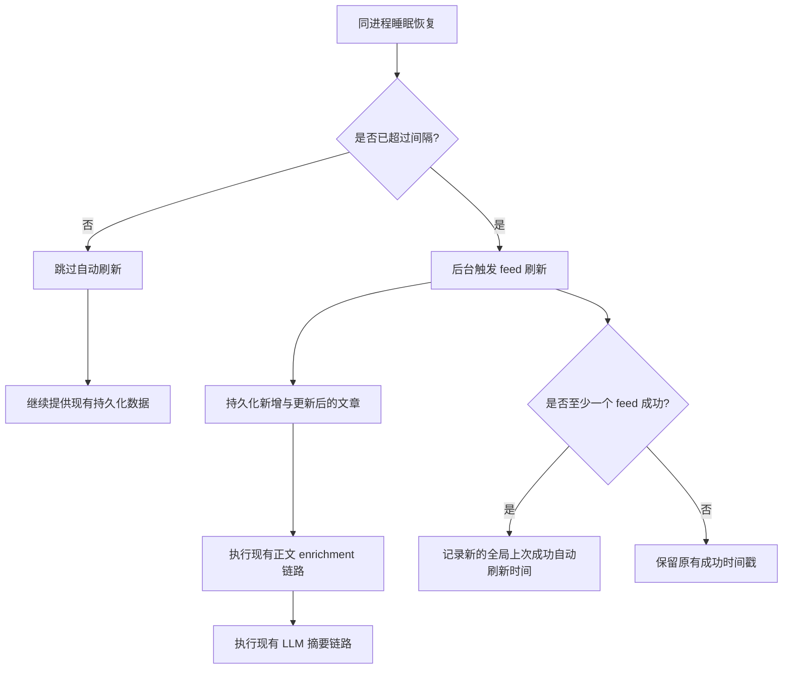

# Feed 唤醒自动刷新需求

## Problem Frame

当前产品已经能在 API 启动时执行 feed 入库，但它仍然更像一次性 bootstrap 流程，而不是持续存在的 feed 刷新能力。这带来一个实际产品缺口：当服务器休眠、空闲或睡眠一段时间后，系统重新上线时可能仍然只带着陈旧 feed 数据；这也包括“机器从睡眠恢复，但原进程仍然继续存活”的场景。

本切片的目标是补上一个 serverless-friendly 的自动刷新规则：当机器 / 运行环境从睡眠、挂起、冻结状态恢复且原进程仍然继续存活时，系统应判断距离上次成功的自动刷新是否已经超过配置间隔。如果已超过，系统应在不阻塞 HTTP 可用性的前提下，后台触发一次新的 feed 刷新。该刷新新发现的文章必须继续走现有 enrichment 链路，包括当前已有的 LLM 摘要生成链路。

已验证的当前状态：

- `apps/api/src/feeds/feed-bootstrap.service.ts` 当前会在 `INGEST_ON_BOOT=true` 时于应用 bootstrap 期间触发 feed 入库。
- `apps/api/src/config/env.validation.ts` 与 `apps/api/src/config/app-config.ts` 当前已经校验启动期入库配置，但还没有提供以“小时”为单位的 feed 刷新间隔配置。
- `apps/api/src/feeds/feed-ingestion.service.ts` 已经会持久化新文章，并在其后触发下游 article content enrichment 与受影响文章的摘要刷新工作。
- `apps/api/prisma/models/feed.prisma` 当前只存有 `etag`、`lastModified`、`createdAt`、`updatedAt` 等 feed 元数据，还没有经过验证的专用字段来表示“全局上次成功自动刷新时间”。
- `INGEST_ON_BOOT` 在本切片中保持现有 bootstrap 语义不变：当它为 `true` 时，启动期入库仍然会在进程启动时无条件执行。本切片只新增“睡眠 / 挂起恢复后的按间隔自动更新”，不改变这个既有契约。

## Requirements

**自动刷新触发**

- R1. 系统必须只在机器或运行环境从睡眠 / 挂起 / 冻结恢复且原进程仍然继续存活时判断是否需要自动刷新；不得把自动刷新检查挂到用户读请求上。
- R2. 第一版自动刷新闸门必须是时间型规则：如果距离上次成功自动刷新已经超过配置间隔，系统必须触发一次新的后台 feed 刷新尝试。
- R3. 如果尚未超过配置间隔，系统必须跳过自动刷新，并继续提供现有持久化数据。
- R4. 自动刷新在本地启动前置条件通过后，必须继续保持不阻塞 HTTP 可用性，与当前 bootstrap 入库姿态一致。
- R5. 本切片不得改变 `INGEST_ON_BOOT` 的既有含义：当 `INGEST_ON_BOOT=true` 时，启动期入库仍然在进程启动时无条件执行，不受新的自动更新间隔影响。
- R6. 如果一轮自动更新已经在进行中，此时又收到新的同进程恢复触发，新的触发必须直接跳过，而不是排队等待第二轮。

**配置与默认值**

- R7. 刷新间隔必须由一个环境变量控制，单位为小时。
- R8. 如果该环境变量未配置，系统必须回退到代码中定义的默认值 `6` 小时，而不是让启动失败。
- R9. 这个刷新间隔配置表达的是“成功自动刷新之间的时间间隔”；它不是 cron 表达式，本切片也不要求常驻调度器。

**成功追踪与 Serverless 行为**

- R10. 本切片必须追踪一个全局“上次成功自动刷新时间”，而不是引入按 feed 粒度的刷新资格判断。
- R11. 在 serverless-friendly 部署里，“机器或运行环境睡眠 / 挂起 / 冻结后、原进程继续存活的恢复”必须沿用同一套“是否已超过间隔”的规则，因此休眠中的服务器在恢复后若已超时，也能自动补拉。
- R12. 如果当前还没有任何已记录的“上次成功自动刷新时间”，同进程恢复时也必须立刻触发一次自动更新。
- R13. 对间隔追踪而言，只要一次自动刷新里至少有一个 feed 成功，该次运行就算成功。
- R14. 全局“上次成功自动刷新时间”只能在整轮自动更新结束后再更新，并且只有当该轮里至少有一个 feed 成功时才允许推进。
- R15. 如果这次自动刷新没有任何 feed 成功，系统不得推进全局“上次成功自动刷新时间”。

**入库与下游链路连续性**

- R16. 自动刷新发现的文章必须继续走与现有启动期入库相同的下游处理链路，而不是被当成一条单独的产品路径。
- R17. 来自自动刷新路径的新文章或新完成 enrichment 的文章，必须继续具备进入现有 LLM 摘要生成链路的资格。
- R18. 本切片不得重定义当前摘要产品行为；它只扩展“新鲜文章如何进入既有入库与 enrichment 流水线”。

**运行边界**

- R19. 本切片不得增加面向用户的 feed 刷新控制、feed CRUD，或公开的手动强制刷新写接口。
- R20. 本切片不得依赖常驻调度器、外部 cron 基础设施或请求时刷新钩子来满足 serverless-friendly 要求。
- R21. 自动刷新路径的日志与运行汇总必须能区分：跳过、已触发刷新、因已有运行中而跳过、部分成功、全部失败。
- R22. 为了避免恢复触发路径卡死，每个 feed 在单轮自动更新里可以对暂时性失败进行重试，但最多只能尝试 3 次。

## Success Criteria

- 当 API 休眠或非活动时间超过配置间隔后，下一次同进程恢复会自动触发一次后台 feed 刷新。
- 当机器从睡眠恢复且原 API 进程仍然活着时，系统仍会执行间隔判断，而不是等到下一次重启才处理。
- 当还没有任何历史成功时间戳时，同进程恢复也会立即触发一次自动更新。
- 当尚未超过间隔时，启动或唤醒不会做不必要的刷新工作。
- 自动刷新路径发现的新文章会继续进入现有 enrichment 与 LLM 摘要流水线。
- 自动刷新不会把 feed 新鲜度判断转移到用户读流量上。
- 一次部分成功的自动刷新会在整轮结束后推进全局成功时间戳，而一次全部失败不会。
- 当自动更新已经在运行中时，重复的恢复触发会被直接跳过，而不是再启动第二轮。
- `INGEST_ON_BOOT=true` 继续表示“启动时总会执行启动期入库”，不受这次新增自动更新间隔影响。

## Scope Boundaries

- 本切片不引入按 feed 粒度的刷新调度或新鲜度策略。
- 本切片不在文章列表或详情读取时增加请求触发的刷新检查。
- 本切片不改变 `INGEST_ON_BOOT` 的 bootstrap 语义。
- 本切片不引入通用任务调度器或分布式 cron 系统。
- 本切片不新增手动刷新 UI、管理工具或公开 repair 接口。

## Key Decisions

- 只在恢复时做自动更新判断：把按间隔自动更新逻辑隔离在读延迟之外，避免把用户流量和慢速上游 feed / LLM 邻接工作耦合在一起，同时覆盖“机器睡醒但同一进程仍存活”的场景。
- `INGEST_ON_BOOT` 保持独立：启动期入库在启用时仍然无条件执行，本切片不把现有 bootstrap 开关改造成按间隔逻辑。
- 使用“按小时的环境变量 + 代码默认值”：既保留部署时可调性，也不把本地开发变成强制配置门槛。
- 只维护一个全局“上次成功自动刷新时间”：在不把本切片扩张成 per-feed 运行状态系统的前提下，解决“唤醒后数据陈旧”问题。
- 成功定义为“至少一个 feed 成功”：避免因为单个坏 feed 导致每次唤醒都被迫立刻重试整组源。
- 成功时间戳在整轮结束后才更新：让间隔追踪绑定到一轮完整刷新，而不是某个中途成功。
- 自动更新运行中遇到重复恢复触发时直接跳过：避免同一恢复窗口里出现重叠刷新波次。
- 复用现有 enrichment 与摘要链路：避免为刷新文章发明一条平行路径，同时保持现有下游行为一致。

## Dependencies / Assumptions

- 本切片假设现有 feed ingestion 路径仍然是新文章进入持久化层的唯一主干。
- 本切片假设当前 article enrichment 与 LLM 摘要链路应继续独立于用户读请求运行。
- 本切片假设在 planning 阶段可以找到或新增一个适合现有数据模型与部署假设的全局“上次成功自动刷新时间”持久化位置。

## Outstanding Questions

### Deferred to Planning

- [Affects R8][Technical] 哪种最小且耐久的持久化形状最适合存放全局“上次成功自动刷新时间”，并与现有数据模型、部署假设兼容？
- [Affects R17][Technical] 自动刷新日志是否应完全复用现有 bootstrap summary 结构，还是应该为唤醒驱动的运行增加一个新的 scope？
- [Affects R12][Needs research] 当前 enrichment 或摘要链路里，是否存在“已存在文章在 refresh 后需要与新文章不同方式重新进入处理”的边界情况？

## Next Steps

-> /ce:plan for structured implementation planning
