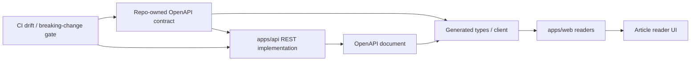

# Web/API 读取边界改为 OpenAPI 合同优先

## Problem Frame

当前 `apps/web` 里读 `apps/api` 的方式还是手写 fetch 包装：
`apps/web/src/widgets/article-reader/api/articles-api.ts` 里自己定义返回
类型，再通过 `response.json() as T` 信任 payload。与此同时，
`apps/api` 侧又有一套独立的 DTO class 和控制器映射。这个结构让“看起来有类型”
和“真的有合同”之间仍然有缝。

这次重构的目标不是换成另一种 RPC 风格，而是把整个 Web/API 读取边界收敛到
一个可审查、可生成、可校验的 OpenAPI 合同上。当前已经能确认的外部读取面很窄，
但这条 seam 是后续所有 web->api 读路径的模板，所以它需要先变成 repo 级标准。

## Requirements

**Contract Source of Truth**

- R1. 仓库必须为所有 `apps/web` 消费的 API read surface 提供一个单一的
  OpenAPI 合同来源。
- R2. 这个合同必须能覆盖当前 `apps/web` 已消费的所有 API 响应形状，不得只修
  文章 reader 这一条 seam 而保留另一套手写合同。
- R3. 合同必须成为 PR 中可审查的仓库资产，避免只在运行时生成而无法被人类直接
  评审。

**Web Consumption**

- R4. `apps/web` 必须通过由合同生成的类型或 client 读取 API 数据，不再保留手写
  DTO-like 类型作为契约来源。
- R5. `apps/web` 必须移除所有 unchecked 的 `response.json() as T` 或等价类型断言。
- R6. 当前 reader 体验必须保持：默认文章选择、URL 保持、404 处理、摘要 fallback
  文案、文章详情渲染都不能因为迁移而退化。

**Backend Ownership and Validation**

- R7. `apps/api` 继续作为 REST 实现的所有者，负责运行时校验、响应映射和数据来源。
- R8. 任何响应形状变化都必须和合同变化一起提交，不能让 backend 实现先变、合同
  后补。
- R9. 合同层必须能让 breaking change 在合并前被看见，而不是等到 web 运行时才暴露。

**Workflow**

- R10. 仓库必须提供一个可重复的 contract 更新流程，让开发者可以稳定生成或刷新
  OpenAPI 合同及 web 侧生成产物。
- R11. CI 或等价的仓库级检查必须能发现实现与已发布合同之间的漂移。
- R12. 这次迁移必须覆盖当前所有 web->api 读取 seam，不能只迁 article reader 后把
  另一条手写路径留在仓库里。

## Success Criteria

- `apps/web` 不再依赖手写的 API 返回类型作为唯一契约来源。
- 当前 reader 页面仍能正常工作，且用户可见行为没有退化。
- 合同变更会在 PR 里变得显式，review 时能直接看到影响范围。
- 如果实现和合同不一致，仓库级检查能在合并前把问题拦住。

## Scope Boundaries

- 本次不迁移到 tRPC，也不把 REST 改成内部 RPC 风格。
- 本次不改 ingestion、summary、Prisma schema 或数据库持久化语义。
- 本次不要求公开更多 reader 数据，例如 `contentMarkdown`。
- 本次不重构成新的前端数据层架构，只解决 Web/API 读取合同这一层。

## Key Decisions

- 选择 OpenAPI contract-first，而不是 tRPC。
- OpenAPI 合同会作为 repo 资产被审查和同步，而不是只在运行时隐式生成。
- 迁移范围按“所有当前 web->api 读取 seam”定义，不只限于 article reader。
- backend 仍保留 Nest REST 形态，合同与实现保持同一条主线，而不是拆成两套真相。

**NestJS 参考文档**

- OpenAPI 介绍：<https://docs.nestjs.com/openapi/introduction>
- OpenAPI CLI plugin：<https://docs.nestjs.com/openapi/cli-plugin>
- 输入校验：<https://docs.nestjs.com/techniques/validation>
- Monorepo / workspace：<https://docs.nestjs.com/cli/monorepo>

**Next.js / OpenAPI 前端参考**

- 数据获取 / Client Components：
  <https://nextjs.org/docs/app/getting-started/fetching-data>
- Orval：
  <https://orval.dev/>
- Orval React Query：
  <https://orval.dev/docs/guides/react-query>

## Dependencies / Assumptions

- 假设当前 REST response 形状可以被 OpenAPI 清晰表达，不需要先重设计接口。
- 假设 web 侧可以接受 Orval 生成的 client / hooks，而不是继续维护手写 fetch
  包装。
- 假设现有 CI 流程可以承接 contract drift 检查，而不需要重新搭一套独立流水线。

## Outstanding Questions

### Deferred to Planning

- [Affects R1][Technical] OpenAPI 合同的 canonical 文件格式应选 YAML 还是 JSON。
- [Affects R10][Technical] 合同生成和 web client 生成应分别放在哪个脚本或 workspace
  任务里。
- [Affects R10][Needs research] 适合当前 repo 的 contract diff / breaking-change gate
  工具是哪一个。
- [Affects R4][Technical] web 侧生成产物应直接从 repo 里的合同读取，还是从某个导出
  artifact 读取。

## Next Steps

-> /ce:plan for structured implementation planning
