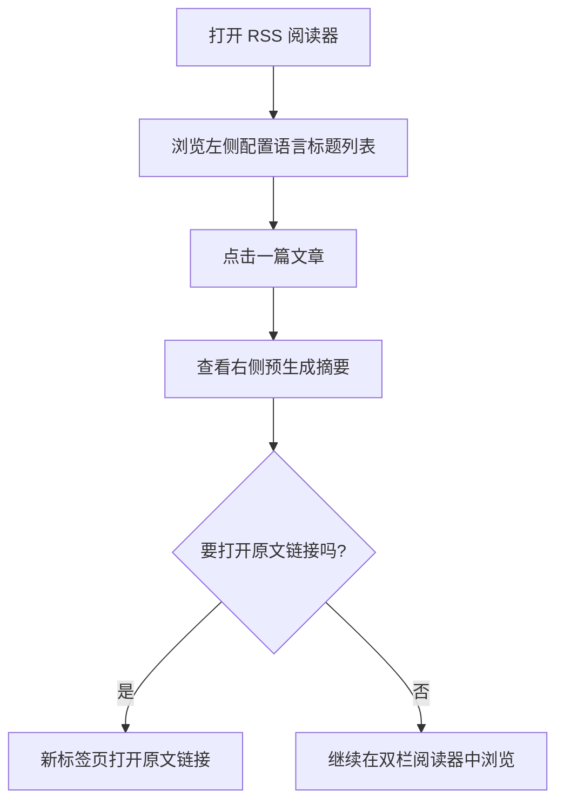

# rss-start v0.1 图表说明

## 概览

这份文档用两张必要的 Mermaid 图说明 `rss-start v0.1` 的最小产品闭环。
重点不是实现细节，而是回答两个产品问题：

- 系统提前准备了什么信息，帮助用户做阅读判断？
- 用户在桌面端是如何从“看标题”走到“决定是否在新标签页打开原文链接”的？

当前版本只保留两张图：

1. `MVP 概念流图`
2. `桌面端阅读路径图`

不纳入这一版的内容：失败路径、降级状态、重试逻辑、实现层 API 编排。

## 图 1：MVP 概念流图

这张图用于确认 v0.1 的产品闭环：系统先从本地订阅配置读取 feed，再根据用户配置提前准备目标语言标题与两层摘要，最后把这些信息交给桌面端双栏界面，帮助用户决定是否按需在新标签页打开原文链接。

图注：这张图回答的是“系统在用户开始阅读前，已经把哪些判断材料准备好了”。

## 图 2：桌面端阅读路径图

这张图用于确认用户在桌面端双栏阅读器中的最短决策路径：先扫描左侧配置语言标题列表，再在右侧查看某篇文章的预生成摘要，最后决定是否额外在新标签页打开原文链接。

图注：这张图回答的是“用户如何在双栏阅读器中从标题判断走到摘要判断，并按需在新标签页打开原文链接”。

## 使用边界

这两张图共同定义了 v0.1 的产品表达边界：

- 列表页负责用用户配置的目标语言降低标题理解门槛
- 摘要页负责帮助用户判断是否值得打开原文链接
- 打开原文是从阅读器补充跳出的外部动作，准确来说是新标签页打开原文链接，而不是在产品内切换到另一条复杂流程

如果未来要补充工程实现、状态流转或异常处理，应另写技术文档，不扩张这份产品图表文档。
