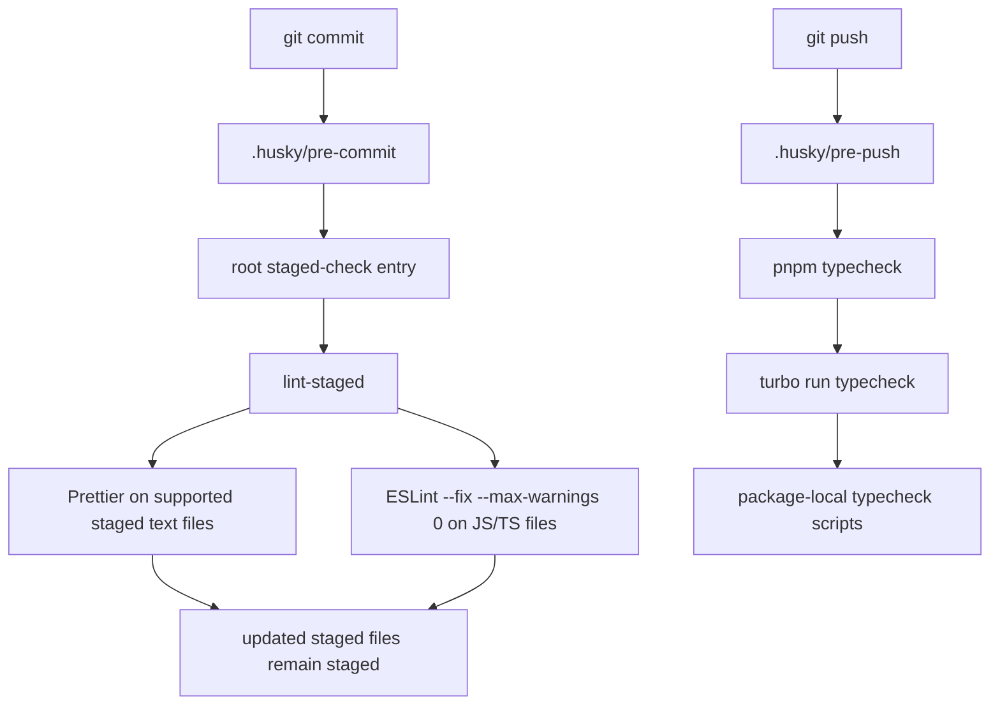

# feat: Add Husky local quality gates

## Overview

这份计划为当前 monorepo 增加一层本地 Git 质量门禁，并明确使用 Husky 作为 hook manager。`pre-commit` 通过 `lint-staged` 只处理 staged files 上的格式化与 lint，使提交阶段保持快速；`pre-push` 则直接复用现有 root workspace `typecheck` 入口，让 Git hook 路径继续贴着当前 Turborepo 任务图，而不是再发明一条平行工作流。

这次 rollout 还会补上当前 workspace 门禁里最明显的一处覆盖缺口：`packages/ui` 已经有 TypeScript 源码，但仍缺少本地 `lint` 与 `typecheck` 脚本。因此计划把 hook 接线与任务覆盖补齐视为同一组变更，保证 push 阶段的新门禁一落地就是可信的。

## Problem Frame

origin requirements 文档已经固定了 Scheme A 的目标行为：commit 阶段只做 staged format 与 lint，workspace `typecheck` 移到 push 阶段执行，而且本地 hook 不能运行端到端测试（见 origin: `docs/zh-Hans/brainstorms/2026-04-11-git-hooks-scheme-a-requirements.md`）。

当前仓库已经接近这个形状，但还缺三块：

- 还没有任何已提交的 Git hook manager 或 `.husky/` surface；
- 还没有 staged-file 级别的轻量编排层来承接快速 commit-time 修复；
- 现有 workspace 门禁并不完整，因为 `packages/ui/package.json` 虽然对应真实源码包，却仍缺本地 `lint` 与 `typecheck`。

用户已经明确选择 Husky，因此这次 planning 关注的是：如何把 Husky 作为薄的 root-level wrapper 接进来，如何让 staged checks 复用现有 Prettier/ESLint 工具链，以及如何在保持 Turborepo package-task ownership 的前提下，把 push-time `typecheck` 门禁补齐到足够可信。

## Requirements Trace

- R1. 在创建 commit 前，只处理 staged files 的 format 与 lint；安全的自动修复必须继续保留在同一次提交尝试里。
- R2. 在接受 push 前，workspace 必须通过现有 monorepo 任务模型运行一次仓库级 `typecheck` 门禁。
- R3. 本次范围内的本地 Git hook 不能运行 `test:e2e` 或等价端到端测试。
- R4. hook 流程必须复用现有 repo entry points，并继续做当前工具链之上的薄编排层。
- R5. package-local tasks 仍然是事实来源；root-level hook entry points 只负责编排。
- R6. commit 阶段必须保持快速，并聚焦 staged files。
- R7. push 阶段允许更慢，但行为必须对贡献者清晰且可预期。

## Scope Boundaries

- 不改变 CI 策略、部署行为或发布流程。
- 不新增 commit-message hook、branch-name hook，或本次质量门禁路径之外的其他 hook 类型。
- 不把任务逻辑从 package `package.json` 挪到 root；root scripts 只能编排 root-only tooling。
- 不把端到端测试引入本地 hooks。
- 除非 hook rollout 暴露出无法靠补齐 package scripts 解决的具体门禁完整性问题，否则不重设计当前 Turborepo 依赖图。

## Context & Research

### Relevant Code and Patterns

- `package.json` 已经定义了当前 root orchestration pattern：repo-level commands 通过 `turbo run ...` 委派，root 拥有 Prettier 这类仓库级 tooling。
- `turbo.json` 已经定义了 workspace `lint` 与 `typecheck` 任务，因此 hook 计划应复用这些入口，而不是新造一套任务图。
- `apps/api/package.json`、`apps/web/package.json` 与 `packages/jest-config/package.json` 展示了当前 package-local `lint` / `typecheck` script 的模式。
- `packages/ui/package.json` 当前同时缺少 `lint` 与 `typecheck`，但 `packages/ui/src/` 已经包含 TypeScript 源码；这是当前 workspace 门禁最明显的缺口。
- `.prettierrc.mjs`、`eslint.config.mjs` 与 `apps/web/eslint.config.mjs` 已经定义了 staged checks 应该复用的 format / lint 行为。
- `README.md` 与 `README.zh-Hans.md` 已经是贡献者视角的 runbook 配对；hook 行为应写在那里，而不是藏在实现细节里。
- `pnpm-workspace.yaml` 确认当前仓库采用标准的 `apps/*` + `packages/*` 布局，hook rollout 不能破坏这个边界。
- `.agents/skills/turborepo/references/best-practices/RULE.md` 明确允许把 Husky、lint-staged 这类 Git-hook tooling 放在 root，同时要求可执行 task 逻辑继续留在 packages 内。

### Institutional Learnings

- `docs/en/solutions/documentation-gaps/keeping-bilingual-diagram-docs-synchronized-2026-04-09.md` 与 `docs/zh-Hans/solutions/documentation-gaps/keeping-bilingual-diagram-docs-synchronized-2026-04-09.md` 要求所有耐久文档在英文与简体中文之间保持同步。
- `docs/en/plans/` 与 `docs/zh-Hans/plans/` 里已有的双语计划也体现了仓库惯例：tooling ownership 要显式写出来，而不是依赖执行者的默认习惯。

### External References

- Husky 官方入门文档：`https://typicode.github.io/husky/get-started.html`
- lint-staged 官方文档：`https://github.com/lint-staged/lint-staged`

## Key Technical Decisions

- 使用 Husky 作为提交到仓库里的 hook manager。这既符合用户的显式决定，也符合当前仓库对 root-level tooling ownership 的边界约束，避免引入临时的 per-package hook wiring。
- 通过 root package lifecycle 安装 Husky，并让 `.husky/pre-commit` 与 `.husky/pre-push` 保持“刻意地薄”。hook 文件应该只委派给可评审的 repo-relative entry points，而不是塞入复杂 shell 逻辑。
- commit 阶段使用 `lint-staged` 做 staged-file orchestration。它本来就是为 staged filename routing 设计的，并且能自动保持任务修改后的文件仍然处于 staged 状态，从而满足 R1，而无需自写 `git add` / index-management 脚本。
- `pre-push` 直接复用现有 root `typecheck` 入口，而不是再造一个 hook-only typecheck 命令。贡献者无论手动运行还是通过 Git 触发，都应该看到同一条门禁路径。
- 在同一次 rollout 中补齐缺失的 package coverage，第一优先是 `packages/ui`。只有当所有相关 source-bearing package 都参与 workspace `typecheck` 时，push-time gate 才值得信任，因此 hook adoption 与 coverage repair 应一起落地。
- 所有本地 hooks 都继续排除 `test:e2e`。更重的验证仍然留给现有手动流程与 CI，本地 hooks 只做快速质量门禁。
- 在双语 README 中明确写出贡献者预期，包括当前 `typecheck` 任务图可能触发上游 `build` 前置步骤，因此 `pre-push` 天生会比 `pre-commit` 更慢。

## Open Questions

### Resolved During Planning

- 最终由哪种 hook manager 承载实现？Husky；这同时符合用户决定与仓库的 root-tooling 边界。
- staged files 的 format 与 lint 映射如何设计？使用 root `lint-staged` 配置：支持的 staged text files 走 Prettier，JavaScript / TypeScript 变体走 ESLint `--fix --max-warnings 0`。
- push-time checks 如何调用 workspace gate？`pre-push` 调用现有 root `typecheck` 入口，让 Git 与手动流程汇合到同一条 `turbo run typecheck` 路径。
- 哪些 package 需要纳入本次 rollout 的范围？至少 `apps/api`、`apps/web`、`packages/jest-config` 与 `packages/ui` 参与 workspace `typecheck`；没有可执行源码的 config-only packages 则继续有意地留在门禁之外，除非未来它们新增需要检查的代码。
- package task coverage 应该在 hook rollout 之前还是过程中补齐？放在同一次 rollout 里补齐，避免新 hook 边界带着已知不完整的 workspace gate 一起上线。

### Deferred to Implementation

- `lint-staged.config.mjs` 内部最终采用怎样的 staged-file glob 边界与命令先后顺序，可以留给实现阶段细化；前提是 staged-only 范围与 auto-fix 行为保持不变。
- `.husky/*` 最终保持单命令文件，还是抽成小型 `scripts/hooks/` helper，可在实现时根据复杂度决定；前提是 hook body 继续保持“薄”。

## High-Level Technical Design

> _This illustrates the intended approach and is directional guidance for review, not implementation specification. The implementing agent should treat it as context, not code to reproduce._

## Implementation Units

- [x] **Unit 1: Normalize workspace lint and typecheck coverage**

**Goal:** 先让现有 workspace 质量命令足够可信，才能把它们当成 push-time Git gate。

**Requirements:** R2, R4, R5, R7

**Dependencies:** None

**Files:**

- Modify: `packages/ui/package.json`

**Approach:**

- 在 `packages/ui/package.json` 中补上本地 `lint` 与 `typecheck` scripts，并沿用 `apps/api`、`apps/web`、`packages/jest-config` 已经采用的 package-owned 模式。
- 重新确认哪些 package 是 workspace `typecheck` 的有意范围，不要用 root-only workaround task 去掩盖缺失覆盖。
- 继续保持 root `lint` / `typecheck` 只做 `turbo run ...` 委派；这次 rollout 应该补齐 task coverage，而不是替换 task model。
- 如果实现时发现还有其它 source-bearing package 存在同样缺口，应在同一轮里显式扩展 coverage，而不是继续让范围保持模糊。

**Patterns to follow:**

- `apps/api/package.json`
- `apps/web/package.json`
- `packages/jest-config/package.json`
- `package.json`

**Test scenarios:**

- Happy path — `packages/ui` 暴露出与其他 source-bearing packages 一致的本地 `lint` / `typecheck` scripts。
- Happy path — root workspace `typecheck` gate 现在会包含 `packages/ui`，而不是静默跳过。
- Edge case — 没有可执行源码的 config-only packages 继续有意地留在 `typecheck` 之外，而不是被塞入没有意义的占位脚本。
- Integration — 如果 `packages/ui` 引入错误，该失败会通过 workspace `typecheck` gate 向上传播，并在 hooks 接好后阻止 push。

**Verification:**

- 所有声明在范围内的 package 都通过 package-local scripts 参与 workspace lint/typecheck，root commands 继续只是薄的 `turbo run` orchestration。

- [x] **Unit 2: Define the staged-file formatting and lint orchestration**

**Goal:** 用一条只处理 staged files 的快速路径满足 commit-time gate，并保证安全自动修复仍留在同一次提交尝试里。

**Requirements:** R1, R4, R6

**Dependencies:** Unit 1

**Files:**

- Modify: `package.json`
- Create: `lint-staged.config.mjs`

**Approach:**

- 添加一个 root staged-check entry（例如 `lint:staged`），由它委派给 `lint-staged`，而不是复用完整的 workspace `lint` 命令。
- 让支持的 staged text files 继续通过现有 root `.prettierrc.mjs` 走 Prettier；让 JavaScript / TypeScript 文件继续通过当前仓库配置走 ESLint `--fix --max-warnings 0`。
- 让 staged-file globs 保持足够窄，避免误碰 unsupported binaries 或制造噪音。
- 直接依赖 lint-staged 内建的 restaging 行为，而不是自写 `git add` 编排。

**Patterns to follow:**

- `package.json`
- `.prettierrc.mjs`
- `eslint.config.mjs`
- `apps/web/eslint.config.mjs`

**Test scenarios:**

- Happy path — 一个只存在格式漂移的 staged TypeScript 文件会被改写，而且仍保留在同一次 commit attempt 里。
- Happy path — 一个存在可自动修复 ESLint 问题的 staged TS/TSX 文件会被修好，并继续包含在待提交内容中。
- Edge case — 同一次提交里既有支持的文本文件也有不支持的静态资源时，只对支持的文件运行检查。
- Error path — 不可自动修复的 lint 错误会以清晰失败信号中止 commit。
- Integration — 无论 staged files 来自 `apps/*` 还是 `packages/*`，都通过共享的 repo-level Prettier / ESLint 配置解析，而不需要 package-specific hook logic。

**Verification:**

- commit-time gate 只处理 staged files，安全自动修复会继续保持 staged，无法恢复的失败会阻止 commit。

- [x] **Unit 3: Wire Husky as the root Git hook entry surface**

**Goal:** 把 Git lifecycle events 接到计划中的仓库级门禁上，同时不引入第二套 task model。

**Requirements:** R1, R2, R3, R4, R5, R6, R7

**Dependencies:** Unit 1, Unit 2

**Files:**

- Modify: `package.json`
- Create: `.husky/pre-commit`
- Create: `.husky/pre-push`

**Approach:**

- 把 Husky 与 lint-staged 作为 root-level development tooling 引入，这与仓库的 Turborepo 指导中“Git-hook tooling 放在 root”的边界一致。
- 配置 root package lifecycle，让贡献者通过正常依赖安装路径完成 hook installation，而不是依赖未记录的手工 setup。
- 让 `.husky/pre-commit` 只聚焦 Unit 2 里的 staged-check entry；让 `.husky/pre-push` 只聚焦现有 root `typecheck` entry。
- 不调用 `test:e2e`，也不把 hook 专属逻辑塞进原本应保持通用的 package scripts。

**Patterns to follow:**

- `package.json`
- `turbo.json`
- `.agents/skills/turborepo/references/best-practices/RULE.md`

**Test scenarios:**

- Happy path — 经过一次正常依赖安装后，仓库拥有可用的 Husky hook surface，而不需要额外的 contributor-specific Git 配置。
- Error path — 如果 staged-check entry 返回非零退出码，`git commit` 会被 hook exit code 阻止。
- Error path — 如果 root workspace `typecheck` gate 返回非零退出码，`git push` 会被 hook exit code 阻止。
- Integration — `pre-push` 跑的是贡献者平时手动执行的同一条 root `typecheck` 路径，而且本方案下没有任何 hook 会运行 `test:e2e`。

**Verification:**

- Git commit / push 会通过极薄的 Husky surface 进入预期的 repo-level gates，且这些 hooks 没有引入一条平行的质量工作流。

- [x] **Unit 4: Document the contributor workflow and hook boundaries**

**Goal:** 让新的本地质量门禁对后续贡献者来说是显式、可理解、且双语同步的。

**Requirements:** R3, R4, R6, R7

**Dependencies:** Unit 3

**Files:**

- Modify: `README.md`
- Modify: `README.zh-Hans.md`

**Approach:**

- 新增一段面向贡献者的简洁说明，交代 `pre-commit` 会运行什么、`pre-push` 会运行什么、以及哪些内容被有意排除在外。
- 明确写出 `pre-push` 可能更慢，因为当前 `typecheck` 任务图会触发上游 `build` 前置步骤。
- 英文与简体中文 README 必须在同一组变更中保持语义同步。
- 把 hook 行为写成 repo-level guidance，而不是埋在只给实现者看的计划文档里。

**Patterns to follow:**

- `README.md`
- `README.zh-Hans.md`
- `docs/en/solutions/documentation-gaps/keeping-bilingual-diagram-docs-synchronized-2026-04-09.md`
- `docs/zh-Hans/solutions/documentation-gaps/keeping-bilingual-diagram-docs-synchronized-2026-04-09.md`

**Test scenarios:**

- Test expectation: none -- 这是纯文档单元，但最终发布的 README 文案必须与 Units 1-3 实际落地后的 hook 行为保持一致。

**Verification:**

- 仅靠双语 README，贡献者就能理解新的本地门禁形状、排除项与延迟取舍。

## System-Wide Impact

- **Interaction graph:** Git lifecycle events 现在会穿过 `.husky/*`、root staged-check entry、root `typecheck` entry、`turbo run typecheck`、package-local scripts，以及现有 Prettier / ESLint 配置表面。
- **Error propagation:** lint-staged、ESLint、Prettier 或 workspace `typecheck` gate 只要返回非零退出码，就必须原样冒泡，让 Git 阻止对应的 commit / push。
- **State lifecycle risks:** commit 阶段的自动修复必须继续保持 staged；push 阶段的 `typecheck` 可能因为当前 `turbo.json` 依赖图而触发上游 `build` 前置步骤。
- **API surface parity:** `pnpm lint` 与 `pnpm typecheck` 等手动 contributor commands 继续是事实来源的质量门禁；Husky 只是给同一行为增加 Git-triggered 入口。
- **Integration coverage:** 单元测试本身无法证明 Git hook 是否真的被触发；文件接好后，实施阶段应在一次性 feature branch 上做真实 commit / push smoke verification。
- **Unchanged invariants:** CI、部署、发布流程与端到端测试执行仍然不在本计划范围内；本地 hook surface 里也仍然没有 commit-message policy。

## Risks & Dependencies

| Risk                                                                            | Mitigation                                                                                                |
| ------------------------------------------------------------------------------- | --------------------------------------------------------------------------------------------------------- |
| 贡献者可能意识不到 hook installation 依赖于正常的依赖安装路径                   | 把 Husky 安装放进 root package lifecycle，并在双语 README 中明确写出来                                    |
| 当前 `typecheck` 任务图会让 `pre-push` 比贡献者预期更慢                         | 在文档里明确说明这项延迟取舍，并让 `pre-commit` 保持刻意地窄                                              |
| 过宽的 staged-file globs 可能误碰 unsupported files 或制造噪音失败              | 让 lint-staged patterns 保持显式，并在 mixed staged-file 场景下完成验证后才视为 rollout 完成              |
| 如果还有其它 source-bearing package 缺脚本，workspace gate 的完整性仍可能不清晰 | 把 scope declaration 视为 rollout 的一部分，发现缺口时显式扩展 package-local coverage，而不是继续依赖假设 |

## Documentation / Operational Notes

- README 更新必须与 hook files 同一组变更一起 rollout，避免 contributor guidance 与真实行为漂移。
- hook 行为验证应在 disposable feature branch 上完成，而不是在受保护分支上试错。
- 保持 hook surface 可评审：`.husky/*` 足够薄、root 配置显式、且不依赖任何隐藏的 per-developer setup steps。

## Sources & References

- **Origin documents:** `docs/en/brainstorms/2026-04-11-git-hooks-scheme-a-requirements.md`, `docs/zh-Hans/brainstorms/2026-04-11-git-hooks-scheme-a-requirements.md`
- **Related code:** `package.json`, `turbo.json`, `pnpm-workspace.yaml`, `.prettierrc.mjs`, `eslint.config.mjs`, `apps/web/eslint.config.mjs`, `apps/api/package.json`, `apps/web/package.json`, `packages/jest-config/package.json`, `packages/ui/package.json`, `README.md`, `README.zh-Hans.md`
- **Related guidance:** `.agents/skills/turborepo/references/best-practices/RULE.md`
- **External docs:** `https://typicode.github.io/husky/get-started.html`, `https://github.com/lint-staged/lint-staged`
