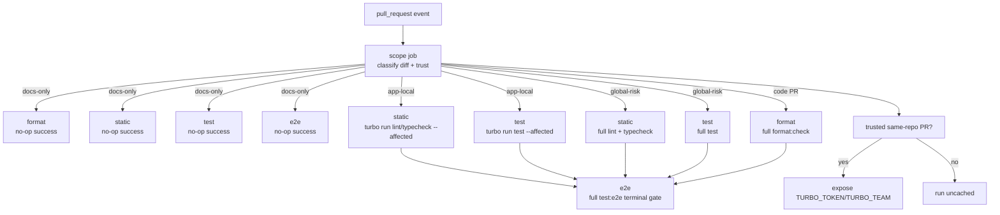

# feat: 新增 GitHub PR 质量 CI

## Overview

本计划为仓库新增一套仅在 pull request 上运行的 GitHub Actions 质量工作流，把仓库现有的本地质量门禁升级为远端必过检查，同时不把范围扩张成宽泛的 CI/CD 体系。根据你刚明确的要求，这次 rollout 需要先修复所有“本应产出 `.d.ts` 却没有产出”的边界工作区，因为声明文件产出才是预期的类型边界契约。完成这一步前置修复后，工作流再保持在当前 Turborepo 任务图之内，通过 workflow 级并发取消与粗粒度的文档-only no-op 路径控制 GitHub Actions 分钟消耗，并且只在 PR 上下文足够可信、可以安全暴露缓存凭据时才启用 Vercel Remote Cache。

| PR 类别                                    | Format              | Lint / typecheck / test                 | E2E                      | Remote cache |
| ------------------------------------------ | ------------------- | --------------------------------------- | ------------------------ | ------------ |
| 仅文档或明显非代码改动                     | No-op success       | No-op success                           | No-op success            | 不使用       |
| 仅 `apps/` 下的应用局部代码改动            | 全仓 `format:check` | 可安全时使用 `turbo run ... --affected` | 全量 `test:e2e` 终局门禁 | 仅同仓库 PR  |
| 共享、根目录、workflow 或 `packages/` 改动 | 全仓 `format:check` | 全仓质量门禁                            | 全量 `test:e2e` 终局门禁 | 仅同仓库 PR  |

## Problem Frame

来源需求文档已经明确了目标形状：pull request 需要一个远端强制质量门禁，但本次范围不能顺手扩张成通用的 push 阶段 CI 或部署流水线（see origin: `docs/en/brainstorms/2026-04-12-github-pr-quality-ci-requirements.md`）。

当前仓库已经在 `package.json` 中暴露了正确的质量入口，`turbo.json` 也已经定义了这些入口背后的任务图。真正的缺口是 `.github/workflows/` 仍然为空，因此 pull request 还没有一个适合 branch protection 使用的远端门禁来覆盖 `format`、`lint`、`typecheck`、`test` 与 `test:e2e`。

因此，本次 planning 的重点是如何引入一套单一的 PR-only workflow：它既要严格，又要在 PR UI 中可读；既要保守处理信任边界，又要明确关心成本；既要保留仓库现有的 Turborepo 任务所有权模型，又要保留当前那些承担 package 类型边界保护职责的上游 `build` 依赖；并且在 CI 优化之前，先把所有缺失的 `.d.ts` 边界产出修复好；同时还要避免任何可能让 required checks 卡在 pending 的“聪明跳过”逻辑。

## Requirements Trace

- R1. 质量工作流只在 pull request 上触发。
- R2. 范围严格限制在代码质量，不包含部署、发布、Docker 或其他交付环节。
- R3. 复用现有 repo-level 与 package-level 质量入口，而不是发明一套平行任务模型。
- R4. 所有会影响代码的 PR 都必须经过 format、lint、test 与 e2e 检查。
- R5. `typecheck` 必须成为一等必需门禁。
- R6. PR UI 必须输出适合 branch protection 使用、且失败点清晰可见的检查信号。
- R7. 必须保留 `lint` 与 `typecheck` 背后有意设置的上游 `build` 依赖，只要它们用于验证产物类型边界。
- R8. 通过取消过期运行和减少重复编排来节省 GitHub Actions 分钟数。
- R9. 在不牺牲正确性的前提下，优先使用 Turborepo 原生增量执行。
- R10. 当凭据可用时启用 Vercel Remote Cache。
- R11. 不能依赖会让 required checks 长期 pending 的顶层 workflow path filters。
- R12. 第一版如果启用 no-op success，规则必须粗粒度、保守、且易于审计。
- R13. 必须对不受信任的 PR 执行保持安全，不能把缓存凭据暴露给 fork 代码。
- R14. 当缓存凭据不可用时，应退化为 uncached 执行，而不是削弱门禁。
- R15. 任何在当前 Turborepo 图中承担上游类型边界职责的工作区，都必须产出 `.d.ts`；如果没有产出，这不是后续优化项，而是 CI rollout 的前置修复项。

## Scope Boundaries

- 本次变更不新增 `push` 触发的云端 CI。
- 本次变更不新增部署、镜像构建、发布或 release 自动化。
- 本次变更不重构 monorepo 布局、package 边界或 Turborepo 任务图；但允许为恢复预期的 `.d.ts` 产出，在相关 package 内做最小必要的 build/export 调整。
- 本次变更不修改 `.husky/` 中的本地 Git hooks 行为。
- 本次变更不把 `pull_request_target` 作为执行不受信任 PR 代码的默认模型。
- 第一版除了粗粒度的 docs-only / non-code no-op 路径外，不引入细粒度依赖推断跳过逻辑。

## Context & Research

### Relevant Code and Patterns

- `package.json` 已经暴露了 `format:check`、`lint`、`typecheck`、`test` 与 `test:e2e` 作为当前根级编排入口，并声明了仓库使用的 `pnpm` 与 Node 约束。
- `turbo.json` 已经定义了 `lint`、`typecheck`、`test` 与 `test:e2e`，并保留了静态检查背后有意存在的上游 `build` 依赖。
- `.github/workflows/` 当前为空，因此本计划可以引入单一 workflow，而不会与既有 CI 表面冲突。
- `apps/web/playwright.config.ts` 表明浏览器 e2e 会同时拉起 API 与 Web 应用，因此 `test:e2e` 是真实的跨表面门禁，而不是占位符。
- `apps/api/test/jest-e2e.json` 表明仓库已经把 API e2e 与浏览器套件区分开来。
- `packages/typescript-config/nestjs.json` 开启了 `declaration`，而当前 `apps/api/dist/src/*.d.ts` 产物说明 API 的 build 确实会产出声明文件。
- `packages/jest-config/package.json`、`packages/jest-config/tsconfig.json` 以及现有的 `packages/jest-config/dist/*.d.ts` 共同说明 `@repo/jest-config` 是一个会产出声明文件的共享 package。
- `packages/typescript-config/nextjs.json` 设置了 `noEmit: true`；`apps/web/tsconfig.json` 与 `packages/ui/tsconfig.json` 都继承了这一模式，而 `packages/ui/package.json` 直接导出源码文件且没有 `build` 脚本。结合你刚明确的要求，这对共享边界 package 来说不是可接受的稳态：`packages/ui` 是当前最明确、必须先修复的声明文件缺口。
- `docs/en/solutions/workflow-issues/monorepo-husky-hooks-package-aware-and-bootstrap-stable-2026-04-11.md` 体现了最近形成的仓库规范：根级工作流表面应当保持薄且可审计，package 所有权应保持显式。
- `AGENTS.md` 要求持久文档在 `docs/en/` 与 `docs/zh-Hans/` 下保持同步，并把 Turborepo 的 package 任务所有权视为工作区任务编排的默认权威。

### Institutional Learnings

- `docs/en/solutions/workflow-issues/monorepo-husky-hooks-package-aware-and-bootstrap-stable-2026-04-11.md` 与 `docs/zh-Hans/solutions/workflow-issues/monorepo-husky-hooks-package-aware-and-bootstrap-stable-2026-04-11.md` 都强调：根级编排表面应该透明，不要把跨 package 的边界逻辑藏进临时捷径里。
- 这个仓库现有的 plan / 文档习惯偏好显式任务所有权、保守 rollout 说明，以及中英文同步的持久工件，而不是依赖口口相传的运维知识。

### External References

- GitHub Actions 并发控制文档：`https://docs.github.com/en/actions/how-tos/write-workflows/choose-when-workflows-run/control-workflow-concurrency`
- GitHub branch protection 文档：`https://docs.github.com/en/repositories/configuring-branches-and-merges-in-your-repository/managing-protected-branches/about-protected-branches`
- GitHub required checks 故障排查文档：`https://docs.github.com/en/repositories/configuring-branches-and-merges-in-your-repository/troubleshooting-required-status-checks`
- GitHub `pull_request_target` 事件与安全文档：`https://docs.github.com/en/actions/reference/events-that-trigger-workflows#pull_request_target`
- GitHub 关于 fork PR Action 限制的文档：`https://docs.github.com/en/enterprise-cloud@latest/organizations/managing-organization-settings/disabling-or-limiting-github-actions-for-your-organization`
- Turborepo CI 文档：`https://turborepo.com/repo/docs/crafting-your-repository/constructing-ci`

## Key Technical Decisions

- 使用单一 `pull_request` workflow，包含一个非 required 的 `scope` job 和四个稳定的 required jobs：`pr-quality / format`、`pr-quality / static`、`pr-quality / test`、`pr-quality / e2e`。这样既保留 branch protection 的可读性，也避免 workflow 过多导致的编排开销。
- 不使用顶层 `paths` / `paths-ignore` 过滤，而是在 workflow 内部通过 scope classifier 把 PR 分为 docs-only no-op、应用局部 affected 模式、以及保守的全仓模式，从而保证 required checks 始终会收敛。
- 使用以 PR 身份为键的 workflow 级并发控制，并开启 `cancel-in-progress: true`，让过期运行停止消耗分钟数。
- 保持最小、只读权限，不使用 `pull_request_target` 执行代码。默认信任模型仍然是普通 `pull_request` 执行。
- Vercel Remote Cache 仅在“可信且可用”时启用：同仓库 PR 在配置了 `TURBO_TOKEN` 与 `TURBO_TEAM` 时可以使用缓存；fork 与无 secrets 的自动化 PR（例如 Dependabot）则退化为 uncached 执行。
- 只有当 scope classifier 能证明改动是应用局部且未触及共享/高风险表面时，才使用 `turbo run lint --affected`、`turbo run typecheck --affected` 与 `turbo run test --affected`。任何根目录、workflow、共享 package、锁文件或配置改动都必须回退到全仓执行。
- 第一版对 `format` 与 `e2e` 保持保守：代码 PR 统一复用现有全仓 `format:check`，`e2e` 保持为所有代码 PR 都要经过的单一终局 job，而不是过早按 app surface 继续拆分。
- 对承担边界职责的工作区而言，声明文件产出就是预期契约。任何基于 `^build` 的 CI 收缩优化，都必须先找出哪些上游工作区本该提供类型边界，并先修复缺失的 `.d.ts` 产出（从 `packages/ui` 开始）；只要意图不清晰，就保留当前更宽的依赖边。
- branch protection 应针对稳定的 job 名称配置，而不是依赖一个笼统的 workflow 总结果，这样 reviewer 才能直接看出哪一道门禁失败。
- 明确保持 CI 运行时一致性：使用满足 `engines.node` 的 Node 24.x、使用声明的 `pnpm` 工具链，并在 CI 中写成 `turbo run ...` 而不是 Turborepo 简写。

## Open Questions

### Resolved During Planning

- 哪个事件表面应当承载这套 workflow？第一版只使用 `pull_request`，不引入 `push`，也不采用 `pull_request_target` 执行模型。
- 哪些 jobs 可以安全使用 affected 模式？只有 `lint`、`typecheck` 与 `test`，并且前提是 diff 为应用局部改动、且未触及共享/高风险路径。
- 第一版是否启用 no-op success？启用，但只对 docs-only 或明显非代码 PR 开启。
- branch protection 应如何配置？要求稳定命名的 jobs（`pr-quality / format`、`pr-quality / static`、`pr-quality / test`、`pr-quality / e2e`），而不是 workflow 外壳。
- e2e 现在要不要继续拆分？不要。先保留一个显式的 `test:e2e` 终局门禁，后续只有在真实运行数据证明值得时再拆。
- 缓存凭据应如何处理？把缓存视为可选优化，只在可信上下文中启用，绝不让它成为质量门禁成立的前提。
- 仓库是否已经把声明文件产出标准化为通用类型边界门禁？还没有完全做到。当前证据表明预期行为只实现了一部分：`apps/api` 与 `packages/jest-config` 会产出声明文件，而 `packages/ui` 还没有。本次 rollout 应先修复这个边界缺口，而不是把它当成可接受例外。

### Deferred to Implementation

- docs-only、应用局部改动、高风险共享改动三类文件模式的精确清单，可以在 implementation 时落定，但前提是任何不确定情况都必须回退到保守的全仓模式。
- 命令选择逻辑是完全留在 workflow YAML 中，还是部分抽到第二个 helper script 中，可以在 implementation 时根据可读性决定。
- 如果仓库未来启用 merge queue，workflow 可能需要补充 `merge_group` 触发器；这属于当前 PR-only 范围之外的前向兼容事项。
- e2e 的重试、超时与 flaky 策略应基于实际 CI 运行情况在 implementation 时确定，而不是在 plan 中臆测。
- 那些并不承担跨工作区上游边界职责的部署型叶子应用，是否也需要统一产出声明文件，不在这次 rollout 范围内；除非 implementation 发现它们事实上承担了上游边界角色。

## High-Level Technical Design

> _This illustrates the intended approach and is directional guidance for review, not implementation specification. The implementing agent should treat it as context, not code to reproduce._

## Implementation Units

- [x] **Unit 1: 先修复声明文件边界，再进入 CI rollout**

**Goal:** 先把所有承担上游类型边界职责、却尚未产出 `.d.ts` 的工作区修复到预期状态，起点是 `packages/ui`。

**Requirements:** R7, R9, R15

**Dependencies:** None

**Files:**

- Modify: `packages/ui/package.json`
- Modify: `packages/ui/tsconfig.json`
- Create: `packages/ui/tsconfig.build.json`
- Test: `packages/ui/package.json`

**Approach:**

- 为 `packages/ui` 增加 package-local `build` 表面，在不新增依赖的前提下产出声明文件和兼容的运行时产物。
- 让 `packages/ui` 脱离“原始源码直接导出”的边界校验方式，使其导出的 entrypoints 像 `packages/jest-config` 一样通过 build 产物参与类型边界验证。
- 保持变更归属在 package 内：修复属于 `packages/ui` 自己，根级 `turbo.json` 继续只负责通过 package-local tasks 编排。
- 审计当前 `^build` 链路里是否还有其他承担上游边界职责但缺少声明文件产出的工作区；若有，也应在这一阶段一并修复，然后再做 CI 收窄。

**Execution note:** 先建立失败验证：对所有需要参与跨工作区类型检查的导出 entrypoint，都必须看到对应的 `.d.ts` 产物。

**Patterns to follow:**

- `packages/jest-config/package.json`
- `packages/jest-config/tsconfig.json`
- `turbo.json`

**Test scenarios:**

- Happy path — 构建 `packages/ui` 时，会为每个导出的组件或 helper entrypoint 产出 `.d.ts`。
- Happy path — `apps/web` 这类下游消费者解析到的是 build 产物中的类型，而不是原始源码导出路径。
- Edge case — 如果发现还有其它共享工作区承担同类上游边界角色，也会在这一阶段同步修复，而不是继续留作隐性例外。
- Error path — 某个导出 entrypoint 缺少声明文件产出时，package build 验证必须失败，不能静默通过。
- Integration — 一旦 `packages/ui` 进入 `build`，`lint` 与 `typecheck` 使用的上游 `^build` 边就可以建立在真实的声明文件边界之上，而不是隐含假设之上。

**Verification:**

- 所有纳入本次范围的上游边界工作区都会产出 `.d.ts`，并且 `packages/ui` 不再依赖源码导出 / `noEmit` 行为来满足跨工作区类型检查。

- [x] **Unit 2: 新增 PR 范围分类与信任门控**

**Goal:** 引入一个小而可测试的 helper，把每个 PR 分类为 docs-only、应用局部代码改动或全局高风险改动，并报告 remote cache 是否可以安全启用。

**Requirements:** R1, R8, R11, R12, R13, R14

**Dependencies:** Unit 1

**Files:**

- Create: `.github/scripts/pr-quality-scope.mjs`
- Create: `.github/scripts/pr-quality-scope.test.mjs`

**Approach:**

- 读取 PR 的 base/head 对比，并输出诸如 `docs_only`、`code_change`、`run_mode`、`can_use_remote_cache` 之类的机器可读结果。
- 将 `packages/`、`.github/`、根级 lock/config 文件、`turbo.json` 以及其他共享仓库表面视为高风险改动，统一升级到全仓执行。
- 当改动只发生在 `apps/` 下且未触及共享/高风险文件时，将其视为可进入 affected 模式的应用局部改动。
- 保守处理不确定性：只要 classifier 不能证明窄路径安全，就必须返回全仓模式。
- 对 fork 与无 secrets 的自动化 PR（例如 Dependabot）一律视为不可信缓存上下文，即便质量检查本身仍然照常执行。

**Execution note:** 先写失败的 classifier tests，覆盖 docs-only、应用局部、高风险共享改动和不可信 PR 这几类情况。

**Patterns to follow:**

- `package.json`
- `turbo.json`
- `docs/en/solutions/workflow-issues/monorepo-husky-hooks-package-aware-and-bootstrap-stable-2026-04-11.md`
- `docs/zh-Hans/solutions/workflow-issues/monorepo-husky-hooks-package-aware-and-bootstrap-stable-2026-04-11.md`

**Test scenarios:**

- Happy path — docs-only diff 会设置 `docs_only=true`、`code_change=false`，并允许所有 required jobs 走显式 no-op 路径。
- Happy path — 仅涉及 `apps/web/**` 或 `apps/api/**` 的 diff 会返回 `run_mode=affected`，同时仍把该 PR 视为代码改动。
- Edge case — 改动 `packages/ui/**`、`turbo.json`、`.github/workflows/**` 或 `pnpm-lock.yaml` 时，必须升级为全仓模式。
- Error path — diff 输入未知或无法解析时，必须回退为全仓模式，而不是跳过检查。
- Integration — 同仓库 PR 且已配置 secrets 时报告 `can_use_remote_cache=true`；fork 或无 secrets 的自动化 PR 报告 `false`。

**Verification:**

- classifier 的输出具有确定性、可审计，而且足够保守，使“多跑一点”比“误跳过检查”更容易发生。

- [x] **Unit 3: 新增 PR-only workflow 外壳与稳定 required jobs**

**Goal:** 创建 GitHub Actions workflow 表面，发布稳定、适合 branch protection 使用的检查名称，并且绝不因为顶层过滤跳过而让 required checks 卡在 pending。

**Requirements:** R1, R2, R6, R8, R11, R13

**Dependencies:** Unit 2

**Files:**

- Create: `.github/workflows/pr-quality.yml`
- Test: `.github/scripts/pr-quality-scope.test.mjs`

**Approach:**

- 新增一个仅在 `pull_request` 上触发的单一 workflow。
- 设置最小权限与 workflow 级并发控制，确保同一个 PR 上旧运行会被取消。
- 拉取足够的 git 历史，支撑基于 diff 的 scope 判断以及可靠的 Turborepo affected 比较。
- 将 `scope` 作为 setup job，并发布四个稳定的 required jobs，名称使用唯一前缀并直接对应真实质量门禁：`pr-quality / format`、`pr-quality / static`、`pr-quality / test`、`pr-quality / e2e`。
- 对 docs-only PR 使用 job/step 内部条件判断和显式 no-op success step，而不是使用顶层 path filters，从而保证 required checks 始终有明确结果。
- 把 `e2e` 放在较便宜的门禁之后，减少在明显坏改动上浪费的分钟数。

**Patterns to follow:**

- `package.json`
- `turbo.json`
- `.agents/skills/turborepo/SKILL.md`

**Test scenarios:**

- Happy path — 打开或更新一个 pull request 时，只会启动一条 PR-quality workflow 运行，并发布稳定命名的检查。
- Happy path — 向同一个 PR 推送新提交时，旧的进行中运行会被取消。
- Edge case — docs-only PR 仍然会把 `format`、`static`、`test` 与 `e2e` 明确报告为 successful/no-op，而不是留下 pending checks。
- Error path — 如果 scope job 失败，下游 required jobs 不应产生误导性的成功结果。
- Integration — branch protection 可以直接要求这些命名 jobs，而不必依赖模糊的 workflow 文件名。

**Verification:**

- PR UI 能显示稳定的 required check 名称，过期运行会自动取消，docs-only PR 不会把 branch protection 卡在 pending 状态。

- [x] **Unit 4: 接入保守的命令选择与 remote cache 行为**

**Goal:** 把 workflow jobs 接到现有根级与 Turborepo 质量命令上，优先保证正确性，并且只在安全时使用 affected 模式与 remote cache。

**Requirements:** R3, R4, R5, R7, R9, R10, R13, R14

**Dependencies:** Unit 1, Unit 2, Unit 3

**Files:**

- Modify: `.github/workflows/pr-quality.yml`
- Create: `.github/scripts/pr-quality-command-plan.mjs`
- Create: `.github/scripts/pr-quality-command-plan.test.mjs`

**Approach:**

- 把命令矩阵编码在单一位置，保持 workflow 薄且便于 review。
- 以 Unit 1 完成后的声明文件边界修复为基线来编码 CI 命令矩阵；只有在 implementation 发现还有其它上游 package 缺口时，才继续扩展审计与修复。
- 在保守模式下复用现有全仓入口：`pnpm format:check`、`pnpm lint`、`pnpm typecheck`、`pnpm test`、`pnpm test:e2e`。
- 在 affected 模式下，继续复用同一套 Turborepo tasks，但用适合 CI 的命令形式：`turbo run lint --affected`、`turbo run typecheck --affected` 与 `turbo run test --affected`。
- 保留 `turbo.json` 中现有的上游 `build` 依赖，不把任务逻辑搬进根级专用 CI scripts。如果 implementation 发现除了 `packages/ui` 之外还有其它边界 package 仍需修复，也必须先修复，再去收窄任何依赖 `^build` 的 CI 路径。
- 第一版不对 `test:e2e` 使用 affected 模式；所有代码 PR 仍统一经过一个终局的 `test:e2e` 集成门禁。
- 仅当 PR 来自可信同仓库上下文且 secrets 存在时，才注入 `TURBO_TOKEN` 与 `TURBO_TEAM`；否则运行相同命令，但走 uncached 路径。

**Execution note:** 先写失败的 command-selection tests，把 docs-only、affected、full-run 与 uncached 四条分支固定住，再把 workflow 接上去。

**Patterns to follow:**

- `package.json`
- `turbo.json`
- `apps/web/playwright.config.ts`
- `apps/api/test/jest-e2e.json`
- `.agents/skills/turborepo/SKILL.md`

**Test scenarios:**

- Happy path — 应用局部 PR 会用全仓模式跑 `format`，用 `turbo run ... --affected` 跑 `static` / `test`，并把 `e2e` 作为全量终局门禁。
- Happy path — 同仓库 PR 且已配置缓存 secrets 时，只对需要 Turbo remote cache 的 jobs 暴露 `TURBO_TOKEN` 与 `TURBO_TEAM`。
- Edge case — 改动 `packages/**`、根级配置文件、workflow 文件或 lockfile 时，`static` 与 `test` 必须强制回到全仓模式，而不是走 affected 路径。
- Edge case — 如果 implementation 发现除了 `packages/ui` 之外还有其它上游边界 package 缺少 `.d.ts`，rollout 必须先补齐这些缺口，再启用任何依赖声明文件产物的更窄 CI 路径。
- Error path — 缓存 secrets 缺失时，workflow 不会跳过或降级检查；它仍然会以 uncached 方式运行，并且只在真实质量问题上失败。
- Integration — 即便单元/集成 `test` 已通过，浏览器 e2e 失败仍然会阻止合并；而更早的 static/test 失败则应避免在明显坏改动上继续浪费 e2e 分钟。

**Verification:**

- 命令选择保持保守，package / task 所有权仍然留在 Turborepo 图内，而 cache 是否可用只影响运行成本，不影响通过/失败语义。

- [x] **Unit 5: 记录仓库运维说明与 branch protection 配置方式**

**Goal:** 把维护者需要的配置说明写清楚，使 workflow 行为、required checks 与 secrets 预期在 rollout 之后仍然可理解。

**Requirements:** R6, R10, R11, R13, R14

**Dependencies:** Unit 3, Unit 4

**Files:**

- Modify: `README.md`
- Modify: `README.zh-Hans.md`

**Approach:**

- 增加一段简洁、双语同步的维护者说明，明确四个带前缀且稳定的 required checks 名称，并解释 docs-only no-op 路径。
- 明确 branch protection 应针对稳定的 job 名称配置，而不是依赖 workflow 文件名。
- 说明需要配置 `TURBO_TOKEN` 与 `TURBO_TEAM`，并记录 fork 与无 secrets 的自动化 PR（例如 Dependabot）会有意在无 secrets 模式下运行，因此可能更慢。
- 仅把 merge queue 相关内容作为未来运维调整说明，而不是当前 rollout 的一部分。

**Patterns to follow:**

- `README.md`
- `README.zh-Hans.md`
- `AGENTS.md`

**Test scenarios:**

- Test expectation: none -- 该单元记录的是运维配置与仓库设置，不引入新的可执行行为。

**Verification:**

- 维护者文档与实际 workflow 行为一致，双语 README 保持同步，branch protection 配置不再依赖口口相传的知识。

## System-Wide Impact

- **Interaction graph:** `pull_request` 事件先进入 scope-classification job，再决定四个命名质量 jobs 的执行方式，这些 jobs 的结果最终进入 GitHub branch protection，并按条件接入 Turbo remote cache。
- **Error propagation:** scope-classification 误判是影响面最大的故障模式，因此所有不确定性都必须传播成全仓执行，而不是静默跳过；cache 故障只能传播为运行变慢，不能传播为门禁变弱。
- **State lifecycle risks:** 过期运行、浅历史 checkout 与缓存信任判断都会影响正确性；因此 workflow 必须取消旧运行、拉取足够历史、并且绝不在不可信上下文复用 secrets。
- **API surface parity:** 外部可见契约是带 `pr-quality / ...` 前缀的稳定 required job 名称，以及仓库现有的 root / Turbo 任务入口；未来任何 workflow 修改如果改变这些名称，就必须同时更新 branch protection 与文档。
- **Integration coverage:** 最关键的跨层场景是同仓库代码 PR、fork 与无 secrets 的自动化 PR（例如 Dependabot）、docs-only PR，以及共享/根级配置 PR，因为这些场景会同时触发信任、缓存与执行模式边界。
- **Unchanged invariants:** 本计划不会新增 push 阶段云端 CI，不会替换本地 hooks，不会把任务逻辑挪出 package，也不会把 cache 可用性变成通过质量门禁的前提。

## Risks & Dependencies

| Risk                                                                      | Mitigation                                                                                                           |
| ------------------------------------------------------------------------- | -------------------------------------------------------------------------------------------------------------------- |
| 范围分类漏掉某个高风险共享文件，错误地选择了 affected 路径                | 保持 classifier 规则粗粒度，为文件分组写单元测试，并让所有未知情况默认回退到全仓模式                                 |
| 因为跳过逻辑放在 workflow 触发层，required checks 仍然卡在 pending        | 不使用顶层 path filters，让每个 required job 都通过正常执行或 no-op 执行自行收敛                                     |
| Remote cache 凭据泄漏到不可信 PR 执行上下文                               | 保持在 `pull_request` 上执行，只对可信同仓库上下文暴露 secrets，并且绝不为了这套 workflow 改用 `pull_request_target` |
| CI 中 git 历史不足，导致 affected 比较错误                                | 拉取足够的历史用于 diff 计算，并在比较不确定时保留全仓回退路径                                                       |
| 某个共享上游边界 package 仍然缺少 `.d.ts`，导致 CI 优化建立在损坏的前提上 | 先修复声明文件产出（从 `packages/ui` 开始），再收窄任何依赖 `^build` 的 CI 路径                                      |
| rollout 后 e2e 仍然偏贵                                                   | 第一阶段先依赖 docs-only no-op 与 workflow 并发取消控费，再在拿到真实 CI 时长数据后决定是否继续细化优化              |

## Documentation / Operational Notes

- 仓库维护者需要在 GitHub Actions secrets 中配置 `TURBO_TOKEN` 与 `TURBO_TEAM`，trusted PR 才能使用 Vercel Remote Cache。
- Branch protection 应要求这套 workflow 产生的稳定 job 名称，而不是只要求 workflow 文件名本身。
- 如果仓库未来启用了 merge queue，应把 `merge_group` 加进 workflow 触发集合，以保证排队合并场景下 required checks 仍然会上报。
- workflow rollout 与相关文档更新必须在同一变更集中同步提交中英文版本。

## Sources & References

- **Origin documents:** `docs/en/brainstorms/2026-04-12-github-pr-quality-ci-requirements.md` + `docs/zh-Hans/brainstorms/2026-04-12-github-pr-quality-ci-requirements.md`
- Related code: `package.json`, `turbo.json`, `apps/web/playwright.config.ts`, `apps/api/test/jest-e2e.json`
- Related repo learnings: `docs/en/solutions/workflow-issues/monorepo-husky-hooks-package-aware-and-bootstrap-stable-2026-04-11.md`, `docs/zh-Hans/solutions/workflow-issues/monorepo-husky-hooks-package-aware-and-bootstrap-stable-2026-04-11.md`
- External docs: `https://docs.github.com/en/actions/how-tos/write-workflows/choose-when-workflows-run/control-workflow-concurrency`, `https://docs.github.com/en/repositories/configuring-branches-and-merges-in-your-repository/managing-protected-branches/about-protected-branches`, `https://docs.github.com/en/repositories/configuring-branches-and-merges-in-your-repository/troubleshooting-required-status-checks`, `https://docs.github.com/en/actions/reference/events-that-trigger-workflows#pull_request_target`, `https://docs.github.com/en/enterprise-cloud@latest/organizations/managing-organization-settings/disabling-or-limiting-github-actions-for-your-organization`, `https://turborepo.com/repo/docs/crafting-your-repository/constructing-ci`
