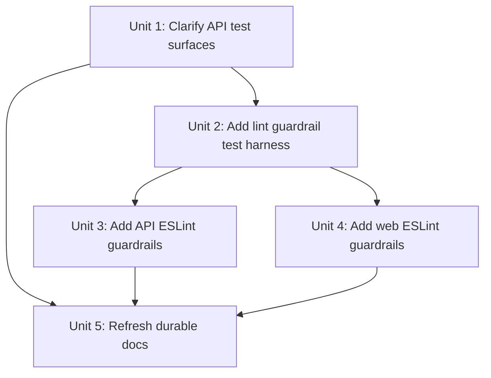

# refactor: 澄清 API e2e 边界并加入 ESLint 可维护性护栏

## Overview

这份计划把误导性的 API 应用级测试面从 `apps/api/test` 改成 `apps/api/e2e`，并因为 colocated spec 已经依赖数据库 reset/bootstrap helper，而把这类 helper 抽到 app-local 的共享 testing surface；同时通过现有 ESLint 入口为 `apps/api` 与 `apps/web` 落第一批可维护性护栏。

实现必须保持当前的 monorepo ownership model：package-local 的 lint/test scripts 继续由各自 package 拥有，root 只保留 orchestration，CI 继续沿用同一条 `pnpm lint` 路径，而不是再发明第二套 checker。

## Problem Frame

配对 requirements 文档已经把问题收窄得很准确（见 origin: `docs/zh-Hans/brainstorms/2026-04-16-test-boundaries-and-eslint-guardrails-requirements.md`）。`apps/api` 里现在有两层都合理的测试：一层是 `apps/api/src/**` 里的 feature-local spec，另一层是当前集中在 `apps/api/test` 里的应用级 HTTP / DB suite。问题不在于两层并存，而在于命名和 ownership 语义不够清楚。

当前代码库也已经证明 `apps/api/test` 并不是纯 e2e 归属：`apps/api/src/articles/article.repository.spec.ts` 会导入 `../../test/test-db`。如果只做目录重命名，不会真正修好这个边界误导。

Lint 侧则正好相反：ownership 很清楚，但 guardrail 还不存在。`apps/api/eslint.config.mjs` 和 `apps/web/eslint.config.mjs` 已经建立在 `packages/eslint-config` 的共享 framework baseline 之上，而 root `pnpm lint` 也早就通过 Turbo 委托到这些 package-local 入口。这使它很适合做一波小而稳的 maintainability policy：只上少量低歧义的 ESLint 规则，按文件角色分配预算，不新增任何 enforcement path。

## Requirements Trace

- R1. 把 API 应用级 suite 改成一个明确表达 e2e 语义的目录面。
- R2. 保留 `apps/api/src/**` 中 colocated 的单元测试与窄范围集成测试。
- R3. 保持 package-local spec 与应用级 HTTP / DB e2e coverage 之间的清晰分层。
- R4. 只有 e2e-only helper 才继续贴着 e2e suite；已经被 e2e 之外复用的 helper 需要迁出。
- R5. 在 `apps/api` 和 `apps/web` 中加入针对大文件、大函数和明显过复杂控制流的可维护性护栏。
- R6. 前后端 surface 采用不同阈值。
- R7. 区分 Web 的逻辑型 TypeScript、TSX 组件以及 Next App Router 入口文件。
- R8. 测试与 test-support 代码使用比生产代码更宽松的限制。
- R9. 第一版保持小而低噪音。
- R10. 通过现有 ESLint 入口执行这些护栏。
- R11. 继续由当前 lint gate 承担 CI 强制执行。

## Scope Boundaries

- 不把 colocated spec 收拢进应用级 e2e 树，也不把 app-specific test helper 挪进 `packages/`。
- 不新增自定义 repo-wide lint wrapper、新 CI job 或平行 enforcement chain。
- 这一轮不尝试用 ESLint 编码完整架构边界。
- 不重写历史 plan 文档；只刷新那些会因为路径或 ownership 语义变化而过时的当前耐久文档。
- 不把 generated code 或 framework build output 变成这批 guardrail 的目标 surface。

## Context & Research

### Relevant Code and Patterns

- `apps/api/src/**/*.spec.ts` 已经把 feature-local 测试 colocate 在被验证代码旁边。
- `apps/api/test/articles.e2e-spec.ts`、`apps/api/test/feed-ingestion.e2e-spec.ts`、`apps/api/test/prisma-schema.e2e-spec.ts` 与 `apps/api/test/jest-e2e.json` 是当前 API 应用级 suite 的路径集合，也是这份计划要改名的目标 surface。
- `apps/api/src/articles/article.repository.spec.ts` 导入了 `../../test/test-db`，证明当前 `test-db.ts` helper 已经被 e2e 之外复用，不应该继续待在一个 e2e-only namespace 里。
- `apps/api/tsconfig.json`、`apps/api/tsconfig.build.json` 与 `apps/api/package.json` 目前都把 `test` 这个路径写进了 include / exclude / script 语义里。
- `apps/api/eslint.config.mjs` 和 `apps/web/eslint.config.mjs` 已经拥有 package-local 的 flat-config 入口，并叠在 `packages/eslint-config/nest.js` 与 `packages/eslint-config/next.js` 上。
- `package.json` 和 `turbo.json` 已经通过 `pnpm lint` -> `turbo run lint` 承担全仓库 lint gate，而 `.github/workflows/pr-quality.yml` 也早已把 lint 当成 required static gate。
- `apps/web/app/page.tsx` 与 `apps/web/app/layout.tsx` 现在都很薄，但 Next.js 把它们当作 framework file conventions，而不是普通叶子组件；这就是它们需要单独 override 类别的依据。

### Local Inventory

- 手写的 API 生产源码当前最高大约 384 行，位于 `apps/api/src/feeds/feed-ingestion.service.ts`；而 colocated API spec 的上界大约是 111 行，当前 API e2e 文件的上界大约是 166 行。
- 当前 Web `src/**/*.tsx` 组件上界大约是 85 行，`apps/web/app/page.tsx` 与 `apps/web/app/layout.tsx` 约 20 行，当前 Web 测试 surface 大约落在 57-99 行之间。
- 这个 inventory 支持 ratchet 策略：后端源码拿到最宽松的生产预算，测试比生产宽松，而 Web 逻辑文件可以比后端 service 更紧一些。

### Institutional Learnings

- `docs/en/solutions/developer-experience/root-pnpm-typecheck-uses-turbo-workspace-coverage-2026-04-13.md` 与 `docs/zh-Hans/solutions/developer-experience/root-pnpm-typecheck-uses-turbo-workspace-coverage-2026-04-13.md` 提醒我们，root command 是 orchestration entrypoint，所以 package-local verification ownership 很关键。
- `docs/en/solutions/workflow-issues/monorepo-husky-hooks-package-aware-and-bootstrap-stable-2026-04-11.md` 与 `docs/zh-Hans/solutions/workflow-issues/monorepo-husky-hooks-package-aware-and-bootstrap-stable-2026-04-11.md` 已经把 package-aware ESLint ownership 确立为这个仓库稳定的 monorepo 模式。
- `docs/en/solutions/workflow-issues/github-pr-quality-ci-trusted-base-scope-and-ui-bootstrap-2026-04-12.md` 与 `docs/zh-Hans/solutions/workflow-issues/github-pr-quality-ci-trusted-base-scope-and-ui-bootstrap-2026-04-12.md` 说明 CI 已经把 package-local lint 视为 required gate；这份计划应继续挂在这条路径上，而不是再加一条。
- `docs/en/solutions/integration-issues/ci-e2e-runtime-inputs-must-match-seeded-targets-2026-04-16.md` 与 `docs/zh-Hans/solutions/integration-issues/ci-e2e-runtime-inputs-must-match-seeded-targets-2026-04-16.md` 目前还在用 `apps/api/test` 描述 API e2e 层，所以路径变更后必须刷新这些耐久文档。

### External References

- ESLint flat config migration guide: `https://eslint.org/docs/latest/use/configure/migration-guide`
- ESLint `max-lines`: `https://eslint.org/docs/latest/rules/max-lines`
- ESLint `max-lines-per-function`: `https://eslint.org/docs/latest/rules/max-lines-per-function`
- ESLint `complexity`: `https://eslint.org/docs/latest/rules/complexity`
- Next.js `page` file convention: `https://nextjs.org/docs/app/api-reference/file-conventions/page`
- Next.js `layout` file convention: `https://nextjs.org/docs/app/api-reference/file-conventions/layout`

## Key Technical Decisions

- 把 `apps/api/test` 重命名为 `apps/api/e2e`，同时保留 `apps/api/src/**` 中的 colocated spec 不动。这既延续了 origin doc 的双层模型，也修正了误导性的命名（见 origin: `docs/zh-Hans/brainstorms/2026-04-16-test-boundaries-and-eslint-guardrails-requirements.md`）。
- 把共享的数据库 bootstrap/reset helper 挪到一个 app-local test-support surface，例如 `apps/api/test-support/database.ts`，因为它已经同时被 colocated integration spec 和应用级 e2e 使用。真正只服务 e2e 的文件，例如 `jest-e2e.json` 和 HTTP suite，继续留在 `apps/api/e2e`。
- v1 只使用三条 maintainability 规则：`max-lines`、`max-lines-per-function` 与 `complexity`。前两条配置 `skipBlankLines: true` 与 `skipComments: true`，并通过 flat-config 的 `files` glob 做文件角色覆盖，而不是靠宽泛的全局豁免。
- 数值阈值继续放在 `apps/api/eslint.config.mjs` 与 `apps/web/eslint.config.mjs` 这些 app-local 配置里。共享包 `packages/eslint-config` 继续承担 framework baseline，而不是 repo-specific size budget 的所有者。
- 落地方式采用 green-at-head ratchet：在完成边界重命名和 helper 抽离之后，选出能让当前仓库保持绿色的最小阈值，而不是一上来给出一套会逼出无关清理工作的严格数字。

### Expected Starting Guardrail Matrix

下面这组矩阵先锚定外部实践，而不是 repo 内部拍脑袋。ESLint 官方默认值分别是：`max-lines = 300`、`max-lines-per-function = 50`、`complexity = 20`；同时 `max-lines` 官方文档还明确说，常见建议区间通常在 `100` 到 `500` 行之间。像 Airbnb 这样的主流共享配置会直接关闭这些体量规则，而像 `ljharb/eslint-config` 这样的严格共享配置则保留 `300 / 50 / 20`；Sentry 这类大型生产仓库会对源码保留 `max-lines: 300` 和 `complexity: 33`，但在测试 surface 里关闭这些规则。基于这些外部依据，v1 应该采用宽松的文件级上限，让函数长度更贴近官方默认值，而不是继续沿用上一版过于自定义的数字，同时避免把测试和 framework glue 也套进文件体量/分支复杂度压力里。

| Surface                       | Primary globs                                                                        | 起始阈值（`max-lines` / `max-lines-per-function` / `complexity`） | Rationale                                                                                                                      |
| ----------------------------- | ------------------------------------------------------------------------------------ | ----------------------------------------------------------------- | ------------------------------------------------------------------------------------------------------------------------------ |
| API 生产源码                  | `apps/api/src/**/*.ts`，排除 `**/*.spec.ts` 与 generated code                        | `500 / 75 / 20`                                                   | `500` 对齐 ESLint 官方给出的常见文件上限区间上沿；`75 / 20` 也比上一版更贴近官方和主流共享配置的默认基线。                     |
| API spec、test support 与 e2e | `apps/api/src/**/*.spec.ts`、`apps/api/test-support/**/*.ts`、`apps/api/e2e/**/*.ts` | `off / 100 / off`                                                 | 大型仓库通常会在测试 surface 关闭文件体量和圈复杂度规则，因为 fixture / setup 天生噪声更大；这里只保留一个宽松的函数长度兜底。 |
| Web 逻辑型 TypeScript         | `apps/web/src/**/*.ts`                                                               | `500 / 75 / 20`                                                   | 逻辑文件先遵循同一套外部证据支持的 baseline，而不是继续使用更紧的 repo-specific 猜测值。                                       |
| Web TSX 组件                  | `apps/web/src/**/*.tsx`                                                              | `500 / 100 / 20`                                                  | JSX 密集组件的函数体天然比纯 TS 更长，所以给更多函数长度余量；但复杂度仍先贴近 `20` 这一外部常见基线。                         |
| Web App Router 入口文件       | `apps/web/app/**/{page,layout,loading,error,not-found,template,default}.tsx`         | `500 / 100 / 20`                                                  | framework entry file 需要和普通 TSX 组件一样的函数余量，但在真实 lint inventory 证明之前，不需要单独再放宽文件级上限。         |
| Web 测试 surface              | `apps/web/**/*.spec.tsx`、`apps/web/e2e/**/*.ts`                                     | `off / 100 / off`                                                 | 复用大型仓库常见做法：不要让 fixture / setup 形状主导文件体量或复杂度告警。                                                    |

如果实现阶段的 lint inventory 发现当前代码里有个别意外 false positive，优先只调整最窄的 override，而不是全局一起放松或收紧整套矩阵。特别是：没有新的外部依据前，不要把 `max-lines` 再降到 `500` 以下；没有 repo-specific 理由前，也不要在测试 surface 重新启用 `complexity`。

## Open Questions

### Resolved During Planning

- **重命名后，共享数据库 helper 应该放在哪里？** 放到像 `apps/api/test-support/` 这样的 app-local shared test-support surface 里，而不是继续放在 `apps/api/e2e` 下，也不是挪进 `packages/`。
- **数值阈值应该由谁拥有？** 由 app-local ESLint config 拥有，因为这些 fairness boundary 是 repo / app specific 的，而不是 framework-global 的。
- **App Router 入口文件是否应该区别于普通 TSX 组件？** 应该。`page` 与 `layout` 是特殊的 Next.js file convention，同一类 override 也应覆盖未来可能出现的其他 App Router special file。
- **如何在不发明新 enforcement path 的前提下，为 guardrail 行为做回归验证？** 通过 `.github/scripts/*.test.mjs` 下的 root-owned tooling test，把小型 fixture materialize 成临时的 app-relative 路径，再去跑现有的 app-local ESLint config。CI 强制执行仍然保持在 `pnpm lint`。

### Deferred to Implementation

- helper 默认使用 `apps/api/test-support/database.ts`，除非实现阶段发现它的职责实际上比数据库 bootstrap/reset 更窄。无论如何，它都应保持 app-local，并被 colocated spec 与 e2e 共同复用。
- 首次对当前代码跑 lint 后，某一个 surface 是否需要额外上调 `+10` 到 `+20` 的阈值。这属于实现期校准，不是 planning 期架构变化。

## Implementation Units

- [x] **Unit 1: 澄清 API 应用级 e2e 边界与共享 test support**

**Goal:** 重命名误导性的 API e2e surface，保留 colocated spec，并把共享数据库 helper 从 e2e-only namespace 中移出。

**Requirements:** R1, R2, R3, R4

**Dependencies:** None

**Files:**

- Create: `apps/api/e2e/articles.e2e-spec.ts`
- Create: `apps/api/e2e/feed-ingestion.e2e-spec.ts`
- Create: `apps/api/e2e/prisma-schema.e2e-spec.ts`
- Create: `apps/api/e2e/jest-e2e.json`
- Create: `apps/api/test-support/database.ts`
- Modify: `apps/api/src/articles/article.repository.spec.ts`
- Modify: `apps/api/package.json`
- Modify: `apps/api/tsconfig.json`
- Modify: `apps/api/tsconfig.build.json`
- Test: `apps/api/src/articles/article.repository.spec.ts`
- Test: `apps/api/e2e/articles.e2e-spec.ts`
- Test: `apps/api/e2e/feed-ingestion.e2e-spec.ts`
- Test: `apps/api/e2e/prisma-schema.e2e-spec.ts`

**Approach:**

- 把应用级 suite namespace 从 `test` 改成 `e2e`，但不去合并或迁走 `apps/api/src/**/*.spec.ts`。
- 只把已经被 e2e 之外复用的 helper 挪进 `apps/api/test-support/`；e2e-specific config 与 HTTP / database suite 继续贴着 `apps/api/e2e`。
- 把所有路径消费者一起更新，包括 scripts 与 TypeScript include / exclude 配置，让新结构既自解释又不会误入 build surface。

**Patterns to follow:**

- `apps/api/src/**/*.spec.ts` 的 feature-local ownership
- `apps/api/package.json` 的 package-local script ownership
- `apps/api/tsconfig.json` 与 `apps/api/tsconfig.build.json` 的 test-vs-build surface 分离

**Test scenarios:**

- Happy path — `apps/api/src/articles/article.repository.spec.ts` 在迁移后仍能访问共享数据库 helper，并继续验证持久化读路径。
- Happy path — API e2e runner 仍能从 `apps/api/e2e` 发现并执行 `articles`、`feed-ingestion` 与 `prisma-schema` suite。
- Edge case — 生产 build 输入排除 `apps/api/e2e` 与 `apps/api/test-support`，确保 app build output 不会吸收 test-only 文件。
- Integration — 一个 colocated spec 和一个应用级 e2e suite 都能从 `apps/api/test-support/` 导入同一个 DB bootstrap helper，而不需要再通过路径技巧回到 e2e namespace。

**Verification:**

- API package 仍然只有一个 unit-test 入口和一个 e2e 入口，但文件系统现在能清楚表达这条边界。
- 除历史文档外，当前代码路径里不再依赖 `apps/api/test`。

- [x] **Unit 2: 加入 repo-owned 的 lint guardrail 回归测试 harness**

**Goal:** 用 tooling test 固化 ESLint surface matrix，避免未来改配置时静默抹掉或误放大这些 guardrail。

**Requirements:** R5, R6, R7, R8, R9, R10, R11

**Dependencies:** Unit 1

**Files:**

- Create: `.github/scripts/eslint-guardrails.test.mjs`
- Create: `.github/scripts/fixtures/eslint-guardrails/api/source-pass.ts`
- Create: `.github/scripts/fixtures/eslint-guardrails/api/source-fail.ts`
- Create: `.github/scripts/fixtures/eslint-guardrails/api/spec-pass.spec.ts`
- Create: `.github/scripts/fixtures/eslint-guardrails/api/e2e-pass.e2e-spec.ts`
- Create: `.github/scripts/fixtures/eslint-guardrails/web/logic-pass.ts`
- Create: `.github/scripts/fixtures/eslint-guardrails/web/logic-fail.ts`
- Create: `.github/scripts/fixtures/eslint-guardrails/web/component-pass.tsx`
- Create: `.github/scripts/fixtures/eslint-guardrails/web/page-pass.tsx`
- Create: `.github/scripts/fixtures/eslint-guardrails/web/page-fail.tsx`
- Create: `.github/scripts/fixtures/eslint-guardrails/web/test-pass.spec.tsx`
- Test: `.github/scripts/eslint-guardrails.test.mjs`

**Approach:**

- 复用 `.github/scripts/*.test.mjs` 这条现有 repo-tooling test 模式，而不是再加新 package 或新 CI lane。
- 在测试运行时 materialize 临时的 app-relative 路径（例如 `apps/api/e2e/...` 与 `apps/web/app/...`），这样真正的 flat-config `files` glob 才会被命中，同时又不用把故意失败的文件提交进 live app tree。
- 用真实的 app-local ESLint config 去跑小型 pass/fail fixture，覆盖每个目标 surface：API 生产代码、API spec、API e2e / test-support、Web 逻辑 TS、Web TSX 组件、App Router 入口文件与 Web 测试。
- fixture 保持小而单一职责，让失败时能直接暴露是哪个 override 类别坏了。

**Patterns to follow:**

- `.github/scripts/pr-quality-scope.test.mjs`
- `.github/scripts/pr-quality-command-plan.test.mjs`

**Test scenarios:**

- Happy path — 一个低于 API source budget 的 fixture 能在 API config 下通过。
- Happy path — 一个会超出通用 TSX budget、但仍落在 App Router entry budget 之内的 Web `page.tsx` fixture 能在 Web config 下通过。
- Edge case — 位于 `*.spec.tsx` 或 `apps/api/e2e/**/*.ts` 的 fixture 会拿到更宽松的 test budget，而不是生产预算。
- Edge case — harness 会把 fixture 写进临时的 app-relative 路径，因此它验证的就是生产 lint 里真实会命中的那批 glob。
- Error path — 故意超长的 fixture 会以预期的规则族失败，而不是静默漏过。
- Integration — root tooling test 可以验证 app-local ESLint 行为，同时不改变真正的 enforcement path；真正的强制执行仍然是 `pnpm lint`。

**Verification:**

- 仓库里有一条快速回归测试，能用可执行方式解释这套 guardrail matrix。
- 即使当前 app 文件没有立刻打到每个 surface，这条测试仍能暴露未来的阈值或 glob 漂移。

- [x] **Unit 3: 通过 `apps/api/eslint.config.mjs` 为 API 加入可维护性护栏**

**Goal:** 给 `apps/api` 落第一波 maintainability policy，清楚区分生产源码、spec、test support 与应用级 e2e。

**Requirements:** R5, R6, R8, R9, R10, R11

**Dependencies:** Unit 1, Unit 2

**Files:**

- Modify: `apps/api/eslint.config.mjs`
- Modify: `.github/scripts/eslint-guardrails.test.mjs`
- Modify: `.github/scripts/fixtures/eslint-guardrails/api/source-pass.ts`
- Modify: `.github/scripts/fixtures/eslint-guardrails/api/source-fail.ts`
- Modify: `.github/scripts/fixtures/eslint-guardrails/api/spec-pass.spec.ts`
- Modify: `.github/scripts/fixtures/eslint-guardrails/api/e2e-pass.e2e-spec.ts`
- Test: `.github/scripts/eslint-guardrails.test.mjs`
- Test: `apps/api/src/articles/article.repository.spec.ts`
- Test: `apps/api/e2e/articles.e2e-spec.ts`

**Approach:**

- 在 API flat config 中按“先宽后窄”的顺序加入 override block：`src/**/*.ts` 使用生产预算，而 `src/**/*.spec.ts`、`apps/api/test-support/**/*.ts` 与 `apps/api/e2e/**/*.ts` 使用更宽的测试预算。
- 只落 `max-lines`、`max-lines-per-function` 与 `complexity` 三条规则；前两条忽略空行和注释，让 guardrail 衡量的是实质代码体量，而不是格式风格。
- 数值阈值继续留在 `apps/api/eslint.config.mjs` 本地，避免未来 API 特有的调参扩散到无关 package。

**Patterns to follow:**

- `apps/api/eslint.config.mjs`
- `docs/en/solutions/workflow-issues/monorepo-husky-hooks-package-aware-and-bootstrap-stable-2026-04-11.md`
- `docs/zh-Hans/solutions/workflow-issues/monorepo-husky-hooks-package-aware-and-bootstrap-stable-2026-04-11.md`

**Test scenarios:**

- Happy path — 一个低于 `420 / 100 / 18` 阈值的 API 生产源码 fixture 能通过。
- Error path — 一个超过文件阈值的 API 生产源码 fixture 会以 `max-lines` 失败。
- Edge case — 一个 colocated `src/**/*.spec.ts` fixture 虽然会触发生产预算，但在更宽松的 test budget 下应通过。
- Edge case — `apps/api/e2e/**/*.ts` 或 `apps/api/test-support/**/*.ts` fixture 应与其他 API 测试代码共享同一套更宽的预算。
- Integration — API package 继续沿用既有的 `pnpm lint` 与 `pr-quality / static` 路径，不新增 wrapper command。

**Verification:**

- API 源码与 API 测试 surface 的 lint 预算真正不同，而且文件系统语义能够解释这种差异。
- 共享 lint harness 与真实 API lint command 对这条 surface split 的判断一致。

- [x] **Unit 4: 通过 `apps/web/eslint.config.mjs` 为 Web 加入可维护性护栏**

**Goal:** 给 `apps/web` 落第一波 maintainability policy，区分逻辑 TS 文件、TSX 组件、App Router 入口文件与测试 surface。

**Requirements:** R5, R6, R7, R8, R9, R10, R11

**Dependencies:** Unit 2

**Files:**

- Modify: `apps/web/eslint.config.mjs`
- Modify: `.github/scripts/eslint-guardrails.test.mjs`
- Modify: `.github/scripts/fixtures/eslint-guardrails/web/logic-pass.ts`
- Modify: `.github/scripts/fixtures/eslint-guardrails/web/logic-fail.ts`
- Modify: `.github/scripts/fixtures/eslint-guardrails/web/component-pass.tsx`
- Modify: `.github/scripts/fixtures/eslint-guardrails/web/page-pass.tsx`
- Modify: `.github/scripts/fixtures/eslint-guardrails/web/page-fail.tsx`
- Modify: `.github/scripts/fixtures/eslint-guardrails/web/test-pass.spec.tsx`
- Test: `.github/scripts/eslint-guardrails.test.mjs`
- Test: `apps/web/app/page.spec.tsx`
- Test: `apps/web/e2e/home.spec.ts`

**Approach:**

- 在 Web flat config 中为 `src/**/*.ts`、`src/**/*.tsx`、`apps/web/app/**` 下的 App Router special file，以及 Web 测试分别建立 lint surface。
- 沿用和 API 一样的三条规则，但逻辑文件预算更紧，TSX 组件与 App Router 入口文件预算更宽。
- 用显式的 App Router special-file glob，而不是宽泛的 `app/**/*.tsx` 豁免，避免普通 route-local UI 自动拿到 entry-file budget。

**Patterns to follow:**

- `apps/web/eslint.config.mjs`
- `apps/web/app/page.tsx`
- `apps/web/app/layout.tsx`

**Test scenarios:**

- Happy path — 一个低于 `180 / 90 / 14` 阈值的逻辑型 TS fixture 能通过。
- Error path — 一个超过自身阈值的逻辑型 TS fixture 会失败，从而证明更严格的 logic budget 确实生效。
- Happy path — 一个低于 component budget 的 TSX 组件 fixture 能通过，而且不需要依赖 App Router entry override。
- Edge case — 一个会超出通用 component budget 的 `apps/web/app/page.tsx` fixture，应该能在 App Router entry-file budget 下通过。
- Edge case — `apps/web/app/page.spec.tsx` 与 `apps/web/e2e/home.spec.ts` 应使用更宽的测试预算，而不是生产预算。
- Integration — Web package 继续沿用既有的 `pnpm lint` 与 `pr-quality / static` 路径，不发生入口变化。

**Verification:**

- Web lint 能按贡献者实际工作的文件形态区分 logic、component、framework entry 与 test。
- App Router special-file override 足够窄，普通 TSX 文件仍然走标准 component budget。

- [x] **Unit 5: 刷新 renamed e2e surface 与 lint 语义相关的耐久仓库文档**

**Goal:** 保持当前仓库 guidance 与新的 API e2e 路径、第一波 maintainability policy 语义同步。

**Requirements:** R1, R3, R4, R10, R11

**Dependencies:** Unit 1, Unit 3, Unit 4

**Files:**

- Modify: `apps/api/README.md`
- Modify: `docs/en/solutions/integration-issues/ci-e2e-runtime-inputs-must-match-seeded-targets-2026-04-16.md`
- Modify: `docs/zh-Hans/solutions/integration-issues/ci-e2e-runtime-inputs-must-match-seeded-targets-2026-04-16.md`
- Modify: `docs/en/solutions/workflow-issues/github-pr-quality-ci-trusted-base-scope-and-ui-bootstrap-2026-04-12.md`
- Modify: `docs/zh-Hans/solutions/workflow-issues/github-pr-quality-ci-trusted-base-scope-and-ui-bootstrap-2026-04-12.md`

**Approach:**

- 更新那些当前还把 `apps/api/test` 当作 live app-level suite path 的耐久文档。
- 用直接、清楚的语言解释最终 ownership model：colocated spec 继续留在 `apps/api/src/**`，应用级 suite 位于 `apps/api/e2e`，共享 API test-support helper 位于 app-local 的 shared test-support surface。
- 明确说明 maintainability guardrail 继续走既有 ESLint / CI 路径，而不是新增自定义 checker。

**Patterns to follow:**

- `apps/api/README.md`
- `docs/en/solutions/documentation-gaps/keeping-bilingual-diagram-docs-synchronized-2026-04-09.md`
- `docs/zh-Hans/solutions/documentation-gaps/keeping-bilingual-diagram-docs-synchronized-2026-04-09.md`

**Test scenarios:**

- Test expectation: none -- 这个 unit 只在代码与 ownership 变化落地后，同步更新双语耐久文档。

**Verification:**

- 当前耐久文档不再把 `apps/api/test` 教成 live API e2e 路径。
- 英文与简体中文 guidance 继续保持语义同步。

## System-Wide Impact

- **Interaction graph:** Root `pnpm lint` 继续经由 `turbo run lint` 进入 `apps/api/eslint.config.mjs` 与 `apps/web/eslint.config.mjs`；API test 入口继续通过 package-local script 进入 unit 与 e2e surface，只是内部路径改成 `apps/api/e2e`，并新增 app-local 的 shared testing support。
- **Error propagation:** lint 失败仍然是现有 static gate 里的普通 ESLint 失败。边界错误现在会在更清晰的位置暴露：路径接错会让 API test discovery 失败，glob 接错会让 root lint harness 与 package-local lint 一起暴露问题。
- **State lifecycle risks:** 这里没有 runtime data migration，但有 config-state 风险：漏掉 import path、tsconfig include 或文档引用，都可能让仓库处于“改名一半”的状态。Unit 1 与 Unit 5 是控制这类 blast radius 的关键点。
- **API surface parity:** `pnpm --filter api test:e2e`、root `pnpm test:e2e` 与 `pr-quality / static` 继续是对外 workflow surface；计划改变的是内部实现，不是入口名。
- **Integration coverage:** guardrail fixture harness 加上既有 package test suite，一起覆盖配置语义、路径接线和真实 package 行为。
- **Unchanged invariants:** `apps/api/src/**/*.spec.ts` 仍然是 feature-local test 的归属地；`packages/` 不会新增 app-specific test helper；CI 继续通过当前 `pnpm lint` 路径强制执行。

## Risks & Dependencies

| Risk                                                                    | Mitigation                                                                          |
| ----------------------------------------------------------------------- | ----------------------------------------------------------------------------------- |
| 当前某些文件可能超过首版 guardrail 阈值，导致落地时噪音过大             | 使用 green-at-head ratchet，只对产生意外 false positive 的那个 surface 做窄幅上调。 |
| 把 `apps/api/test` 改名后，script、tsconfig glob 或 import 路径被打断   | 把所有路径消费者都视为 Unit 1 的一部分，而不是事后清理。                            |
| 未来 guardrail 会静默漂移，因为当前 app 文件并没有覆盖到每个 surface    | 在 Unit 2 引入 root fixture harness，并让它挂在现有 root tooling test 路径上。      |
| 路径改名后文档变陈旧                                                    | 同一次实现里一起刷新双语耐久文档。                                                  |
| 把数值阈值过度集中到 `packages/eslint-config` 会把无关 package 绑在一起 | 让共享配置继续面向 framework，而把 repo-specific ceiling 留在 app-local config。    |

## Documentation / Operational Notes

- 历史 plan 文档里可以继续出现 `apps/api/test`，因为那属于过去时上下文；但当前耐久 guidance 与 live code path 不应再这样写。
- 不需要 rollout flag 或 staged CI path。现有 lint gate 已经是 required enforcement surface；实现阶段只需要确保它保持绿色。

## Sources & References

- **Origin documents:** `docs/en/brainstorms/2026-04-16-test-boundaries-and-eslint-guardrails-requirements.md` + `docs/zh-Hans/brainstorms/2026-04-16-test-boundaries-and-eslint-guardrails-requirements.md`
- **Related code:** `apps/api/package.json`, `apps/api/tsconfig.json`, `apps/api/tsconfig.build.json`, `apps/api/eslint.config.mjs`, `apps/web/eslint.config.mjs`, `apps/api/src/articles/article.repository.spec.ts`, `apps/api/test/articles.e2e-spec.ts`, `apps/api/test/test-db.ts`, `package.json`, `turbo.json`, `.github/workflows/pr-quality.yml`
- **Related docs:** `docs/en/solutions/workflow-issues/github-pr-quality-ci-trusted-base-scope-and-ui-bootstrap-2026-04-12.md`, `docs/zh-Hans/solutions/workflow-issues/github-pr-quality-ci-trusted-base-scope-and-ui-bootstrap-2026-04-12.md`, `docs/en/solutions/integration-issues/ci-e2e-runtime-inputs-must-match-seeded-targets-2026-04-16.md`, `docs/zh-Hans/solutions/integration-issues/ci-e2e-runtime-inputs-must-match-seeded-targets-2026-04-16.md`
- **External docs:** `https://eslint.org/docs/latest/use/configure/migration-guide`, `https://eslint.org/docs/latest/rules/max-lines`, `https://eslint.org/docs/latest/rules/max-lines-per-function`, `https://eslint.org/docs/latest/rules/complexity`, `https://nextjs.org/docs/app/api-reference/file-conventions/page`, `https://nextjs.org/docs/app/api-reference/file-conventions/layout`
