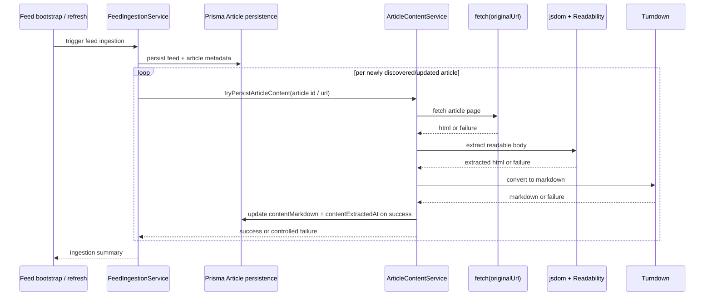

# feat: 在 ingestion 期间持久化文章正文

## Overview

这份计划彻底替换掉之前以 CLI/backfill 为中心的方向。正确的 v0.1 第三切片不是一个需要开发者手动触发的同步脚本，而是把文章正文落库纳入系统的正常 ingestion 生命周期，同时保持现有 feed 发现主干 fail-open，并继续维持很薄的公开 `/articles` 契约。

推荐方案吸收了 Miniflux 和 FreshRSS 的共同模式：

- 正文持久化属于系统正常 refresh/ingestion 路径，而不是人工脚本
- 正文抽取必须保持 best-effort，这样即使抽取失败，feed/文章发现仍然成功
- 单篇 retry HTTP 接口可以作为补救路径存在，但它不是主触发面

本切片仍然不把 Markdown 暴露给前端，也仍然不生成 AI 摘要。本轮目标只有一个：让正文内容能稳定落库，为后续摘要能力准备输入层。

## Problem Frame

`apps/api` 已经能抓 feed 元数据并持久化 `Article` 行，但这些记录目前只包含 feed 层字段，例如标题、原文 URL、发布时间和兼容性 `summary`。这还不足以支撑后续 AI 摘要。缺失的能力是：把文章正文稳定持久化下来。

之前那版计划的问题在于，它把能力中心放在 package-local 命令上。那会让正文落库变成一个可选的人工操作，而不是系统默认行为。对当前产品方向来说，这个默认值是错的。系统既然已经发现并落库文章元数据，就应该顺势尝试正文抽取。

与此相关的当前仓库事实：

- `apps/api/src/feeds/feed-bootstrap.service.ts` 已经拥有启动期 ingestion 语义。
- `apps/api/src/feeds/feed-ingestion.service.ts` 已经负责 feed 抓取、规范化、best-effort 循环与持久化更新。
- `apps/api/src/articles/articles.controller.ts` 当前只暴露很薄的只读接口。
- `apps/api/prisma/models/article.prisma` 仍然没有正文存储字段。

因此，正确的边界应该是：

- `feeds` 仍然负责文章发现与元数据持久化
- 新的 `article-content` feature 负责 HTML 抓取、正文提取、Markdown 转换与正文落库
- feed ingestion 在 best-effort 语义下调用这个 feature，作为正常流程的一部分
- 单篇 retry HTTP 接口只作为补救路径，在需要时重跑某一条文章

## 外部最佳实践方向

### Miniflux

通过 DeepWiki 可见，Miniflux 的主路径是在 feed refresh / 后台处理过程中抓取全文，同时也保留了按需的单篇 HTTP/UI 抓取动作。关键不是它的语言栈，而是触发模型：

- 自动 refresh 路径负责正常 enrichment
- 单篇按需动作负责补救或覆盖
- 富化内容最终挂在 entry/article 记录上

### FreshRSS

通过 DeepWiki 可见，FreshRSS 更倾向于把全文抓取内联在 feed actualization/update 流程里，通常由 cron/systemd 或 UI update 驱动。关键点在于：全文落库属于 feed 更新生命周期，而不是开发者手工同步脚本。

### 对本仓库的推荐

这个仓库最适合采用两者的折中模式：

- **主路径：** 在正常 feed ingestion / refresh 时自动尝试正文落库
- **辅路径：** 提供一个单篇 retry 接口用于补救和验证
- **明确不推荐：** 把开发者手动执行的 `pnpm script` 作为正文同步主路径

这个推荐最符合当前目标（正文应自动存在，为后续 AI 摘要服务）以及当前代码形态（已有 ingestion 主干、公开 read API 很薄、当前不需要 UI 消费 Markdown）。

## Requirements Trace

- R1. 系统必须把文章正文落库纳入正常 ingestion / refresh 生命周期，而不是依赖开发者手动同步脚本。
- R2. 系统必须从 `Article.originalUrl` 抓取文章 HTML，提取可读正文，转换为 Markdown，并回写到同一条 `Article` 记录。
- R3. 这条持久化路径必须保持 best-effort：即使正文抽取失败，文章发现与元数据落库仍然成功。
- R4. `Article` 必须新增可空 `contentMarkdown` 与 `contentExtractedAt` 字段。
- R5. 当前 `summary` 字段必须保留现有语义，继续表示 feed 提供的 summary/description 兼容文本。
- R6. 本切片中 `GET /articles` 与 `GET /articles/:id` 的公开返回必须保持不变。
- R7. 系统可以增加一个单篇文章 retry HTTP 接口作为补救路径，但该接口必须是次级路径，而不是正文落库的主触发面。
- R8. 本切片必须包含自动化测试，用受控 HTML fixtures 证明正文抽取与持久化路径。
- R9. HTML 提取失败必须 fail-open，不能破坏现有 article 行。
- R10. 所有 schema、依赖与运行时所有权都继续留在 `apps/api`。
- R11. 实现阶段新增的任何包都必须是在当前依赖图下尽可能新的无冲突稳定版本；如果无法干净安装，就必须停下并暴露冲突。

## Scope Boundaries

- 不新增 package-local 或 root-level 的 `pnpm` 同步脚本作为主触发面。
- 本切片不通过公开 article 读取 API 暴露 `contentMarkdown`。
- 本切片不做前端消费正文内容。
- 本切片不做 AI 摘要、标题翻译或分层摘要。
- 本切片不增加持久化 job queue、run-history 表，或 scheduler 管理面。
- 本切片不引入浏览器自动化、登录流程、付费墙处理或反爬绕过。
- 不允许正文抽取失败阻断 feed/文章 ingestion。

## Context & Research

### Relevant Code and Patterns

- `apps/api/src/feeds/feed-ingestion.service.ts` 是当前最自然的落点，因为它已经负责 feed 抓取循环、按项规范化与持久化。
- `apps/api/src/feeds/feed-bootstrap.service.ts` 已经定义了启动触发的 ingestion 生命周期。
- `apps/api/src/articles/article.repository.ts`、`apps/api/src/articles/articles.service.ts`、`apps/api/src/articles/articles.controller.ts` 说明当前 article 对外契约刻意保持很薄。
- `apps/api/test-support/database.ts` 负责 database-backed 测试的 reset 与 migration replay。
- `apps/api/e2e/feed-ingestion.e2e-spec.ts` 已经提供了 fetch mocking 与持久化验证模式。
- `apps/api/e2e/articles.e2e-spec.ts` 与 `apps/api/src/articles/article.repository.spec.ts` 保护着当前只读契约，schema 增长后仍必须保持通过。

### Dependency Direction

计划中的抽取栈仍然是：

- `@mozilla/readability`
- `jsdom`
- `turndown`
- 一个支持 GFM 的 Markdown 转换扩展（前提是能与当前栈干净安装）

实现时必须选择与 `apps/api` 当前依赖图能干净兼容的尽可能新稳定版本。如果首选 GFM 插件线过旧、无法干净安装，就应该停下并显式确认一个更小的维护中替代方案，或最小本地 fallback 规则，而不是硬装。

## Key Technical Decisions

- 在 `apps/api` 内建立独立的 `article-content` feature 边界，而不是把抽取逻辑直接埋进 `feeds` 或 `articles`。
- feed ingestion 继续负责文章发现编排，但在 metadata 已经规范化并准备持久化后，以 best-effort 方式调用 `article-content` 进行正文抽取。
- 正文内容直接挂在现有 `Article` 行上，通过可空 `contentMarkdown` 与 `contentExtractedAt` 持久化。
- 正文抽取必须 fail-open：抓取、解析、转换失败时，元数据行仍然落库，article 读取能力不受影响。
- 增加一个单篇 retry HTTP 接口，用于补救和验证。但系统不能依赖操作者手动调用它来完成正常正文落库。
- `summary` 语义保持不变，公开 `/articles` 契约保持不变。
- 处理不可信 HTML 时，保持 jsdom 的脚本执行与子资源执行关闭。
- Markdown 转换前的 HTML 清洗保持最小化；本切片目标是“稳定存储”，不是“最终渲染质量”。

## Open Questions

### Resolved in This Revision

- **主触发面应该是 CLI/script 吗？** 不应该。这个方向是错的，已经从计划中移除。
- **系统应该自动落库正文吗？** 应该。自动落库现在是主路径。
- **是否仍然需要补救入口？** 需要。单篇 retry 接口仍有价值，但仅作为次级路径。
- **本切片是否要把 Markdown 或 AI 摘要暴露给前端？** 不要。本轮只做存储。

### Deferred to Implementation

- 单篇文章抓取的具体 timeout 常量。
- 单篇 retry 路由的最终命名，只要边界清晰且保持次级定位即可。
- 通过 fixture 驱动测试收敛出的最小稳定 Markdown 规范化规则。

## High-Level Technical Design

## Implementation Units

- [x] **Unit 1: 扩展 `Article` 持久化形状，同时保持公开 read 契约不变**

**Goal:** 新增正文存储字段，并证明现有 read API 完全不变。

**Requirements:** R4, R5, R6, R9, R10

**Dependencies:** None

**Files:**

- Modify: `apps/api/prisma/models/article.prisma`
- Create: `apps/api/prisma/migrations/<timestamp>_add_article_content_markdown/migration.sql`
- Modify: `apps/api/e2e/prisma-schema.e2e-spec.ts`
- Modify: `apps/api/src/articles/article.repository.spec.ts`
- Modify: `apps/api/e2e/articles.e2e-spec.ts`

**Approach:**

- 增加可空 `contentMarkdown` 与 `contentExtractedAt`。
- article DTO 映射完全保持不变。
- 扩展测试，显式证明新增列不会改变 `/articles` 与 `/articles/:id` 的返回结构。

**Verification:**

- 数据库行可以保存正文内容，同时公开读取 API 在字段层面保持完全兼容。

- [x] **Unit 2: 构建 `article-content` 正文抽取流水线**

**Goal:** 创建从 article URL + HTML 到“可持久化 Markdown 或受控失败”的纯转换层。

**Requirements:** R2, R3, R8, R9, R10, R11

**Dependencies:** Unit 1

**Files:**

- Modify: `apps/api/package.json`
- Create: `apps/api/src/article-content/article-content.module.ts`
- Create: `apps/api/src/article-content/article-content-extraction.service.ts`
- Create: `apps/api/src/article-content/article-content-extraction.service.spec.ts`
- Create: `apps/api/src/article-content/fixtures/clean-article.html`
- Create: `apps/api/src/article-content/fixtures/noisy-relative-links-article.html`
- Create: `apps/api/src/article-content/fixtures/non-readerable-page.html`

**Approach:**

- 抽取依赖只装在 `apps/api`。
- 该服务不直接处理持久化：输入是 article URL + 原始 HTML，输出是 Markdown 成功结果或受控失败原因。
- 使用带页面 URL 的 jsdom、Readability 做正文提取，再做最小清洗和 Turndown 转换。

**Verification:**

- 基于 fixture 的测试可以在不碰数据库的前提下，验证稳定 Markdown 输出与受控失败行为。

- [x] **Unit 3: 在 ingestion 中自动调用正文落库能力**

**Goal:** 让正文落库成为正常 article-ingestion 生命周期的一部分。

**Requirements:** R1, R2, R3, R6, R8, R9, R10, R11

**Dependencies:** Unit 1, Unit 2

**Files:**

- Modify: `apps/api/src/feeds/feed-ingestion.service.ts`
- Modify: `apps/api/src/feeds/feeds.module.ts`
- Create: `apps/api/src/article-content/article-content.repository.ts`
- Create: `apps/api/src/article-content/article-content.service.ts`
- Create: `apps/api/src/article-content/article-content.service.spec.ts`
- Modify: `apps/api/e2e/feed-ingestion.e2e-spec.ts`

**Approach:**

- 在 feed entries 已规范化并持久化之后，对新发现/更新且 eligible 的文章调用 `article-content`。
- 正文抽取路径保持 best-effort，并把失败隔离在当前文章内。
- 沿用 feed ingestion 现有的结构化日志风格记录 success/failure。
- 对已经有 `contentMarkdown` 的记录默认不重复处理，除非后续由显式 retry 路径请求重跑。

**Verification:**

- 当正文抽取失败时，feed ingestion 仍然完成元数据落库；当正文抽取成功时，系统会自动把正文持久化下来。

- [x] **Unit 4: 增加单篇 retry HTTP 接口作为补救路径**

**Goal:** 提供一个狭窄的后端触发面，用来在自动落库被跳过或失败后，针对某一篇文章重跑正文抽取。

**Requirements:** R7, R9, R10

**Dependencies:** Unit 1, Unit 2, Unit 3

**Files:**

- Create: `apps/api/src/article-content/article-content.controller.ts`
- Modify: `apps/api/src/app.module.ts`
- Create: `apps/api/e2e/article-content-retry.e2e-spec.ts`

**Approach:**

- 新增一个只作用于单篇文章的路由，边界清晰地挂在 article-content feature 下。
- 接口保持狭窄：输入一篇文章，执行一次 retry。
- 返回一个简短结构化结果，例如 `succeeded`、`failed`、`skipped`，必要时附带简短原因。
- 文档和实现都要明确：这是补救路径，不是系统正常正文落库的依赖前提。

**Verification:**

- 一次定向 HTTP 调用可以为某篇文章重跑正文抽取并成功落库，同时不改变公开 article 读取契约。

- [x] **Unit 5: 更新文档，纠正触发模型**

**Goal:** 去掉旧的 script-centered 心智模型，并把“自动落库 + 单篇 retry 补救”写清楚。

**Requirements:** R1, R6, R7

**Dependencies:** Unit 1, Unit 2, Unit 3, Unit 4

**Files:**

- Modify: `apps/api/README.md`
- Modify: `README.md`
- Modify: `README.zh-Hans.md`

**Approach:**

- 明确说明：文章正文现在会在 ingestion 时自动尝试落库。
- 明确说明：retry 接口只是补救路径，不是默认工作流。
- 继续保持文档与实际产品边界一致：Markdown 只是内部存储层，当前不对前端暴露。

**Verification:**

- 文档不再暗示“通过手动脚本同步正文”，而是准确描述自动落库模型。

## System-Wide Impact

- **主要行为变化：** 系统会在 article ingestion 期间自动尝试正文落库。
- **失败模型：** 正文抽取失败变成局部、非阻断式 enrichment 失败，而不是 ingestion blocker。
- **API 行为：** 现有 article 读取 API 保持不变；新增一个狭窄的 retry 接口作为补救路径。
- **产品姿态：** 本切片只为未来 AI 摘要准备已落库的正文输入，不提前把正文暴露到 UI。

## Risks & Mitigations

| Risk                                           | Mitigation                                                                      |
| ---------------------------------------------- | ------------------------------------------------------------------------------- |
| 正文抽取让 ingestion 变慢或更容易失败。        | 保持 bounded timeout、best-effort 以及与元数据落库解耦。                        |
| 某些来源页面 HTML 过于混乱，抽取成功率不稳定。 | 用 fixture 驱动测试固定主路径，把失败保持为非阻断，并把来源特化规则推迟到以后。 |
| 偏好的 Markdown 插件栈存在依赖冲突。           | 选择尽可能新且能干净安装的稳定版本；一旦依赖路径变得冲突密集就停下。            |
| 操作者可能误把 retry 接口理解成主工作流。      | 在文档与实现里明确把它标为 repair path。                                        |

## Sources & References

- **Origin documents:** `docs/en/brainstorms/2026-04-17-v0-1-slice-3-article-markdown-storage-requirements.md`, `docs/zh-Hans/brainstorms/2026-04-17-v0-1-slice-3-article-markdown-storage-requirements.md`
- **Relevant code:** `apps/api/src/feeds/feed-ingestion.service.ts`, `apps/api/src/feeds/feed-bootstrap.service.ts`, `apps/api/src/articles/articles.controller.ts`, `apps/api/test-support/database.ts`, `apps/api/e2e/feed-ingestion.e2e-spec.ts`
- **External architectural references via DeepWiki:** `miniflux/v2`, `FreshRSS/FreshRSS`
