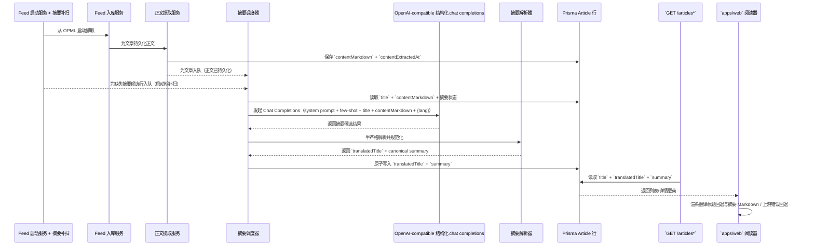
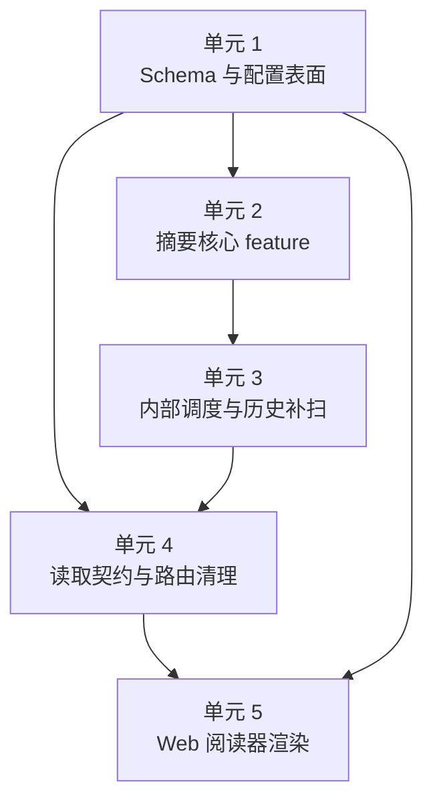
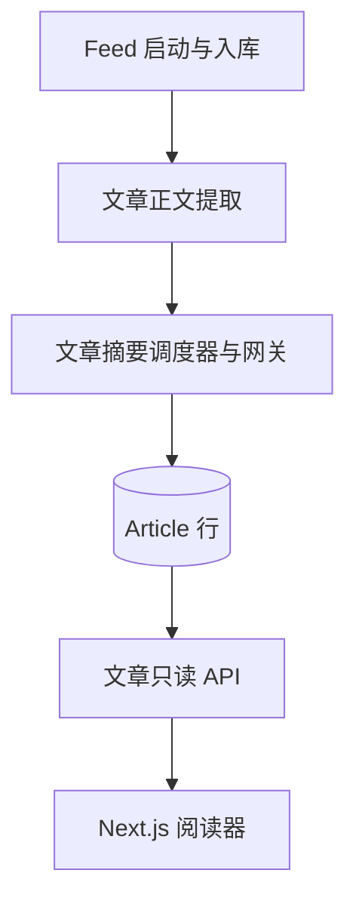

# feat: 交付 v0.1 LLM 摘要阅读器切片

## Overview

这份计划把“文章正文持久化”切片真正转成 v0.1 的第一条产品主链路：已持久化的文章元数据和 `contentMarkdown` 将进一步产出可直接消费的翻译标题与阅读摘要，让现有双栏阅读器直接消费。计划保持公开表面只读、保持 LLM 集成边界很薄，并把“摘要缺失”视为内部富化问题，而不是用户触发动作。

## Problem Frame

`tmp/v0.1/v0.1.md` 把产品定义成“摘要优先的 RSS 筛选器”，不是传统 RSS 阅读器。origin requirements 明确要求两个产品语义切换：

- `Article.summary` 不再表示“feed 兼容描述文本”，而改为摘要阅读器的已准备主产物（see origin: `docs/zh-Hans/brainstorms/2026-04-18-v0-1-slice-4-llm-summary-reader-requirements.md`）。
- 系统不仅要覆盖新完成正文富化的文章，还要覆盖已经持久化、已具备 `contentMarkdown`、但还没有完整摘要结果的历史文章（see origin: `docs/zh-Hans/brainstorms/2026-04-18-v0-1-slice-4-llm-summary-reader-requirements.md`）。

当前仓库里会直接影响方案边界的事实：

- `apps/api/src/feeds/feed-ingestion.service.ts` 已经拥有 feed refresh 循环和文章发现主路径。
- `apps/api/src/article-content/article-content.service.ts` 已经在 fail-open 语义下持久化 `contentMarkdown`，但它仍然只负责正文抽取。
- `apps/api/src/articles/article.repository.ts` 与 `apps/web/src/widgets/article-reader/ui/article-detail.tsx` 仍然默认旧的薄读合同：`title` 加纯文本 `summary`。
- `apps/api/src/article-content/article-content.controller.ts` 仍然暴露 `POST /article-content/:id/retry`，这已经与本切片的只读产品姿态冲突。

因此，这份 plan 需要同时解决四个互相关联的问题：

1. 为翻译标题和已准备摘要建立安全的持久化形状；
2. 加入一个面向 gateway 的薄 LLM 集成，但不把 provider-specific 抽象拖进仓库；
3. 让新旧 eligible 文章都能通过内部触发进入摘要生成链路；
4. 改造 read contract 和 Web 阅读器来消费翻译标题与 Markdown 摘要，同时关闭公开写入口。

## Requirements Trace

- R1-R5 — 摘要生成是预先准备的内部生产步骤，输入把 `title + contentMarkdown` 当成一个语义单元，一次成功写入一个翻译标题与一个固定格式阅读摘要，并保持摘要优先的阅读心智。
- R6-R9 — 外部 LLM 访问收敛到一个 OpenAI-compatible 表面，只保留 `LLM_BASE_URL`、`LLM_API_KEY`、`LLM_MODEL`、`LLM_SUMMARY_LANGUAGE` 以及一个可选 timeout 配置，把 retry/fallback 复杂性留在应用外部。
- R10-R16 — 摘要契约是一份英文 system prompt，包含少量 few-shot、`{lang}` 注入、保守的 source-only 行为，以及三段式 Markdown 输出；其中 `## Title` 的语义是“原标题翻译”，不是重写标题。
- R17-R24 — 摘要生成在正文抽取后由内部触发，覆盖新文章和历史文章，`translatedTitle` 与 `summary` 原子化写入，后续成功重生时直接覆盖，整体保持 fail-open。
- R25-R30 — 公开表面保持只读，`POST /article-content/:id/retry` 被删除，列表与详情优先显示翻译标题，桌面双栏阅读器继续是主要 UX。
- R31-R39 — 没有 `contentMarkdown` 的文章不被强制要求生成摘要，gateway 的暂时性错误只做三次隐式重试且间隔 1 分钟，解析对 `Title / Summary / Key Points` 采用半严格策略，禁止半套持久化，可观测性保持在日志与自动化测试层面。

## Scope Boundaries

- 不做移动端适配、键盘快捷键、digest/timeline 产品或批量 briefing 面。
- 不做用户可见的“重新生成摘要”按钮，也不新增替代性的公开写接口。
- 不做按用户切换语言；`LLM_SUMMARY_LANGUAGE` 继续是部署级配置。
- 不做独立 `ArticleSummary` 表、版本历史、prompt-version 跟踪模型或持久化 job queue。
- 不做 provider-specific adapter 矩阵、多 gateway 路由器、复杂 retry/fallback 中心或用户可见运维面板。
- 不要求公开暴露 `contentMarkdown`。
- 不把摘要主产物扩展成复杂嵌套 JSON 契约；任何结构化辅助都必须保持浅层且仅内部使用。
- 不允许只写 `translatedTitle` 或只写 `summary` 这种半套结果。

## 计划中的依赖方向

- 本切片如果要引入新的 registry 依赖，必须在实现开始时先明确披露，并且只安装到真正拥有它的 workspace，不能装到仓库根目录。
- 版本策略：优先选择实现时可用、且不与当前 workspace 依赖图冲突的尽可能新、最新稳定版本。如果最新发布版会引入 peer conflict、需要大量 overrides、或带来与本切片无关的依赖连带升级，就退回到“最新无冲突稳定版”。
- 基于外部调研后，本切片明确采用的 package 方案：
  - `apps/web/package.json` — 增加 `react-markdown` 与 `remark-gfm`，作为持久化摘要主产物的具体 Markdown 渲染栈。
  - `apps/api/package.json` — 增加 `openai`，作为 OpenAI-compatible Structured Outputs 与请求构造的具体 SDK。
  - `apps/api/package.json` — 增加 `zod`，作为 `Title / Summary / Key Points` 结构 schema 定义与校验 helper。
- 依赖变更必须保持 package-local。本切片不需要新的根级运行时依赖，不应该借机做跨 workspace hoist，也不应该顺手扩大成无关的依赖刷新工作。

## Context & Research

### Relevant Code and Patterns

- `apps/api/src/feeds/feed-ingestion.service.ts` 已经提供了仓库当前的顺序式 best-effort 富化模式，以及 content extraction 使用的 remaining-budget 处理方式。
- `apps/api/src/article-content/article-content.service.ts` 已经定义了 fail-open 富化边界、fetch timeout 处理，以及结构化 JSON 日志风格；摘要生成应该复用这种风格，而不是另起一套。
- `docs/zh-Hans/solutions/integration-issues/feed-ingestion-retries-missing-article-markdown-2026-04-17.md` 与 `docs/en/solutions/integration-issues/feed-ingestion-retries-missing-article-markdown-2026-04-17.md` 明确了一条很关键的编排规则：历史上“不完整的既有行”必须通过正常内部主路径重新入队，而不能依赖补救端点。
- `apps/api/src/articles/*` 与 `apps/api/e2e/articles.e2e-spec.ts` 正在保护当前薄 read contract；任何 DTO 或字段形状变动都必须穿过 repository、service、controller 和 e2e 合同测试一起更新。
- `apps/web/src/widgets/article-reader/ui/article-reader-page.tsx` 与 `apps/web/src/widgets/article-reader/ui/article-detail.tsx` 展示了当前服务端取数 seam 和 detail pane 渲染面；本切片需要在这里接入 Markdown 摘要渲染和 translated-title fallback。
- `apps/web/e2e/home.spec.ts` 已经证明了浏览器层面的关键不变量：默认选中第一篇、URL 持久化选择、stale detail fallback。新切片必须保住这些行为。

### Institutional Learnings

- 上面的 markdown recovery 解决方案文档已经证明，“existing row but incomplete enrichment” 在这个代码库里是真实回归形状，所以历史缺失摘要必须是主设计的一部分，不能当成收尾问题。
- 同一份 solution 也说明了，repair endpoint 很容易被高估；当产品合同写的是“自动富化”，测试就必须直接断言自动主路径，而不是默认人工补救也可以。
- 更早的 read-path plan（`docs/en/plans/2026-04-10-001-feat-first-vertical-slice-read-path-plan.md` + `docs/zh-Hans/plans/2026-04-10-001-feat-first-vertical-slice-read-path-plan.md`）已经定下仓库预期：web reader 继续保持 URL 驱动 + 服务端取数；摘要工作应该扩展这条 seam，而不是额外发明 client-state 编排。

### External References

- OpenAI Chat Completions API reference: `https://developers.openai.com/api/reference/resources/chat/subresources/completions/methods/create/`
- OpenAI Structured Outputs guide: `https://developers.openai.com/api/docs/guides/structured-outputs`
- OpenAI JavaScript SDK docs: `https://platform.openai.com/docs/libraries/javascript`
- OpenAI rate-limit guide: `https://developers.openai.com/api/docs/guides/rate-limits/`
- OpenAI error-code guide: `https://platform.openai.com/docs/guides/error-codes/`
- LiteLLM OpenAI-compatible endpoint docs: `https://docs.litellm.ai/docs/providers/openai_compatible`
- `ChatGPTNextWeb/NextChat` 的 DeepWiki package 调研：`https://deepwiki.com/search/for-this-repository-which-npm_db076053-4c7a-49eb-89c2-d30d24d63cf3`
- `lobehub/lobe-chat` 的 DeepWiki package 调研：`https://deepwiki.com/search/for-this-repository-which-npm_f055647b-4050-4233-9c8e-654e7059288a`
- `vercel/ai-chatbot` 的 DeepWiki package 调研：`https://deepwiki.com/search/for-this-repository-which-npm_69a35a70-24fa-4303-9608-e284b4b77bf2`

这些来源给出两条对本仓库很关键的结论：

- OpenAI 对 OpenAI-native 新项目推荐更新的结构化 API，但 OpenAI-compatible gateway 当前仍然主要围绕 `/chat/completions` 兼容面组织；因此本切片应在这个兼容面上使用 SDK 驱动的结构化输出路径。
- 由于本切片明确把“OpenAI-compatible 的结构化输出可用”视为既定前提，计划可以把 SDK 驱动的 Structured Outputs 作为主合同，而不是把它降级成可选增强。

### 外部 package 调研结论

- `ChatGPTNextWeb/NextChat` 使用 `react-markdown` + `remark-gfm` 做 Markdown 渲染，更多插件主要服务聊天富文本场景；这支持把这组组合作为最小主流渲染基线。
- `lobehub/lobe-chat` 也携带 `react-markdown`、`remark-gfm`、`zod` 和官方 `openai` 包；这组组合和本切片更接近，因为它把 Markdown 渲染与结构化 LLM 契约拆成了两层。
- `vercel/ai-chatbot` 使用 `streamdown` 和 Vercel AI SDK 栈（`ai`、`@ai-sdk/react`、`@ai-sdk/gateway`）来服务流式聊天 UX；这更适合交互式生成，而不是已落库摘要的展示。
- 基于这轮调研，本切片应采用“最小但主流”的 TypeScript 方案：`apps/web` 用 `react-markdown` + `remark-gfm`，`apps/api` 用 `openai` + `zod`。

## Key Technical Decisions

| Decision               | Chosen direction                                                                                                         | Why this wins now                                                                                 |
| ---------------------- | ------------------------------------------------------------------------------------------------------------------------ | ------------------------------------------------------------------------------------------------- |
| 摘要触发所有权         | 新建 `article-summary` feature 负责调度和执行；`article-content` 只负责在正文持久化成功后发信号                          | 能把正文抽取和 LLM 工作隔开，避免阻塞 feed-content timeout budget，也让历史 backfill 有明确 owner |
| 历史覆盖策略           | 除了新正文保存后的即时调度外，再加一次启动期 backfill sweep，扫描已有 `contentMarkdown` 且缺失完整摘要结果的行           | 仅依赖 feed replay 无法保证历史文章会再次出现在后续 RSS payload 里                                |
| Gateway 表面           | 使用官方 `openai` SDK 指向 OpenAI-compatible base URL，并走兼容的 chat-completions 结构化输出路径                        | 既沿用生态里的标准 SDK，又直接贴合 explicit 的 OpenAI-compatible 要求                             |
| 输出校验方式           | 先用 Structured Outputs + `zod` 拿到主合同，再把该结构化结果规范化成 canonical Markdown，并单独保存 `translatedTitle`    | 同时满足产品合同、让 web renderer 保持简单，并让持久化产物成为同一份已校验结果的确定性投影        |
| Read contract 形状     | API 同时暴露 `title`（原标题）和可选 `translatedTitle`，展示回退在 web 层完成                                            | 既保留原标题用于调试/回退，又让 UI 行为变得显式且可测试                                           |
| `Article.summary` 语义 | 停止把 feed description 写入 `Article.summary`，并在 migration 里清空旧兼容值，把空摘要视为“尚未准备好”                  | 能防止后续 ingestion 覆盖 AI 摘要，也能避免把旧兼容文本误当成新的产品产物                         |
| Web 渲染方式           | 在 detail pane 直接渲染 canonical summary Markdown                                                                       | 让 Markdown 真正成为输出契约，而不是在 UI 下游重新拼装一个摘要对象                                |
| Retry 模型             | 用串行的内存内 dispatcher，对 timeout / `429` / `5xx` 只做三次、每次间隔 1 分钟的内部重试                                | 满足需求，又不用引入 queue，同时还能把 gateway 压力控制在可恢复范围内                             |
| 刷新规则               | 当正文重新抽取成功，或 feed ingestion 观察到一条已有 `contentMarkdown` 的文章其原始 `title` 发生变化时，重新触发摘要生成 | 避免 `translatedTitle` 与 Markdown 摘要只会补空、不随最新持久化源材料更新而漂移                   |

## Open Questions

### Resolved During Planning

- **`contentMarkdown` 持久化后，究竟由哪个内部触发点负责摘要生成？** 使用独立的 `article-summary` feature。`ArticleContentService` 只在正文写入成功后 schedule 摘要工作，不在行内直接调用 LLM；历史文章由 bootstrap backfill sweep 覆盖。
- **第一版 Web 阅读器是否需要同时支持 Markdown 渲染？** 需要。摘要主产物按合同就是 Markdown，所以 detail pane 这一轮就应该直接渲染，而不是先压平为纯文本。
- **本切片该用 Responses 还是 Chat Completions？** 选 `openai` SDK 驱动的 OpenAI-compatible chat-completions 结构化输出路径。原因不是“更新 API 不好”，而是本切片显式要求 OpenAI-compatible gateway，而当前兼容边界仍以这一路径为准。
- **API 是否应该把翻译标题藏进改写过的 `title` 字段？** 不应该。保留 `title` 为原标题，新增 `translatedTitle`，由 web 统一做 `translatedTitle ?? title` 的展示回退。

### Deferred to Implementation

- 如果首次 gateway 测量显示单一默认值过于激进或过于宽松，`LLM_TIMEOUT_MS` 的最终默认数值可以在实现阶段确认。plan 只要求存在这个可选配置位，不在此处假装已经测量完毕。
- 第一版安全 Markdown renderer 落地后，detail pane 是否需要额外的排版细化可以在实现阶段观察；本 plan 要求的是 Markdown 渲染正确和 fallback 正确，不要求顺手做一轮视觉 redesign。

## High-Level Technical Design

> _This illustrates the intended approach and is directional guidance for review, not implementation specification. The implementing agent should treat it as context, not code to reproduce._

## Implementation Units

- [x] **Unit 1: 扩展 prepared summary 所需的持久化与运行时配置**

**Goal:** 为翻译标题持久化和薄 gateway 配置补齐数据库与配置形状，同时不把 provider-specific 抽象强塞进仓库。

**Requirements:** R3, R6, R7, R8, R18, R19, R21, R33

**Dependencies:** None

**Files:**

- Modify: `apps/api/prisma/models/article.prisma`
- Create: `apps/api/prisma/migrations/<timestamp>_add_article_summary_fields/migration.sql`
- Modify: `apps/api/prisma/seed/seed.sql`
- Modify: `apps/api/src/config/env.validation.ts`
- Modify: `apps/api/src/config/app-config.ts`
- Modify: `apps/api/src/config/app-config.spec.ts`
- Modify: `apps/api/.env.example`
- Test: `apps/api/e2e/prisma-schema.e2e-spec.ts`

**Approach:**

- 给 `Article` 增加 `translatedTitle`，用非空字符串 + 空字符串默认值表示“还没有完整摘要结果”，避免 nullable tri-state 复杂度。
- migration 要清空旧的兼容性 `summary`，避免历史行继续把 feed description 误当成已准备 AI 摘要展示出来。
- app config 只补最小 LLM 表面：base URL、API key、model、部署语言（默认 `zh-CN`）和一个可选 timeout。
- 运行时验证继续保持对全应用 fail-open：缺失 LLM 设置应该阻止摘要生成，不应该让基础 read-path 启动都失败；所以 config 需要能区分“gateway unavailable”和“database unavailable”。

**Patterns to follow:**

- `apps/api/src/config/app-config.ts`
- `apps/api/src/config/app-config.spec.ts`
- `apps/api/prisma/models/article.prisma`
- `apps/api/prisma/migrations/202604150001_init_feed_ingestion/migration.sql`

**Test scenarios:**

- Happy path — migration 新增 `translatedTitle`，保留现有 article 行，且把旧 `summary` 清到新的 empty-state 基线。
- Happy path — 未设置 `LLM_SUMMARY_LANGUAGE` 时默认值为 `zh-CN`。
- Edge case — 现有相对/绝对 `FEED_OPML_PATH` 在 config 扩展后仍按原语义解析。
- Error path — 缺失 `DATABASE_URL` 仍然 fail fast；缺失 `LLM_*` 不会把无关的 read-path 启动一起打断。
- Integration — checked-in seed 能同时表达“prepared summary 已存在”和“summary 尚未准备好”两种状态，而不再依赖旧的 feed-description 语义。

**Verification:**

- 数据库已经能区分“行上有 prepared summary”与“行仍等待摘要生成”，应用也能读取 LLM 设置而不把它和其他运行时前提绑死。

- [x] **Unit 2: 建立 `article-summary` feature 边界，承接 prompt、gateway、解析与原子持久化**

**Goal:** 创建一个自包含的 Nest feature，把 `title + contentMarkdown` 转成可验证的 prepared summary 结果。

**Requirements:** R1, R2, R3, R4, R6-R16, R20-R24, R34-R38

**Dependencies:** Unit 1

**Files:**

- Create: `apps/api/src/article-summary/article-summary.module.ts`
- Create: `apps/api/src/article-summary/article-summary.repository.ts`
- Create: `apps/api/src/article-summary/article-summary.gateway.ts`
- Create: `apps/api/src/article-summary/article-summary.prompt.ts`
- Create: `apps/api/src/article-summary/article-summary.parser.ts`
- Create: `apps/api/src/article-summary/article-summary.service.ts`
- Test: `apps/api/src/article-summary/article-summary.parser.spec.ts`
- Test: `apps/api/src/article-summary/article-summary.service.spec.ts`

**Approach:**

- 按仓库现有 Nest feature-module 习惯，把新代码完整放在 `apps/api/src/article-summary/`。
- 后端依赖压力仍然要保持克制，但主合同明确使用标准工具：传输与结构化解析用官方 `openai` SDK，repo 自己拥有的摘要 schema 用 `zod`。
- 用 SDK 指向 `LLM_BASE_URL` 的 OpenAI-compatible chat-completions 结构化输出路径，发送英文 system prompt + few-shot，运行时从配置注入 `{lang}`，并区分 retryable / permanent failure。
- 把一个结构化结果形状当成主合同：`translatedTitle`、一段摘要、以及 ordered key points。该结果通过校验后，再重组为稳定的 `## Title`、`## Summary`、`## Key Points` canonical Markdown。
- 只有结构化结果通过 schema 校验后，repository 才一次性写入 `translatedTitle` 与 canonical `summary`。永久失败或重试耗尽时，两者都保持为空。
- 在 schema 校验之后保留一层很薄的本地规范化步骤，保证落库结果即使在模型措辞略有波动时也仍然稳定可比较。

**Patterns to follow:**

- `apps/api/src/article-content/article-content.service.ts`
- `apps/api/src/article-content/article-content.service.spec.ts`
- `apps/api/src/article-content/article-content-extraction.service.ts`
- `apps/api/src/articles/article.repository.ts`

**Test scenarios:**

- Happy path — gateway 成功返回后被解析成 `translatedTitle` + canonical Markdown，并且两个字段一起落库。
- Happy path — heading 仅在大小写或轻微空格上有变化时，仍能解析成功并规范化成 canonical headings。
- Edge case — `Key Points` 只有 2 条或有 6 条时，只要三段结构存在就仍然成功。
- Error path — 缺失 `Title` 段时整次生成失败，并且两个持久化字段都保持为空。
- Error path — `401`/`403`/其他永久 gateway 错误只记录失败，不进入重试。
- Error path — timeout、`429` 和 `5xx` 被正确归类为可重试。
- Integration — 持久化后的 Markdown 足够稳定，web reader 无需自己重拼结构就能渲染 heading、paragraph 和 ordered list。

**Verification:**

- 现在已经有一个 feature boundary 完整拥有摘要合同：prompt、gateway request、parser 与 atomic save 全部和 requirements 文档对齐。

- [x] **Unit 3: 在没有公开 repair endpoint 的前提下加入内部调度、重试与历史 backfill**

**Goal:** 让摘要生成自动覆盖“新完成正文富化的文章”和“历史上已经 eligible 的文章”，同时不破坏现有 feed ingestion 的 fail-open 语义。

**Requirements:** R17, R18, R21-R24, R31-R33, R37-R39

**Dependencies:** Unit 1, Unit 2

**Files:**

- Create: `apps/api/src/article-summary/article-summary-bootstrap.service.ts`
- Modify: `apps/api/src/article-content/article-content.module.ts`
- Modify: `apps/api/src/article-content/article-content.service.ts`
- Modify: `apps/api/src/article-content/article-content.service.spec.ts`
- Modify: `apps/api/src/app.module.ts`
- Modify: `apps/api/src/feeds/feed-bootstrap.service.ts`
- Modify: `apps/api/src/feeds/feed-bootstrap.service.spec.ts`
- Modify: `apps/api/e2e/feed-ingestion.e2e-spec.ts`
- Test: `apps/api/src/article-summary/article-summary-bootstrap.service.spec.ts`

**Approach:**

- 不要把 LLM 调用直接塞进 `FeedIngestionService` 现有 per-article content budget 里。`ArticleContentService` 只在正文持久化成功后 schedule 摘要工作。
- 在 summary feature 内部加一个轻量、串行、内存内 dispatcher，用来做 article ID 去重、限制并发，以及只对 retryable failure 执行“三次 + 间隔 1 分钟”的要求。
- bootstrap 只负责把 eligible rows 入队后立即返回，而不是等待整个 backlog drain 完成，这样才能保持仓库现有的非阻塞启动姿态。
- 再加一个启动期 backfill sweep，查找 `contentMarkdown` 已存在但完整摘要结果仍缺失的行，并把它们交给同一个 dispatcher。它是历史文章与重启恢复的内部恢复路径。
- 当 article-content 重抽成功，或 feed ingestion 发现一条已富化文章的原始 `title` 发生变化时，也复用同一个 dispatcher 触发 summary refresh。
- 整体继续 fail-open：即使 scheduling 或 summary 执行失败，bootstrap 和 feed ingestion 仍然继续，失败原因通过结构化日志暴露。

**Patterns to follow:**

- `apps/api/src/feeds/feed-bootstrap.service.ts`
- `apps/api/src/feeds/feed-bootstrap.service.spec.ts`
- `apps/api/src/article-content/article-content.service.ts`
- `docs/en/solutions/integration-issues/feed-ingestion-retries-missing-article-markdown-2026-04-17.md`

**Test scenarios:**

- Happy path — `ArticleContentService` 成功持久化 `contentMarkdown` 后，会为该文章 schedule 一次 summary job。
- Happy path — bootstrap 能找到历史上 `contentMarkdown` 已存在但 `translatedTitle` 为空的行，把它们入队，并且不会因为等待整个 backlog 完成而阻塞 application bootstrap。
- Edge case — 同一篇文章在执行前被重复 schedule，不会产生重复并发工作。
- Edge case — 当 feed ingestion 更新了一条已经有 `contentMarkdown` 的文章，且原始 `title` 发生变化时，即使它之前已有 prepared summary，也会被重新入队做 summary refresh。
- Error path — 可重试失败会在每次间隔 1 分钟的条件下重试，第三次仍失败后停止，并保持 `translatedTitle` 与 `summary` 为空。
- Error path — 永久 gateway failure 只记录一次，不进入重试。
- Error path — 缺失 LLM 配置时，bootstrap scheduling 只做 clean skip + 日志，而不是把 app startup 一起打断。
- Integration — 即使摘要最终失败，feed ingestion 仍然成功，article row 仍然可读可持久化。

**Verification:**

- 新文章和历史文章都能进入同一条内部摘要链路，而且这条链路失败不会回归现有 ingestion backbone。

- [x] **Unit 4: 清理公开 API 表面，并完成 `Article.summary` 的语义切换**

**Goal:** 删除公开写路由、阻止 feed description 覆盖 prepared summary，并发布 Web 阅读器真正需要的读取形状。

**Requirements:** R3, R20, R25-R30, R33

**Dependencies:** Unit 1, Unit 2, Unit 3

**Files:**

- Modify: `apps/api/src/feeds/feed-ingestion.service.ts`
- Modify: `apps/api/src/feeds/feed-ingestion.service.spec.ts`
- Modify: `apps/api/src/articles/article.repository.ts`
- Modify: `apps/api/src/articles/article.repository.spec.ts`
- Modify: `apps/api/src/articles/articles.service.ts`
- Modify: `apps/api/src/articles/dto/article-list-item.dto.ts`
- Modify: `apps/api/src/articles/dto/article-detail-item.dto.ts`
- Modify: `apps/api/src/articles/articles.controller.spec.ts`
- Modify: `apps/api/e2e/articles.e2e-spec.ts`
- Modify: `apps/api/src/article-content/article-content.module.ts`
- Delete: `apps/api/src/article-content/article-content.controller.ts`
- Delete: `apps/api/e2e/article-content-retry.e2e-spec.ts`
- Modify: `apps/api/README.md`

**Approach:**

- 把 `POST /article-content/:id/retry` controller 从 app surface 中彻底移除。
- feed ingestion 不再把 feed description 写入 `Article.summary`；本切片之后，这个列只属于 prepared summary。
- 当 feed ingestion 更新一条已经有 `contentMarkdown` 的 existing row 时，需要比较新归一化后的原始标题与持久化原标题；如果源标题变化，就重新入队做 summary refresh。
- read DTO 扩展为同时暴露 `translatedTitle`，保留 `title` 为原标题。display fallback 在 web 层做，但 API 已经提供了足够信息，前端不需要重新解析 Markdown 标题。
- 其余读路径继续保持很薄：未知 ID 仍然是 `404`，`contentMarkdown` 仍是内部字段，也仍然没有公开 summary-generation resource。

**Patterns to follow:**

- `apps/api/src/articles/article.repository.ts`
- `apps/api/src/articles/articles.service.ts`
- `apps/api/e2e/articles.e2e-spec.ts`
- `apps/api/README.md`

**Test scenarios:**

- Happy path — `GET /articles` 返回原标题 `title`、可选 `translatedTitle`，且不暴露 `contentMarkdown` 等内部字段。
- Happy path — `GET /articles/:id` 返回 `summary` 与 `translatedTitle`，让 web reader 不必反向解析 Markdown 标题。
- Edge case — 没有完整 prepared summary 的行返回空 `summary` 和空 `translatedTitle`，而不是泄露旧 feed-description 文本。
- Error path — `GET /articles/:id` 对未知 article ID 仍然返回 `404`。
- Error path — `POST /article-content/:id/retry` 已经无法再路由。
- Integration — 后续 feed ingestion 再运行时，不会把已经准备好的 AI 摘要重新覆盖成 feed metadata。
- Integration — 后续 feed ingestion 如果发现源标题发生变化，会重新入队做摘要重算，避免 `translatedTitle` 与最新原标题发生漂移。

**Verification:**

- 公开 API 重新回到只读姿态，`Article.summary` 现在只有一个稳定语义，web client 也能在不发明额外解析规则的前提下做 translated-title fallback。

- [x] **Unit 5: 更新 Web 阅读器，优先显示翻译标题并渲染 canonical summary Markdown**

**Goal:** 让桌面阅读器直接消费 prepared summary 主产物，同时保留现有 URL 驱动导航模型。

**Requirements:** R4, R5, R28-R30, R33, R39

**Dependencies:** Unit 1, Unit 4

**Files:**

- Modify: `apps/web/package.json`
- Modify: `apps/web/src/widgets/article-reader/api/articles-api.ts`
- Modify: `apps/web/src/widgets/article-reader/ui/article-list.tsx`
- Modify: `apps/web/src/widgets/article-reader/ui/article-detail.tsx`
- Modify: `apps/web/app/page.spec.tsx`
- Modify: `apps/web/e2e/home.spec.ts`
- Modify: `apps/web/README.md`

**Approach:**

- 在 `apps/web` 明确使用 `react-markdown` + `remark-gfm` 增加一个薄而安全的 Markdown renderer，并在 detail pane 中直接使用它，让持久化的 summary 字符串自己承载 `Title / Summary / Key Points` 结构。
- Web 侧 Markdown 栈故意保持很小；除非实现证明 canonical summary 格式确实需要，否则不要再引入面向流式聊天的 renderer 或额外 rehype 插件。
- 左侧列表和任何 detail fallback state 都统一做 `translatedTitle ?? title`。
- 删除 detail body 的纯文本渲染分支。header 仍保留 source/date 元信息和 jump-to-original 行为，但真正的阅读内容由 canonical summary Markdown 驱动。
- 当 API 返回空 `summary` 时，按要求展示固定文案 `上游服务错误`，而不是发明新的部分摘要逻辑。
- 保持 `apps/web/app/page.tsx` 与 `apps/web/src/widgets/article-reader/ui/article-reader-page.tsx` 的服务端取数方式不变；不需要引入 client cache 或 mutation layer。

**Patterns to follow:**

- `apps/web/src/widgets/article-reader/api/articles-api.ts`
- `apps/web/src/widgets/article-reader/ui/article-reader-page.tsx`
- `apps/web/app/page.spec.tsx`
- `apps/web/e2e/home.spec.ts`
- `docs/en/plans/2026-04-10-001-feat-first-vertical-slice-read-path-plan.md`

**Test scenarios:**

- Happy path — 列表在 `translatedTitle` 存在时优先显示它，缺失时回退显示 `title`。
- Happy path — detail pane 能从 `summary` 渲染 canonical Markdown headings、paragraph 和 ordered key points。
- Edge case — 空 `summary` 时，固定展示 `上游服务错误`，并保留 reader chrome 可见。
- Error path — stale `articleId` 仍然只触发 pane-level unavailable state，不会把列表一起隐藏。
- Integration — 通过 `apps/api/prisma/seed/seed.sql` 注入的浏览器测试能证明：翻译标题和 Markdown 摘要可以完整穿过 API-to-web seam。

**Verification:**

- 阅读器仍然是桌面优先、URL 驱动的，但它现在消费的就是后端持久化下来的同一份 prepared summary 产物。

## System-Wide Impact

- **Interaction graph:** `FeedBootstrapService` 与 `FeedIngestionService` 继续拥有 feed discovery；`ArticleContentService` 继续拥有 HTML-to-Markdown 持久化；新的 `article-summary` feature 拥有 LLM 调度/执行；`apps/api/src/articles/*` 继续是唯一公开 read seam；`apps/web` 仍然是唯一消费方。
- **Error propagation:** gateway 配置错误、rate limit 和临时上游失败都会被限制在结构化日志与“空 prepared summary”状态里，不会扩展成新的 HTTP 写接口或 API status taxonomy。
- **State lifecycle risks:** 摘要工作故意保持为内存内、best-effort，所以进程重启可能会丢掉尚未完成的重试；bootstrap backfill sweep 就是让这个权衡在 v0.1 可接受的恢复机制。源标题变化后的 refresh 也必须重新进入同一条队列，避免 translated title 静默漂移。
- **API surface parity:** 一旦新增 `translatedTitle` 并移除 `POST /article-content/:id/retry`，DTO、repository mapping、README endpoint 文档、seed data 和 Playwright 预期都必须一起调整。
- **Integration coverage:** 仅靠 unit tests 不够；本切片必须有跨 feed ingestion、bootstrap backfill、API response mapping 和浏览器 Markdown 渲染的端到端覆盖。
- **Unchanged invariants:** `contentMarkdown` 仍是内部字段；不引入公开 regenerate endpoint；不加 per-user language selector；也不加持久化 queue/history model。

## Alternative Approaches Considered

| Approach                                                                    | Why not chosen                                                                                                            |
| --------------------------------------------------------------------------- | ------------------------------------------------------------------------------------------------------------------------- |
| 只在 `FeedIngestionService` 内做 summary generation                         | 无法覆盖那些以后不会再出现在 feed payload 里的历史文章，还会把 LLM 延迟/重试直接绑到现有 feed budget 上                   |
| 直接在 `ArticleContentService.tryPersistArticleContent(...)` 里行内调用 LLM | 会让正文抽取显著变慢，耦合两个 feature boundary，还会把原本一个 content timeout 扩成更大的 summary timeout/retry 窗口     |
| 放弃 Structured Outputs，只靠自由文本 Markdown 解析                         | 本切片已经把 OpenAI-compatible 的 Structured Outputs 视为既定能力；放弃 schema 校验只会丢掉可靠合同，并不会真正减少复杂度 |
| 保留公开 repair endpoint，并额外增加公开 summary endpoint                   | 直接违反 origin document 的只读公开表面要求，也会为 v0.1 额外扩大安全与运维面                                             |

## Risk Analysis & Mitigation

| Risk                                                             | Likelihood | Impact | Mitigation                                                                                                  |
| ---------------------------------------------------------------- | ---------- | ------ | ----------------------------------------------------------------------------------------------------------- |
| 结构化输出结果与仓库持久化摘要合同发生漂移                       | Low        | High   | 用 `openai` SDK 返回值绑定到 repo 自己的 `zod` schema，再把通过校验的结果规范化成 canonical Markdown 后落库 |
| 进程重启或临时失败后，历史文章仍然没有摘要                       | Medium     | High   | 用 bootstrap-time candidate sweep + 以空 `translatedTitle` / 空 `summary` 为准的幂等调度                    |
| 后续 feed ingestion 用 feed description 覆盖掉已准备好的 AI 摘要 | High       | High   | 完全停止把 feed description 写入 `Article.summary`，并用 repository + ingestion tests 把这个回归钉死        |
| Markdown renderer 造成 UI 重复或渲染形状漂移                     | Medium     | Medium | 先持久化 canonical Markdown，再让 detail pane 围绕这份产物渲染，并显式测试 heading/list 输出                |
| 生产环境缺失或错误配置 LLM 参数，导致摘要无法生成                | Medium     | Medium | 在 `.env.example` 和 `apps/api/README.md` 里明确 `LLM_*` 所有权，并在启动期用清晰的 config-missing 日志暴露 |

## Documentation / Operational Notes

- 更新 `apps/api/.env.example` 与 `apps/api/README.md`，记录 `LLM_BASE_URL`、`LLM_API_KEY`、`LLM_MODEL`、`LLM_SUMMARY_LANGUAGE`、可选 timeout 行为、内部 backfill 路径，以及 `POST /article-content/:id/retry` 已被删除。
- 更新 `apps/web/README.md`，说明 translated-title fallback 与 Markdown summary rendering 的预期。
- 可观测性继续保持轻量，只通过像 `article_summary`、`article_summary_bootstrap` 这样的结构化日志 scope 暴露；本切片不新增 dashboard 或 console。
- seed data 至少要包含一篇已准备好 translated title + canonical Markdown summary 的文章，让 browser tests 直接覆盖真实产品形状。

## Sources & References

- **Origin documents:** `docs/en/brainstorms/2026-04-18-v0-1-slice-4-llm-summary-reader-requirements.md` + `docs/zh-Hans/brainstorms/2026-04-18-v0-1-slice-4-llm-summary-reader-requirements.md`
- **Prior plans:** `docs/en/plans/2026-04-17-001-feat-article-markdown-backfill-plan.md` + `docs/zh-Hans/plans/2026-04-17-001-feat-article-markdown-backfill-plan.md`
- **Institutional learnings:** `docs/en/solutions/integration-issues/feed-ingestion-retries-missing-article-markdown-2026-04-17.md` + `docs/zh-Hans/solutions/integration-issues/feed-ingestion-retries-missing-article-markdown-2026-04-17.md`
- **Related code:** `apps/api/src/feeds/feed-ingestion.service.ts`, `apps/api/src/article-content/article-content.service.ts`, `apps/api/src/articles/article.repository.ts`, `apps/web/src/widgets/article-reader/ui/article-detail.tsx`, `apps/web/e2e/home.spec.ts`
- **External docs:** `https://developers.openai.com/api/reference/resources/chat/subresources/completions/methods/create/`, `https://developers.openai.com/api/docs/guides/structured-outputs`, `https://developers.openai.com/api/docs/guides/rate-limits/`, `https://platform.openai.com/docs/guides/error-codes/`, `https://docs.litellm.ai/docs/providers/openai_compatible`
