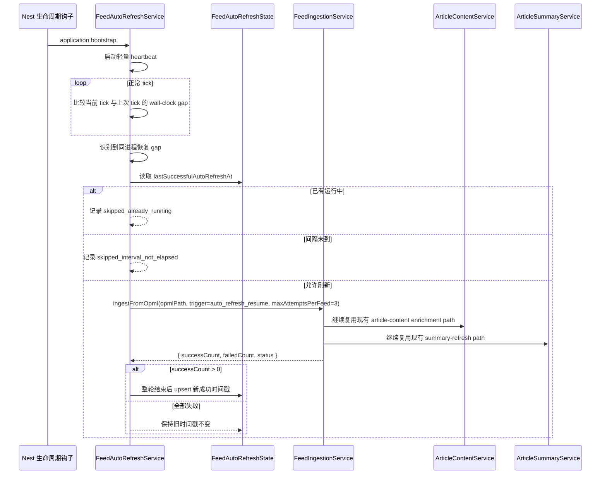

# feat: 增加 feed 唤醒自动刷新

## Overview

这份计划为 `apps/api` 增加一条“同进程唤醒后的自动刷新”路径，同时不改变 `INGEST_ON_BOOT` 现有的启动期语义。API 仍然保持今天的启动入库行为不变，但当同一个仍然存活的进程从长时间睡眠/冻结中恢复时，系统要能判断后台 feed 刷新是否已经过期。

这项工作全部留在 `apps/api` 内完成，继续复用现有的 feed ingestion、article-content enrichment 与 summary pipeline，并且把刷新资格判断完全隔离在用户读流量之外。

| 场景                                    | 触发面              | 预期结果                                                               |
| --------------------------------------- | ------------------- | ---------------------------------------------------------------------- |
| 进程启动且 `INGEST_ON_BOOT=true`        | 现有 bootstrap 路径 | 启动期入库仍然无条件执行                                               |
| 进程启动且 `INGEST_ON_BOOT=false`       | 现有 bootstrap 路径 | 不执行启动入库；只后台挂起唤醒检测监视器                               |
| 同进程唤醒且间隔未到                    | 新的唤醒检测器      | 跳过刷新，继续提供现有持久化数据                                       |
| 同进程唤醒且无历史成功时间 / 已超过间隔 | 新的唤醒检测器      | 触发一次后台刷新；只有整轮结束且至少一个 feed 成功时才推进全局成功状态 |

## Problem Frame

`apps/api` 已经具备一条比较完整的主 ingestion 骨架：`FeedBootstrapService` 能在启动时触发基于 OPML 的入库，`FeedIngestionService` 已经负责 feed/article 持久化，缺失正文的旧文章会重新进入 article-content enrichment，而标题变化的已富化文章也会触发 summary refresh。它真正缺失的是：当运行时睡眠但进程没有重启时，系统没有一个持续可用的补拉机制。

这正是来源需求文档指出的产品缺口：机器或运行时醒来时，即使进程没有重启，数据也可能已经陈旧，所以“只在启动时入库一次”并不够。计划因此补上一层轻量级唤醒检测，再增加一个耐久的“上次成功 wake auto-refresh 时间戳”，但真正的文章处理仍然全部留在现有 ingestion 主链里。

从来源文档继承下来的关键约束：

- 自动刷新资格只能在“同进程恢复”时检查，绝不能绑到用户读请求上。
- `INGEST_ON_BOOT` 继续保持当前 bootstrap-only 契约。
- 自动刷新必须保持后台化，不能阻塞 HTTP 可用性。
- 只要一轮中至少一个 feed 成功，就算该轮自动刷新成功。
- 本切片不增加 per-feed 调度、不增加公开刷新接口，也不引入常驻 cron/scheduler 子系统。

## Requirements Trace

- R1-R6. 检测同进程恢复、跳过同进程内的重复触发、保持一次最多一个后台自动刷新波次，并且不改变 bootstrap 语义。
- R7-R9. 提供一个以小时为单位的环境变量，默认值为 `6`，语义保持为“间隔”而不是 cron。
- R10-R15. 持久化一个全局“上次成功 wake auto-refresh 时间”，成功定义为至少一个 feed 成功，并且只有整轮结束后才推进时间戳。
- R16-R18. 继续复用现有 feed ingestion、article-content enrichment 与 summary refresh pipeline，而不是发明平行下游路径。
- R19-R20. 功能边界继续留在 `apps/api` 内；不增加请求时刷新、手动控制或外部调度依赖。
- R21. 结构化日志必须能区分：跳过唤醒检查、已有运行中而跳过、已触发刷新、部分成功、全部失败。
- R22. 单轮自动刷新中，每个 feed 的暂时性失败最多重试 3 次。

## Scope Boundaries

- 不改变 `INGEST_ON_BOOT` 的含义，也不把启动期入库改造成按间隔触发。
- 不把刷新资格判断搬到 `GET /articles` 或任何其他读路径上。
- 不引入 per-feed 新鲜度状态、cron 表达式或分布式调度基础设施。
- 不新增公开的手动刷新 API、管理工具或 UI 控件。
- 不重做 article-content 或 LLM summary 的产品语义；本切片只改变“唤醒后如何重新进入既有 pipeline”。

## Context & Research

### Relevant Code and Patterns

- `apps/api/src/feeds/feed-bootstrap.service.ts` 已经定义了启动触发的 ingestion 语义，也体现了仓库里 fire-and-forget 后台任务的结构化错误日志模式。
- `apps/api/src/feeds/feed-ingestion.service.ts` 已经是 feed 抓取循环、article 持久化、article-content enrichment、title-change summary refresh 的正统编排边界。
- `apps/api/src/feeds/feed-ingestion.service.spec.ts` 与 `apps/api/e2e/feed-ingestion.e2e-spec.ts` 已经覆盖了重复入库稳定性、fail-open 行为，以及多轮运行时的下游连续性。
- `apps/api/src/config/env.validation.ts`、`apps/api/src/config/app-config.ts`、`apps/api/src/config/app-config.spec.ts` 已经建立了本仓库的配置默认值与校验模式。
- `apps/api/e2e/prisma-schema.e2e-spec.ts` 是当前已有的 schema/migration 回归测试面，适合承接新的耐久状态模型。
- `apps/api/README.md` 与 `apps/api/.env.example` 拥有 API 运行时环境变量文档的所有权。

### Institutional Learnings

- `docs/en/solutions/integration-issues/feed-ingestion-retries-missing-article-markdown-2026-04-17.md` 与 `docs/zh-Hans/solutions/integration-issues/feed-ingestion-retries-missing-article-markdown-2026-04-17.md` 明确提醒：恢复类行为必须继续留在主 ingestion 路径上，而不是依赖次级 repair-only 路径。这直接支持“唤醒刷新复用 `FeedIngestionService`”。
- `docs/en/solutions/workflow-issues/api-test-surfaces-and-package-local-eslint-guardrails-2026-04-16.md` 与 `docs/zh-Hans/solutions/workflow-issues/api-test-surfaces-and-package-local-eslint-guardrails-2026-04-16.md` 明确了测试分层：app-level integration/e2e 应放在 `apps/api/e2e/`，而窄范围编排测试继续 colocate 在 `apps/api/src/**/*.spec.ts`。
- `docs/en/plans/2026-04-15-001-feat-feed-ingestion-backbone-plan.md` 与 `docs/zh-Hans/plans/2026-04-15-001-feat-feed-ingestion-backbone-plan.md` 已经为这个区域建立了 app-owned config 默认值、Prisma migration 覆盖与 feed pipeline 验证模式。

### External References

- NestJS lifecycle events: `https://docs.nestjs.com/fundamentals/lifecycle-events`
- Node.js timers API: `https://nodejs.org/api/timers.html`
- 基于这些官方文档的 planning inference：最贴合当前仓库的方案是“在 Nest 生命周期里启动一个轻量级、unref 的后台 heartbeat，并在关闭时清理；用 wall-clock drift 推断同进程恢复”，而不是引入调度器依赖。

## Key Technical Decisions

- 使用独立的单例持久化模型来保存唤醒刷新状态，而不是把一个伪全局字段塞进 `Feed`。全局成功时间戳是跨 feed 状态，写到每条 feed 上会带来语义歧义和不必要的 fan-out。
- 明确拆开两个概念：一个是内部 heartbeat gap，用来检测“同进程恢复”；另一个是对外契约里的“刷新间隔小时数”，用来判断是否允许刷新。heartbeat 属于实现细节；`FEED_AUTO_REFRESH_INTERVAL_HOURS` 仍然是唯一用户可见契约。
- 保持 `FeedIngestionService` 作为 feed/article pipeline 的唯一 owner。自动刷新编排层只调用它，并消费结构化运行结果，不能自己重写 feed loop、enrichment 或 summary scheduling。
- 结构化日志采用“两层区分”：增加一个新的顶层 auto-refresh orchestration scope，同时在 ingestion 子日志里补充 trigger metadata。这样既能区分 bootstrap 与 wake run，也不会把底层事件词汇表完全分叉。
- 同进程内用 process-local 的 in-flight guard 跳过重复唤醒触发。这足够满足 R6，但不会把本切片扩张成跨副本分布式锁系统。
- 只有当 wake auto-refresh 整轮运行结束且 `successCount > 0` 时，才推进全局成功时间戳。这样部分成功仍然算成功，但全部失败绝不会错误地延长下一次重试窗口。
- 这份成功时间戳有意与 bootstrap ingestion 解耦，以保持 KISS：启动期成功不会回写 auto-refresh 状态，即使这意味着某些 sleep/wake 场景可能接受一次额外刷新。

## Open Questions

### Resolved During Planning

- **wake auto-refresh 成功时间戳最小且耐久的落点是什么？** 新增一个单例 Prisma model，例如固定 ID 的 `FeedAutoRefreshState` 行，而不是滥用 per-feed `Feed` 模型。这样才能与 R10-R15 的全局语义保持一致。
- **唤醒触发日志要不要直接复用 bootstrap scope？** 不建议。应增加一个顶层 orchestration scope，例如 `feed_auto_refresh`，同时在 ingestion 子日志里增加 `trigger` 字段，让 bootstrap 与 wake run 既可比较又可区分。
- **刷新后的文章需要不同的 enrichment/summary 下游吗？** 不需要。当前 repo 行为已经会让缺失正文的旧文章重新进入 enrichment，也会让标题变化的已富化文章重新进入 summary refresh。唤醒刷新应继续复用 `FeedIngestionService`，继承这些规则。

### Deferred to Implementation

- heartbeat 周期与“判定为恢复”的 gap 阈值具体取多少，才能在误报与响应速度之间取得合适平衡。计划已固定形状（heartbeat gap detection），但具体常量留给测试驱动实现收敛。
- 单例状态行使用的固定 key 名称，以及 repository helper 的精确命名。
- per-feed retry 中“哪些错误算 retryable”的精确分类边界；只要求 timeout/network/5xx 一类暂时性失败可重试，且永远不超过 3 次。

## High-Level Technical Design

> _This illustrates the intended approach and is directional guidance for review, not implementation specification. The implementing agent should treat it as context, not code to reproduce._

## Implementation Units

- [x] **Unit 1: 增加唤醒刷新配置与耐久全局状态**

**Goal:** 引入新的刷新间隔配置，并为全局“上次成功 wake auto-refresh 时间”增加专门的持久化形状。

**Requirements:** R7, R8, R9, R10, R12, R14, R15

**Dependencies:** None

**Files:**

- Create: `apps/api/prisma/models/feed-auto-refresh-state.prisma`
- Create: `apps/api/prisma/migrations/<timestamp>_add_feed_auto_refresh_state/migration.sql`
- Modify: `apps/api/src/config/env.validation.ts`
- Modify: `apps/api/src/config/app-config.ts`
- Modify: `apps/api/src/config/app-config.spec.ts`
- Modify: `apps/api/e2e/prisma-schema.e2e-spec.ts`

**Approach:**

- 增加一个可选环境变量，例如 `FEED_AUTO_REFRESH_INTERVAL_HOURS`，在 `getAppConfig()` 中按正整数解析；未配置时默认回退到 `6`。
- 用独立的单例表保存唤醒刷新成功状态，而不是挂到 `Feed` 上；该记录允许 `lastSuccessfulAutoRefreshAt` 在第一次 wake auto-refresh 成功之前保持 `null`。
- schema 变更继续限制在 `apps/api` 内，并用既有 Prisma migration replay 模式覆盖它，和前面 feed/article schema 演进保持一致。

**Patterns to follow:**

- `apps/api/src/config/app-config.ts`
- `apps/api/src/config/app-config.spec.ts`
- `apps/api/e2e/prisma-schema.e2e-spec.ts`
- `docs/en/plans/2026-04-15-001-feat-feed-ingestion-backbone-plan.md`（参考其中 config + migration 覆盖模式）

**Test scenarios:**

- Happy path - 未设置 `FEED_AUTO_REFRESH_INTERVAL_HOURS` 时，config 返回默认值 `6`，而不是抛错。
- Happy path - 设置 `FEED_AUTO_REFRESH_INTERVAL_HOURS=12` 时，config 正确暴露 `12`，且不影响现有 `INGEST_ON_BOOT` 解析。
- Error path - `FEED_AUTO_REFRESH_INTERVAL_HOURS=0`、负数或非整数时，以清晰的正整数校验错误失败。
- Integration - Prisma migration 创建专门的全局状态表，`lastSuccessfulAutoRefreshAt` 可为空，且不会改动现有 `Feed` / `Article` 记录形状。
- Integration - 从现有 feed/article baseline 回放 migration 仍然成功，证明新表是对当前 schema history 的干净增量。

**Verification:**

- API config 拥有稳定的默认间隔契约，数据库也能在不污染 per-feed 语义的前提下保存一个全局唤醒刷新成功时间戳。

- [x] **Unit 2: 扩展 feed ingestion 的结构化结果与有界重试能力**

**Goal:** 让现有 ingestion 骨架返回可供自动刷新编排消费的运行结果，同时继续保持既有下游 enrichment 与 summary continuity。

**Requirements:** R13, R16, R17, R18, R21, R22

**Dependencies:** None

**Files:**

- Modify: `apps/api/src/feeds/feed-ingestion.service.ts`
- Modify: `apps/api/src/feeds/feed-ingestion.service.spec.ts`
- Modify: `apps/api/e2e/feed-ingestion.e2e-spec.ts`

**Approach:**

- 把 `ingestFromOpml(...)` 从“只写日志的 orchestrator”扩展成“既写结构化 summary，又返回 run result object”的方法，供 bootstrap 与 wake auto-refresh 调用方消费。
- 为调用方增加 trigger metadata 与 per-feed retry cap 选项，这样唤醒驱动的运行就能在不改变 bootstrap 语义的情况下，对暂时性失败做最多 3 次重试。
- 所有 article-content enrichment 与 title-change summary refresh 规则继续留在现有 pipeline 里；唤醒路径只能继承它们，不能绕开或复制它们。

**Execution note:** 先补 run-result 形状与 retry 边界的失败单测，再改调用方 wiring；这样可以把现有 ingestion 契约守住。

**Patterns to follow:**

- `apps/api/src/feeds/feed-ingestion.service.ts`
- `apps/api/src/feeds/feed-ingestion.service.spec.ts`
- `docs/en/solutions/integration-issues/feed-ingestion-retries-missing-article-markdown-2026-04-17.md`
- `docs/zh-Hans/solutions/integration-issues/feed-ingestion-retries-missing-article-markdown-2026-04-17.md`

**Test scenarios:**

- Happy path - 所有 feed 成功时，返回的 run result 正确报告 `all_success`、`successCount`、`failedCount` 与总 feed 数。
- Happy path - 唤醒驱动的运行仍然会为新创建文章排 article-content enrichment，也仍会在已富化文章标题变化时排 summary refresh。
- Edge case - 混合成功/失败的一轮运行报告 `partial_success`，且成功数与失败数准确。
- Error path - retryable failure 对单个 feed 最多重试 3 次；若每次都失败，最终按失败上报。
- Error path - terminal failure（例如明显不可重试的响应或解析错误）不会无意义地烧完全部 retry 配额。
- Integration - 重复 ingestion 仍然保持 article ID 稳定，也不会用 feed metadata 覆盖 prepared summary。

**Verification:**

- 调用方可以稳定地区分 full failure 与 partial success，且 ingestion 骨架仍然是 article-content enrichment 与 summary refresh 的唯一入口。

- [x] **Unit 3: 增加同进程唤醒检测与自动刷新编排服务**

**Goal:** 检测同进程恢复、按时间与运行中状态决定是否刷新，并在不阻塞 HTTP 可用性的前提下触发后台刷新。

**Requirements:** R1, R2, R3, R4, R5, R6, R10, R11, R12, R13, R14, R15, R19, R20, R21

**Dependencies:** Unit 1, Unit 2

**Files:**

- Create: `apps/api/src/feeds/feed-auto-refresh.repository.ts`
- Create: `apps/api/src/feeds/feed-auto-refresh.service.ts`
- Create: `apps/api/src/feeds/feed-auto-refresh.service.spec.ts`
- Modify: `apps/api/src/feeds/feed-bootstrap.service.ts`
- Modify: `apps/api/src/feeds/feed-bootstrap.service.spec.ts`
- Modify: `apps/api/src/feeds/feeds.module.ts`

**Approach:**

- 增加一个 feeds-local service，在 Nest bootstrap 时启动、挂起一个轻量级 unref heartbeat，通过观察异常的 wall-clock gap 来识别“同进程恢复”，并在 module/application shutdown 时清理它。
- 保持 bootstrap ingestion 与 wake-driven refresh 的职责分离：bootstrap 仍然只看 `INGEST_ON_BOOT`；auto-refresh 只有在检测到恢复事件后才判断间隔资格。
- 用一个 process-local `isRefreshRunning` guard 跳过同进程内的重叠唤醒运行，并且只有在返回的 ingestion result 显示至少一个 feed 成功时，才持久化新的成功时间戳。
- orchestration outcome 用专门的 scope（例如 `feed_auto_refresh`）记录；同时把 trigger metadata 透传给 ingestion，这样底层日志仍能在 bootstrap 与 wake flow 之间对齐比较。
- 继续复用现有 OPML/config 输入；只有在确实能干净消掉重复时，才提取一个很小的 prerequisite helper，不要为这个切片引入通用 scheduler abstraction。

**Execution note:** 先用 fake timers / 单测把 timer-gap 与 in-flight-guard 逻辑做稳，再把 provider 接进 `FeedsModule`；timer 语义是这个切片最脆弱的边界。

**Patterns to follow:**

- `apps/api/src/feeds/feed-bootstrap.service.ts`
- `apps/api/src/article-summary/article-summary-bootstrap.service.ts`
- `https://docs.nestjs.com/fundamentals/lifecycle-events`
- `https://nodejs.org/api/timers.html`

**Test scenarios:**

- Happy path - 检测到同进程恢复且没有历史成功时间戳时，立即触发一次后台刷新。
- Happy path - 检测到同进程恢复且已超过配置间隔时，触发后台刷新，并且只有整轮结束后才推进持久化成功时间戳。
- Edge case - 检测到恢复但尚未达到配置间隔时，记录 skip，并保持成功时间戳不变。
- Edge case - 当一次唤醒驱动的运行已经在进行中时，第二个恢复事件只记录 `already_running`，不会排第二轮。
- Error path - 当一轮运行 `successCount = 0` 时，记录 full failure，且不推进持久化成功时间戳。
- Error path - wake auto-refresh prerequisite failure 会被记录并吞掉，不会击穿 HTTP 启动；而 `INGEST_ON_BOOT=true` 下现有 bootstrap prerequisite fail-fast 语义保持不变。
- Integration - `INGEST_ON_BOOT=false` 的启动过程仍然不会无条件执行 ingestion；它只会挂起监视器。

**Verification:**

- API 在长时间 idle/sleep 后恢复时，能够准确地做一次 eligibility 判断，然后要么跳过，要么只启动一个后台刷新波次，同时 bootstrap 语义完全不变。

- [x] **Unit 4: 增加跨层证明与运维文档**

**Goal:** 从 schema、编排到 ingestion 边界做整条唤醒刷新路径验证，并把运行时契约文档化给未来实现者与操作者。

**Requirements:** R4, R7, R8, R11, R16, R17, R18, R21

**Dependencies:** Unit 1, Unit 2, Unit 3

**Files:**

- Create: `apps/api/e2e/feed-auto-refresh.e2e-spec.ts`
- Modify: `apps/api/README.md`
- Modify: `apps/api/.env.example`

**Approach:**

- 增加一个 app-level e2e suite，模拟 durable state row、过期间隔与未过期间隔两种唤醒判断，以及 wake-triggered orchestration 下的既有 ingestion pipeline。测试里应通过 fake timers 或测试模块内提取出的 resume-check 入口来驱动唤醒检测，而不是在 CI 里依赖真实机器 sleep。
- 文档聚焦运行时所有权：环境变量含义、为什么这是 same-process wake detection、日志如何区分 skip/trigger/failure，以及为什么它不是 cron 替代品。
- 明确写出当前 single-process 假设，避免未来多副本部署误把本切片当作分布式锁方案。

**Patterns to follow:**

- `apps/api/e2e/feed-ingestion.e2e-spec.ts`
- `apps/api/README.md`
- `apps/api/.env.example`
- `docs/en/solutions/workflow-issues/api-test-surfaces-and-package-local-eslint-guardrails-2026-04-16.md`

**Test scenarios:**

- Integration - 当持久化成功时间戳已经过期时，模拟一次唤醒会触发 ingestion、让新文章继续进入既有 pipeline，并在运行结束后推进 state row。
- Integration - 当成功时间戳仍在间隔内时，模拟一次唤醒只会跳过刷新，articles 与 state 都保持不变。
- Integration - 当 state row 还不存在时，第一次模拟唤醒仍会触发初始 auto-refresh。
- Integration - 当第一次 wake-triggered run 仍在进行中时，第二次模拟唤醒不会启动重复 ingestion wave。
- Test expectation: none -- README 与 `.env.example` 的更新本身是文档变更，但上面的 e2e suite 必须证明被文档化的运行时契约真实成立。

**Verification:**

- 跨层测试证明唤醒路径确实复用了 canonical ingestion pipeline，而 API 文档也准确解释了新环境变量、日志词汇表以及 same-process-only 的功能边界。

## System-Wide Impact

- **Interaction graph:** `FeedBootstrapService` 继续只负责启动触发；新的唤醒检测逻辑位于 `FeedAutoRefreshService`；耐久状态通过 `FeedAutoRefreshRepository` 访问；实际 feed/article 处理仍然走 `FeedIngestionService`、`ArticleContentService` 与 `ArticleSummaryService`。
- **Error propagation:** 唤醒驱动的编排层必须记录并吞掉异步失败，保证 HTTP 可用性不被拖住；只有结构化运行结果与持久化成功状态更新才决定全局时间戳是否推进。
- **State lifecycle risks:** 新的单例时间戳能够跨进程重启保存，但 in-flight dedupe 刻意只做 process-local。这与“同进程重复触发”需求一致，但并不解决跨副本重叠问题。
- **API surface parity:** 公开 REST/DTO 面不应发生变化。变化集中在内部日志、配置与持久化状态，`/articles` 行为以及 `INGEST_ON_BOOT` 语义都保持不变。
- **Integration coverage:** 仅靠单元测试无法证明 migration 兼容性、同进程唤醒编排以及文章下游链路连续性，所以计划同时增加 schema e2e 与 wake-path e2e。
- **Unchanged invariants:** 用户读请求仍然永远不会触发刷新检查；不会新增公开手动刷新控制；现有 article-content 与 summary 规则仍然由同一条 ingestion backbone 提供，而不是平行路径。

## Risks & Dependencies

| Risk                                                                   | Mitigation                                                                                                                                          |
| ---------------------------------------------------------------------- | --------------------------------------------------------------------------------------------------------------------------------------------------- |
| timer-gap detection 可能把一次很长的 event-loop stall 误判成恢复事件。 | 使用保守的 gap 阈值，用 fake-timer 测试覆盖 skip/trigger 边界，并继续用耐久 success timestamp 做 eligibility gate，避免一次误判演变成持续刷新风暴。 |
| 新的 process-local `already running` guard 不能跨多个 API 副本去重。   | 在文档里明确 single-process 假设，让作用域严格贴合“同进程”需求；如果部署拓扑未来变化，再另开 follow-up 做分布式锁。                                 |
| 新的持久化模型可能与现有 migration 历史或测试 reset 流程产生漂移。     | 复用 `apps/api/e2e/prisma-schema.e2e-spec.ts` 的既有 migration replay harness，并把 schema 变更保持为纯增量。                                       |
| retry 逻辑可能对永久性失败过度重试，或制造噪音日志。                   | 只对明确的暂时性错误开放重试，最大 3 次，并在结构化日志里记录 attempt/trigger metadata 方便诊断。                                                   |

## Documentation / Operational Notes

- 更新 `apps/api/README.md` 与 `apps/api/.env.example`，说明 `FEED_AUTO_REFRESH_INTERVAL_HOURS` 的含义、默认值 `6`，以及它表示“成功唤醒刷新之间的间隔”，不是 cron 配置。
- 文档中显式列出新的日志词汇：wake check skipped、already running、triggered、partial success、full failure。
- 明确说明：冷启动仍然依赖现有 bootstrap 行为；本切片只覆盖同进程在 sleep/freeze 后恢复的场景。
- 明确说明：这个功能只有在运行时会冻结并恢复同一进程时才体现出 serverless-friendly 价值；如果平台直接销毁进程，仍然只能依赖正常启动路径。

## Sources & References

- **Origin documents:** `docs/en/brainstorms/2026-04-20-feed-auto-refresh-on-wake-requirements.md` + `docs/zh-Hans/brainstorms/2026-04-20-feed-auto-refresh-on-wake-requirements.md`
- Related code: `apps/api/src/feeds/feed-bootstrap.service.ts`, `apps/api/src/feeds/feed-ingestion.service.ts`, `apps/api/src/config/app-config.ts`, `apps/api/src/config/env.validation.ts`, `apps/api/e2e/feed-ingestion.e2e-spec.ts`, `apps/api/e2e/prisma-schema.e2e-spec.ts`
- Institutional learnings: `docs/en/solutions/integration-issues/feed-ingestion-retries-missing-article-markdown-2026-04-17.md`, `docs/zh-Hans/solutions/integration-issues/feed-ingestion-retries-missing-article-markdown-2026-04-17.md`, `docs/en/solutions/workflow-issues/api-test-surfaces-and-package-local-eslint-guardrails-2026-04-16.md`, `docs/zh-Hans/solutions/workflow-issues/api-test-surfaces-and-package-local-eslint-guardrails-2026-04-16.md`
- Related plans: `docs/en/plans/2026-04-15-001-feat-feed-ingestion-backbone-plan.md`, `docs/zh-Hans/plans/2026-04-15-001-feat-feed-ingestion-backbone-plan.md`
- External docs: `https://docs.nestjs.com/fundamentals/lifecycle-events`, `https://nodejs.org/api/timers.html`
