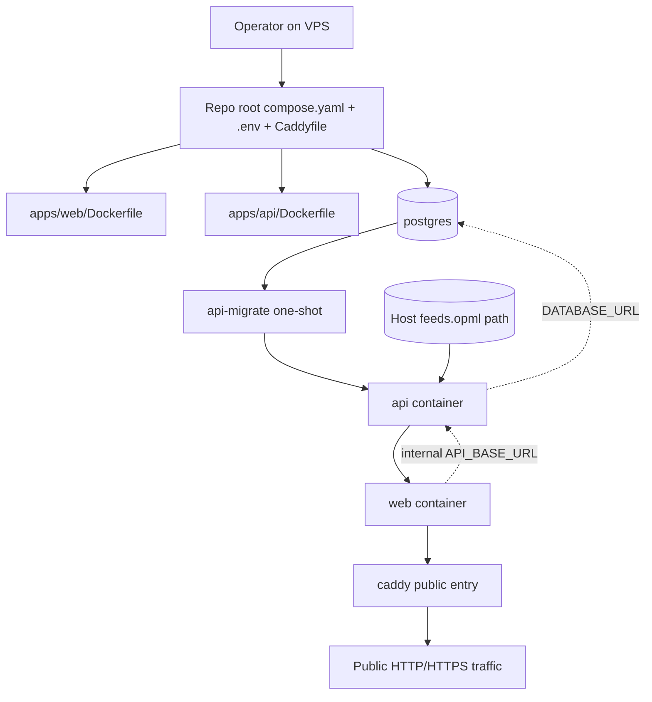
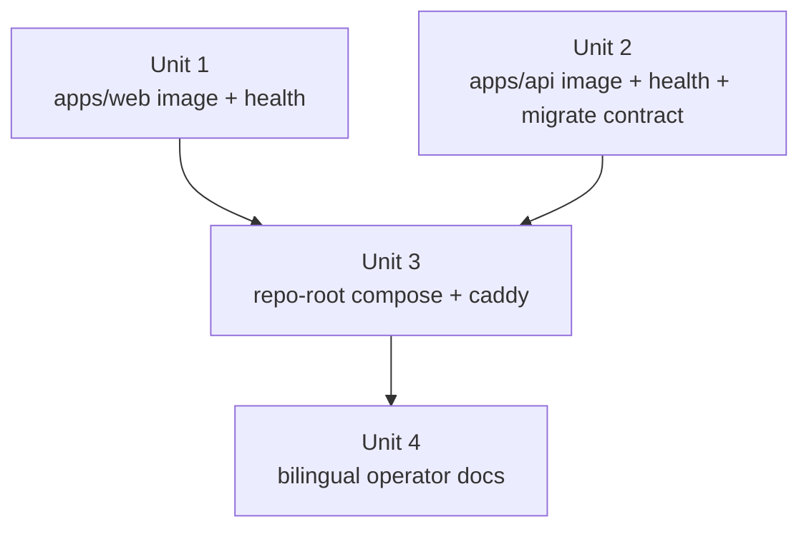

# feat: 增加 Docker 镜像与 VPS Compose 部署路径

## Overview

这份计划把生产部署入口明确重写为 repo 根方案：`compose.yaml`、`.env.example`、`Caddyfile` 与 `.dockerignore` 放在仓库根目录，`apps/web/Dockerfile` 与 `apps/api/Dockerfile` 继续留在各自 app 内。operator 在 VPS 上 clone 仓库后，应当能够直接从 repo 根完成环境准备、镜像本地构建和整栈启动，而不是再进入额外的 `deploy/vps/` 子目录。

这不是把 app 职责塌缩到仓库根，而是把“跨 app 的生产编排”放回 repo 级别所有权：app 自己拥有镜像构建逻辑、运行命令与健康面；repo 根拥有单机生产拓扑、反向代理入口与 operator 级运行时装配。这样既满足 R1-R12，也符合用户要求的“一眼就能发现、一条命令就能部署”的操作面。

| 输入 / 资产类别   | 所有者                  | 交付方式                                 | 首版约束                                                      |
| ----------------- | ----------------------- | ---------------------------------------- | ------------------------------------------------------------- |
| 生产部署入口      | repo 根                 | `compose.yaml` + `.env` + `Caddyfile`    | 首版故意不放到 `deploy/` 子目录                               |
| app 镜像构建逻辑  | `apps/web` / `apps/api` | `apps/*/Dockerfile`                      | 不把 app build 逻辑搬到根目录                                 |
| operator 可变配置 | operator                | repo 根 `.env`（由 `.env.example` 派生） | 这是 Compose/operator 契约，不替代本地开发用 app `.env.local` |
| 持久化状态        | Compose                 | named volumes                            | PostgreSQL 默认不暴露宿主机端口                               |
| feed 订阅文件     | operator                | 显式只读 bind mount                      | 不烘焙进镜像，不作为默认部署载荷提交                          |

## Problem Frame

来源需求文档已经把问题定义清楚：仓库已有可部署的 `apps/web` 与 `apps/api`，但缺少生产镜像与一条单机 VPS 自托管路径，因此 operator 还拿不到“从 repo checkout 到完整服务启动”的稳定交付面（见 origin: `docs/zh-Hans/brainstorms/2026-04-21-docker-images-and-vps-compose-requirements.md`）。

当前代码库还给出了几个必须沿用的现实约束：

- `apps/web` 通过服务端 `API_BASE_URL` 调用 API，不是浏览器直接打 API 原始端口（`apps/web/src/widgets/article-reader/api/articles-api.ts`）。
- `apps/api` 已经把 `DATABASE_URL`、`FEED_OPML_PATH`、`INGEST_ON_BOOT`、`LLM_*`、`PORT` 视为 app-owned runtime contract（`apps/api/.env.example`、`apps/api/README.md`、`apps/api/src/config/app-config.ts`）。
- `apps/api` 的 wake auto-refresh 仍然是单进程假设，不适合在首版部署里引入多副本或公开 API 负载均衡（`apps/api/README.md`）。
- 仓库当前没有现成的生产 Docker/Compose/Caddy 资产；repo 根也没有 `compose.yaml`、`docker-compose.yml`、`Caddyfile` 或 `.dockerignore`，说明这条部署面需要从零补齐。
- `apps/api` 与 `apps/web` 目前都没有专门为容器编排准备的 health/readiness surface（`apps/api/src/main.ts`、`apps/api/src/app.module.ts`，以及 repo 级文件检索结果）。

因此，这份计划的真正目标不是“找个地方塞 Compose”，而是给当前 monorepo 增加一个正确的生产操作面：repo 根一键编排，app 内各自持有镜像与运行契约，operator 拥有外部输入与持久化介质。

## Requirements Trace

- R1-R3. 为 `apps/web` 与 `apps/api` 分别提供生产镜像，同时保持 Turborepo 的 app/package 边界；repo 根只承载跨 app 编排资产，不承载 app 专属构建实现。
- R4-R8. 提供一个基于 repo 根 `compose.yaml` 的单机拓扑，运行 `web`、`api`、`postgres`、`caddy`；默认 PostgreSQL 只在 Compose 内网可达；公共流量统一经过 Caddy；首版代理固定为 Caddy。
- R9-R10. operator 可以在 VPS 上 clone 仓库后，直接在 repo 根本地构建镜像并启动服务；部署路径继续兼容 `apps/web/package.json` 与 `apps/api/package.json` 已有的 build/start/migrate 命令。
- R11-R12. 文档和编排必须明确 env file、named volume、bind mount 的边界，尤其 `feeds.opml` 必须来自 operator 自己指定的宿主机路径，并以只读 bind mount 方式交给 API。

## Scope Boundaries

- 不包含 GitHub Actions 镜像发布、registry、Kubernetes、ECS、Nomad、Swarm 或多机编排。
- 不尝试让 `apps/api` 支持多副本 ingestion / 分布式 wake-refresh；单进程假设保持不变。
- 默认不暴露 PostgreSQL 宿主机端口；未来如果需要本机调试例外，也只接受 loopback 绑定，并不属于本计划交付。
- 不在首版里引入第二种反向代理，也不提前扩张出浏览器直连 API 的公网 `/api/*` 路由层。
- 不新增 `deploy/vps/` 目录作为首版生产入口；生产操作面就是 repo 根。

## Context & Research

### Relevant Code and Patterns

- `apps/web/package.json` 当前生产命令面是 `build` 与 `start`，Web 默认监听 `3001`，适合被容器化后继续保留 app-owned 启动契约。
- `apps/api/package.json` 当前生产命令面已经明确区分 `db:deploy` 与 `start:prod`，这天然支持“同一镜像分别承担 migration service 与长期运行 service”的 Compose 设计。
- `apps/web/src/widgets/article-reader/api/articles-api.ts` 明确要求 `API_BASE_URL`，且失败信息直指 `apps/web/.env.local` / `apps/web/.env.example`；部署方案不能把这个 contract 偷偷改成别的隐式地址。
- `apps/api/src/config/app-config.ts` 说明 `FEED_OPML_PATH` 支持绝对路径和相对 `apps/api` package root 的路径解析，这允许生产 Compose 把 OPML 以绝对容器路径挂进去，同时不破坏本地开发的相对路径默认值。
- `apps/api/src/main.ts` 与 `apps/api/src/app.module.ts` 展示了当前 Nest bootstrap 形状，但没有专门的 readiness/liveness surface；容器编排不能继续依赖“端口打开了就算 ready”。
- `README.md` 与 `README.zh-Hans.md` 现在只覆盖本地开发路径，没有任何 repo 根生产部署 runbook；这意味着 root compose 方案必须同步补文档，而不是只补文件不补说明。

### Institutional Learnings

- `docs/en/solutions/integration-issues/ci-e2e-runtime-inputs-must-match-seeded-targets-2026-04-16.md` 与对应中文文档已经证明：只要 build/start/reset/seed 读的不是同一套运行时输入，系统就会进入“本地能跑、CI 或托管失败”的漂移状态。生产 Compose 必须定义一个明确的 operator-owned source of truth，而不是再制造第二套隐式配置入口。

### External References

**GitHub + DeepWiki 样本（用于判断 repo 根 Compose 是否是合理模式）**

- `pezzolabs/pezzo`
  - GitHub 根文件 `docker-compose.yaml` 展示了 repo 根 Compose 调用 app-local Dockerfile、使用 `service_completed_successfully` / `service_healthy`、并以 healthcheck 管启动顺序的模式。
  - DeepWiki 将该仓库描述为“以 repo 根 `docker-compose.yaml` 为主入口”的容器化部署结构。
- `nktnet1/rt-stack`
  - GitHub 根文件 `compose.yaml` 展示了 `build.context: .` + `dockerfile: ./apps/web/Dockerfile` / `./apps/server/Dockerfile` 的结构，还包含 healthcheck 与按 profile 单独运行数据库工具容器的模式。
  - DeepWiki 明确把该仓库的 repo 根 `compose.yaml` 描述为主要的容器化部署入口。

**Planning inference from those samples**

- repo 根 Compose 作为 operator 入口是常见且合理的做法，尤其当目标是“clone repo 后直接 `docker compose ...`”。
- app-local Dockerfile 与 repo-root Compose 并不冲突；这正是 monorepo 场景下常见的边界拆法。
- 一次性 migration service、health-gated startup order、以及 repo 根 env / compose 入口，都是成熟样本里反复出现的模式。

**Standards references**

- Next.js `output` docs: `https://nextjs.org/docs/app/api-reference/config/next-config-js/output`
- Docker Compose startup order docs: `https://docs.docker.com/compose/how-tos/startup-order/`
- Docker bind mounts docs: `https://docs.docker.com/engine/storage/bind-mounts/`
- Caddy `reverse_proxy` docs: `https://caddyserver.com/docs/caddyfile/directives/reverse_proxy`

## Key Technical Decisions

- **Repo 根 `compose.yaml` 是生产部署主入口**：首版直接在仓库根创建 `compose.yaml`，而不是引入 `deploy/vps/`。这样 operator 在 repo 根即可执行 `docker compose up -d --build`，无需额外 `-f` 或切目录；这也与 `pezzolabs/pezzo`、`nktnet1/rt-stack` 这类实际仓库模式一致。
- **repo 根 `.env.example` 只代表 Compose/operator 契约**：repo 根 `.env` 负责单机生产部署所需的 operator 输入与 Compose 插值；`apps/web/.env.example` 与 `apps/api/.env.example` 继续服务本地开发和测试，不被根部署入口取代。
- **app Dockerfile 继续留在 app 内，但 build context 使用 repo 根**：`compose.yaml` 通过 `context: .` + `dockerfile: ./apps/web/Dockerfile` / `./apps/api/Dockerfile` 组合来访问 monorepo 工作区依赖，同时保持 app 自己拥有镜像构建实现。
- **`apps/web` 采用 standalone 输出**：Web 镜像应依赖 Next.js `output: 'standalone'`，并显式设置 monorepo tracing root，避免 `packages/ui` 之类工作区依赖在运行时镜像里丢失。
- **同一份 API 镜像承担 migration 与 runtime**：首版接受一点镜像体积成本，让 `apps/api` 的运行时镜像同时保留 Prisma 迁移所需资产；这样 `api-migrate` 与 `api` 共享同一镜像，减少 schema ownership 分叉。
- **只让 Caddy 发布宿主机端口**：`web`、`api`、`postgres` 都只在 Compose 网络内互通；Caddy 是唯一的公网入口。这样直接落实 R5/R5a/R7，也让“部署成功”的外部可见面更单纯。
- **首版只公开 Caddy -> Web；Web 再内部访问 API**：当前 Web 是服务端通过 `API_BASE_URL` 取 API，所以首版不需要把 API 原始端口或 `/api/*` 公网代理暴露出去。Compose 内部把 `API_BASE_URL` 设为 `http://api:3000` 即可。
- **operator-owned `feeds.opml` 必须是只读 bind mount**：生产环境不再把 `apps/api/feeds.opml` 当作部署输入；operator 必须显式提供宿主机文件路径，Compose 以 long-syntax read-only bind mount 挂入容器，再把 `FEED_OPML_PATH` 指向该容器内路径。
- **补齐显式 health surface**：`apps/api` 新增 liveness/readiness 端点，`apps/web` 新增轻量健康路由。Compose 依赖顺序与代理探针不应依赖业务页面或业务接口。
- **repo 根 `.dockerignore` 只做 build context 收敛**：它是 repo 级构建辅助文件，不承担 app 专属逻辑，也不改变 Turborepo 的 apps/packages 边界。
- **所有外部基础镜像必须严格锁版本，且 PostgreSQL 必须锁到发行版标签**：首版明确禁止 `latest`、裸主版本或其他浮动标签。`postgres` 必须使用类似 `postgres:18.6-bookworm` 这类同时锁 major/minor/patch + distro 的标签；Node 基础镜像也应锁到明确版本与发行版变体，而不是 `node:24` 或 `node:24-bookworm` 这种仍会漂移的标签。
- **实现阶段必须用本地 Docker / Compose 做真实运行验证**：agent 不能只做静态 YAML / Dockerfile 检查；至少要在本机执行一次从 repo 根发起的 `docker compose` 启动验证，并确认关键服务真的能启动、通过健康检查和依赖顺序。

## Open Questions

### Resolved During Planning

- **生产 Compose 应该放哪里？** 放 repo 根，文件名用 `compose.yaml`。这是 operator 一眼可见、无需额外参数的生产入口，也是本计划重写后的第一原则。
- **repo 根 `.env` 会不会破坏 app-owned env 边界？** 不会。repo 根 `.env` 仅服务 Compose/operator 层；app 本地开发仍保留各自 `.env.local` / `.env.example`。
- **公网路由契约怎么定？** 首版只需要 `Internet -> Caddy -> web`；`web` 通过内部 `API_BASE_URL` 调用 `api`，不引入新的公网 API surface。
- **哪些输入应该走 env，哪些走 volume / mount？** 标量配置与密钥走 repo 根 `.env`；PostgreSQL 与 Caddy 状态走 named volumes；`feeds.opml` 走 operator 提供的只读 bind mount。
- **单机最小可靠启动顺序是什么？** `postgres` healthy -> `api-migrate` completed successfully -> `api` ready -> `web` healthy -> `caddy` 对外接流量。
- **外部镜像版本应该怎么管？** 必须严格锁版本。尤其 PostgreSQL 不能只锁 major，也不能只写 `postgres:18`、`postgres:18-bookworm` 或 `latest`；计划要求锁到具体补丁版本和发行版。Node 基础镜像同理，避免基础层在未评审情况下漂移。
- **实现完成后如何验收？** 必须跑本地 Docker / Compose 真实验证，而不是只看 contract test 或配置 diff。至少要从 repo 根实际构建并启动一次容器拓扑，确认 migration gate、healthcheck、内部网络访问与 Caddy 公网入口都按计划工作。

### Deferred to Implementation

- API 与 Web 运行时镜像最终采用哪一种 Node 24 基础镜像变体，留给实现阶段结合兼容性与体积做最后选择。
- Compose healthcheck 的 `interval`、`timeout`、`retries`、`start_period` 精确数值需要在实际容器启动时间上微调。
- 是否在后续增加一个仅供本机调试的 PostgreSQL loopback profile，不属于当前切片。

## High-Level Technical Design

> _This illustrates the intended approach and is directional guidance for review, not implementation specification. The implementing agent should treat it as context, not code to reproduce._

## Implementation Units

- [x] **Unit 1: 为 `apps/web` 提供可自托管的生产镜像与健康端点**

**Goal:** 让 `apps/web` 在不改变业务边界的前提下，产出一个适合生产容器运行的镜像，并给 Compose / Caddy 提供独立于业务页面的健康检查入口。

**Requirements:** R1, R3, R9, R10

**Dependencies:** None

**Files:**

- Create: `apps/web/Dockerfile`
- Create: `apps/web/app/api/health/route.ts`
- Create: `apps/web/app/api/health/route.spec.ts`
- Modify: `apps/web/next.config.ts`

**Approach:**

- 打开 Next.js standalone 输出，并显式设置 monorepo tracing root，确保 `@repo/ui` 与其他工作区依赖会进入运行时镜像。
- Dockerfile 继续位于 `apps/web`，但由 repo 根 `compose.yaml` 以 root build context 调用，避免为了容器化破坏 monorepo 依赖解析。
- 运行时镜像只负责启动 Web 生产服务，继续保留 `API_BASE_URL` 作为 env-owned contract，不把 host loopback 或公网地址烘焙进镜像。
- 新增轻量 `/api/health` 路由，专门服务于容器探针和代理健康检查，不让首页承担探针职责。

**Patterns to follow:**

- `apps/web/package.json`
- `apps/web/src/widgets/article-reader/api/articles-api.ts`
- `apps/web/app/page.tsx`
- `apps/web/app/page.spec.tsx`
- `apps/web/playwright.config.ts`

**Test scenarios:**

- Happy path - `/api/health` 在 production server 下返回 `200` 与稳定 payload，不依赖文章数据或 API 可用性。
- Happy path - Web 运行时仍然从 `API_BASE_URL` 读取 API 地址，而不是把固定地址烘焙进镜像。
- Edge case - standalone 产物包含 `packages/ui` 等 traced workspace 依赖，容器启动时不会因缺文件失败。
- Error path - `API_BASE_URL` 缺失时，仍保持当前清晰失败语义，而不是静默回退到错误地址。
- Integration - 当 Compose 把 `API_BASE_URL` 设为 `http://api:3000` 时，Web 容器可通过内部 service DNS 访问 API。

**Verification:**

- `apps/web` 能在容器内稳定启动、响应 `/api/health`，并保留当前 app-owned `API_BASE_URL` 契约。

- [x] **Unit 2: 为 `apps/api` 提供生产镜像、迁移契约与 readiness 检查**

**Goal:** 让 `apps/api` 产出一份既能执行一次性迁移、也能运行长期服务的生产镜像，并暴露适合 Compose 启动编排的健康端点。

**Requirements:** R2, R3, R6, R9, R10, R11, R12

**Dependencies:** None

**Files:**

- Create: `apps/api/Dockerfile`
- Create: `apps/api/src/health/health.module.ts`
- Create: `apps/api/src/health/health.controller.ts`
- Create: `apps/api/src/health/health.controller.spec.ts`
- Create: `apps/api/e2e/health.e2e-spec.ts`
- Modify: `apps/api/src/app.module.ts`
- Modify: `apps/api/src/main.ts`

**Approach:**

- 保持 `db:deploy` 与 `start:prod` 作为 package-local 权威命令面；Compose 调用这些契约，而不是再发明 root wrapper。
- 运行时镜像保留 Prisma CLI、迁移文件与生成客户端，使同一镜像可同时支持 `api-migrate` 与常驻 `api` 服务。
- 新增一个小型 Nest feature module 暴露 `/health/live` 与 `/health/ready`；`ready` 必须反映数据库可达和应用已完成启动，`live` 只表示进程仍可服务。
- 继续尊重现有 `FEED_OPML_PATH` 解析规则，让 Compose 通过绝对容器内路径接入 bind-mounted OPML 文件，而不是在镜像里附带默认订阅文件。

**Execution note:** 先用 controller spec + e2e 固定 liveness/readiness 语义，再接 Docker image 与 Compose 启动顺序，避免把“ready 到底是什么意思”留到最后才临时决定。

**Patterns to follow:**

- `apps/api/package.json`
- `apps/api/src/app.module.ts`
- `apps/api/src/main.ts`
- `apps/api/src/config/app-config.ts`
- `apps/api/src/articles/articles.controller.spec.ts`
- `apps/api/e2e/articles.e2e-spec.ts`

**Test scenarios:**

- Happy path - `/health/live` 在 Nest 完成启动后返回 `200`，不依赖文章数据或 LLM 配置。
- Happy path - `/health/ready` 只在数据库可访问且应用已完成启动后返回 `200`。
- Error path - PostgreSQL 不可用或 schema 未就绪时，`/health/ready` 返回失败态，而不是假阳性。
- Edge case - 同一份已构建镜像既能成功执行一次性 `pnpm db:deploy`，也能随后执行 `pnpm start:prod`。
- Integration - 当 `FEED_OPML_PATH` 指向 bind-mounted 绝对路径时，API 继续保留当前本地开发的相对路径解析语义。

**Verification:**

- `apps/api` 镜像可被 Compose 用来先迁移、再启动服务，且 readiness 真正代表“数据库与 API 都已可用”。

- [x] **Unit 3: 在 repo 根新增 `compose.yaml`、`Caddyfile`、`.env.example` 与部署约束测试**

**Goal:** 用 repo 根级别的一组最小编排资产，把两个 app、PostgreSQL 与 Caddy 串成一条 VPS 一键部署路径，同时把 operator 输入与持久化状态放到正确的所有权边界上。

**Requirements:** R3, R4, R5, R5a, R6, R7, R8, R9, R11, R12

**Dependencies:** Unit 1, Unit 2

**Files:**

- Create: `compose.yaml`
- Create: `Caddyfile`
- Create: `.env.example`
- Create: `.dockerignore`
- Create: `.github/scripts/compose-contract.test.mjs`

**Approach:**

- `compose.yaml` 在 repo 根定义五个服务：`postgres`、`api-migrate`、`api`、`web`、`caddy`。其中只有 Caddy 发布宿主机端口。
- `web` 与 `api` 的 build 都使用 `context: .`，但 `dockerfile` 指向各自 app 内的 Dockerfile；这样既复用 monorepo workspace，又保持 app-owned image build logic。
- repo 根 `.env.example` 只暴露 operator 真正拥有的部署输入，例如 public host / TLS 信息、数据库凭据、`FEED_OPML_HOST_PATH`、`INGEST_ON_BOOT`、`LLM_*` 等；operator 复制为 repo 根 `.env` 后，Compose 直接在同目录自动读取。
- `postgres` 使用 named volume 持久化且默认不定义 host `ports`；Caddy 也应使用 named volume 保存其运行时状态（尤其证书与配置缓存）。
- API service 通过 long-syntax read-only bind mount 接收 operator 指定的宿主机 `feeds.opml` 路径，再把 `FEED_OPML_PATH` 指向固定容器内路径。
- `Caddyfile` 首版只需要把公网入口反代到 `web:3001`；`web` 再通过内部 `API_BASE_URL=http://api:3000` 访问 API，不新增公网 API surface。
- 启动顺序使用官方 `depends_on` conditions：`postgres` 必须 healthy，`api-migrate` 必须 completed successfully，`api` 必须 ready，`web` 必须 healthy，之后 Caddy 才成为公网入口。
- repo 根 contract test 直接钉住这几个不允许回归的部署约束：只有 Caddy 暴露端口、PostgreSQL 无 host ports、存在只读 OPML bind mount、存在 migration gate、根 Compose 调 app-local Dockerfile、外部镜像标签不是浮动版本。

**Execution note:** 先写 `.github/scripts/compose-contract.test.mjs`，把“repo 根入口”和拓扑约束固定下来，再落 `compose.yaml` 与 `Caddyfile`，避免实现后期又滑回错误的目录结构。

**Patterns to follow:**

- `package.json`
- `turbo.json`
- `.github/scripts/eslint-guardrails.test.mjs`
- `README.md`
- `README.zh-Hans.md`

**Test scenarios:**

- Happy path - contract test 验证 repo 根 `compose.yaml` 至少包含 `postgres`、`api-migrate`、`api`、`web`、`caddy`，且引用 `apps/web/Dockerfile` 与 `apps/api/Dockerfile`。
- Happy path - 只有 Caddy 具有宿主机端口发布；`postgres`、`api`、`web` 不对宿主机发布端口。
- Happy path - PostgreSQL 使用 named volume 持久化且不含 host `ports`，满足默认内网可达约束。
- Happy path - `postgres` service 使用精确版本 + 发行版标签，例如 `postgres:18.6-bookworm`，而不是 `latest`、`18` 或其他浮动标签。
- Happy path - Web/API Dockerfile 的 Node 基础镜像同样锁到明确版本和发行版变体，而不是浮动标签。
- Happy path - API 服务存在 operator-specified 的只读 bind mount，用于提供 `feeds.opml`。
- Edge case - `depends_on` 链路要求 `postgres` healthy、`api-migrate` completed successfully、`api` ready 后才允许后续服务启动。
- Error path - 若后续有人把 Compose 挪回 `deploy/`、给 PostgreSQL 增加 host `ports`、去掉 migration gate、或把 OPML 挂载改成可写，contract test 会失败。

**Verification:**

- 在装有 Docker Engine + Compose plugin 的 VPS 上，operator 只需 repo checkout、repo 根 `.env` 与一个现成的 OPML 宿主机路径，就能通过 repo 根 `docker compose` 流程完成本地构建与启动。
- 实现 agent 必须在本地执行一次真实的 Docker / Compose 验证，至少覆盖镜像构建、`api-migrate` 一次性执行、`api`/`web` 健康检查，以及 Caddy 对 Web 的反向代理可用性。

- [x] **Unit 4: 补齐双语 operator runbook，并明确 root 部署入口与 app 本地开发入口的边界**

**Goal:** 让 operator 不必阅读代码，也不用猜测“该在 repo 根还是 app 目录配什么”，就能理解这条生产部署路径与本地开发路径之间的职责分离。

**Requirements:** R9, R10, R11, R12

**Dependencies:** Unit 3

**Files:**

- Modify: `README.md`
- Modify: `README.zh-Hans.md`
- Modify: `apps/api/README.md`
- Modify: `apps/web/README.md`

**Approach:**

- 在根 README 双语对中新增生产部署 / self-hosting 一节，明确 repo 根 `compose.yaml`、repo 根 `.env`、repo 根 `Caddyfile` 才是 VPS 入口，并解释为什么首版故意不放到 `deploy/` 子目录。
- 在 `apps/api/README.md` 中区分两套输入边界：本地开发仍使用 `apps/api/.env.local` 与 app 内示例 OPML；生产 Compose 部署使用 repo 根 `.env` 与 operator 外部 bind mount。
- 在 `apps/web/README.md` 中记录：Compose 部署时 `API_BASE_URL` 指向内部服务名 `http://api:3000`，而不是宿主机 loopback。
- 文档中把单进程 API 约束、只有 Caddy 暴露公网、PostgreSQL 默认内网、以及 `feeds.opml` 外部所有权写成显式运维规则，而不是隐含假设。

**Patterns to follow:**

- `README.md`
- `README.zh-Hans.md`
- `apps/api/README.md`
- `apps/web/README.md`

**Test scenarios:**

- Test expectation: none -- 本单元只更新文档与说明文字；行为正确性由 Unit 1-3 的测试与验证覆盖，包括本地 Docker / Compose 真实运行验证要求。

**Verification:**

- 新 operator 可以只按双语文档完成从 clone 到启动的流程，并清楚区分 repo 根部署入口与 app 本地开发入口。

## System-Wide Impact

- **Interaction graph:** 外部流量固定为 `Internet -> Caddy -> web -> api -> postgres`；`apps/api` 额外消费 operator 提供的 `feeds.opml` bind mount。
- **Ownership model:** repo 根拥有跨 app 的生产编排入口；`apps/web` 与 `apps/api` 继续拥有各自镜像与运行命令；operator 拥有 `.env` 与宿主机 feed 文件。
- **Error propagation:** PostgreSQL 未 ready 时，`api-migrate` 不应运行；迁移失败时，`api` / `web` / `caddy` 不应继续以“看似在线”的状态启动；API readiness 失败时，Web 与 Caddy 都不应成为公网入口。
- **State lifecycle risks:** `postgres` 与 Caddy 的运行时状态需要 named volumes；`feeds.opml` 必须留在宿主机路径，由 operator 自己版本化 / 备份，镜像重建不能覆盖它。
- **API surface parity:** 当前 `apps/web` 的 `API_BASE_URL` server-to-server 契约保持不变；`apps/api` 的 `db:deploy` / `start:prod` package-local ownership 保持不变；不会新增浏览器可见的公网 `/api/*` 面。
- **Unchanged invariants:** API 仍是单进程假设；首版仍不包含 registry / CI 发布；PostgreSQL 默认不向宿主机公开；反向代理首版仍只支持 Caddy。
- **Validation posture:** 除静态 contract test 外，实施验收必须包含一次本地 Docker / Compose 真实启动验证；没有实际跑起来，不算完成。

## Risks & Dependencies

| Risk                                                                        | Mitigation                                                                                                         |
| --------------------------------------------------------------------------- | ------------------------------------------------------------------------------------------------------------------ |
| repo 根 `.env` 若无限膨胀，可能重新制造一套与 app 契约脱节的配置层          | 明确 repo 根 `.env` 只暴露 operator-owned Compose 输入，并在文档中写清与 app `.env.local` 的边界                   |
| 把 Compose 放回 repo 根后，有人误以为 Docker build 逻辑也应迁到根目录       | 在计划、README 与 contract test 中明确：repo 根只拥有编排；`apps/*/Dockerfile` 才是镜像实现所有者                  |
| Web standalone tracing 在 monorepo 中漏掉 `packages/ui` 或其他工作区依赖    | 在 `apps/web/next.config.ts` 中显式设置 tracing root，并用容器启动验证覆盖                                         |
| API 镜像若过度瘦身，`db:deploy` 与 `start:prod` 可能分裂成两套不一致运行时  | 明确接受“首版 API 运行时镜像保留 Prisma CLI”的权衡，用单一镜像承担 migration + runtime                             |
| operator 提供的 OPML 宿主机路径错误，导致 API 启动后出现 ingestion 故障     | 使用显式只读 bind mount 与文档化路径所有权；API readiness / 启动日志需让配置错误尽早暴露                           |
| 后续修改 Compose 时意外暴露 PostgreSQL 或移除 migration gate                | 增加 repo 根 contract test，把这些部署约束固化为仓库不变量                                                         |
| 外部基础镜像使用浮动标签，导致未评审的基础层变更直接进入生产                | 在计划和 contract test 中明确禁止 `latest`、裸 major、未锁 patch 的镜像标签；PostgreSQL 额外要求锁到具体发行版标签 |
| 单机部署依赖 Docker Engine、Compose plugin、基础入站网络与域名/TLS 前置条件 | 在 runbook 中把这些前置条件列成 operator checklist，而不是隐含依赖                                                 |

## Documentation / Operational Notes

- repo 根 `compose.yaml`、`Caddyfile`、`.env.example` 是生产部署资产；`apps/web/.env.example` 与 `apps/api/.env.example` 继续是本地开发资产。两者并存是刻意设计，不是重复配置。
- 生产部署文档需要把“外部镜像必须锁版本”写成明确规则，而不是实现细节：尤其 PostgreSQL 必须锁到具体补丁版本 + 发行版标签，Node 基础镜像也必须锁到明确版本。
- 根 README 双语对需要明确：这条路径是“在 VPS 上从 repo 根本地构建镜像并启动”，不是“先推 registry 再拉取镜像”。
- `apps/api/README.md` 需要强调：Compose 部署时 migrations 由一次性 `api-migrate` service 执行，常驻 API container 不再隐式负责 schema 对齐。
- `apps/web/README.md` 需要说明：生产 Compose 下的 `API_BASE_URL` 是内部服务地址，不是浏览器可见地址。
- 如果实现阶段发现还需要一份更长寿的部署知识库文档，应同步创建 `docs/en/solutions/` 与 `docs/zh-Hans/solutions/` 配对文档，但这不是本计划的必选输出。

## Sources & References

- **Origin documents:** `docs/en/brainstorms/2026-04-21-docker-images-and-vps-compose-requirements.md` + `docs/zh-Hans/brainstorms/2026-04-21-docker-images-and-vps-compose-requirements.md`
- **Related code:** `apps/web/package.json`, `apps/web/src/widgets/article-reader/api/articles-api.ts`, `apps/web/next.config.ts`, `apps/api/package.json`, `apps/api/README.md`, `apps/api/src/config/app-config.ts`, `apps/api/src/main.ts`, `apps/api/src/app.module.ts`, `README.md`, `README.zh-Hans.md`
- **Institutional learning:** `docs/en/solutions/integration-issues/ci-e2e-runtime-inputs-must-match-seeded-targets-2026-04-16.md`, `docs/zh-Hans/solutions/integration-issues/ci-e2e-runtime-inputs-must-match-seeded-targets-2026-04-16.md`
- **External repo examples:** `pezzolabs/pezzo` root `docker-compose.yaml`, `pezzolabs/pezzo` root `docker-compose.infra.yaml`, `nktnet1/rt-stack` root `compose.yaml`
- **External docs:** `https://nextjs.org/docs/app/api-reference/config/next-config-js/output`, `https://docs.docker.com/compose/how-tos/startup-order/`, `https://docs.docker.com/engine/storage/bind-mounts/`, `https://caddyserver.com/docs/caddyfile/directives/reverse_proxy`
