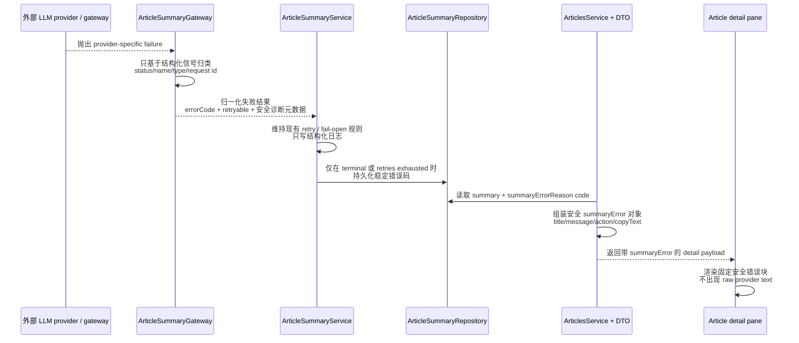

# fix: 脱敏 LLM 摘要错误并补齐安全诊断

## Overview

本计划在错误源头关闭已确认的 LLM 摘要错误泄漏链，而不是在下游做遮罩补丁。后端会把 provider 失败归一化为稳定错误码，把原始上游文本挡在持久化业务字段和常规日志之外，在文章详情 API 上暴露结构化安全错误对象，并让 Web 阅读器渲染固定、可复制的安全错误块，同时保持现有 fail-open 阅读主链路不回归。

## Problem Frame

当前仓库存在一条已确认的泄漏链：`apps/api/src/article-summary/article-summary.gateway.ts` 读取原始 `error.message`，`apps/api/src/article-summary/article-summary.repository.ts` 将该字符串落到 `summaryErrorReason`，`apps/api/src/articles/articles.service.ts` 通过 detail DTO 返回它，`apps/web/src/widgets/article-reader/ui/article-detail.tsx` 再直接把它渲染出来。这意味着只要 provider 失败文本里带有 API key、Bearer token、header 片段、代理细节或其他敏感诊断内容，它就可能同时进入数据库、后端日志和阅读器 UI。

结合仓库现状，这个改动不是单纯文案替换：

- `apps/api/src/article-summary/article-summary.service.ts` 已经承载重试与 fail-open 语义，而且刚做过回归修复，所以安全收口不能破坏“重试耗尽前不落失败态”这条边界。
- `apps/api/src/article-summary/article-summary.gateway.ts` 目前已有粗粒度分类逻辑，但没有 gateway 级规格测试，新的归一化边界很容易漂移。
- `apps/api/src/articles/*` 与 `apps/api/e2e/articles.e2e-spec.ts` 共同保护当前读取契约，但这个契约仍把 `summaryErrorReason` 当作面向用户的文本字段。
- `apps/web/app/page.spec.tsx` 当前通过断言渲染原始 `summaryErrorReason` 来证明失败态，因此 UI 测试必须随契约一起改。
- `packages/` 下没有共享 API contract/types package，因此这次计划不应为了一个 detail-path 契约就引入新的 repo 级包装成本，除非后续出现第二个消费者。

因此，这次修复需要在同时改四个 surface 的前提下守住一个核心不变量：摘要任务仍然 fail-open，但失败载荷会变成安全、结构化、稳定的跨层契约。

## Requirements Trace

- R1-R4 - 原始 provider / gateway 错误文本不能再进入用户可见 UI、持久化业务字段或常规应用日志；任何 secrets 与请求细节都必须在进入业务契约前被丢弃。
- R5-R8 - LLM 摘要边界必须输出稳定错误码与 retryable 语义；读取链路不能再依赖 provider 自由文本。
- R9-R12 - article-summary 失败日志必须变成结构化诊断，至少包含 `scope`、`status`、`errorCode`、`retryable`、`articleId`、`attempt`、`trigger`，并在可安全获取时带上 provider 元数据。
- R13-R16 - Web 阅读器必须渲染固定的安全错误块，包含稳定错误码、人类可读说明、建议动作与可复制文本，同时保持当前 detail pane 布局可理解。
- R17-R20 - 先关闭已确认的 `article-summary -> article read API -> web detail pane` 泄漏链，产出的模式要便于后续复用，同时不能破坏现有 retry / fail-open 行为。

## Scope Boundaries

- 不重做全局异常系统，也不顺手整治整个仓库的 `error.message` 使用点。
- 不引入 jobs dashboard、错误历史中心、运维后台，也不加 provider-specific adapter 层。
- 第一版不做 Prisma schema migration；继续复用 `Article.summaryErrorReason` 字段，但将其契约收紧为“稳定机器错误码槽位”，不再是 raw message 槽位。
- 第一版不新增 `packages/*` 共享类型包；后端直接给当前唯一 Web 消费者输出完整的结构化安全错误对象。
- 不要求新建客户端剪贴板交互；错误块只需提供稳定、服务端渲染且可安全复制的文本内容。

## Context & Research

### Relevant Code and Patterns

- `apps/api/src/article-summary/article-summary.gateway.ts` 已经是外部 LLM 边界，也是当前泄漏的源头，因为它直接返回 `getErrorReason(error)`。
- `apps/api/src/article-summary/article-summary.service.ts` 已经集中处理摘要任务的重试调度、fail-open 持久化时机和 JSON 字符串日志风格。
- `apps/api/src/article-summary/article-summary.repository.ts` 是 `summaryErrorReason`、`summary`、`translatedTitle` 的唯一写入点，因此它是把 durable failure value 收紧为 code-only 的正确持久化边界。
- `apps/api/src/article-summary/article-summary.service.spec.ts` 已经锁住重试耗尽边界；这次计划应在此基础上扩展，而不是另起一套编排测试 harness。
- `apps/api/src/articles/article.repository.ts`、`apps/api/src/articles/articles.service.ts`、`apps/api/src/articles/dto/article-detail-item.dto.ts` 与 `apps/api/e2e/articles.e2e-spec.ts` 共同定义当前详情读取契约。
- `apps/web/src/widgets/article-reader/ui/article-detail.tsx` 与 `apps/web/app/page.spec.tsx` 展示了当前唯一失败展示路径；仓库里没有可直接复用的前端安全错误展示模式。
- `apps/api/src/article-summary/article-summary.gateway.spec.ts` 目前不存在，这是新归一化边界在本地模式上的明显空白。

### Institutional Learnings

- `docs/en/solutions/logic-errors/article-summary-retryable-failures-must-not-clear-existing-summary-2026-04-18.md` 与 `docs/zh-Hans/solutions/logic-errors/article-summary-retryable-failures-must-not-clear-existing-summary-2026-04-18.md` 说明 `ArticleSummaryService` 是一个脆弱的 fail-open 边界：可重试失败在耗尽前不能持久化失败态，也不能清空可读内容。
- `docs/en/solutions/workflow-issues/api-test-surfaces-and-package-local-eslint-guardrails-2026-04-16.md` 与 `docs/zh-Hans/solutions/workflow-issues/api-test-surfaces-and-package-local-eslint-guardrails-2026-04-16.md` 明确了仓库测试分层：colocated spec 负责窄行为，`apps/api/e2e/**` 负责 HTTP / database 契约，测试面保持 package-local ownership。

### External References

- OpenAI Node SDK（`openai` `^6.34.0`）文档明确提供 `APIError` 结构化字段，例如 `status`、`name`、`headers`、`request_id`，响应对象还有 `_request_id`。这支持“记录结构化元数据而非 raw error text”的方案：`https://github.com/openai/openai-node/blob/master/README.md`
- OWASP Logging Cheat Sheet 明确把 secrets、access tokens、认证数据等列为不应写入日志的数据类型，这进一步支持在常规日志前丢弃 provider 原始报错：`https://cheatsheetseries.owasp.org/cheatsheets/Logging_Cheat_Sheet.html`

结合这些外部资料与本地代码检查，可以得出一条边界清晰的路径：

- 仓库现有结构已经足够把修复收敛在 `article-summary`、`articles` 与 reader widget 内。
- 本地没有成熟的“安全外部错误契约”模式，因此第一版应该先做 feature-scoped 模式并用测试锁住，而不是马上抽成通用包。
- `apps/api` 使用 NestJS `11.1.18`，`apps/web` 使用 Next.js `16.2.2`，当前 reader 是服务端渲染，因此计划应避免为了“复制”需求额外引入 client-only 交互或跨 workspace 抽象。

## Key Technical Decisions

| 决策                   | 选择方向                                                                                                                                                             | 现在这样更合适的原因                                                                       |
| ---------------------- | -------------------------------------------------------------------------------------------------------------------------------------------------------------------- | ------------------------------------------------------------------------------------------ |
| durable failure 持久化 | 数据库继续保留 `Article.summaryErrorReason`，但只持久化稳定错误码                                                                                                    | 不需要 Prisma 迁移即可关闭泄漏，同时保住现有 fail-open 写路径，也方便后续按 code 查询/聚合 |
| 对外 detail 契约       | 不再把 `summaryErrorReason` 当 public read field，改为在文章详情 API 上暴露结构化 `summaryError` 对象                                                                | 前端不再猜文案/映射，UI 只消费结构化数据，也避免在 `apps/web` 重复维护错误码到文案的映射   |
| 归一化 owner           | 错误码注册表、诊断映射与展示元数据都放在 `apps/api/src/article-summary/` 内，不新增 repo-wide shared package                                                         | 作用域紧贴已确认泄漏链，但仍能形成未来其他外部集成可复用的模式                             |
| 诊断日志策略           | 日志写 `errorCode`、`retryable`、`articleId`、`attempt`、`trigger`，并在可安全获取时附带 `httpStatus`、`sdkErrorName`、`providerRequestId`；绝不写 raw upstream text | 既符合仓库现有 JSON 字符串日志风格，也与官方 SDK / OWASP 的结构化、非秘密化诊断建议一致    |
| copy UX                | Web 失败态继续保持服务端渲染，通过稳定文本实现“可复制”，不新增 clipboard button / client component                                                                   | 满足需求，同时避免给已经良好运作的 detail pane 增加新的 Next.js client boundary            |
| 跨层契约共享方式       | 后端直接输出完整 `summaryError` 对象，`apps/web` 只做薄渲染；第一版不新增 `packages/*` 类型 workspace                                                                | 当前只有一个消费者，而仓库也没有现成共享 contract package 可无成本扩展                     |

## Open Questions

### Resolved During Planning

- **第一版到底只持久化错误码，还是持久化结构化安全对象？** 持久化层只保留稳定错误码在 `Article.summaryErrorReason` 中，然后在 API 边界组装结构化 `summaryError` 读取对象。这样既最小化持久化改动，也能给 UI 提供结构化契约。
- **是否需要新的 correlation-id 体系？** 第一版不引入新的 app-wide correlation layer。使用 `articleId`、`attempt`、`trigger` 作为稳定本地关联键，并在 SDK / provider 安全暴露时附带 `providerRequestId`。
- **现在要不要抽通用 external-error helper？** 先不要。helper 仍放在 `article-summary` feature 内，命名可以足够通用；等第二个外部集成真的需要同样契约时，再做更高层抽取。

### Deferred to Implementation

- 每个错误码最终对应的用户可见文案可以在实现阶段确定，只要仍然满足“安全标题 + 简短说明 + 建议动作 + 可复制文本”这四项约束。
- 当前环境里的 OpenAI-compatible gateway 是否稳定返回 `request_id` / `x-request-id` 只能在执行阶段确认，因此计划把它视为可选诊断元数据。

## High-Level Technical Design

> _This illustrates the intended approach and is directional guidance for review, not implementation specification. The implementing agent should treat it as context, not code to reproduce._

## Implementation Units

- [x] **Unit 1: 在 gateway 边界定义脱敏后的 LLM 摘要失败契约**

**Goal:** 在外部调用边界拦住 raw provider text，并替换成一个下游可以稳定依赖的失败契约。

**Requirements:** R1-R8, R17-R19

**Dependencies:** None

**Files:**

- Create: `apps/api/src/article-summary/article-summary.error.ts`
- Modify: `apps/api/src/article-summary/article-summary.gateway.ts`
- Test: `apps/api/src/article-summary/article-summary.gateway.spec.ts`

**Approach:**

- 在 feature 内新增第一版错误码注册表：`LLM_AUTH_FAILED`、`LLM_RATE_LIMITED`、`LLM_TIMEOUT`、`LLM_CONNECTION_FAILED`、`LLM_BAD_RESPONSE`、`LLM_PROVIDER_FAILED`、`LLM_CONFIG_UNAVAILABLE`。
- 失败归类只依赖结构化信号：SDK error type/name、HTTP status、timeout/abort 特征，以及可选 request-id 元数据。raw `message` 文本即使在本地被读取，也只能用于窄范围 fallback 判定，不能被返回、记录或持久化。
- 让 gateway 返回一个归一化结果，把 durable code / presentation data 与 log-only diagnostics 分开，这样下游代码就不再依赖 provider 自由文本。
- helper 保持在 `apps/api/src/article-summary/` 内，不在第一版就抽 repo-wide external-error abstraction。

**Execution note:** 先补失败中的 gateway specs，证明常见 provider 失败会收敛成稳定错误码，且不会回显 raw text。

**Patterns to follow:**

- `apps/api/src/article-summary/article-summary.gateway.ts`
- `apps/api/src/feeds/feed-ingestion.service.ts`（只借鉴“本地归一化边界”，不要复制它的 raw-message 行为）

**Test scenarios:**

- Happy path - 成功 completion 仍返回结构化 output，不带 failure contract。
- Error path - `401` / `403` 归一化为 `LLM_AUTH_FAILED`，`retryable = false`，仅带安全诊断元数据。
- Error path - `429` 与 `5xx` 归一化为可重试错误码，且不会暴露 provider 文本。
- Error path - timeout、connection、abort 归一化为 `LLM_TIMEOUT` 或 `LLM_CONNECTION_FAILED`，并标记 `retryable = true`。
- Edge case - 缺失 LLM config 时返回 `LLM_CONFIG_UNAVAILABLE`，且不会创建 client。
- Edge case - 未知错误形态降级为 `LLM_PROVIDER_FAILED`，而不是泄漏原始字符串。

**Verification:**

- `ArticleSummaryGateway` 只会向下游暴露归一化失败数据或成功 output；不会再有调用方依赖 raw `error.message`。

- [x] **Unit 2: 把归一化失败结果贯穿到摘要执行、持久化和结构化日志**

**Goal:** 让摘要任务只持久化安全 durable value，并输出可检索的诊断日志，同时不破坏重试耗尽与 fail-open 语义。

**Requirements:** R2-R4, R6-R12, R17-R20

**Dependencies:** Unit 1

**Files:**

- Modify: `apps/api/src/article-summary/article-summary.service.ts`
- Modify: `apps/api/src/article-summary/article-summary.repository.ts`
- Modify: `apps/api/src/article-summary/article-summary.service.spec.ts`
- Modify: `apps/api/src/article-summary/article-summary-bootstrap.service.ts`
- Modify: `apps/api/src/article-summary/article-summary-bootstrap.service.spec.ts`
- Modify: `apps/api/src/feeds/feed-bootstrap.service.ts`
- Modify: `apps/api/src/feeds/feed-bootstrap.service.spec.ts`

**Approach:**

- 用 Unit 1 的归一化错误码与诊断字段替换当前 `reason` 传递，并把 parser / empty-response 失败也并入同一错误契约族，这样摘要流水线只说一种错误语言。
- 保持现有 fail-open 时机不变：可重试失败在耗尽前不持久化，也不清空用户可见 summary 状态；terminal 或 retries exhausted 后才把稳定错误码写入 `summaryErrorReason`。
- 摘要任务日志统一改为显式字段，如 `scope`、`status`、`errorCode`、`retryable`、`articleId`、`attempt`、`trigger`，以及可选的 `httpStatus`、`sdkErrorName`、`providerRequestId`、provider kind。
- 移除 article-summary bootstrap 失败处理里的 raw `error.message` 日志，让 summary 子系统不再保留常规 raw upstream text sink。

**Execution note:** 先扩展现有 retry/fail-open service specs；这个区域最近刚有过回归，先锁行为再穿透契约。

**Patterns to follow:**

- `apps/api/src/article-summary/article-summary.service.ts`
- `apps/api/src/article-summary/article-summary.service.spec.ts`
- `docs/en/solutions/logic-errors/article-summary-retryable-failures-must-not-clear-existing-summary-2026-04-18.md`
- `docs/zh-Hans/solutions/logic-errors/article-summary-retryable-failures-must-not-clear-existing-summary-2026-04-18.md`

**Test scenarios:**

- Happy path - 成功写入摘要时仍会清空旧的 durable error code，并保持 translated-title/summary 原子持久化。
- Edge case - 第 1、2 次可重试失败只记录 `scheduled_retry` 结构化日志，不落 `summaryErrorReason`，也不清空已有可读 summary。
- Error path - terminal provider failure 只持久化稳定错误码，不持久化 raw provider text，并记录带预期诊断键的 `persisted_failure_state`。
- Error path - parser 或 empty-response 失败统一映射到 `LLM_BAD_RESPONSE`，默认不可重试，且不会输出 raw payload text。
- Integration - bootstrap 级 summary failure 只记录安全 bootstrap reason，不序列化 raw upstream message。

**Verification:**

- 摘要流水线仍然 fail-open，但 durable failure state 与运维日志现在都只携带稳定错误码和结构化诊断信息。

- [x] **Unit 3: 用结构化安全错误对象替换文章详情读取契约**

**Goal:** 从 public detail API 移除 raw-string 泄漏面，并给 Web 阅读器提供一个稳定的结构化 summary failure payload。

**Requirements:** R1-R3, R5-R8, R13-R18

**Dependencies:** Unit 2

**Files:**

- Modify: `apps/api/src/articles/article.repository.ts`
- Modify: `apps/api/src/articles/articles.service.ts`
- Modify: `apps/api/src/articles/dto/article-detail-item.dto.ts`
- Modify: `apps/api/src/articles/article.repository.spec.ts`
- Modify: `apps/api/src/articles/articles.controller.spec.ts`
- Modify: `apps/api/e2e/articles.e2e-spec.ts`

**Approach:**

- `summaryErrorReason` 继续留在 repository/storage 语义内部，但不再直接从 detail DTO 暴露给外部读取契约。
- 在文章读取边界根据 Unit 1 的后端注册表组装 public `summaryError` 对象，让前端收到 `code`、`title`、`message`、`action`、copy-safe text，而不是自己实现映射逻辑。
- 对 prepared 或 pending 行统一返回 `summaryError = null`，保持现有 fail-open reader state 简洁。
- 对未知 code 降级到 generic safe presentation，而不是让请求失败，或把存储里的字符串原样返回。

**Patterns to follow:**

- `apps/api/src/articles/articles.service.ts`
- `apps/api/src/articles/article.repository.ts`
- `apps/api/e2e/articles.e2e-spec.ts`

**Test scenarios:**

- Happy path - 已有 prepared summary 的行返回 `summaryError = null`，且其余 detail 字段保持稳定。
- Happy path - failed row 返回结构化 `summaryError` 对象，只包含安全字段，不包含 raw provider text。
- Edge case - summary 与 durable code 都为空的 pending row 仍返回 `summaryError = null`。
- Edge case - 未知持久化 code 会降级成 generic safe error object，而不是暴露原始存储文本。
- Integration - `GET /articles/:id` 的 public payload 移除 `summaryErrorReason`，并只在失败态返回新的结构化 `summaryError` 字段。

**Verification:**

- 文章详情 API 成为 summary failure presentation 的唯一安全契约，public read path 不再泄漏 provider 字符串。

- [x] **Unit 4: 在 Web 阅读器里渲染固定、可复制的摘要错误块**

**Goal:** 在不破坏 prepared-summary 渲染和 detail pane 布局的前提下，把摘要失败展示为安全、可复制的支持块。

**Requirements:** R13-R20

**Dependencies:** Unit 3

**Files:**

- Modify: `apps/web/src/widgets/article-reader/api/articles-api.ts`
- Modify: `apps/web/src/widgets/article-reader/ui/article-detail.tsx`
- Modify: `apps/web/app/page.spec.tsx`

**Approach:**

- 更新 `ArticleDetail` 类型以消费 Unit 3 的结构化 `summaryError` payload，并继续把展示逻辑留在现有 article-reader widget 内，遵守当前仓库的 Next.js + FSD pages-first 姿势。
- 用固定错误块替换 raw-string fallback，展示稳定标题、错误码、简短说明、建议动作与可安全复制的支持文本。
- 保持 prepared summary 路径、标题 fallback 逻辑和 scroll-root 结构不变，避免安全修复演变为 layout regression。
- 错误块继续走服务端渲染和文本复制语义；第一版不新增 client-only clipboard 交互。

**Patterns to follow:**

- `apps/web/src/widgets/article-reader/ui/article-detail.tsx`
- `apps/web/app/page.spec.tsx`
- `apps/web/src/widgets/article-reader/ui/article-detail-frame.tsx`

**Test scenarios:**

- Happy path - prepared summary 仍能正确渲染 Markdown headings / lists，并继续从正文里剥离存储的 `## Title` section。
- Happy path - failed detail payload 会渲染固定错误块，包含安全 copy text 与预期错误码。
- Edge case - 失败态下若 `translatedTitle` 为空，detail pane 仍回退到原始文章标题。
- Edge case - 没有 summary、也没有 `summaryError` 的行仍显示 `Summary pending`。
- Integration - server-rendered reader-shell tests 在保留现有 scroll-root / layout 断言的同时，把 failure-state 预期从 raw string 切换成结构化安全内容。

**Verification:**

- 用户能从阅读器复制一段安全的摘要错误块文本，且 detail pane 在 success、pending、failure 三种状态下都保持同一套阅读布局。

## System-Wide Impact

- **Interaction graph:** `ArticleSummaryGateway` 成为唯一允许读取 provider-specific failure detail 的位置；`ArticleSummaryService`、`ArticleSummaryRepository`、`ArticlesService` 与 reader widget 只消费归一化契约。
- **Error propagation:** raw upstream text 在 gateway 边界被截断；结构化诊断继续流向 service logs；只有稳定错误码进入 durable storage；只有安全 `summaryError` 对象进入 Web。
- **State lifecycle risks:** 可重试失败在耗尽前必须继续保留已有 summary / translatedTitle；terminal 持久化时仍会清空 prepared fields 并写入稳定错误码。
- **API surface parity:** `GET /articles/:id` 与 `apps/web` 的 `ArticleDetail` 类型需要同步改；list payload 不变。
- **Integration coverage:** gateway specs、summary-service specs、article API contract tests、API e2e 与 `apps/web/app/page.spec.tsx` 共同证明端到端泄漏已关闭。
- **Unchanged invariants:** 摘要生成仍然 fail-open，detail pane 布局保持稳定，计划也不会扩张成 repo-wide error-handling refactor。

## Risks & Dependencies

| Risk                                                   | Mitigation                                                                                                                    |
| ------------------------------------------------------ | ----------------------------------------------------------------------------------------------------------------------------- |
| 错误码映射过粗，导致 retryability 误判                 | 第一版先保持窄而清晰的 code 集合，并用 `article-summary.gateway.spec.ts` 与 `article-summary.service.spec.ts` 锁住代表性 case |
| public/API 契约漂移，前端再次开始“猜”错误含义          | 让后端直接输出完整 `summaryError` 对象，并用 `apps/api/e2e/articles.e2e-spec.ts` + `apps/web/app/page.spec.tsx` 锁跨层契约    |
| 安全修复误伤 fail-open 语义                            | 在改持久化逻辑前先复用并扩展 4 月 18 日的 retry-exhaustion regression specs                                                   |
| compatible gateway 并不总暴露 request id 或 SDK 元数据 | 把 `providerRequestId` 等字段视为可选诊断信息，而不是必填契约字段                                                             |
| 仓库其他位置仍存在 raw `error.message`                 | 明确把本计划限定在已确认的 article-summary 泄漏链，把更广泛清理作为后续工作，而不是在本次 silently 扩 scope                   |

## Documentation / Operational Notes

- 不需要新增环境变量；计划继续复用 `apps/api/src/config/app-config.ts` 与 `apps/api/.env.example` 里已经存在的 `LLM_*` 摘要配置。
- 运维排障应围绕稳定错误码、`articleId`、`attempt`、`trigger` 进行；若可用，provider request ID 可用于与上游日志对齐。
- 若本计划顺利落地，后续 `feeds`、`article-content` 或其他外部集成链路的清理，可以直接参考这套 feature-scoped normalization pattern。

## Sources & References

- **Origin documents:** `docs/en/brainstorms/2026-04-22-llm-error-sanitization-and-diagnostics-requirements.md` + `docs/zh-Hans/brainstorms/2026-04-22-llm-error-sanitization-and-diagnostics-requirements.md`
- **Related code:** `apps/api/src/article-summary/article-summary.gateway.ts`, `apps/api/src/article-summary/article-summary.service.ts`, `apps/api/src/article-summary/article-summary.repository.ts`, `apps/api/src/articles/articles.service.ts`, `apps/web/src/widgets/article-reader/ui/article-detail.tsx`
- **Institutional learnings:** `docs/en/solutions/logic-errors/article-summary-retryable-failures-must-not-clear-existing-summary-2026-04-18.md`, `docs/zh-Hans/solutions/logic-errors/article-summary-retryable-failures-must-not-clear-existing-summary-2026-04-18.md`, `docs/en/solutions/workflow-issues/api-test-surfaces-and-package-local-eslint-guardrails-2026-04-16.md`, `docs/zh-Hans/solutions/workflow-issues/api-test-surfaces-and-package-local-eslint-guardrails-2026-04-16.md`
- **External docs:** `https://github.com/openai/openai-node/blob/master/README.md`, `https://cheatsheetseries.owasp.org/cheatsheets/Logging_Cheat_Sheet.html`
