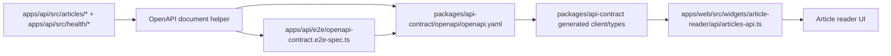

# refactor: 让 Web/API 读取边界改为 OpenAPI 优先

## 可能引入的额外包

- 新安装的依赖必须尽可能使用当前可用的最新稳定版本；只有在兼容
  性、锁定策略或仓库约束明确不允许时，才向下退让。
- `@nestjs/swagger` - 从 Nest 的 article controller/DTO 生成 OpenAPI
  文档。
- `orval` - 从 checked-in 的 OpenAPI 合同生成 web 侧 client/types。

## 概览

把当前 `apps/api` 的对外 HTTP surface 收敛成一个仓库自有的 OpenAPI
合同：合同文件要检查入库、可审查、可生成，并作为 web 侧 client/types
的生成来源。API 仍然负责运行时 REST 实现和响应映射，但 wire contract
要变成双方都必须遵守的共享来源。这样可以把变化限制在当前公开接口，
而不是扩大成更大的 API 重构。

这次范围里 `apps/api` 的公开接口一共有 4 个：`GET /health/live`、
`GET /health/ready`、`GET /articles`、`GET /articles/:id`。其中 web 只
消费 articles 读取 seam，但 health 也必须进入 OpenAPI 和 drift check。

## 问题背景

`apps/web` 现在还是通过 `apps/web/src/widgets/article-reader/api/articles-api.ts`
里的手写包装去读 `apps/api`。这个文件自己定义返回类型，再通过
`response.json() as T` 直接信任 payload，所以 web 层可以在不明显的
情况下和 API 漂移。

`apps/api` 已经有两类对外 HTTP 入口：`apps/api/src/articles/*` 里的
article 读取接口，以及 `apps/api/src/health/health.controller.ts` 里的
liveness/readiness probes。当前它们各自有 runtime 实现，但还没有被统一
发布成一个仓库级的 OpenAPI 资产。结果就是“看起来有类型”和“真的有
合同”之间仍然有缝。

这份 plan 要做的是：把 OpenAPI 合同变成可审查的仓库资产，从它生成
web 侧 client/types，并加一层 drift check，确保 API 实现不能先动、
合同后补。

## 需求追踪

- R1. 为 `apps/api` 所有对外 HTTP surface 提供唯一 OpenAPI 来源。
- R2. 覆盖当前所有公开响应形状，不只修 reader 这一条 seam；health
  probes 也要进入合同。
- R3. 把合同保留为 PR 里可审查的仓库资产。
- R4. `apps/web` 必须改用生成的 types/client，而不是手写 DTO-like 类型。
- R5. 清掉 reader seam 里的 `response.json() as T` 之类 unchecked 断言。
- R6. reader 行为保持不退化：默认选择、URL 保持、404 处理、摘要
  fallback 文案、详情渲染都不变。
- R7. `apps/api` 继续负责运行时校验、响应映射和持久化。
- R8. 响应形状变化必须和合同变化一起提交。
- R9. breaking change 要在合并前可见。
- R10. 提供可重复的 contract refresh 流程。
- R11. 加一个 repo 级 drift check，能抓住实现和发布合同的偏差。
- R12. 迁移必须覆盖当前所有公开 HTTP 接口，不能只留一条手写路径。

## 范围边界

- 不迁移到 tRPC。
- 不改 ingestion、summary 生成、Prisma schema 或持久化语义。
- 不扩展公开 reader payload，包括 `contentMarkdown`。
- 不重做整套前端数据层。
- 不把这次 refactor 扩大成更大的 API 重构，只把现有公开接口收进合同。
- 不需要 public Swagger UI route；合同文件本身就是可审查产物。

## 背景与调研

### 相关代码与模式

- `apps/web/src/widgets/article-reader/api/articles-api.ts` 是当前手写 seam，
  里面有 DTO-like 类型和 `response.json() as T`。
- `apps/web/src/widgets/article-reader/ui/article-reader-page.tsx`、
  `apps/web/src/widgets/article-reader/ui/article-list.tsx` 和
  `apps/web/src/widgets/article-reader/ui/article-detail.tsx` 是 reader UI
  消费者，必须继续保持同样的可见行为。
- `apps/api/src/articles/articles.controller.ts`、
  `apps/api/src/articles/articles.service.ts` 和
  `apps/api/src/articles/article.repository.ts` 定义了当前响应映射边界。
- `apps/api/src/articles/dto/article-list-item.dto.ts` 与
  `apps/api/src/articles/dto/article-detail-item.dto.ts` 是当前 DTO 形状，
  OpenAPI 文档应该描述的就是它们。
- `apps/api/src/health/health.controller.ts` 与
  `apps/api/e2e/health.e2e-spec.ts` 定义了 liveness/readiness 对外合同，
  也必须进入同一份 OpenAPI 视野。
- `apps/api/e2e/articles.e2e-spec.ts` 已经在断言文章 payload 形状，
  `apps/web/app/page.spec.tsx` 和 `apps/web/e2e/home.spec.ts` 则锁住了
  reader 行为。
- `apps/api/README.md` 和 `apps/web/README.md` 现在仍在用 prose 描述这条
  seam，部分字段命名还偏旧，所以需要一起更新到新的合同路径。
- `packages/ui/package.json` 是最接近的现成模式：一个跨 app 的共享
  workspace package，被 build 后再被别的 app import。

### 仓库记忆里的相关经验

- 这条 seam 还没有专门的 OpenAPI 合同方案文档；最接近的仓库约束是：
  contract drift 要在合并前可见，workspace 边界要保持 package-local，
  不要漏到 repo root。
- 现有记忆里对 `articles-api.ts` 的合同安全风险有过同类提醒：
  手写 client 类型和像 `summaryErrorReason` 这种旧命名，正是这类 plan
  要防的漂移点。

### 外部参考

- NestJS OpenAPI introduction: <https://docs.nestjs.com/openapi/introduction>
- NestJS OpenAPI CLI plugin: <https://docs.nestjs.com/openapi/cli-plugin>
- Orval: <https://orval.dev/>
- Orval React Query guide: <https://orval.dev/docs/guides/react-query>

## 关键技术决策

- canonical 合同放在 `packages/api-contract/openapi/openapi.yaml`，并且用
  YAML 做可审查产物。refresh 流程直接读写这份文件，不再多包一层导出
  的 spec artifact。
- 新增一个共享的 `packages/api-contract` workspace package，对外导出
  生成后的 web client/types。这样合同资产和消费边界都落在正常的
  Turborepo package graph 里，而不是用一个临时 root 脚本硬接。
- API 的 runtime 归属继续留在 `apps/api/src/articles` 和
  `apps/api/src/health`，用显式 OpenAPI decorator 和共享的 document
  helper 来描述，不额外搭一个 public docs server。
- web seam 保持很薄：它仍然负责 `API_BASE_URL`、请求缓存策略、URL
  编码和 404 -> null 转换，但不再自己定义合同 shape；health 不需要
  web adapter。
- 用一个 contract drift check，把 emitted OpenAPI 文档和 checked-in YAML
  的偏差挡在 merge 前。
- reader 仍然走 server-side flow；生成 client 取代手写 payload 类型，
  但不要引入新的 client-state 模型。

## Open Questions

### 已在规划阶段解决

- YAML 还是 JSON：选 YAML，因为这份合同就是要给人 review 的，并且要
  一起进入仓库。
- canonical artifact 放哪：`packages/api-contract/openapi/openapi.yaml`。
- web 怎么读合同：`apps/web` import 生成后的 `@repo/api-contract`
  package；refresh 流程则直接读 YAML。web 只取 articles 读取 seam，
  health 只进入 spec 和 drift check。
- 是否需要 public Swagger route：不需要；checked-in artifact 就是合同。

### 延后到实现

- `packages/api-contract` 里具体的 generated 文件名和 export 名称。
- API document helper 是只给 refresh script 用，还是也给 e2e drift test
  复用，或者两者都复用。
- web 侧薄 adapter 的具体形状，只要还能保住 `API_BASE_URL` 和 404
  处理归属即可。

## 高层技术设计

> 这张图只表达 intended approach，给 review 用，不是实现规格。落地时
> 只把它当上下文，不要把它照抄成代码。

## Implementation Units

- [ ] **Unit 1: 发布共享合同 package**

**Goal:** 创建仓库自有的 OpenAPI package，以及 web 可以消费的、检查入库
的 canonical API contract。

**Requirements:** R1, R2, R3, R4, R10

**Dependencies:** `apps/api/src/articles/*`、`apps/api/src/health/*` 里的
当前响应形状，以及 `apps/web` 里的现有 reader seam。

**Files:**

- Create: `packages/api-contract/package.json`
- Create: `packages/api-contract/tsconfig.json`
- Create: `packages/api-contract/orval.config.ts`
- Create: `packages/api-contract/openapi/openapi.yaml`
- Create: `packages/api-contract/src/generated/api-client.ts`
- Create: `packages/api-contract/src/index.ts`
- Modify: `package.json`
- Modify: `apps/api/package.json`
- Modify: `apps/web/package.json`
- Modify: `apps/api/README.md`
- Modify: `apps/web/README.md`

**Approach:**

- 把 checked-in YAML 作为 canonical contract artifact，用它生成 web-facing
  client/types；生成产物里可以包含 articles 和 health 的操作，但 web
  只会 import articles 读取 seam。
- 通过 `packages/api-contract/src/index.ts` 暴露生成后的 surface，让 web
  import 一个正常的 workspace package，而不是运行时去直接读 spec 文件。
- 在 API package、contract package 和 repo root 上都给出明确的 refresh
  入口，保证开发者有一条很清楚的合同刷新路径。

**Execution note:** 从合同文件本身开始，保持 package 边界干净；不要再
搞一套平行的手写 web contract。

**Patterns to follow:**

- `packages/ui/package.json`
- `packages/ui/src/index.ts`
- `apps/web/package.json`
- `apps/api/package.json`

**Test scenarios:**

- Happy path: shared package 能基于 checked-in YAML 构建，并导出
  article reader 可用的 client surface。
- Edge case: 合同文件保留当前 article list/detail 字段集，包括 detail
  上的 `summaryError`，并且不出现 `contentMarkdown`；health 的 live/ready
  schema 也保持和当前实现一致。
- Integration: `apps/web` 可以依赖 `@repo/api-contract`，而不会回退到
  手写 DTO-like 类型。

**Verification:**

- 仓库里只有一份可审查的合同文件，生成后的 client 可以从它构建，
  并且 refresh 流程对开发者是可发现的。

- [ ] **Unit 2: 增加 API emit 和 drift validation**

**Goal:** 让 `apps/api` 从真实 Nest 实现里 emit 全部公开 HTTP OpenAPI
文档，并在 checked-in contract 偏离时失败。

**Requirements:** R7, R8, R9, R11, R12

**Dependencies:** Unit 1，以及当前 article / health controller 与 DTO
mapping。

**Files:**

- Create: `apps/api/src/openapi/openapi-document.ts`
- Create: `apps/api/src/openapi/openapi-refresh.ts`
- Modify: `apps/api/src/articles/articles.controller.ts`
- Modify: `apps/api/src/articles/dto/article-list-item.dto.ts`
- Modify: `apps/api/src/articles/dto/article-detail-item.dto.ts`
- Modify: `apps/api/src/health/health.controller.ts`
- Modify: `apps/api/src/articles/articles.controller.spec.ts`
- Modify: `apps/api/src/health/health.controller.spec.ts`
- Create: `apps/api/e2e/openapi-contract.e2e-spec.ts`
- Modify: `apps/api/e2e/articles.e2e-spec.ts`
- Modify: `apps/api/e2e/health.e2e-spec.ts`

**Approach:**

- 给当前 article 和 health controller / DTO 加显式的 OpenAPI metadata，
  让生成出来的文档描述全部 public surface，而不是靠隐式推断。
- 把 document creation 抽到一个可复用 helper 里，这样 refresh path 和
  drift test 用的是同一份 source of truth。
- 把 emitted document 和 `packages/api-contract/openapi/openapi.yaml`
  做比较；只要有 drift 或 breaking change，就在 merge 前失败。

**Execution note:** 先把 drift test 和 checked-in contract 锁住，再去
改 controller metadata 让它们对齐。

**Patterns to follow:**

- `apps/api/src/articles/articles.controller.ts`
- `apps/api/src/articles/articles.controller.spec.ts`
- `apps/api/src/health/health.controller.ts`
- `apps/api/src/health/health.controller.spec.ts`
- `apps/api/e2e/articles.e2e-spec.ts`
- `apps/api/e2e/health.e2e-spec.ts`
- `apps/api/README.md`

**Test scenarios:**

- Happy path: 生成的 OpenAPI 文档包含 `GET /health/live`、
  `GET /health/ready`、`GET /articles` 和 `GET /articles/{id}`，并且字段和
  当前 public surface 一致。
- Edge case: health readiness 的 503 响应和 article detail schema 继续把
  `summaryError` 作为 nullable 暴露，并且不把内部持久化字段带进公开合同。
- Error path: 任何没有同步更新合同的字段新增、删除或重命名，都会让
  drift check 失败。
- Integration: OpenAPI 文档和现有 HTTP e2e 断言描述的是同一组
  health/article payload、404 行为和 503 readiness 行为。

**Verification:**

- API 测试套件可以重新生成合同文档，并在 merge 前抓住它和 checked-in
  YAML 的不一致。

- [ ] **Unit 3: 把 web seam 切到生成后的合同**

**Goal:** 移除 `apps/web` 里手写的 article-client contract，并通过生成
package 保持 reader 行为不变。

**Requirements:** R4, R5, R6, R12

**Dependencies:** Units 1 和 2。

**Files:**

- Modify: `apps/web/src/widgets/article-reader/api/articles-api.ts`
- Modify: `apps/web/src/widgets/article-reader/ui/article-reader-page.tsx`
- Modify: `apps/web/src/widgets/article-reader/ui/article-list.tsx`
- Modify: `apps/web/src/widgets/article-reader/ui/article-detail.tsx`
- Modify: `apps/web/package.json`
- Modify: `apps/web/next.config.ts`
- Modify: `apps/web/app/next-config.spec.ts`
- Modify: `apps/web/app/page.spec.tsx`
- Modify: `apps/web/e2e/home.spec.ts`

**Approach:**

- 让 web seam 继续只负责 `API_BASE_URL`、`cache: "no-store"`、URL 编码
  和 404 -> null 转换，但 types 和 request surface 从 `@repo/api-contract`
  来；contract package 里即使包含 health operations，reader seam 也只会
  读取 articles 相关导出。
- 删掉 seam 文件里本地手写的 DTO-like 类型，让 web app 不再手工拥有
  contract shape。
- 更新 web package wiring，保证直接跑 app 时也会先 build shared
  contract package，再让 reader 代码 import 它。

## 全局影响

- **Interaction graph:** `apps/api/src/articles/*` + `apps/api/src/health/*`
  -> OpenAPI document helper -> `packages/api-contract/openapi/openapi.yaml`
  -> generated client/types -> `apps/web/src/widgets/article-reader/api/articles-api.ts`
  -> reader UI.
- **Error propagation:** 404 在合同和 API 层仍然是 404，但 web adapter
  继续把它转成 `null`，让 unavailable state 保持原样。
- **State lifecycle risks:** checked-in contract 或 generated client 可能会和
  Nest 实现漂移；drift test 必须在它们到 browser 之前把问题拦住。
- **API surface parity:** `/health/live`、`/health/ready`、`/articles` 和
  `/articles/:id` 都纳入同一份公开合同，`summaryError` 仍然是公开 failure
  detail，而不是任何内部持久化字段。
- **Integration coverage:** OpenAPI drift test、HTTP health/article e2e 和
  browser reader spec 三层一起，才能证明同一份合同。
- **Unchanged invariants:** ingestion、summary 生成、Prisma schema、
  article id、URL-driven selection，以及现有 summary fallback copy 都不变。

## 风险与依赖

| Risk                                     | Mitigation                                                                                                       |
| ---------------------------------------- | ---------------------------------------------------------------------------------------------------------------- |
| generated client 比现在的薄 wrapper 更重 | 保持 `apps/web/src/widgets/article-reader/api/articles-api.ts` 只是很薄的 adapter，只负责 env、编码和 404 转换。 |
| 合同文件和 Nest 实现漂移                 | 增加专门的 API drift test，把 emitted document 和 `packages/api-contract/openapi/openapi.yaml` 做比较。          |
| 新 shared package 增加 workspace 摩擦    | 让 `packages/api-contract` 保持 private、可导出，并对齐现有 `packages/ui` 模式。                                 |
| app README 文案落后于合同                | 在同一轮里同步更新 `apps/api/README.md` 和 `apps/web/README.md`，并一起修掉旧字段名。                            |

## 文档 / 运维说明

- 更新 `apps/api/README.md` 和 `apps/web/README.md`，把新的合同 package
  和 refresh 流程写进去。
- 保持 YAML 合同作为可审查的仓库产物；这个 feature 不要求再加一个
  public docs server。
- 以后只要合同变了，就先 refresh checked-in YAML，再从这份文件重新
  generate client，不要手改 web 副本。

## 来源与参考

- **Origin documents:** `docs/en/brainstorms/2026-04-24-web-api-openapi-contract-first-requirements.md` +
  `docs/zh-Hans/brainstorms/2026-04-24-web-api-openapi-contract-first-requirements.md`
- 相关代码：`apps/api/src/articles/articles.controller.ts`、
  `apps/api/src/articles/articles.service.ts`、
  `apps/api/src/articles/article.repository.ts`、
  `apps/api/src/health/health.controller.ts`、
  `apps/web/src/widgets/article-reader/api/articles-api.ts`、
  `apps/web/src/widgets/article-reader/ui/article-reader-page.tsx`、
  `apps/api/e2e/articles.e2e-spec.ts`、
  `apps/api/e2e/health.e2e-spec.ts`、
  `apps/web/app/page.spec.tsx`、
  `apps/web/e2e/home.spec.ts`
- 相关文档：`apps/api/README.md`、`apps/web/README.md`、
  `packages/ui/package.json`
- 外部文档：NestJS OpenAPI introduction 和 Orval
