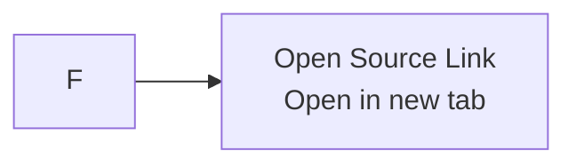

# 保持双语图表文档与计划文档的语义同步

## Context

我们为 `rss-start` 新建了 v0.1 的双语产品图表文档和配套 plan 文档，并在评审与产品澄清后持续迭代。在这个过程中，几类漂移同时出现：durable docs 从 `docs/{lang}/v0.1-diagrams/` 移动到 `docs/{lang}/diagrams/`，产品语义从固定中文输出改成用户配置的目标语言输出，而“打开原文”也被澄清为“在新标签页打开原文链接”，而不是进入产品内的另一段阅读流程。

图表文档先被修正，但配对的 plan 文档和部分概览文案仍然保留了旧路径与旧语义。这样会导致整组双语文档虽然单看每个文件都说得通，但作为一个整体已经不再一致。

## Guidance

把双语 durable docs 当作一组锁定文件来维护，而不是把每个文件当成独立资产。

当某个澄清先落在一个语言版本或一种文档类型上时，要在同一次变更里同步更新所有配对文档：

1. 中文和英文版本一起更新。
2. 用户可读文档和对应 plan 文档一起更新。
3. 只要文件移动了，就要在同一轮里修完所有 durable 引用路径。
4. 只要产品语义改了，就要一起更新概览文字、图注、节点标签和 plan requirement。

这次在仓库里稳定下来的结构是：

```text
docs/zh-Hans/diagrams/v0.1-diagrams.md
docs/en/diagrams/v0.1-diagrams.md
docs/zh-Hans/plans/2026-04-09-001-feat-v0-1-bilingual-diagrams-plan.md
docs/en/plans/2026-04-09-001-feat-v0-1-bilingual-diagrams-plan.md
```

必须保持一致的语义规则包括：

- 标题和摘要语言由用户配置决定，而不是固定中文
- 产品是桌面端双栏阅读器
- 打开原文是一个外部动作：在新标签页打开原文链接

适合这类变更的检查清单：

- 路径变更后，搜索所有旧路径：
  - `docs/zh-Hans/v0.1-diagrams/v0.1-diagrams.md`
  - `docs/en/v0.1-diagrams/v0.1-diagrams.md`
- 语义澄清后，搜索所有旧表述：
  - `中文标题` / `Chinese titles`
  - `跳转原文` / `Jump to source`
  - `read the original article`
- 对照 Diagram 1、Diagram 2 和对应 plan requirement，确认它们描述的是同一个产品行为。

## Why This Matters

双语文档只有在“作为一个整体可信”时才会真正积累价值。一旦某个文件写“configured-language titles”，而另一个文件还写“Chinese titles”，未来的 agent 或协作者就很可能在规划、实现或评审时重新带回旧假设。

路径漂移同样代价很高：当 plan 指向一个已经不存在的路径时，未来的读者会误以为文档从未被创建过，即使真实文档已经存在。这在仓库已经通过 `AGENTS.md` 编码 durable docs 规则之后，破坏性会更大。

## When to Apply

- 当中文和英文文档被设计为同步维护的一对时
- 当 plan 文档引用 durable 的产品或设计文档时
- 当评审反馈修改的是产品表达，而不是实现代码时
- 当文档被重新整理到新的子目录，例如 `docs/{lang}/diagrams/`

## Examples

修复前，这组文档同时存在路径漂移和语义漂移：

```md
- docs/zh-Hans/v0.1-diagrams/v0.1-diagrams.md
- users scan Chinese titles in the list
- Jump to source
```

修复后，路径和语义都被统一了：

```md
- docs/zh-Hans/diagrams/v0.1-diagrams.md
- users scan titles in the configured language
- open the source link in a new tab
```

这次改动里一个具体的 Mermaid 标签修正如下：



这次一起联动更新的文档包括：

- `docs/zh-Hans/diagrams/v0.1-diagrams.md`
- `docs/en/diagrams/v0.1-diagrams.md`
- `docs/zh-Hans/plans/2026-04-09-001-feat-v0-1-bilingual-diagrams-plan.md`
- `docs/en/plans/2026-04-09-001-feat-v0-1-bilingual-diagrams-plan.md`

## Related

- `AGENTS.md`
- `docs/zh-Hans/diagrams/v0.1-diagrams.md`
- `docs/en/diagrams/v0.1-diagrams.md`
- `docs/zh-Hans/plans/2026-04-09-001-feat-v0-1-bilingual-diagrams-plan.md`
- `docs/en/plans/2026-04-09-001-feat-v0-1-bilingual-diagrams-plan.md`
